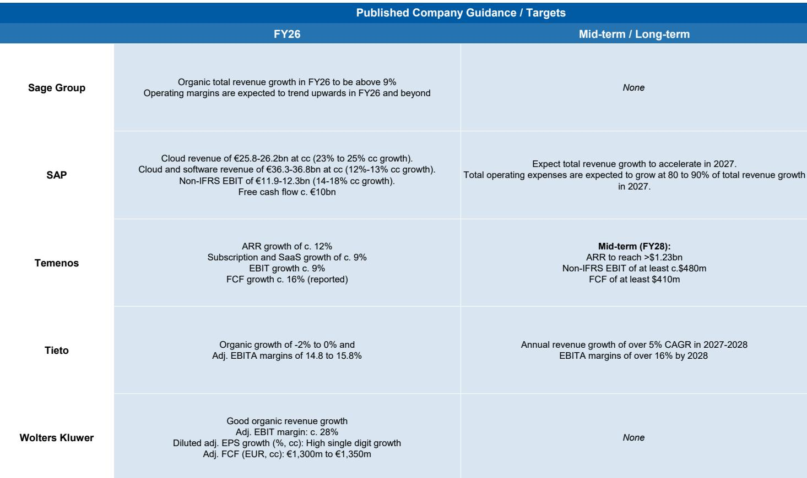
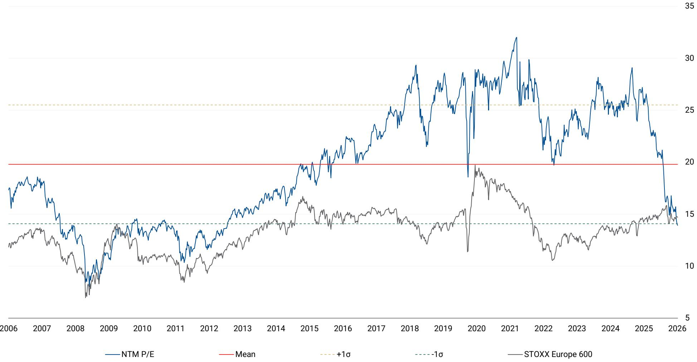

# 摩根斯坦利：AI对内存的饥渴，正在改写软件行业的估值逻辑

当一家存储芯片公司的季度收入同比暴涨350%，从90亿美元跃升至410亿美元，市场的第一反应往往是“又一个AI基建周期的受益者”。但摩根斯坦利在最新一期《Software Snippets》中给出了一个更值得深思的判断：这轮内存需求的爆发，其结构性可能远大于周期性。

这份报告的核心洞察不在于Micron的财务数字本身，而在于数字背后正在发生的、软件工作负载的深层演变。AI正在从“一问一答”的聊天工具，进化为能够规划、调用工具、阅读文档、保持会话历史、生成子代理并迭代趋近结果的Agent系统。这种从“对话式”到“工作流式”的转变，意味着每一次交互消耗的内存和存储，不再是线性增长，而是指数级膨胀。

> **KC评论：** 市场习惯用“资本开支周期”来理解半导体需求，但摩根斯坦利暗示了一个更本质的变化——AI的“记忆需求”正在从周期性变成结构性。如果Agent成为AI的主流形态，每个Agent都需要长期保持上下文、记忆和工具调用历史，那么内存消耗将不再是“每次对话重置”的临时需求，而是持续存在的固定成本。这对整个软件栈的架构设计、成本模型和定价逻辑，都意味着根本性的重塑。

## 1. 这轮变化真正考验的是企业能否把规模转化为议价权

Micron的财报中最值得关注的细节，不是收入数字本身，而是其背后16份已签署的长期战略客户协议。在半导体行业，长期协议通常意味着两件事：一是需求的确定性足够高，客户愿意锁价锁量；二是供应端开始出现结构性紧张，客户不得不提前锁定产能。

摩根斯坦利的全球半导体团队将此称为“Chipflation——一场记忆体危机”。这个判断的潜台词是：如果内存供给持续偏紧，拥有规模化产能和先进工艺的厂商将获得显著的议价权。而对于下游的软件公司来说，这意味着AI推理和Agent运行的成本结构将面临持续上行压力。

目前市场仍在争论“这波AI内存需求是否比过去更少周期性”，但摩根斯坦利的证据已经相当明确——长期协议的签署数量、收入的同比增速、以及AI工作负载从推理扩展到Agent化的趋势，都在指向一个结论：这不是短期的库存周期补货，而是AI基础设施的长期需求重构。

## 2. SAP的“无人开发”宣言不是裁员信号，而是人才结构重置信号

在同一份报告中，摩根斯坦利引用了SAP CEO Christian Klein在《澳大利亚金融评论》上的发言：“有理由相信，3-4年内SAP内部将不再有人类从事软件开发。” 这句话被市场解读为“AI将消灭程序员”，但摩根斯坦利的分析视角更加细腻。

Klein的原话是：“我们需要能理解业务并能进行‘vibe coding’的产品经理……软件开发者需求下降，但我们需要更多的数据科学家。” 这不是简单的裁员，而是SAP正在执行一套“质量替代数量”的人才战略——以3:1的比例，用一名顶尖AI人才替换三名传统开发者，并相应调整薪酬结构以在稀缺的AI人才市场中保持竞争力。

> **KC评论：** 市场对“AI取代程序员”的叙事往往过于戏剧化。SAP的案例其实揭示了一个更微妙的现实：AI不是消灭了编程岗位，而是重塑了编程岗位的技能树。如果SAP这样拥有数万名开发者的巨型企业都在系统性地减少传统编码人员，那么整个企业软件行业的组织架构、外包模式和薪酬体系都将面临重构。这对那些依赖大量初级程序员提供IT服务的企业（如印度的IT外包巨头），是一个需要认真对待的结构性信号。

## 3. 学术出版是AI最被低估的受益者，但变现路径仍存疑

摩根斯坦利在Springer Nature的技术日活动上，看到了AI在学术出版领域最务实的应用场景。Springer Nature目前平均审稿周期约200天，Nature品牌期刊更是长达300天。AI工具正在被用来缩短这一流程：从帮助作者匹配期刊和基金渠道，到辅助编辑进行初步稿件评估、推荐审稿人，再到将不合适的稿件引导至更匹配的期刊。

这些工具看似“边缘”，但效果显著。目前已有约75%的研究人员在使用AI工具，约三分之一愿意为此付费。对于RELX、Informa、Wolters Kluwer这些学术出版巨头来说，AI带来的最直接好处不是颠覆性的商业模式创新，而是对现有高利润率业务的操作效率提升。

但摩根斯坦利也明确指出了悬而未决的问题：出版商能否有效变现研究流程中的特定AI工具？例如Springer Nature的Nature Research Assistant或RELX的LeapSpace。这是一个典型的“效率有确定性、变现有不确定性”的场景——AI可以显著缩短审稿周期、提升用户体验、降低运营成本，但这些改善能否转化为额外收入，仍是一个开放问题。

## 4. B2B线下活动在AI时代反而获得了差异化溢价

在AI驱动的数字营销日益泛滥、信息真实性持续贬值的背景下，摩根斯坦利对Informa的分析提出了一个反直觉的判断：B2B线下活动资产的价值正在上升。

原因很简单：当每个人都在用AI生成内容和进行数字营销时，人与人之间真实的、面对面的商业连接反而变得稀缺和有价值。Informa作为全球最大的B2B活动主办方之一，其核心资产——Live B2B Events——正在获得市场重新定价。

摩根斯坦利通过分部加总分析（SOTP）认为，Informa的公允价值较当前水平有超过20%的上行空间。报告给出的估值框架值得关注：Live B2B Events应该获得“高十几倍”的FY26 EV/EBIT估值，而Informa整体在目标价下约为16倍。对于一个具有6%内生收入增长、约12%的每股收益增长（含回购）和超过2.5%股息收益率的公司，这个估值并不激进。

但摩根斯坦利也提醒投资者注意短期扰动：Informa调整了活动排期，超过1.75亿美元的活动收入从上半年转移至下半年，这将导致上半年同比数据在表面上显得疲弱。这不是基本面恶化，而是季节性再分配，但共识预期可能需要时间调整。

## 5. 报告尚未完全回答的关键问题：Agent化对软件定价模式的长期冲击

摩根斯坦利敏锐地捕捉到了AI从“对话式”向“Agent化”的转变，并指出了其对内存需求的拉动。但这份报告没有完全展开的一个问题是：当AI Agent成为企业软件的主流交互形态时，现有的软件定价模式是否还能成立？

目前，SaaS的定价主要基于“用户数”或“API调用次数”。但Agent系统的特点是：一个用户可能同时驱动数十个Agent并发执行任务，每个Agent都需要维持自己的上下文、记忆和工具调用历史。如果继续按用户数定价，软件厂商将面临严重的价值漏损；如果按Agent数或内存消耗定价，客户将面临成本失控的风险。

这不仅是定价技术问题，更是商业模式的结构性挑战。摩根斯坦利在报告中提到了Micron的长期协议和SAP的人才重置，但没有深入探讨：当AI Agent成为企业计算的基本单元时，软件厂商的定价单位、成本结构和竞争壁垒将如何被重新定义？

> **KC评论：** 这个问题的答案，可能决定了未来五年企业软件行业的赢家和输家。那些能够将Agent化趋势转化为更高ARPU（每用户平均收入）的公司，将获得显著的估值溢价；而那些无法摆脱“按人头收费”惯性、眼睁睁看着用户数增长但收入增长脱钩的公司，将面临结构性困境。这是报告中最值得继续深挖的方向，也是我们社群近期讨论的重点。

## 6. 一个值得持续跟踪的观察框架

综合摩根斯坦利这份报告的分析，我们可以提炼出三个用于跟踪AI对软件行业影响的观察维度：

第一，内存需求的“结构性”验证信号。Micron的长期协议数量是一个关键指标，但更重要的信号来自下游——当主要云厂商和AI公司开始基于“内存消耗”而不是“计算时间”来优化工作负载架构时，才真正意味着Agent化趋势进入了规模化的阶段。

第二，软件公司的人才结构转型速度。SAP的“3:1替换”是一个领先指标，但真正重要的是观察：传统软件外包商的收入增长是否开始放缓？企业IT部门的招聘结构是否从“大量初级开发者”转向“少量全栈AI人才”？这些变化将直接反映在相关公司的利润率曲线上。

第三，学术出版和B2B活动等“非典型AI受益者”的估值重估。如果市场开始认可“AI推动效率提升但变现路径尚未清晰”这类公司，那么当前被低估的RELX、Informa等标的可能迎来系统性重估。关键在于：这些公司的AI工具能否从“成本优化”升级为“收入创造”。

---

这份摩根斯坦利报告的价值，不仅在于它提供了Micron的财务数据和SAP的CEO语录，更在于它帮助读者建立了一个从硬件到软件、从基础设施到应用层的完整分析框架。AI对内存的饥渴，只是冰山一角；水面之下，是整个软件行业商业模式、人才结构和竞争格局的深层重构。

每天，我们的团队会由AI agent结合人工review，生成国际投行中文摘要与KC评论，daily更新约10-40页，并整理当天最新数据图表合集。这些内容既方便喂给AI作为分析素材，也方便人工快速把握全球market dynamics。如果您对这份报告中提到的“Agent化对软件定价的影响”或“学术出版AI变现路径”等未解问题有进一步兴趣，欢迎来我们的星球和微信群继续讨论。

Personal reading notes and learning share only. Not investment advice.

