June 29, 2026 12:00 AM GMT

Investor Presentation | Asia Pacific

# ASEAN Telecoms & Data Centers: Beneficiaries of the New Computing Paradigm

We are at a historic inflection in AI infrastructure build-out, driven by Nvidia GPUs and the rise of agentic AI frameworks like OpenClaw. ASEAN sits at a unique intersection of this megatrend: abundant land, competitive power, strategic subsea cable connectivity. and growing sovereign AI mandates.

This presentation provides investors with a practical “Data Centers 101,” including AI data centers’ anatomy and economics, the value chain, Singtel’s AI infrastructure positioning, and the potential emergence of orbital data centers as a long-tail disruptor.

## Related Report:

ASEAN Telecoms and Media: Beneficiaries of New Compute Paradigm (19 Mar 2026)

MS ASIA (SINGAPORE) PTE.+

Da Wei Lee
Equity Analyst
Dawei.Lee@morganstanley.com

+65 6834-6510

Asia Summer School 2026

MS does and seeks to do business with companies covered in MS. As a result, investors should be aware that the firm may have a conflict of interest that could affect the objectivity of MS. Investors should consider MS as only a single factor in making their investment decision.

For analyst certification and other important disclosures, refer to the Disclosure Section, located at the end of this report.

+= Analysts employed by non-U.S. affiliates are not registered with FINRA, may not be associated persons of the member and may not be subject to FINRA restrictions on communications with a subject company, public appearances and trading securities held by a research analyst account.

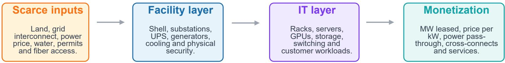

## Data Centers: Transforming Power into Computing

Scarce inputs
Land, grid interconnect, power price, water, permits and fiber access.

Facility layer
Shell, substations,
UPS, generators,
cooling and physical
security.

IT layer

Racks, servers, GPUs, storage, switching and customer workloads.

Monetization
MW leased, price per kW, power pass-through, cross-connects and services.

1. MW is the core capacity unit, but revenue is a function of leased load, price, power structure, and utilization.

2. AI shifts the bottleneck from space to power density, cooling, and networks.

3. Equity exposure is a supply chain, not only data center landlords.

24x7

Mission-critical workload expectation

Primary capacity unit sold or built

KPI bridge

Capacity → Leasing → Utilization → EBITDA → ROIC

Source: MS.

Revenue depends on contracted capacity, billing model, power pass-through, ramp schedule, interconnection services. and customer mix.

PUE

ROIC

Efficiency bridge between IT load and site power

The investor lens on growth capex

Power train

## Data Centers: The DC Anatomy

A data center is not just a shell building.
It is a tightly engineered system that makes IT equipment reliable, dense and connected.

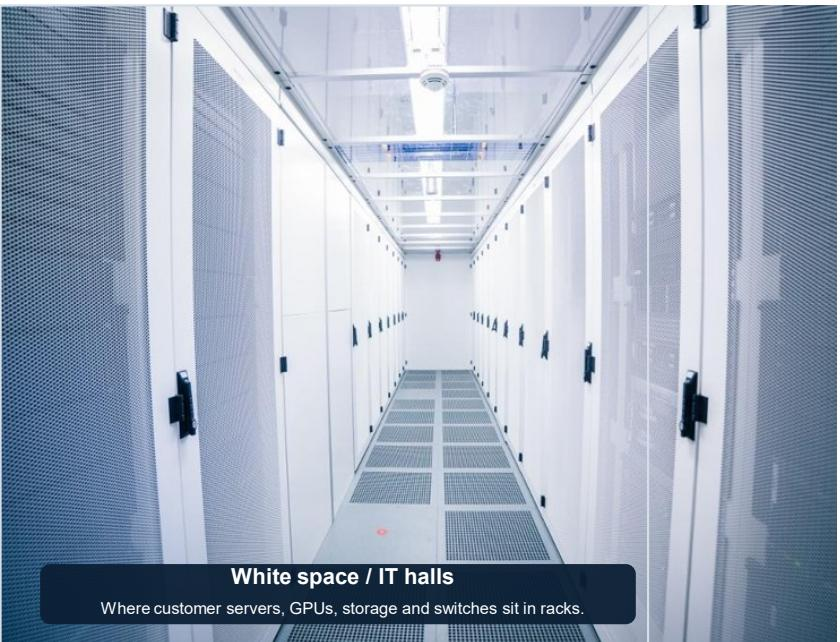

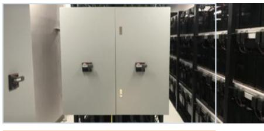  
UPS cabinets, batteries, switchgear and generators bridge grid outages and keep racks online.

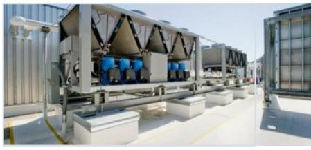

  
Connectivity
Meet-me rooms, fiber, cross-connects and cloud on-ramps make the facility valuable to tenants.  
Thermal management
Chillers, CRAH/CRAC units, airflow containment and liquid loops remove heat from dense racks.

  
Controls & security  
24x7 monitoring, access control, fire suppression and SLAs protect uptime and compliance.  
The hardest assets to replicate are often power access, cooling design, network density, and operating track record – not the building shell.  
Source: MS.

Data Centers: Workload Management  
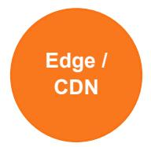

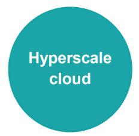  
Latency tolerant / Low Power Density

Source: MS.

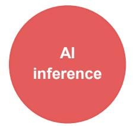

AI inference

  
AI training

## Why this matters

Different workloads imply different siting logic, contract structures, and capex intensity.

AI training can be centralized near cheap power. Inference is more latency-sensitive and may favor regional hubs closer to users and data sovereignty zones.

Do not treat every MW as equal. A leased AI-ready MW may require a very different capex and cooling spec.

Higher Power Density

Data Centers: Business Models

<table><tr><td>Retail colocationMany enterprise customers</td><td>Operator sells smaller blocks plus connectivity. Higher interconnection revenue; more operational complexity.</td><td>Power/cooling</td><td>Security</td><td>Cross-connects</td></tr><tr><td>Wholesale colocationLarge tenants / hyperscalers</td><td>Operator sells MW-scale suites or buildings. Longer leases; lower customer count; pre-leasing matters.</td><td>Large MW suites</td><td>Long leases</td><td>Ramp schedules</td></tr><tr><td>Build-to-suit / hyperscaler-ownedSingle tenant or owner-operated</td><td>Hyperscaler controls design and capex. Third parties may provide land, power shells or JVs.</td><td>Tenant design</td><td>Custom power</td><td>Dedicated campus</td></tr><tr><td>GPU cloud / AI factoryCompute as a service</td><td>Provider controls facility and GPUs, then sells ca or API/compute access to enterprises and AI labs</td><td>GPUs</td><td>Orchestration</td><td>AI services</td></tr></table>

Source: MS.

## ASEAN Data Centers: Formation of Data Center Clusters

## Connectivity

Fiber routes, subsea cables, cloud on-ramps

## Power

Availability, price, reliability, emissions

## Demand

Enterprises, cloud regions, data sovereignty

## Policy

## Land

tax incentives, permitting, regulation

Campus scale, zoning, noise buffers

## Climate

Water, ambient temperature, natural disasters, wars

The best locations maximize connectivity and customer access while minimizing power, land and permitting risk.

Source: MS.

## ASEAN Data Centers: Singapore Is a Submarine Cable Hub

  
Source: TeleGeography, MS.

## ASEAN Data Centers: Key Changes in the Stack

## Power density moves from room-level planning to rack-level thermodynamics

Traditional enterprise rack

5-15 kW

GPUs / accelerators

Compute engines

AI GPU rack today

40-200 kW

Next-gen AI platforms

hundreds of kW+

HBM memory

Model state + throughput

High-speed networking

Cluster scale-out

Cooling progression for higher density racks

Air

Direct-to-chip

Immersion

Power distribution

High-current delivery

Liquid cooling loop

Heat removal

## Training

Massive, centralized clusters; economics tilt toward cheap power, high utilization and low-latency intra-cluster networking.

## Inference

Workloads can be more distributed; latency, data sovereignty and proximity to enterprises matter more.

The winners are not only builders of square footage. They are operators with secure power, liquid-cooling expertise, dense fiber and customers willing to commit to high-density capacity.

Source: MS.

## ASEAN Data Centers: Rise of the New Computing Paradigm

## Evolving AI Hardware Stack

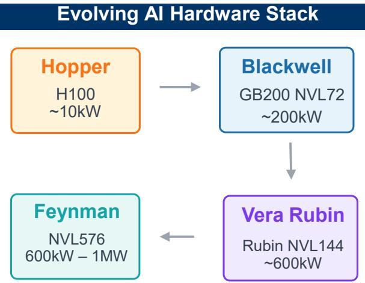

## Surge in Global Hyperscalers' Capex

## Rise of Agentic AI

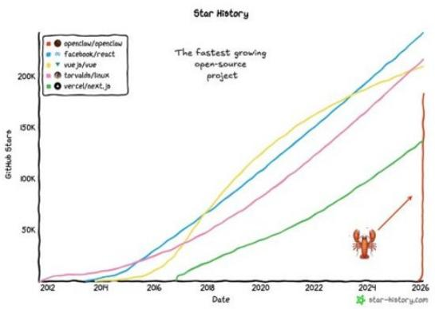  
Source: Company data, MS.

US-China- Tech Diffusion Cycle  
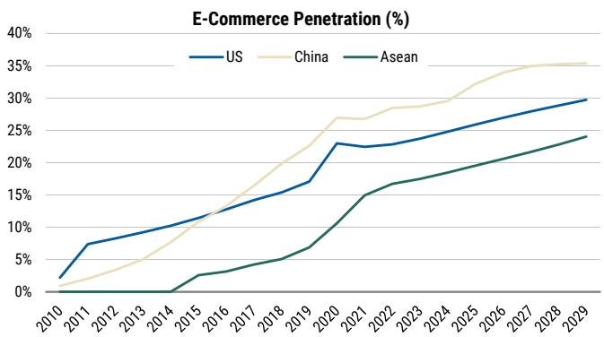

## ASEAN Data Centers: Global AI Infrastructure Supply Chain Players

## AI Applications

## Data Center Value Chain

## Power Generation

## Fossil Baseload

\- Gulf (TH) - J-Power (JP)
- GPSC (TH) - Shikoku Electric (JP)

\- Sembcorp (SG) - Chugoku Electric (JP)
- KEPCO (KR) - Tohoku Electric (JP)

## Clean Power

\- Gulf (TH)
- GPSC (TH)

\- Origin Energy (AU)
- AGL Energy (AU)

\- Sembcorp (SG)

## Nuclear

• J-Power (JP)

• Shikoku Electric (JP)

\- Chugoku Electric (JP)

• Tohoku Electric (JP)

## Power Equipment

• GE Vernova (US)

• Simens Energy (US)

\- Bloom Energy (US)

\- Doosan Enerbility (KR)

Source: TeleGeography, MS.

## Grid + Energy Storage

## Grid Operators

• Tenaga (MY) • Shikoku Electric (JP)

\- Chugoku Electric (JP)

\- APA Group (AU)
- Chugoku Electric (JP)
- Tohoku Electric (JP)

## Batteries

\- CATL (CH)
- BYD (CH)

• LG Energy (KR)

\- SK Innovation (KR)
- Samsung SDI (KR)
- Panasonic (JP)

## Grid Equipment

\- XJ Electric (CH)

• NARI Tech (CH)

• LS Electric (KR)

## Commercial Applications

## Hyperscalers

\- Google (NA)

\- Microsoft (NA)

\- Meta (NA)

\- Amazon (NA)

Localisation

• Gulf (TH)

\- SEA (SG)

\- Grab (SG)

## Data Center

## Hyperscalers

\- Tencent (CH)
- Amazon (NA)
- Google (NA)
- Microsoft (NA)
- Oracle (NA)

## Data Center Technology

## Server

## Processor

## System Brands / End User Devices

\- Apple
- Google
- Microsoft
- Meta
- Tesla
- AWS
- Dell
- HP
- Supermicro

## Semi Production

## Integrated Device Management (IDM)

## 1. IC Design

\- Nvidia (NA)
- MediaTek (TW)
- Aspeed (TW)

## • SK Hynix (KR)

## 2. Foundries

• TSMC (TW)
• Samsung (KR)

## Design Services

• Andes(TW)
• GlobalUnichip (TW)

## Equipment

• AlChip (TW)

\- ASE (TW)
- KYEC (TW)

• Verisilicon (CH)

## Colocation

## 3. Outsourced Semi Assembly & Test

• Disco(JP)

\- Equinix (NA) - Keppel DC (SG)
- GDC (CH) - Gulf (TH)

## DC Operators

• Advantest (JP)

• ASM Pacific (HK)

\- FII (CH)
- Quanta(TW)
- Wistron (TW)
- Wiwynn (TW)
- Giga-Byte (TW)
- Lenovo (HK)

## ODM/EMS

## Server Components

## Power Supply

\- Delta (TW)
- Lite-On tech (TW)

## Printed Circuit Board

• Gold Circuit (TW)
• Shennan (CH)

## Thermal Solution

\- Asia Vital Components (TW)
  - Sunonwealth (TW)
  - Auras (TW)

## Passive Component

\- Yageo (TW)

## Sovereign AI

\- AIS (TH)

\- Singtel (SG)

\- Telkom (ID)

• Telkom Malaysia (MY)

## Telcos

\- Singtel (SG)
- Globe (PH)
- Telcom (ID)
- AIS (TH)

## Network

• Nvidia InfiniBand (NA)

## Switch

\- Arista (NA)
- Juniper (NA)

## DCI (Routing/Optical)

• Juniper (NA)

\- Cisco (NA)

• Ciena (NA)

• Infinera (NA)

## Others

\- Venture (SG)

## Memory/Storage

\- Western
Digital (NA)
- Seagate (NA)
- SK Hynix (KR)
- Micron (NA)

## Transceiver

\- Innolight (CH)

• Eoptolink (CH)

\- Landmark (TW)

• TFC Optical (CH)

## Enterprise

\- Meta (NA)
- SEA (SG)
- SAP (NA)

## Internal Power

Uninterruptible Power Supply (UPS)
• Delta (TW)
• Huawei (CH)
• Mitsubishi Electric\* (JP)

## Power Electronics

\- Mitsubishi Electric\* (JP)
  - Delta (TW)

## Cooling

## Liquid Cooled

• Non-covered/private\*: XYL, Asperitas, Submer, TT, LiquidStack, VRT, Green Revolution,

## Air Cooled

\- Mitubishi Electric (JP)
- Daikin (JP)

• Schneider Electric (EU)

## ASEAN Data Centers: Emerging AI Infrastructure Hub

## Global DC Market Growing Double-Digits

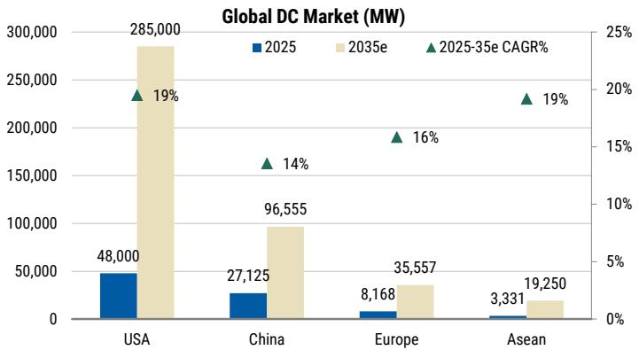

## US Remains Most Saturated DC Market

Global DC Market (MW per mn pop)  
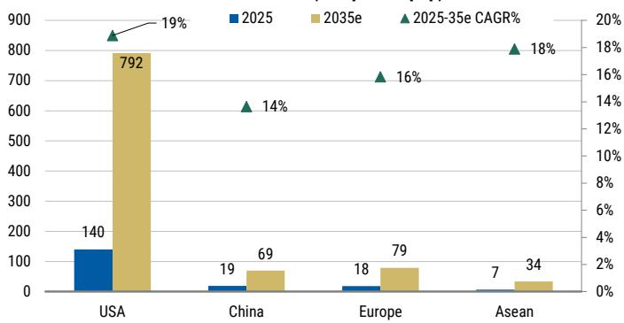

## MY>TH>SG in terms of DC Capacity

ASEAN DCs Capacity (MW)  
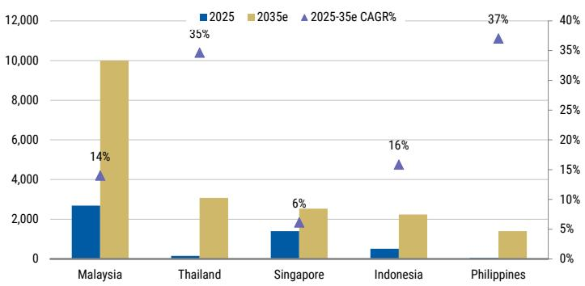  
Source: Company data, MS.

## Singapore Remains Most Saturated DC Market

ASEAN DCs MW per pop (mn)  
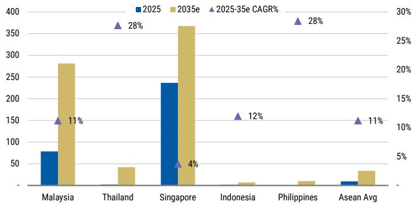

## ASEAN Data Centers: Singtel's AI Factory Stack

## Integrated stack: more than colocation

Four layers that convert regional connectivity and capacity into AI workloads.

Orchestration

Paragon

Platform layer to coordinate AI workloads, networks and enterprise deployments.

GPUaaS & AlaaS

RE:AI

On-demand GPU capacity and AI services, with NVIDIA ecosystem access and partner reach.

AI DC platform

Nxera

High-density, sustainable and AI-ready campuses in Singapore, Thailand, Indonesia and Malaysia.

Connectivity

Network Fabric

APAC telco, subsea and edge connectivity for low-latency AI adoption.

Enabled outcome: sovereign AI applications and enterprise workflows

## Investor read-through

Why the stack matters for monetization, customer capture and differentiation.

## Move up the value chain

Beyond wholesale colo: adds GPUaaS / AlaaS, orchestration and managed AI services.

## Sovereign AI wedge

Targets government and regulated enterprises needing local, secure AI infrastructure.

## Replicable playbook

JVs combine Singtel blueprint + NVIDIA platform with local power, land and telco partners.

## Connectivity advantage

Telco networks, subsea cables and edge locations create a low-latency demand funnel.

Source: Company data, MS. Note: We have not included STT GDC's contribution in Singtel's Digital Infraco

## ASEAN Data Centers: Singtel – The Leading AI DC Platform

## Singtel's First Phase Organic Pipeline

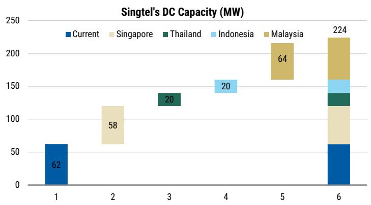

## Singtel's Digital Infraco's EBITDA grow $>30\%$

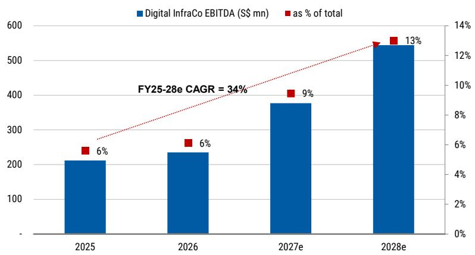

## Singtel's Digital InfraCo to be $>10\%$ of SOTP

Digital InfraCo Enterprise Valuation  
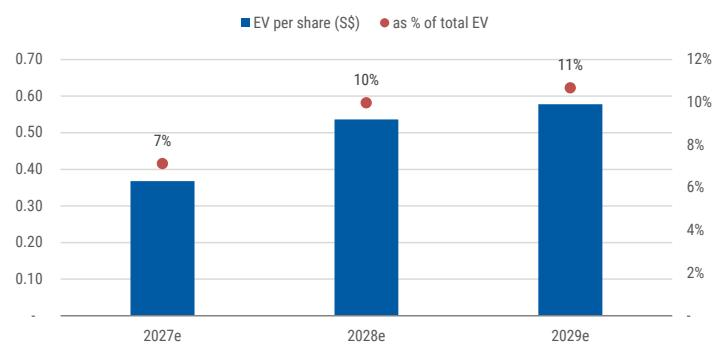

Singtel's Digital InfraCo Not Priced In  
Value of Associates vs Singtel's EV  
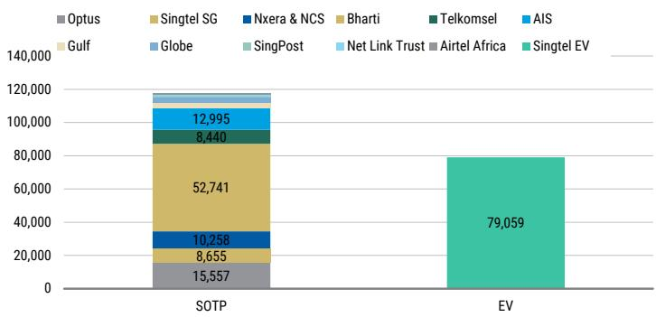  
Source: Company data, MS. Note: We have not included STT GDC's contribution in Singtel's Digital Infraco

## ASEAN Data Centers: Singtel Scaling through Acquisition of STT GDC

## Overview of STT GDC

Operational scale and footprint acquired by the consortium.

50 data centers \~673MW in operation

12 markets

## Footprint by market

Operational count / presence; asterisk = upcoming or pipeline market.

India 23

UK 11

Singapore 6

Philippines 5

Thailand 2

Japan 1

Vietnam 1

Indonesia 1

Malaysia\*

Germany\*

Italy\*

S. Korea\*

## Capacity / footprint bridge

A fast path from regional pipeline to a global AI data-center platform.

Nxera base

STT operating

>400MW medium-term pipeline

STT pipeline

+673MW current capacity +\~1.7GW pipeline across markets

Combined platform

\~2.8GW design capacity / 12 markets

## Transaction snapshot

EV S\$13.8bn; S\$6.6bn cash for 100% of STT GDC. Singtel contributes S\$740mn for 25% stake.

Equity-accounted; no dividend impact. Expected close in 2H26 per management.

Additional Singtel capex: \~S\$400-500mn over the next three years.

## Why it matters for Singtel

Capacity access: scarce operating MW + pipeline

\- Customer base: global hyperscalers and blue-chip enterprises

\- Footprint: 12 markets anchored by SG, India and UK

Value read-through: \~4% Singtel EV uplift based on MSe

Strategic read-through: access to constrained capacity, multi-market customer relationships and geographic optionality, while retaining a partnership-led model.

Source: Company data, MS.

Hardware in orbit

## ASEAN Data Centers: Moving Computing to Space

## Think small GPU satellites/modular computing containers linked optically

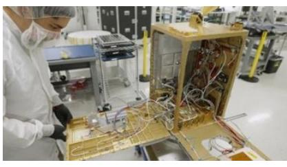  
H100-class GPU demonstrator  
2

Launch & deploy  
  
Reusable rockets + rideshare missions  
3 Modular computing

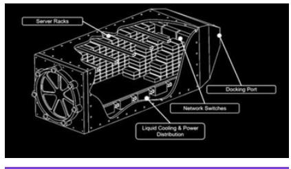  
GPU containers dock to power/cooling

4 Long-term scale  
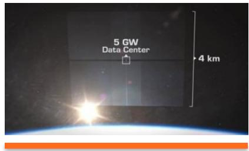  
Distributed nodes first; GW platforms later

## Why space?

Terrestrial bottleneck is power. Orbit offers abundant solar energy and radiative heat rejection.

## What has to work?

Launch cost, radiation shielding, thermal design, orbital debris, security and replacement cycles.

## Investor framing

A long-duration call option on AI power scarcity — not a near-term substitute for terrestrial DCs.

Core idea: move the demand source (computing) closer to abundant solar power instead of bringing scarce power to computing.

## ASEAN Data Centers: Key Diligence Checklist

## Ten questions to ask before underwriting data center-driven earnings growth

Capacity bridge What is operational, under construction, power-secured and merely planned? Cooling What rack density can the facility support today and after retrofit?
Power What grid connection dates, PPAs, redundancy design and utility dependencies are in place? Utilization How long from commissioning to stabilized EBITDA?
Leasing How much is pre-leased, to whom, for how long, and with what ramp schedule? Funding How are projects financed - balance sheet, JV, project debt, asset recycling?
Pricing Is billing per kW, per kWh, shell-and-power, or bundled service? Is power passed through? Customer risk What is tenant concentration and credit quality?
Capex/MW What is the all-in cost per MW and how exposed is it to electrical/cooling equipment inflation? Returns What is the stabilized EBITDA, ROIC and downside if leasing is delayed?

## Disclosure Section

The information and opinions in MS were prepared or are disseminated by MS Asia Limited (which accepts the responsibility for its contents) and/or MS Asia (Singapore) Pte. (Registration number 199206298Z) and/or MS Asia (Singapore) Securities Pte Ltd (Registration number 200008434H), regulated by the Monetary Authority of Singapore (which accepts legal responsibility for its contents and should be contacted with respect to any matters arising from, or in connection with, MS), and/or MS Taiwan Limited and/or MS & Co International plc, Seoul Branch, and/or MS Australia Limited (A.B.N. 67 003 734 576, holder of Australian financial services license No. 233742, which accepts responsibility for its contents), and/or MS Wealth Management Australia Pty Ltd (A.B.N. 19 009 145 555, holder of Australian financial services license No. 240813, which accepts responsibility for its contents), and/or MS India Company Private Limited having Corporate Identification No (CIN) U22990MH1998PTC115305, regulated by the Securities and Exchange Board of India ("SEBI") and holder of licenses as a Research Analyst (SEBI Registration No. INH000001105); Stock Broker (SEBI Stock Broker Registration No. INZ000244438), Merchant Banker (SEBI Registration No. INM000011203), and depository participant with National Securities Depository Limited (SEBI Registration No. IN-DP-NSDL-567-2021) having registered office at Altimus, Level 39 & 40, Pandurang Budhkar Marg, Worli, Mumbai 400018, India; Telephone no. +91-22-61181000; Compliance Officer Details: Mr. Tejarshi Hardas, Tel. No.: +91-22-61181000 or Email: tejarshi.hardas@morganstanley.com; Grievance officer details: Mr. Tejarshi Hardas, Tel. No.: +91-22-61181000 or Email: msic-compliance@morganstanley.com which accepts the responsibility for its contents and should be contacted with respect to any matters arising from, or in connection with, MS, and their affiliates (collectively, "MS"). MS India Company Private Limited (MSICPL) may use AI tools in providing research services. All recommendations contained herein are made by the duly qualified research analysts.

For important disclosures, stock price charts and equity rating histories regarding companies that are the subject of this report, please see the MS Disclosure Website at www.morganstanley.com/eqr/disclosures/webapp/generalresearch, or contact your investment representative or MS at 1585 Broadway, (Attention: Research Management), New York, NY, 10036 USA.

For valuation methodology and risks associated with any recommendation, rating or price target referenced in this research report, please contact the Client Support Team as follows: US/Canada +1800 303-2495; Hong Kong +852 2848-5999; Latin America +1718 754-5444 (U.S.); London +44 (0)20-7425-8169; Singapore +65 6834-6860; Sydney +61(0)2-9770-1505; Tokyo +81(0)3-6836-9000. Alternatively you may contact your investment representative or MS at 1585 Broadway, (Attention: Research Management), New York, NY 10036 USA.

## Analyst Certification

The following analysts hereby certify that their views about the companies and their securities discussed in this report are accurately expressed and that they have not received and will not receive direct or indirect compensation in exchange for expressing specific recommendations or views in this report: Da Wei Lee.

## Global Research Conflict Management Policy

MS has been published in accordance with our conflict management policy, which is available at www.morganstanley.com/institutional/research/conflictpolicies. A Portuguese version of the policy can be found at www.morganstanley.com.br

## Important Regulatory Disclosures on Subject Companies

The equity research analysts or strategists principally responsible for the preparation of MS have received compensation based upon various factors, including quality of research, investor client feedback, stock picking, competitive factors, firm revenues and overall investment banking revenues. Equity Research analysts' or strategists' compensation is not linked to investment banking or capital markets transactions performed by MS or the profitability or revenues of particular trading desks.

MS and its affiliates do business that relates to companies/instruments covered in MS, including market making, providing liquidity, fund management, commercial banking, extension of credit, investment services and investment banking. MS sells to and buys from customers the securities/instruments of companies covered in MS on a principal basis. MS may have a position in the debt of the Company or instruments discussed in this report. MS trades or may trade as principal in the debt securities (or in related derivatives) that are the subject of the debt research report.

Certain disclosures listed above are also for compliance with applicable regulations in non-US jurisdictions.

## STOCK RATINGS

MS uses a relative rating system using terms such as Overweight, Equal-weight, Not-Rated or Underweight (see definitions below). MS does not assign ratings of Buy, Hold or Sell to the stocks we cover. Overweight, Equal-weight, Not-Rated and Underweight are not the equivalent of buy, hold and sell. Investors should carefully read the definitions of all ratings used in MS. In addition, since MS contains more complete information concerning the analyst's views, investors should carefully read MS, in its entirety, and not infer the contents from the rating alone. In any case, ratings (or research) should not be used or relied upon as investment advice. An investor's decision to buy or sell a stock should depend on individual circumstances (such as the investor's existing holdings) and other considerations.

## Global Stock Ratings Distribution

## (as of May 31, 2026)

The Stock Ratings described below apply to MS's Fundamental Equity Research and do not apply to Debt Research produced by the Firm.

For disclosure purposes only (in accordance with FINRA requirements), we include the category headings of Buy, Hold, and Sell alongside our ratings of Overweight, Equal-weight, Not-Rated and Underweight. MS does not assign ratings of Buy, Hold or Sell to the stocks we cover. Overweight, Equal-weight, Not-Rated and Underweight are not the equivalent of buy, hold, and sell but represent recommended relative weightings (see definitions below). To satisfy regulatory requirements, we correspond

Overweight, our most positive stock rating, with a buy recommendation; we correspond Equal-weight and Not-Rated to hold and Underweight to sell recommendations, respectively.

<table><tr><td></td><td colspan="2">Coverage Universe</td><td colspan="3">Investment Banking Clients (IBC)</td><td colspan="2">Other Material Investment Services Clients (MISC)</td></tr><tr><td>Stock Rating Category</td><td>Count</td><td>% of Total</td><td>Count</td><td>% of Total IBC</td><td>% of Rating Category</td><td>Count</td><td>% of Total Other MISC</td></tr><tr><td>Overweight/Buy</td><td>1542</td><td>42%</td><td>465</td><td>51%</td><td>30%</td><td>707</td><td>43%</td></tr><tr><td>Equal-weight/Hold</td><td>1571</td><td>43%</td><td>369</td><td>40%</td><td>23%</td><td>723</td><td>44%</td></tr><tr><td>Not-Rated/Hold</td><td>3</td><td>0%</td><td>0</td><td>0%</td><td>0%</td><td>1</td><td>0%</td></tr><tr><td>Underweight/Sell</td><td>551</td><td>15%</td><td>86</td><td>9%</td><td>16%</td><td>201</td><td>12%</td></tr><tr><td>Total</td><td>3,667</td><td></td><td>920</td><td></td><td></td><td>1632</td><td></td></tr></table>

Data include common stock and ADRs currently assigned ratings. Investment Banking Clients are companies from whom MS received investment banking compensation in the last 12 months. Due to rounding off of decimals, the percentages provided in the "% of total" column may not add up to exactly 100 percent.

## Analyst Stock Ratings

Overweight (O). The stock's total return is expected to exceed the average total return of the analyst's industry (or industry team's) coverage universe, on a risk-adjusted basis, over the next 12-18 months.

Equal-weight (E). The stock's total return is expected to be in line with the average total return of the analyst's industry (or industry team's) coverage universe, on a risk-adjusted basis, over the next 12-18 months.

Not-Rated (NR). Currently the analyst does not have adequate conviction about the stock's total return relative to the average total return of the analyst's industry (or industry team's) coverage universe, on a risk-adjusted basis, over the next 12-18 months. Underweight (U). The stock's total return is expected to be below the average total return of the analyst's industry (or industry team's) coverage universe, on a risk-adjusted basis, over the next 12-18 months. Unless otherwise specified, the time frame for price targets included in MS is 12 to 18 months.

## Analyst Industry Views

Attractive (A): The analyst expects the performance of his or her industry coverage universe over the next 12-18 months to be attractive vs. the relevant broad market benchmark, as indicated below.

In-Line (I): The analyst expects the performance of his or her industry coverage universe over the next 12-18 months to be in line with the relevant broad market benchmark, as indicated below.

Cautious (C): The analyst views the performance of his or her industry coverage universe over the next 12-18 months with caution vs. the relevant broad market benchmark, as indicated below.

Benchmarks for each region are as follows: North America - S&P 500; Latin America - relevant MSCI country index or MSCI Latin America Index; Europe - MSCI Europe; Japan - TOPIX; Asia - relevant MSCI country index or MSCI sub-regional index or MSCI AC Asia Pacific ex Japan Index.

## Important Disclosures for MS Smith Barney LLC Customers

Important disclosures regarding any material conflict of interest that can reasonably be expected to have influenced MS Smith Barney LLC's choice of a third-party research provider or the subject company of a third-party research report, are available on the MS Wealth Management disclosure website at www.morganstanley.com/online/researchdisclosures. For MS specific disclosures, you may refer to https://www.morganstanley.com/eqr/disclosures/webapp/generalresearch.

Each MS report is reviewed and approved on behalf of MS Smith Barney LLC. This review and approval is conducted by the same person who reviews the research report on behalf of MS. This could create a conflict of interest.

## Other Important Disclosures

MS policy is to update research reports as and when the Research Analyst and Research Management deem appropriate, based on developments with the issuer, the sector, or the market that may have a material impact on the research views or opinions stated therein. In addition, certain Research publications are intended to be updated on a regular periodic basis (weekly/monthly/quarterly/annual) and will ordinarily be updated with that frequency, unless the Research Analyst and Research Management determine that a different publication schedule is appropriate based on current conditions.

MS is not acting as a municipal advisor and the opinions or views contained herein are not intended to be, and do not constitute, advice within the meaning of Section 975 of the Dodd-Frank Wall Street Reform and Consumer Protection Act. MS produces an equity research product called a "Tactical Idea." Views contained in a "Tactical Idea" on a particular stock may be contrary to the recommendations or views expressed in research on the same stock. This may be the result of differing time horizons, methodologies, market events, or other factors. For all research available on a particular stock, please contact your sales representative or go to Matrix at http://www.morganstanley.com/matrix.

MS is provided to our clients through our proprietary research portal on Matrix and also distributed electronically by MS to clients. Certain, but not all, MS products are also made available to clients through third-party vendors or redistributed to clients through alternate electronic means as a convenience. For access to all available MS, please contact your sales representative or go to Matrix at http://www.morganstanley.com/matrix. Any access and/or use of MS is subject to MS's Terms of Use (http://www.morganstanley.com/terms.html). By accessing and/or using MS, you are indicating that you have read and agree to be bound by our Terms of Use (http://www.morganstanley.com/terms.html). In addition you consent to MS processing your personal data and using cookies in accordance with our Privacy Policy and our Global Cookies Policy (http://www.morganstanley.com/privacy\_pledge.html), including for the purposes of setting your preferences and to collect readership data so that we can deliver better and more personalized service and products to you. To find out more information about how MS processes personal data, how we use cookies and how to reject cookies see our Privacy Policy and our Global Cookies Policy (http://www.morganstanley.com/privacy\_pledge.html). Please use the provided link to review the Terms and Conditions and Most Important Terms and Conditions for MS India Company Private Limited (https://www.morganstanley.com/assets/pdfs/about-us-global-offices/india/Terms\_and\_conditions.pdf) and the following link to review the audit report (https://ny.matrix.ms.com/eqr/research/webapp/researchdocs/MSICPL\_Morgan\_Stanley\_Research\_Audit\_Report.pdf).

If you do not agree to our Terms of Use and/or if you do not wish to provide your consent to MS processing your personal data or using cookies please do not access our research.

MS does not provide individually tailored investment advice. MS has been prepared without regard to the circumstances and objectives of those who receive it. MS recommends that investors independently evaluate particular investments and strategies, and encourages investors to seek the advice of a financial adviser. The appropriateness of an investment or strategy will depend on an investor's circumstances and objectives. The securities, instruments, or strategies discussed in MS may not be suitable for all investors, and certain investors may not be eligible to purchase or participate in some or all of them. MS is not an offer to buy or sell or the solicitation of an offer to buy or sell any security/instrument or to participate in any particular trading strategy. The value of and income from your investments may vary because of changes in interest rates, foreign exchange rates, default rates, prepayment rates, securities/instruments prices, market indexes, operational or financial conditions of companies or other factors. There may be time limitations on the exercise of options or other rights in securities/instruments transactions. Past performance is not necessarily a guide to future performance. Estimates of future performance are based on assumptions that may not be realized. If provided, and unless otherwise stated, the closing price on the cover page is that of the primary exchange for the subject company's securities/instruments.

The fixed income research analysts, strategists or economists principally responsible for the preparation of MS have received compensation based upon various factors, including quality, accuracy and value of research, firm profitability or revenues (which include fixed income trading and capital markets profitability or revenues), client feedback and competitive factors. Fixed Income Research analysts', strategists' or economists' compensation is not linked to investment banking or capital markets transactions performed by MS or the profitability or revenues of particular trading desks.

The "Important Regulatory Disclosures on Subject Companies" section in MS lists all companies mentioned where MS owns 1% or more of a class of common equity securities of the companies. For all other companies mentioned in MS, MS may have an investment of less than 1% in securities/instruments or derivatives of securities/instruments of companies and may trade them in ways different from those discussed in MS. Employees of MS not involved in the preparation of MS may have investments in securities/instruments or derivatives of securities/instruments of companies mentioned and may trade them in ways different from those discussed in MS. Derivatives may be issued by MS or associated persons.

With the exception of information regarding MS, MS is based on public information. MS makes every effort to use reliable, comprehensive information, but we make no representation that it is accurate or complete. We have no obligation to tell you when opinions or information in MS change apart from when we intend to discontinue equity research coverage of a subject company. Facts and views presented in MS have not been reviewed by, and may not reflect information known to, professionals in other MS business areas, including investment banking personnel.

MS personnel may participate in company events such as site visits and are generally prohibited from accepting payment by the company of associated expenses unless pre-approved by authorized members of Research management. MS may make investment decisions that are inconsistent with the recommendations or views in this report.

To our readers based in Taiwan or trading in Taiwan securities/instruments: Information on securities/instruments that trade in Taiwan is distributed by MS Taiwan Limited ("MSTL"). Such information is for your reference only. The reader should independently evaluate the investment risks and is solely responsible for their investment decisions. MS may not be distributed to the public media or quoted or used by the public media without the express written consent of MS. Any non-customer reader within the scope of Article 7-1 of the Taiwan Stock Exchange Recommendation Regulations accessing and/or receiving MS is not permitted to provide MS to any third party (including but not limited to related parties, affiliated companies and any other third parties) or engage in any activities regarding MS which may create or give the appearance of creating a conflict of interest. Information on securities/instruments that do not trade in Taiwan is for informational purposes only and is not to be construed as a recommendation or a solicitation to trade in such securities/instruments. MSTL may not execute transactions for clients in these securities/instruments.

Certain information in MS was sourced by employees of the Shanghai Representative Office of MS Asia Limited for the use of MS Asia Limited.

MS is not incorporated under PRC law and the research in relation to this report is conducted outside the PRC. MS does not constitute an offer to sell or the solicitation of an offer to buy any securities in the PRC. PRC investors shall have the relevant qualifications to invest in such securities and shall be responsible for obtaining all relevant approvals, licenses, verifications and/or registrations from the relevant governmental authorities themselves. Neither this report nor any part of it is intended as, or shall constitute, provision of any consultancy or advisory service of securities investment as defined under PRC law. Such information is provided for your reference only.

MS is disseminated in Brazil by MS C.T.V.M. S.A. located at Av. Brigadeiro Faria Lima, 3600, 6th floor, São Paulo - SP, Brazil; and is regulated by the Comissão de Valores Mobiliários; in Mexico by MS México, Casa de Bolsa, S.A. de C.V which is regulated by Comision Nacional Bancaria y de Valores. Paseo de los Tamarindos 90, Torre 1, Col. Bosques de las Lomas Floor 29, 05120 Mexico City; in Japan by MS MUFG Securities Co., Ltd. and, for Commodities related research reports only, MS Capital Group Japan Co., Ltd; in Hong Kong by MS Asia Limited (which accepts responsibility for its contents) and by MS Bank Asia Limited; in Singapore by MS Asia (Singapore) Pte. (Registration number 199206298Z) and/or MS Asia (Singapore) Securities Pte Ltd (Registration number 200008434H), regulated by the Monetary Authority of Singapore (which accepts legal responsibility for its contents and should be contacted with respect to any matters arising from, or in connection with, MS) and by MS Bank Asia Limited, Singapore Branch (Registration number T14FC0118); in Australia to "wholesale clients" within the meaning of the Australian Corporations Act by MS Australia Limited A.B.N. 67 003 734 576, holder of Australian financial services license No. 233742, which accepts responsibility for its contents; in Australia to "wholesale clients" and "retail clients" within the meaning of the Australian Corporations Act by MS Wealth Management Australia Pty Ltd (A.B.N. 19 009 145 555, holder of Australian financial services license No. 240813, which accepts responsibility for its contents; in Korea by MS & Co International plc, Seoul Branch; in India by MS India Company Private Limited having Corporate Identification No (CIN) U22990MH1998PTC115305, regulated by the Securities and Exchange Board of India ("SEBI") and holder of licenses as a Research Analyst (SEBI Registration No. INH000001105); Stock Broker (SEBI Stock Broker Registration No. INZ000244438), Merchant Banker (SEBI Registration No. INM000011203), and depository participant with National Securities Depository Limited (SEBI Registration No. IN-DP-NSDL-567-2021) having registered office at Altimus, Level 39 & 40, Pandurang Budhkar Marg, Worli, Mumbai 400018, India; Telephone no. +91-22-61181000; Compliance Officer Details: Mr. Tejarshi Hardas, Tel. No.: +91-22-61181000 or Email: tejarshi.hardas@morganstanley.com; Grievance officer details: Mr. Tejarshi Hardas, Tel. No.: +91-22-61181000 or Email: msic-compliance@morganstanley.com. MS India Company Private Limited (MSICPL) may use AI tools in providing research services. All recommendations contained herein are made by the duly qualified research analysts; in Canada by MS Canada Limited; in Germany and the European Economic Area where required by MS Europe S.E., authorised and regulated by Bundesanstalt fuer Finanzdienstleistungsaufsicht (BaFin) under the reference number 149169; in the US by MS & Co. LLC, which accepts responsibility for its contents. MS & Co. International plc, authorized by the Prudential Regulation Authority and regulated by the Financial Conduct Authority and the Prudential Regulation Authority, disseminates in the UK research that it has prepared, and research which has been prepared by any of its affiliates, only to persons who (i) are investment professionals falling within Article 19(5) of the Financial Services and Markets Act 2000 (Financial Promotion) Order 2005 (as amended, the "Order"); (ii) are persons who are high net worth entities falling within Article 49(2)(a) to (d) of the Order; or (iii) are persons to whom an invitation or inducement to engage in investment activity (within the meaning of section 21 of the Financial Services and Markets Act 2000, as amended) may otherwise lawfully be communicated or caused to be communicated. RMB MS Proprietary Limited is a member of the JSE Limited and A2X (Pty) Ltd. RMB MS Proprietary Limited is a joint venture owned equally by MS International Holdings Inc. and RMB Investment Advisory (Proprietary) Limited, which is wholly owned by FirstRand Limited. The information in MS is being disseminated by MS Saudi Arabia, regulated by the Capital Market Authority in the Kingdom of Saudi Arabia, and is directed at Sophisticated investors only.

The information in MS is being communicated by MS & Co. International plc (DIFC Branch), regulated by the Dubai Financial Services Authority (the DFSA) or by MS & Co. International plc (ADGM Branch), regulated by the Financial Services Regulatory Authority Abu Dhabi (the FSRA), and is directed at Professional Clients only, as defined by the DFSA or the FSRA, respectively. The financial products or financial services to which this research relates will only be made available to a customer who we are satisfied meets the regulatory criteria of a Professional Client. A distribution of the different MS Research ratings or recommendations, in percentage terms for Investments in each sector covered, is available upon request from your sales representative.

The information in MS is being communicated by MS & Co. International plc (QFC Branch), regulated by the Qatar Financial Centre Regulatory Authority (the QFCRA), and is directed at business customers and market counterparties only and is not intended for Retail Customers as defined by the QFCRA.

As required by the Capital Markets Board of Turkey, investment information, comments and recommendations stated here, are not within the scope of investment advisory activity. Investment advisory service is provided exclusively to persons based on their risk and income preferences by the authorized firms. Comments and recommendations stated here are general in nature. These opinions may not fit to your financial status, risk and return preferences. For this reason, to make an investment decision by relying solely to this information stated here may not bring about outcomes that fit your expectations.

The trademarks and service marks contained in MS are the property of their respective owners. Third-party data providers make no warranties or representations relating to the accuracy, completeness, or timeliness of the data they provide and shall not have liability for any damages relating to such data. The Global Industry Classification Standard (GICS) was developed by and is the exclusive property of MSCI and S&P.

MS, or any portion thereof may not be reprinted, sold or redistributed without the written consent of MS.

Indicators and trackers referenced in MS may not be used as, or treated as, a benchmark under Regulation EU 2016/1011, or any other similar framework.

The issuers and/or fixed income products recommended or discussed in certain fixed income research reports may not be continuously followed. Accordingly, investors should regard those fixed income research reports as providing stand-alone analysis and should not expect continuing analysis or additional reports relating to such issuers and/or individual fixed income products.

MS may hold, from time to time, material financial and commercial interests regarding the company subject to the Research report.

Registration granted by SEBI and certification from the National Institute of Securities Markets (NISM) in no way guarantee performance of the intermediary or provide any assurance of returns to investors. Investment in securities market are subject to market risks. Read all the related documents carefully before investing.

## © 2026 MS