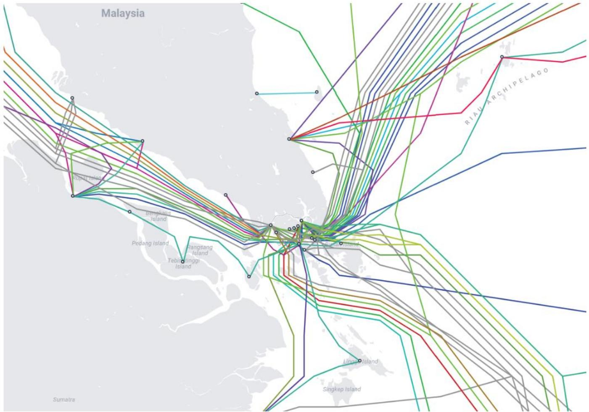
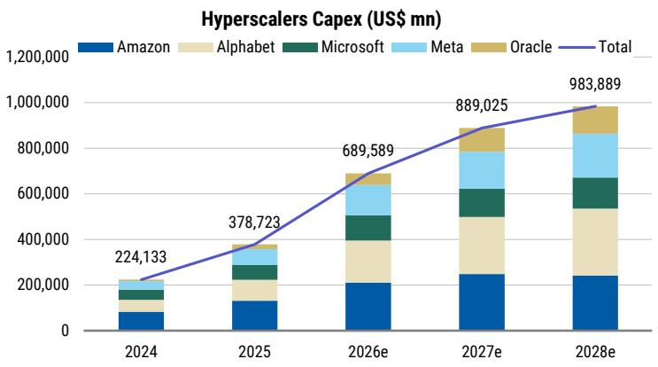

# ASEAN Telecoms Are No Longer Just Telcos: They Are the Region’s Most Underappreciated AI Infrastructure Play

The prevailing narrative about artificial intelligence infrastructure has been dominated by hyperscaler data centers in the United States and the semiconductor supply chain in Taiwan and South Korea. Investors have focused on Nvidia’s GPU roadmap, the power constraints of Northern Virginia, and the water consumption of Iowa server farms. This focus, while justified, has obscured a structural shift that is quietly reshaping the investment landscape of Southeast Asia: ASEAN telecom operators are becoming the region’s primary conduits for the new computing paradigm, and their data center businesses are being systematically undervalued by the market.

This is not a story about tower companies or fiber-to-the-home penetration. It is a story about how the convergence of sovereign AI mandates, GPU-driven workload density, and subsea cable geography is transforming the economics of telecom infrastructure in a region that houses 650 million people, some of the world’s most competitive power prices, and a growing list of governments that do not want their national data to leave their borders.

The argument is straightforward but not yet priced in. Telecom operators in ASEAN are uniquely positioned to capture value from the AI infrastructure build-out because they control the three most scarce inputs: land with power access, subsea cable connectivity, and the regulatory relationships necessary for sovereign AI deployments. The market still values these companies as mature telcos with declining voice revenues and capital-intensive fiber builds. It has not yet repriced them as AI infrastructure platforms with recurring, escalatory revenue streams from high-density compute capacity.

## The AI Data Center Is a Different Asset Class Than the Enterprise Data Center, and the Market Has Not Fully Adjusted Its Valuation Framework

The traditional enterprise data center was a real estate play with a power bill. A company leased space, brought its own servers, and paid for electricity. The data center operator’s competitive advantage was location and uptime. The unit economics were stable but unexciting, with returns that rarely justified aggressive valuation multiples.

The AI data center is a fundamentally different asset. It is a power conversion machine that transforms high-voltage grid electricity into GPU compute cycles. The bottleneck is no longer square footage. It is power density per rack, liquid cooling capability, and low-latency intra-cluster networking. A single AI training rack can draw 40 to 200 kilowatts, compared to 5 to 15 kilowatts for a traditional enterprise rack. Next-generation platforms will push beyond hundreds of kilowatts per rack. This changes everything about the economics.

The operator that can secure grid interconnection rights, build substations capable of delivering 100 megawatts or more, and deploy liquid cooling loops has created a competitive moat that is far deeper than a building shell. The hardest assets to replicate are power access, cooling design, network density, and operating track record. A data center is not a commodity warehouse. It is a tightly engineered system that makes IT equipment reliable, dense, and connected.

For ASEAN telecom operators, this shift is existential and opportunistic. Their legacy networks already connect to every major population center and industrial zone. They have existing relationships with grid operators and regulators. They own land parcels near subsea cable landing stations. And they are sitting on balance sheets that, while capital-intensive, can support the long-duration investment cycle that data center development requires.

The critical insight for investors is that not every megawatt of data center capacity is equal. A leased AI-ready megawatt requires a different capex profile, cooling specification, and customer contract than a traditional colocation megawatt. The market is still applying a single multiple to data center earnings without adequately differentiating between enterprise-grade and AI-grade capacity. This creates an opportunity for operators that can demonstrate AI-ready power density and for investors who can identify the gap between reported capacity and actually deployable compute load.

## ASEAN’s Structural Advantages in Land, Power, and Connectivity Create a Regional Cluster That Can Compete With Established Markets

The global data center market is growing at double-digit rates, but the distribution of capacity is highly uneven. The United States remains the most saturated market by megawatts per million population. In ASEAN, the picture is more varied. Malaysia has the largest absolute data center capacity in the region, followed by Thailand, then Singapore. But Singapore remains the most saturated market on a per capita basis, which has driven development into neighboring countries.

This dispersion is not random. It reflects a clear set of locational factors that the report identifies as the formation of data center clusters. The best locations maximize connectivity and customer access while minimizing power, land, and permitting risk. In ASEAN, this means that clusters are forming around subsea cable landing stations, near hydroelectric or natural gas power plants, and in jurisdictions with clear permitting pathways and tax incentives.

Singapore is the region’s submarine cable hub, with fiber routes connecting to every major Asian market and onward to Europe and the United States. But the city-state faces land and power constraints that cap its total addressable capacity. This has pushed hyperscalers and colocation operators into Johor, Malaysia, and Batam, Indonesia, where land is cheaper, power is more available, and the connectivity to Singapore’s cable landings is only a few milliseconds away.

Thailand is emerging as a distinct cluster, driven by its competitive power prices from natural gas and its geographic position as a hub for Indochina. Indonesia, with its massive population and growing digital economy, is developing capacity in Greater Jakarta and Batam, though permitting and grid reliability remain challenges.

The strategic implication is clear. ASEAN is not a single data center market. It is a set of interconnected clusters, each with its own power profile, regulatory environment, and customer base. Operators that can build across multiple clusters, leveraging common design standards and customer relationships, will capture the network effects of regional scale. Operators that are confined to a single market, particularly Singapore, will face growth constraints that limit their ability to participate in the AI infrastructure build-out.

## The Rise of Sovereign AI Mandates Creates a Captive Demand Pool That Only Local Operators Can Serve

One of the most underappreciated drivers of ASEAN data center demand is sovereign AI. Governments across the region are increasingly mandating that certain categories of data, particularly government records, healthcare information, and financial services data, must remain within national borders. This is not a theoretical concern. Thailand, Indonesia, and Malaysia have all introduced or strengthened data localization requirements in recent years.

The implication for data center demand is profound. Global hyperscalers can build capacity in Singapore or Malaysia to serve enterprise customers across the region, but they cannot serve sovereign workloads in Thailand with capacity located in Indonesia. Each country requires its own data center capacity, operated by a local entity that can demonstrate compliance with national regulations.

This creates a structural demand wedge that only local telecom operators can fill. They already have the regulatory licenses, the physical network infrastructure, and the relationships with government agencies. They understand the local permitting environment and can navigate the bureaucratic complexity that hyperscalers often find frustrating. And they have the balance sheet to invest in capacity that may take three to five years to reach stabilized utilization.

The report highlights Singtel’s AI factory stack as an example of this strategy in action. Singtel has built an integrated platform that spans connectivity, AI-ready data center campuses, GPU-as-a-service, and orchestration software. The stack is designed to capture value at every layer, from the physical infrastructure to the AI workload management. The sovereign AI wedge is a key part of the thesis: Singtel targets government and regulated enterprises that need local, secure AI infrastructure that cannot be outsourced to a hyperscaler in another country.

But Singtel is not the only operator pursuing this strategy. Other ASEAN telcos, including AIS in Thailand, Telkom in Indonesia, and Telkom Malaysia, are building their own AI infrastructure capabilities. The question for investors is which operators have the execution capability, the balance sheet capacity, and the customer relationships to convert sovereign AI mandates into long-term, contracted revenue.

## The Report Raises Critical Questions About Capacity Quality, Utilization Timing, and the True Cost of AI-Ready Infrastructure

No investment thesis is complete without a clear-eyed assessment of the risks, and the report provides a diligence checklist that should give any serious investor pause before underwriting data center-driven earnings growth.

The first question is capacity quality. What is operational versus under construction versus merely planned? In a market where every operator is announcing ambitious pipeline targets, the gap between announced capacity and delivered capacity can be substantial. Power interconnection dates slip. Permitting takes longer than expected. Cooling retrofits are more expensive than budgeted. Investors need to look past the headline megawatt numbers and understand the commissioning timeline for each facility.

The second question is utilization timing. How long does it take from commissioning to stabilized EBITDA? In the current market, pre-leasing is common, but the ramp schedule matters. A facility that is 50 percent pre-leased but takes 18 months to reach full utilization will generate significantly lower returns than one that ramps in 12 months. The difference can be the difference between a 12 percent and an 8 percent ROIC.

The third question is the true cost of AI-ready infrastructure. Cooling a 40-kilowatt rack requires a fundamentally different design than cooling a 10-kilowatt rack. Direct-to-chip liquid cooling, immersion cooling, and advanced air handling all carry different capex profiles and operating costs. The all-in cost per megawatt for AI-ready capacity can be 30 to 50 percent higher than for enterprise-grade capacity, and the market may not be fully pricing this differential into valuation multiples.

The report also raises a longer-term question that is deliberately left open: the potential emergence of orbital data centers. The concept is simple in theory and extraordinarily difficult in practice. Move computing into space, where solar power is abundant and heat rejection is efficient, and bypass terrestrial power constraints entirely. The technology requires reusable rockets, radiation-hardened hardware, and orbital debris management. It is a long-duration call option on AI power scarcity, not a near-term substitute for terrestrial data centers. But it is a reminder that the current infrastructure paradigm is not permanent and that investors should be wary of extrapolating today’s bottlenecks indefinitely.

## A Decision Framework for Investors Evaluating ASEAN Data Center Exposure

The report provides the raw material for a structured investment framework. Here is how a serious investor should think about positioning.

First, distinguish between capacity and capability. Megawatts of data center capacity are not all equal. The investor should evaluate each operator based on its ability to deliver AI-ready power density, liquid cooling, and low-latency networking. An operator with 100 megawatts of enterprise-grade capacity is less valuable than an operator with 50 megawatts of AI-ready capacity, because the latter can charge higher prices, attract better customers, and generate higher ROIC.

Second, evaluate the power train. Data center economics are ultimately power economics. The investor needs to understand the grid connection timeline, the power purchase agreement structure, the redundancy design, and the utility dependency. An operator with a signed PPA and a confirmed grid interconnection date is worth more than an operator with a land option and a memorandum of understanding.

Third, assess the sovereign AI wedge. Which operators have the regulatory relationships and the local presence to capture sovereign AI workloads? This is a structural demand driver that is independent of the global capex cycle. Governments will continue to localize data regardless of whether Nvidia’s next GPU generation is delayed or hyperscaler capex growth slows.

Fourth, stress-test the utilization assumption. The bullish case for data center investment assumes that capacity will be leased quickly and ramped efficiently. The bear case is that supply outpaces demand, that power costs rise unexpectedly, or that cooling retrofits prove more expensive than anticipated. The investor should model a downside scenario with a 12-month delay in leasing and a 20 percent increase in capex per megawatt. If the returns still look acceptable, the investment thesis is robust.

## Join the community to read the full report and review the original charts

The analysis above synthesizes the core argument from a detailed research report on ASEAN telecoms and data centers. But the full report contains considerably more granularity: the anatomy of AI data center economics, the value chain mapping from power generation to server components, the specific capacity pipelines for each operator, and the detailed financial projections for Singtel’s digital infrastructure business. The original charts, particularly those showing the capacity bridge between operational and planned megawatts and the EBITDA growth trajectory for digital infrastructure, are essential for any investor building a position in this sector.

The report also leaves several meaningful questions unanswered, which is precisely why reading the original material is valuable. What is the true cost of capital for data center development in ASEAN versus developed markets? How will the emergence of agentic AI frameworks change workload distribution between training and inference? Which operators have the balance sheet capacity to fund their pipeline without diluting equity? These are questions that every investor needs to answer for themselves, and the full report provides the data to do so.

*This article is for learning and discussion only and does not constitute investment advice.*

Personal reading notes and learning share only. Not investment advice.

