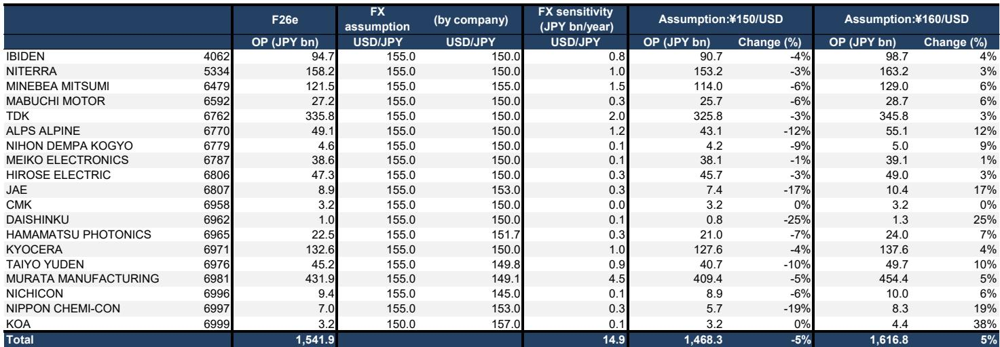
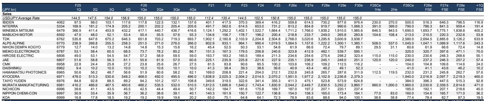

# The Real AI-Supply-Chain Advantage Is Not About Price Hikes — It Is About Product-Mix Asymmetry

Investors visiting Singapore and Hong Kong in late June 2026 came with a single question on their minds: how much can MLCC prices rise? They left with an answer they did not expect. The conversation is not about price hikes at all. It is about a structural asymmetry in product mix that will determine which companies compound value over the next cycle and which ones trap themselves in a short-term earnings mirage.

In 31 one-on-one meetings and two group lunches with institutional investors across both financial hubs, the dominant theme was the disconnect between what the market is pricing and what the underlying earnings trajectory actually looks like. The market remains fixated on commoditized MLCC pricing cycles — a 2018 replay that is not coming. The real story is that high-value-added MLCCs for AI servers are growing at a rate that makes commoditized pricing a sideshow. Murata Manufacturing is on track to grow AI/data center MLCC sales by 85–90% year-over-year in fiscal year ending March 2027, with roughly half of that growth coming from ASP expansion driven purely by product mix, not price increases on identical components.

This is not a cyclical recovery story. It is a structural divergence story. The gap in corporate value between companies that chase price hikes and those that continuously improve product competitiveness is about to become the defining feature of the Japanese electronic components landscape. The report from a global investment bank that synthesized these investor meetings provides the analytical architecture for understanding that gap — and for identifying which companies will widen it and which will fall into it.

## The Market Is Asking the Wrong Question About MLCC Pricing, and the Answer Is Hidden in Product Mix

Every investor meeting in Singapore and Hong Kong circled back to the same concern: are MLCC prices for commoditized products going up, and how far? This is the wrong question. The correct question is: how fast is the revenue mix shifting toward products that cannot be easily replicated by competitors?

The data from the report makes this clear. Murata's expected ASP growth of roughly 50% for AI/data center MLCCs in F3/27 comes entirely from selling a higher proportion of ultra-high-capacitance components — 1608 size 100μF, 1005 size 47μF, and 0603 size 10μF — not from raising prices on existing catalog items. These are products that require mastery of barium titanate particle refinement, electrode width reduction, and dielectric layer stacking at a level that only one company has demonstrated the ability to mass-produce stably.

The implication is straightforward. The market is using a 2018 playbook to analyze a 2026 reality. In 2018, the MLCC cycle was driven by supply constraints across commoditized products. In 2026, the cycle is driven by demand for products that did not exist at scale five years ago. Investors who focus on commoditized pricing are analyzing a shrinking portion of the profit pool. The growth is elsewhere, and it is not accessible to every player.

## Only One Company Can Stably Supply the Full Suite of AI-Server MLCCs, and That Creates a Multi-Year Earnings Asymmetry

The report's market share estimates tell a stark story. Murata holds 40.8% of the total MLCC market in 2025, compared to 22.5% for SEMCO and 11.3% for Taiyo Yuden. But the concentration is far more extreme in the high-value-added segment. For AI server applications requiring the smallest, highest-capacitance components, Murata appears to be the only supplier capable of stable mass production across the full product range.

Taiyo Yuden is making progress. The report estimates its AI/data center MLCC sales will grow 82–83% year-over-year in F3/27, reaching roughly 15% of its total MLCC sales. But there is a timing problem. By the time Taiyo Yuden achieves stable mass production of the current generation of high-value-added MLCCs, Murata will likely be mass-producing even smaller, higher-capacitance components. This is not a static race. It is a moving target where the leader extends its advantage with each product generation.

The strategic consequence is that Taiyo Yuden's earnings will benefit from higher utilization rates and some AI-related volume, but the profit contribution from high-value-added products will remain limited relative to Murata. Furthermore, Taiyo Yuden froze capital expenditure in the second half of 2024, constraining capacity growth to roughly 5% in F3/26. When capacity is tight and product mix is lagging, the ability to capture new business is structurally constrained regardless of demand.

## The Corporate-Value Divergence Between Price-Hikers and Product-Improvers Is the Underappreciated Structural Theme

This is the section of the report that deserves the most attention from long-term investors. The argument is not merely that some companies have better products. It is that the strategy of pursuing indiscriminate price hikes on commoditized products actively destroys long-term competitive advantage.

Murata's approach is instructive. The company does not proactively raise prices on commoditized MLCCs, even when market conditions would allow it. The reasoning is strategic: short-term price increases maximize current profits but lower barriers to entry. When prices rise on commoditized products, Chinese, South Korean, and Taiwanese competitors find it easier to enter the market, capture share, and ultimately compress margins over the medium to long term. Murata accepts lower short-term commoditized margins in exchange for maintaining the competitive moat that protects its high-value-added business.

The contrast with many competitors is sharp. Companies that pursue short-term profit maximization through price hikes tend to underinvest in R&D and production technology. The report argues that while rising commoditized prices may boost their near-term earnings, those gains are unlikely to translate into market share gains or corporate value expansion over a multi-year horizon.

This is a testable thesis. Investors can track R&D spending as a percentage of sales, capacity expansion plans, and product launch cadences across the coverage universe. The companies that score high on those metrics are the ones that will compound value. The ones that score low but show high commoditized pricing power are likely to be value traps.

## The IBIDEN Debate Reveals a Tension Between Technology Trajectory and Market Expectation

The ABF package substrate story is real, but the market may be getting ahead of itself. The report estimates that Ibiden began volume shipments of ABF substrates for NVIDIA's Rubin platform in the fourth quarter of F3/26, and that Rubin-related sales will exceed Blackwell-related sales by the first quarter of F3/27. Earnings expansion from high-value-added ABF substrates is coming.

But the report's operating profit forecasts are significantly below both company guidance and consensus. For F3/28, the report forecasts ¥128.5 billion in operating profit, compared to the company's own guidance of ¥150 billion and a FactSet consensus of ¥151.5 billion. For F3/31, the gap widens: the report forecasts ¥242.6 billion versus the company's ¥300 billion target.

The source of the divergence is EMIB-T. While the report expects EMIB-T to drive earnings expansion from F3/29 onward, it questions whether the profit margins on these products will match those of existing NVIDIA offerings. The technology trajectory is positive, but the market may be pricing in margin outcomes that are not yet justified by the competitive dynamics.

This creates an interesting analytical tension. Ibiden is clearly a beneficiary of the AI infrastructure buildout. But the report's underweight rating suggests that the current valuation — with a base target price of ¥13,000 against a market price of ¥24,000 as of June 26 — already prices in a level of success that may take several years to materialize, if it materializes at all.

## What the Report Does Not Fully Answer: The Competitive Dynamics Beyond the Current Product Generation

The report provides a detailed snapshot of the current competitive landscape, but it leaves several critical questions open. First, how sustainable is Murata's lead in high-value-added MLCCs? The report notes that only Murata can stably mass-produce the full suite of current-generation AI server MLCCs. But the competitive moat depends on continuous innovation. If a competitor achieves a breakthrough in barium titanate processing or electrode design, the advantage could narrow faster than expected.

Second, what happens when AI server architectures change? The report's demand projections are based on the assumption that total MLCC capacitance required per accelerator board doubles with each GPU generation while installation space remains limited. That assumption is reasonable for the current architecture, but it is not guaranteed indefinitely. A shift toward different packaging or power delivery architectures could alter the MLCC demand profile.

Third, how will the ABF substrate market evolve as Intel, Samsung, and other foundries scale their own advanced packaging capabilities? Ibiden's current advantage is tied to NVIDIA's specific requirements. If NVIDIA diversifies its substrate suppliers or if competing architectures gain share, Ibiden's earnings trajectory could look very different from the base case.

These are not flaws in the report. They are the natural boundaries of any forward-looking analysis. The report provides a clear framework for understanding the current inflection point. The unanswered questions are where the next round of research will focus.

## A Decision Framework for Investors: Three Filters for Identifying Structural Winners

Based on the report's logic, investors evaluating Japanese electronic components companies can apply a three-part filter to distinguish between companies that are building durable competitive advantage and those that are riding a cyclical wave.

First, measure the share of revenue coming from products where the company has a demonstrable technological lead over competitors. For Murata, AI/data center MLCCs are moving from 10–15% of total MLCC sales to 20–25% in a single year. For Taiyo Yuden, the comparable figure is moving from 5–10% to around 15%. The absolute level matters, but so does the rate of change. Companies that can shift their mix faster than competitors are building a structural earnings buffer.

Second, evaluate the company's approach to commoditized product pricing. Does it raise prices aggressively when demand allows, or does it use pricing discipline to maintain barriers to entry? The report's argument is that aggressive commoditized pricing is a leading indicator of future market share loss. Companies that prioritize short-term profit maximization in commoditized segments are likely sacrificing long-term competitive position.

Third, compare the company's R&D and capex trajectory against its product road map. The report notes that Taiyo Yuden's capex freeze in late 2024 constrained capacity growth to roughly 5% in F3/26. That is a concrete signal that the company's ability to capture new business is limited, regardless of demand. Companies that maintain or increase investment during periods of strong demand are positioning for the next product generation. Companies that pull back are signaling that they expect the current cycle to be temporary.

Investors who apply these three filters will find that the coverage universe divides cleanly into two groups. The first group consists of companies that are building structural earnings power through product mix improvement and investment discipline. The second group consists of companies that are generating cyclical earnings from commoditized pricing and may face a sharp revaluation when the cycle turns.

## Join the Community to Read the Full Report and Review the Original Charts

The analysis above draws on a detailed report that includes market share estimates, revenue breakdowns by product category, and multi-year earnings forecasts for 20 companies in the Japanese electronic components sector. The original charts — particularly the sales and operating profit trajectory tables and the price-to-target-price gap visualization — provide the quantitative foundation for the arguments made here. They also reveal several interesting anomalies that this article has not fully explored, including the wide dispersion in bull-case valuations across the coverage universe and the specific inflection points in Ibiden's revenue ramp that underpin the underweight rating.

Readers who want to examine the original data, review the full set of company-level forecasts, and track how these arguments evolve as new quarterly results come in should join the community. The full report contains the exhibits and numerical details that transform these strategic observations into actionable investment frameworks.

*This article is for learning and discussion only and does not constitute investment advice.*

Personal reading notes and learning share only. Not investment advice.

