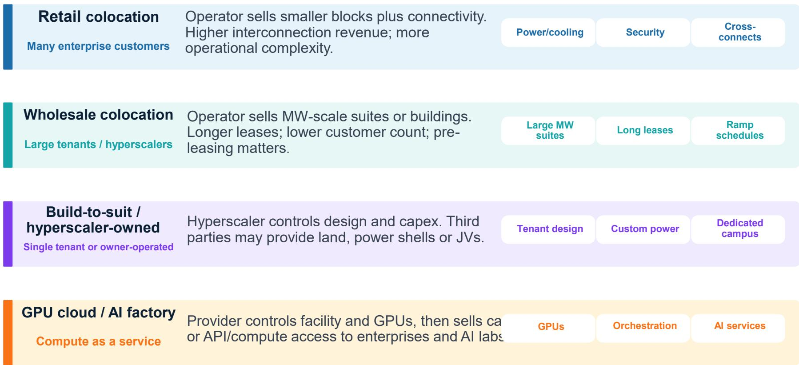

# 摩根斯坦利：MS：AI基建的下一站不在美国，在东盟

当全球资本还在争论美国数据中心是否已经过热时，一份来自MS的投资者演示材料提出了一个值得深思的判断：AI基础设施建设的下一个结构性机会，可能出现在一个被多数投资者低估的区域——东盟。

这不是一个关于“东南亚是否值得关注”的泛泛之谈。报告的核心主张非常具体：东盟正处在AI基础设施建设的独特交汇点上——拥有充足的廉价土地和电力、战略性的海底光缆连接、以及正在崛起的主权AI需求。这三个要素的组合，在全球范围内几乎找不到第二个区域同时具备。

更为关键的是，这份报告不是停留在宏观叙事层面。它提供了一套完整的“数据中心投资指南”，从资产解剖到商业模式拆解，再到具体标的的估值分析，最后甚至讨论了一个可能改变游戏规则的长期变量——轨道数据中心。

我们将其核心判断提炼为以下五个层次。

## 1. AI数据中心的核心瓶颈已经从“空间”转向“功率密度”，这改变了整个投资逻辑

传统数据中心的核心指标是面积和机柜数量。但AI训练和推理的需求完全不同。报告指出，一个AI GPU机架的功率密度已经从传统企业级机架的5-15千瓦飙升至40-200千瓦，下一代平台甚至可能达到数百千瓦级别。

这意味着什么？简单说，过去建数据中心像建仓库，核心是“能放多少货”。现在建数据中心更像建发电厂，核心是“能接入多少电和怎么散热”。

> **KC评论：** 投资者需要重新理解数据中心的“产能单位”。过去看数据中心，核心指标是面积和机柜数。现在要看MW（兆瓦）的可用容量和利用率。一个能支持200千瓦/机架的数据中心，其资本开支结构和运营逻辑与支持5千瓦的完全不同。这份报告里有一张“DC Anatomy”图，详细拆解了从电网连接到机柜散热的全链条，值得仔细研究。

这一变化直接决定了哪些运营商能胜出。报告特别强调，真正的赢家不是那些只会盖楼的企业，而是那些拥有稳定电力供应、液冷技术能力、密集光纤网络，并且能吸引客户为高密度容量付费的运营者。

## 2. 东盟的独特优势：不是成本最低，而是“要素组合”最稀缺

东盟数据中心集群的形成，依赖五个维度的协同：连接性（光纤路由和海底光缆）、电力（可用性、价格和可靠性）、需求（企业、云区域和数据主权）、政策（税收优惠和审批速度）以及土地和气候。

报告用一张地图展示了新加坡作为海底光缆枢纽的地位。但有趣的是，东盟内部各市场正在形成差异化分工。

从数据来看，马来西亚的数据中心容量最大，其次是泰国，新加坡反而排第三。但如果按人均数据中心容量计算，新加坡的饱和度在东盟内部是最高的，甚至超过许多发达国家市场。这意味着，新加坡正在从“建设”阶段转向“运营优化”阶段，而马来西亚和泰国正处于建设高峰期。

> **KC评论：** 不同东盟市场的投资逻辑完全不同。新加坡是成熟运营型资产，马来西亚和泰国是成长型资产。报告里有一张东盟各国数据中心容量和人均容量的对比图，可以清晰看出各市场所处的生命周期阶段。这些数据对于判断不同市场的估值倍数和风险溢价非常关键。

## 3. 新加坡电信的“AI工厂堆栈”正在重塑电信公司的估值逻辑

报告用较大篇幅分析了新加坡电信（Singtel）的AI基础设施布局。这可能是整份报告中最具实操价值的部分。

Singtel的AI工厂堆栈分为四层：底层是连接性（亚太电信、海底光缆和边缘连接），第二层是AI数据中心平台Nxera（在新加坡、泰国、印度尼西亚和马来西亚建设高密度、可持续的AI就绪园区），第三层是GPU即服务和AI即服务，顶层是编排层Paragon（协调AI工作负载、网络和企业部署）。

这一堆栈的价值在于，它让Singtel从传统的“管道商”变成了“AI基础设施运营商”。报告估算，Singtel的数字基础设施业务（Digital InfraCo）的EBITDA增长率超过30%，其企业价值可能占Singtel整体SOTP（分类加总估值）的10%以上。

更重要的是，Singtel通过收购STT GDC，获得了50个数据中心、约673MW的在运营容量和超过1.7GW的管道容量，覆盖12个市场。这一交易使Singtel从区域性玩家一跃成为全球性AI数据中心平台。

> **KC评论：** 电信公司做数据中心不是新鲜事，但Singtel的差异化在于它构建了从连接到计算到编排的完整堆栈。这类似于从“卖地”升级到“卖楼”再到“卖服务”。报告里有一张Singtel AI工厂堆栈的示意图，清晰展示了每层的能力和变现逻辑。投资者可以对照这张图去评估其他电信公司的AI战略差距。

## 4. 一个尚未完全回答的问题：主权AI需求究竟有多大？

报告提到“主权AI”是东盟数据中心需求的重要推动力，并指出Singtel的Nxera平台专门瞄准政府和受监管企业对于本地化、安全AI基础设施的需求。

但报告没有完全展开的是：主权AI需求的规模有多大？它是可持续的结构性需求，还是政策推动的短期项目？不同东盟国家的主权AI战略差异如何影响数据中心选址和商业模式？

这些问题对于判断东盟数据中心市场的长期天花板至关重要。如果主权AI只是少数国家的政策口号，那么东盟市场可能很快面临供给过剩。但如果主权AI成为东盟各国的普遍战略，那么东盟可能成为全球AI基础设施的“第二主场”。

## 5. 一个需要长期跟踪的变量：轨道数据中心

报告在最后部分讨论了一个令人意外的方向：将计算能力送上太空。核心逻辑是，地面数据中心的瓶颈是电力，而轨道上拥有充足的太阳能和辐射散热能力。

报告描述了一个从GPU卫星演示到模块化计算容器再到分布式节点的演进路径。但报告也坦诚地列出了需要解决的挑战：发射成本、辐射屏蔽、热设计、轨道碎片、安全性和更换周期。

这不是一个短期投资主题。报告将其定位为“AI电力稀缺背景下的长期看涨期权”。但值得思考的是，如果未来十年发射成本持续下降，而地面电力成本持续上升，轨道数据中心可能从一个科幻概念变成可商业化的现实。

> **KC评论：** 轨道数据中心听起来很遥远，但它揭示了一个根本性的矛盾：AI计算需求正在指数级增长，而地球上的电力供给是有限的。如果这个矛盾无法通过地面可再生能源和核电解决，那么把计算搬到太空就不再是技术幻想，而是逻辑必然。这个方向值得长期跟踪，但短期内不要据此做投资决策。

---

**对于希望深入了解的读者，我们建议重点关注以下未解问题：**

第一，东盟各国的主权AI政策细节和执行力度，这将决定需求端的真实规模。第二，Singtel的STT GDC收购整合进度和协同效应实现情况，这是判断其估值是否合理的关键。第三，液冷技术的成本曲线和规模化进展，这将直接影响高密度数据中心的投资回报率。

这些问题的答案，部分存在于报告中的详细图表和假设推演中，部分需要结合后续的市场数据和政策动态来验证。

我们每天会通过AI agent和人工审核的方式，整理国际投行的中文研报摘要和KC评论，日更新量约10到40页，同时附上当天最新数据图表合集。这些内容既方便喂给AI做深度分析，也方便人工快速把握市场动态。欢迎在知识星球微信群里继续讨论这些未解问题，我们会持续追踪并分享后续观点。

Personal reading notes and learning share only. Not investment advice.

