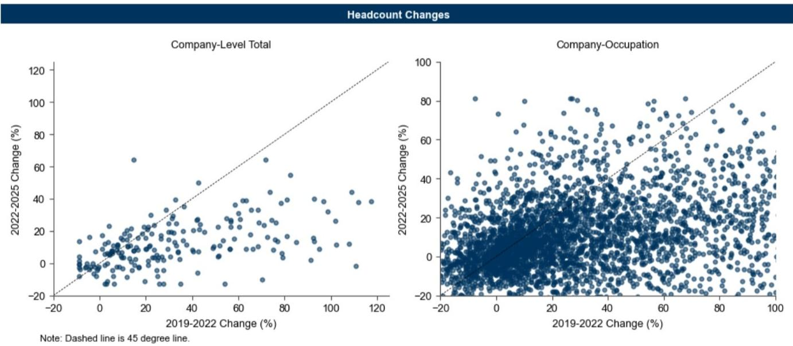
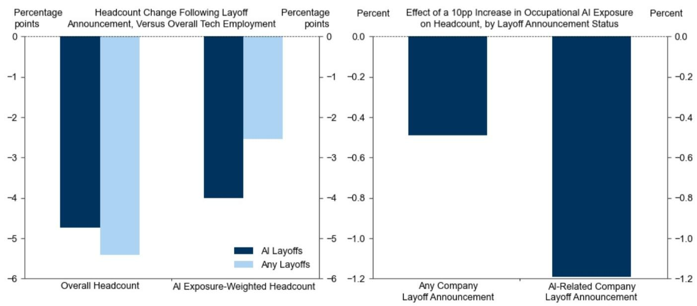
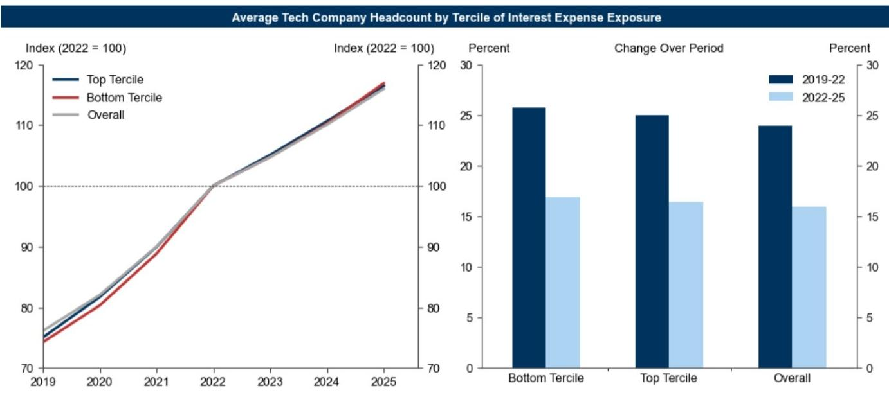

# Post-Pandemic Overhiring, Not AI or Higher Rates, Explains Most of the Tech Hiring Slowdown

The tech labor market has experienced a dramatic reversal since late 2022, with employment growth underperforming its long-run trend by roughly five percentage points annually. Three plausible explanations have dominated the narrative: a hawkish Federal Reserve that raised financing costs and slowed growth, artificial intelligence-driven efficiency gains that reduced the need for workers, and a correction for the pandemic-era hiring binge. Disentangling these forces matters not just for understanding what happened, but for predicting what comes next. The answer, based on granular company- and occupation-level data, is that pandemic overhiring is roughly three to four times more important than AI in explaining the slowdown, while higher interest rates have had virtually no measurable effect. This finding has direct implications for how investors, executives, and policymakers should assess the trajectory of tech employment going forward.

The temptation to attribute the tech hiring slowdown to a single cause is understandable, but analytically dangerous. All three headwinds emerged simultaneously: the Fed's most aggressive rate hiking cycle in decades coincided with the public release of ChatGPT in late 2022, just as companies that had doubled headcount during the pandemic began reassessing their staffing needs. Observers who focus on AI point to a structural transformation of work. Those who emphasize rates see a cyclical adjustment to tighter monetary conditions. And those who highlight overhiring view the current period as a necessary normalization. Each narrative carries different implications for whether the slowdown is temporary or permanent, and for which segments of the tech workforce will recover first.

A global investment bank report leverages a detailed company-occupation panel covering over 800 distinct occupations across more than 300 public US tech companies from 2019 to 2025. This data allows for a more precise decomposition than aggregate employment statistics alone can provide. The key insight is that while all three headwinds were operating simultaneously, their effects varied systematically across companies and occupations in ways that can be statistically identified. The results challenge several widely held beliefs and offer a more nuanced picture of what is actually driving the tech labor market.

## Higher Interest Rates Have Had a Negligible Effect on Tech Employment Growth

The argument that higher rates caused the tech hiring slowdown rests on a straightforward mechanism: rising financing costs reduce the present value of future cash flows, compress equity valuations, and force companies to cut costs, including headcount. If this channel were dominant, we would expect companies with greater exposure to higher rates to show disproportionately larger hiring slowdowns. The data does not support this prediction.

The analysis splits public US tech companies into terciles based on changes in their interest coverage ratio over the hiking cycle. Companies in the top tercile, whose interest coverage improved the most, experienced headcount trends that were virtually indistinguishable from those in the bottom tercile, whose coverage deteriorated the most. Both groups tracked the overall tech industry trend almost exactly. Company-level regressions confirm the absence of any statistically meaningful relationship between interest rate exposure and hiring outcomes.

This finding is counterintuitive but important. It suggests that the tech sector's hiring decisions have been driven more by idiosyncratic factors and sector-specific dynamics than by the broad monetary tightening that reshaped other parts of the economy. For investors, this implies that the Federal Reserve's policy path may be less relevant for tech employment than commonly assumed. For tech company executives, it means that internal strategic decisions about headcount are likely more consequential than external financing conditions.

## AI Has Reduced Hiring, but the Effect Is Modest and Concentrated in Specific Occupations

AI's impact on tech employment has been the subject of intense debate, with some commentators warning of mass displacement and others accusing companies of "AI-washing" layoffs by overstating the role of technology. The data supports a middle ground: AI has slowed hiring, but its effect is small relative to the overall slowdown, and the layoff announcements that cite AI appear credible.

The analysis regresses annual occupational headcount growth on an occupation's AI exposure score, which measures the share of work tasks vulnerable to automation. Prior to 2023, higher AI exposure was actually associated with faster headcount growth, likely reflecting the tech sector's demand for workers to develop and implement AI systems. By 2025, however, a 10 percentage point difference in AI exposure was associated with a 0.4 percentage point drag on annual employment growth. Because tech sector employees are, on average, just over 10 percentage points more exposed to AI than the average US worker, this implies that AI exposure can explain roughly half a percentage point of the tech sector's annual employment growth underperformance.

The credibility of AI-related layoff announcements is tested by comparing companies that attributed layoffs to AI versus those that cited other reasons. Overall headcount reductions were similar across both groups, but the composition of cuts differed systematically. Companies citing AI reduced headcount more in AI-exposed occupations, while companies citing other reasons reduced headcount more evenly across occupations. This pattern holds in event-time analysis controlling for aggregate drivers, and the intensive margin analysis confirms that occupation-level headcount was more sensitive to AI exposure at companies that cited AI efficiencies.

The implication is clear: AI-washing is not a widespread issue. Companies are reducing headcount in a manner consistent with their public explanations. The small magnitude of AI's effect, however, suggests that the technology has not yet triggered the kind of structural labor displacement that some fear. For now, AI is a modest headwind, not a transformative force.

## Pandemic Overhiring Is the Dominant Factor, Explaining Up to Two Percentage Points of the Slowdown

The strongest evidence points to a correction for pandemic-era overhiring as the primary driver of the tech hiring slowdown. Identifying overhiring is methodologically challenging because headcount is inherently tied to demand, making it difficult to distinguish between a genuine correction and a response to weaker growth. The analysis addresses this by identifying companies that accelerated headcount growth from 2019 to 2022 while simultaneously experiencing declining revenue per employee. This combination suggests that hiring outpaced the underlying business fundamentals.

The results are striking. Companies identified as overhirers have seen total headcount grow by only 10% since 2022, underperforming tech companies that did not overhire by roughly 7 percentage points. Statistical estimates that control for company and occupation fixed effects imply that a 10 percentage point acceleration in hiring from 2020 to 2022 was associated with a 1 to 2 percentage point underperformance in annual occupation-level growth from 2023 to 2025. Because sector-wide hiring accelerated by roughly 10 percentage points according to the data, this suggests that headcount normalization can explain up to 2 percentage points of the tech sector's annual employment growth slowdown.

The mechanism is intuitive. Companies that hired aggressively during the pandemic, often in anticipation of sustained demand shifts that did not fully materialize, are now bringing headcount back into alignment with actual business needs. This process is fundamentally different from a cyclical downturn or a structural shift driven by AI. It is a one-time adjustment, and once completed, the drag on employment growth should dissipate.

## The Unexplained Half of the Slowdown Points to a Broader Sectoral Reassessment

The combined effects of higher rates, AI, and overhiring can explain roughly 2.5 percentage points of the 5 percentage point annual slowdown in tech sector headcount growth since 2022. That leaves approximately half of the underperformance unexplained by the cross-company and cross-occupation variation that these factors capture. This residual is attributable to aggregate shocks that are common to all tech companies and workers.

Identifying the source of these common shocks is inherently difficult because aggregate factors affect all firms simultaneously, leaving no cross-sectional variation to exploit. Several candidates are plausible. The broader reassessment of tech sector valuations that began in 2022 may have permanently altered the growth expectations that underpin hiring decisions. Changes in investor sentiment toward unprofitable growth companies may have forced a more disciplined approach to headcount across the entire sector. Or the maturation of certain tech sub-sectors may have reduced the structural demand for labor independent of any specific shock.

This unexplained residual is the most important open question for investors and executives. If the common shock is temporary, then tech employment should recover as the adjustment completes. If it reflects a permanent shift in the sector's growth trajectory, then the current slowdown may represent a new baseline rather than a temporary deviation. The data cannot distinguish between these possibilities, but the answer will determine whether the tech labor market returns to its pre-pandemic trend or settles at a lower equilibrium.

## A Decision Framework for Interpreting Tech Employment Trends

For readers who need to translate these findings into actionable insights, the following framework organizes the key questions and their implications.

First, assess whether a given tech company's hiring slowdown is driven by overhiring correction or structural factors. Companies with rapid pandemic-era headcount growth and declining revenue per employee are likely in the middle of a normalization that will run its course. Companies with more measured pandemic hiring and stable productivity metrics are more likely affected by aggregate sectoral factors or AI, which may have longer-lasting implications.

Second, evaluate AI exposure at the occupation level, not the company level. The analysis shows that AI's effect is concentrated in specific occupations rather than broadly across firms. Companies with high overall AI exposure may not show disproportionate hiring slowdowns if their workforce is concentrated in occupations that complement AI rather than compete with it.

Third, distinguish between cyclical and structural explanations for the unexplained half of the slowdown. If the common shock is driven by valuation compression or investor sentiment, it may reverse as market conditions evolve. If it reflects a permanent downgrade in the sector's growth prospects, then the current employment trajectory may persist regardless of individual company adjustments.

Fourth, monitor the composition of layoff announcements. Companies that cite AI are likely telling the truth, but the small magnitude of AI's effect means that AI-related layoffs should remain a minority of total announcements. A sudden surge in AI-attributed layoffs would signal either an acceleration of AI's impact or a shift in how companies frame their restructuring decisions.

## The Full Picture Requires Granular Data and a Willingness to Challenge Narratives

The analysis presented here offers the most rigorous decomposition of the tech hiring slowdown available, but it also raises as many questions as it answers. The finding that overhiring is three to four times more important than AI challenges the dominant narrative that technology is reshaping the labor market in real time. The finding that interest rates have had no measurable effect challenges the assumption that monetary policy is the primary driver of cyclical employment fluctuations in the tech sector. And the finding that half of the slowdown remains unexplained suggests that our understanding of the tech labor market is incomplete.

These unresolved questions are not weaknesses of the analysis. They are invitations to dig deeper. What exactly is driving the common shock that affects all tech companies equally? How will the relative importance of AI versus overhiring evolve as AI adoption accelerates and the pandemic-era adjustment completes? And what does the unexplained residual imply for the long-run trajectory of tech employment relative to the broader economy?

The full report contains the original charts and detailed statistical results that underpin these findings. It also includes the occupation-level AI exposure scores, the overhiring identification methodology, and the event-time analysis of layoff announcements that provide the foundation for the conclusions summarized here.

Join the community to read the full report and review the original charts.

*This article is for learning and discussion only and does not constitute investment advice.*

Personal reading notes and learning share only. Not investment advice.

