# 2026 H2 Outlook: Balancing a Two-Speed Economy

After a strong start in Q1, a deepening K-shaped divergence has led to a growth slowdown in Q2. Strong exports have been offset by weaker domestic demand, with consumption softening due to the diminishing impact of subsidies, weaker consumer confidence, and the pass-through of higher prices. Fiscal impulse also weakened significantly in the second quarter, with overall spending growth turning negative in March and April.

Looking into H2, we think strong external demand will continue to drive growth... Exports are forecast to grow 14% for the full year, supported by the "AHEAD" factors: Agentic AI, heavy assets, energy cost advantages, accelerating green transition, and diversification.

...while increased fiscal spending and property market positive signals will help stabilize domestic demand. A rebound in fiscal spending is likely in H2 as policymakers respond to the Q2 slowdown, with projects under the 15th Five-Year Plan expected to ramp up. Concurrently, the property market is showing early signs of stabilization in top-tier cities, with rising secondary home sales and declining inventories, though a broad-based recovery is not yet evident.

■ Reflation is expected to continue, though the pace of price hikes will likely become less steep in H2. While imported inflation from oil has likely run its course, PPI is still expected to continue its reflation trend, driven by strong AI demand and price pass-throughs from upstream to downstream. CPI rebound will likely be more modest and slower than previously expected, partly due to fuel price drops and a delayed recovery in pork prices.

The PBOC will likely hold its policy rate unchanged. Given growth target remains on track, a sharp rebound in PPI, and ample liquidity in the banking system from exporter FX conversions, the central bank is unlikely to pursue further broad-based easing. No policy rate changes are anticipated, with the PBOC likely to rely on targeted structural tools instead to channel lending into priority sectors such as AI, new infrastructure, and services.

RMB internationalization will gain pace as the currency continues to appreciate steadily. RMB remains undervalued based on REER analysis. Stability of the RMB during recent market volatility accelerated its use in cross-border payments and financing. Sustained appreciation, driven by strong exports and political impetus, is expected to continue, supporting the currency's growing international role.

Key forecasts: we forecast GDP growth will slow to 4.4% YoY in Q2 before rebounding to 4.6% in Q3 and 4.7% in Q4. CPI and PPI are expected to rise at a modest pace in H2 to 4.5% and 1.5%, respectively (from 3.9% and 1.2%

Yi Xiong, Ph.D.
Chief Economist
+852-2203 6139

Deyun Ou
Economist
+852-2203 6166

Figure 1: China economic forecasts

<table><tr><td colspan="2"></td><td>2024</td><td>2025</td><td>2026F</td><td>2027F</td></tr><tr><td>GDP, real</td><td>% YoY</td><td>5.0</td><td>5.0</td><td>4.7</td><td>4.5</td></tr><tr><td>GDP, nominal</td><td>% YoY</td><td>4.2</td><td>4.0</td><td>6.8</td><td>6.6</td></tr><tr><td>CPI inflation</td><td>% YoY</td><td>-0.1</td><td>0.0</td><td>1.3</td><td>1.6</td></tr><tr><td>Exports growth</td><td>% YoY</td><td>7.2</td><td>10.1</td><td>14.0</td><td>8.0</td></tr><tr><td>Imports growth</td><td>% YoY</td><td>2.2</td><td>1.9</td><td>16.0</td><td>8.0</td></tr><tr><td>Current account</td><td>% of GDP</td><td>2.3</td><td>3.7</td><td>3.6</td><td>3.5</td></tr><tr><td>USDCNY, end-year</td><td></td><td>7.30</td><td>6.99</td><td>6.55</td><td>6.30</td></tr><tr><td>Fiscal balance</td><td>% of GDP</td><td>-7.7</td><td>-9.0</td><td>-8.5</td><td>-8.0</td></tr><tr><td>7-day OMO rate, EOP</td><td>%</td><td>1.50</td><td>1.40</td><td>1.40</td><td>1.40</td></tr></table>

in May). RMB is expected to appreciate to 6.55/USD by end-2026.

## Growth outlook

We forecast China's GDP growth at $4.7\%$ in 2026. This is a minor downward revision of 0.2 percentage points from our April forecast, reflecting softer-than-expected domestic activity since the start of the second quarter. But it remains higher than the $4.5\%$ forecast in our 2026 Outlook at year beginning, as we anticipate continued trade outperformance and a persistent reflationary trend.

We expect growth to regain momentum in the second half of the year following a temporary slowdown in Q2. We project Q2 GDP growth will moderate to 4.4% YoY, weighed down by the impact of higher oil prices and slower government spending. As oil prices have since fallen back to Q1 levels and fiscal stimulus is expected to re-accelerate after the summer, we forecast GDP growth will rebound to 4.6% in Q3 and 4.7% in Q4.

Reflation will be a powerful driver of China's nominal GDP growth. As identified in our 2026 Outlook: Path to Reflation, a price-driven nominal recovery is a key theme for the year. After reaching a three-year high of 4.9% in Q1, we now forecast nominal growth will accelerate to 6.6% in Q2 and exceed 7% in H2—significantly higher than the sub-5% rates of the past four years. This rise in RMB-denominated growth should bolster corporate profits, with potential positive knock-on effects expected for household income and asset prices.

Figure 2: We forecast 4.7% real GDP growth in 2026  
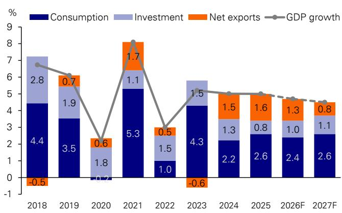  
Source : DB  
Figure 3: Nominal GDP growth will likely rise to 5-year high in H2 2026

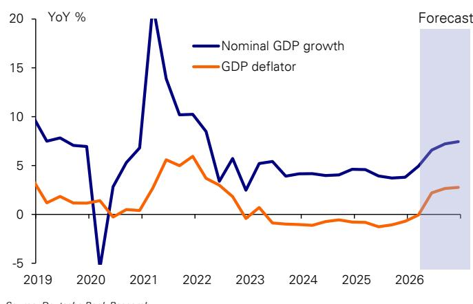  
Source : DB

## Exports: the Key Growth Engine

Exports are poised to remain a primary driver of growth in H2, supported by what we term the "AHEAD" factors. In March, we identified five pillars underpinning China's export strength: Agentic AI, HALO assets, Energy cost advantages, Accelerating green transition, and Diversification of export markets. These drivers intensified through April and May, particularly the demand for AI-related products; combined imports and exports for this category surged by over 80% YoY in May, exceeding our expectations. With these tailwinds likely to persist, we are raising our full-year export growth forecast to 14%.

Imports are also expected to demonstrate strong growth, potentially outpacing exports. This strength is largely attributable to surging domestic investment in AI, which is fueling higher imports of semiconductors, computers, and related components. Higher energy prices and the imports of input materials for future exports also supported the strength in imports.

The normalization of trade relations with the United States presents an upside risk. Following the reduction of reciprocal tariffs and the recent US-China leaders' meeting, we anticipate a meaningful recovery in bilateral trade flows. In May, China's exports to the US climbed to a one-year high, running $10\%$ above the 2025 average. Trade talks between US and China could potentially lead to further reduction in tariffs and restrictions, paving the way for further increases in two-way trade flows.

Strong exports should support industrial activities. Although industrial production growth has slowed over the past three months, we think this was mainly driven by drag from fossil fuels and chemicals. By contrast, the rest of the manufacturing sector has remained broadly stable, as also suggested by steady growth in power generation.

Figure 4: China's exports surged further in the past few months...  
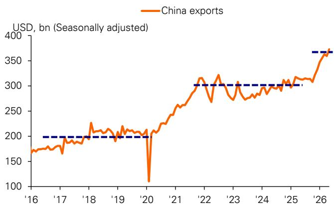  
Source : DB, Haver Analytics

Figure 5: ... driven by "AHEAD" factors  
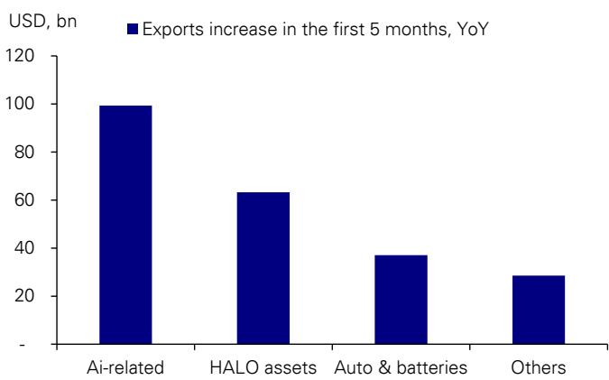  
Source : DB, Wind
Note: AI-related products include semis and communication devices; HALO assets include metals and machinery outside autos and batteries.

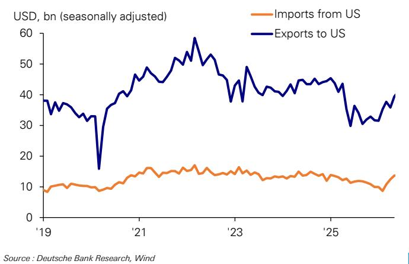  
Source : DB, Wind

Figure 7: We raise our full-year export growth forecast to 14%  
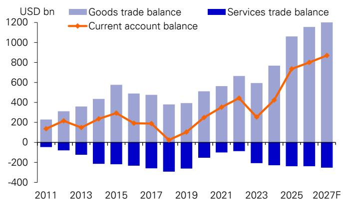  
Source : DB, Wind

## Consumption: Navigating Headwinds

Consumption has softened in 2Q. Entering its third year, the marginal impact of consumer goods trade-in subsidies is diminishing. Since 2H25, sales of subsidized product categories have already started to decline. Stimulus of comparable scale targeting other consumer goods or services consumption has yet to take shape, leaving the gap unfilled and weighing on total consumption.

This policy vacuum has been compounded by softer consumer confidence. Our latest proprietary dbDIG survey shows a slight deterioration in sentiment in Q2, likely reflecting the sequential slowdown in economic activity and financial market volatility. The share of respondents reporting an improvement in their financial conditions or expecting future income growth fell by 6ppt and 2ppt, respectively. Consequently, willingness to spend on discretionary items has also weakened, with the proportion of consumers planning to increase such spending dropping to 46%, a one-year low.

Furthermore, price hikes linked to higher oil costs have dampened real demand. Our survey indicates that consumers have perceived notable price increases in categories like fuel, travel, and apparel. This is corroborated by official data: passenger air traffic, for instance, declined for two consecutive months in April and May, underperforming seasonal norms. This trend not only curtails transport-related spending but also has negative spillover effects on catering, accommodation, and the broader travel industry.

Looking forward, we expect consumption to improve modestly in the second half of 2026.

The most direct effect is lower transportation fuel costs, and since late May we have already seen airlines reduce related charges. This should provide strong support for travel-related services consumption. In addition, price pressures for chemical and metal products are also likely to ease.

Second, fiscal spending is likely to re-accelerate, supporting the labor market and household income, and ultimately helping improve consumer

Source : DB, dbDIG survey

confidence. In particular, faster infrastructure project implementation would not only directly generate substantial employment, but also create spillover demand for catering and entertainment consumption.

Third, we expect additional policy measures to support consumption, especially services consumption. Domestically, we expect policy support to focus on fiscal subsidies, credit support, and supply-side quality upgrades. It is also worth noting that foreign visitors' spending in China could become a new growth driver as visa policies continue to be relaxed. Inbound foreign tourist flows have surged since last year, with travel service exports rising by 50% and reaching 1.6 times the 2019 level.

Figure 8: Marginal impact of consumer goods trade-in subsidies is diminishing  
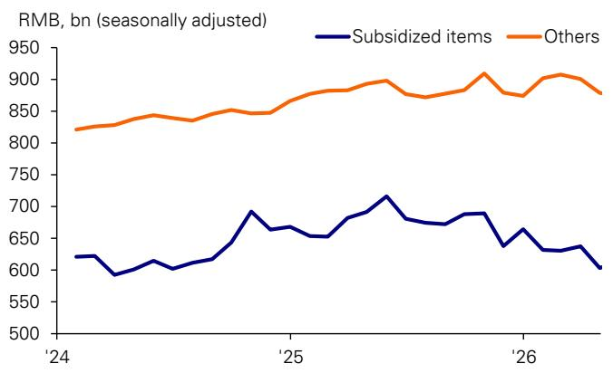  
Source : DB, Wind

Figure 9: Passenger air traffic declined for two consecutive months  
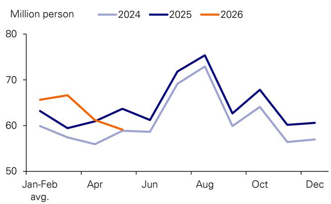  
Source : DB, CEIC

Figure 10: Consumer confidence weakened in 2Q  
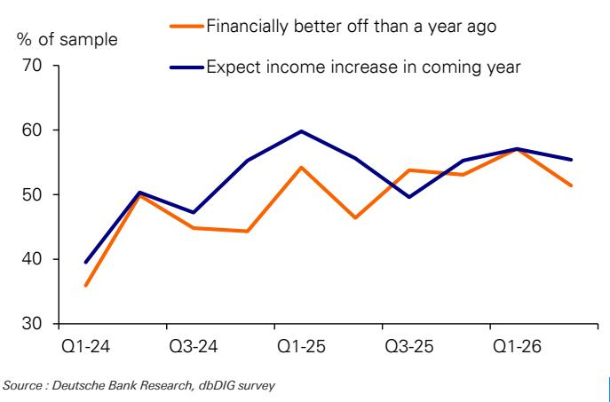  
Source : DB, dbDIG survey

Figure 11: Less proportion of surveyed consumer reported higher discretionary spending  
%, proportion of reporting higher discretionary spending  
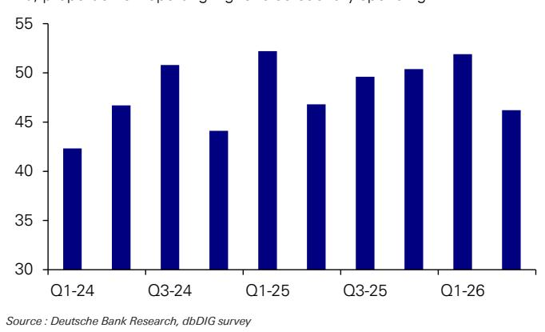

## Property: Stabilization in Sight, But Recovery Will Be Gradual

China's prolonged property downcycle may be approaching its end. The correction, now in its fifth year, has seen secondary-home prices fall by over $20\%$ . In terms of both duration and depth, this aligns with major historical downturns observed in other countries, increasing the probability of a cyclical bottom emerging within the next one to two years.

Positive signals are already appearing in top-tier cities, where secondary-home transaction volumes have reached a one-year high. Unlike previous false starts, this rebound appears more durable for two reasons. First, inventories are declining as transactions rise, suggesting the market is finally absorbing excess supply. Second, rents are stabilizing, which can bolster homebuyer confidence in asset values.

However, any recovery will likely be gradual and uneven. The property sector now amplifies economic trends rather than acting as a counter-cyclical stabilizer, meaning a housing recovery will be a consequence of a broader economic upswing, not its cause. The rebound will be geographically specific, emerging first in economically vibrant Tier-1 and Tier-2 cities.

The transmission to the macro economy will also likely be slow. An improvement in the secondary market will take time to filter through to new-home sales, land revenues, and overall investment. As a result, the drag from property on growth may gradually narrow, but it will still take time before the sector turns into a positive contributor.

Figure 12: China's property correction has broadly moved into the range of major housing downturns  
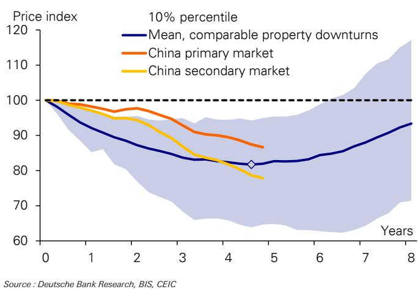  
Source : DB, BIS, CEIC

Figure 13: Secondary home sales in top tier cities have rebounded  
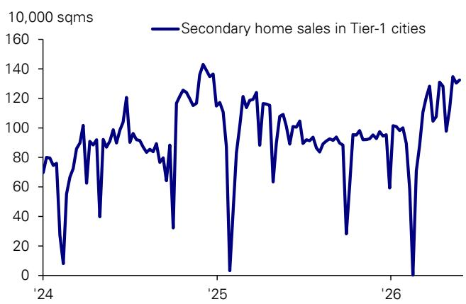  
Source : DB, CREIS

Figure 14: Secondary listings declined in 4 top tier cities  
  
Source : DB, CREIS

Figure 15: Rents have also stabilized  
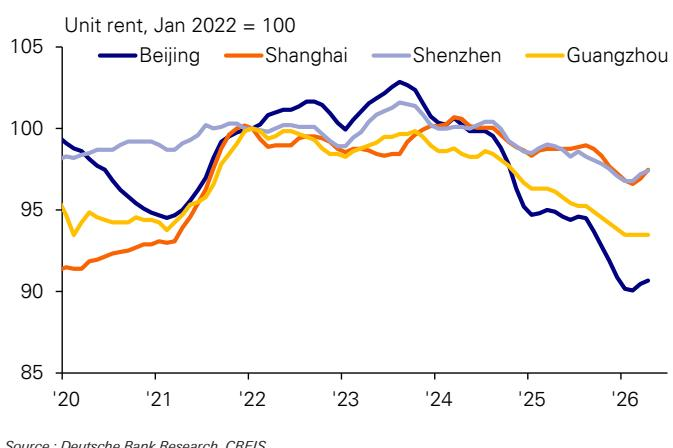  
Source : DB, CREIS

## Continued Reflation at a Slower Pace

The reflationary trend in China remains a key theme, though the outlook has moderated following the recent drop in international oil prices. While the shock from imported inflation has likely run its course, we believe domestic factors will continue to drive producer prices higher. This will stand in contrast to a more muted recovery in consumer prices, which are being held back by soft domestic demand.

The Producer Price Index is expected to remain on a clear reflationary path. Although lower oil prices remove a key source of upside pressure, we believe a meaningful share of prior cost hikes will be retained due to price stickiness and strong external demand. Going forward, the primary drivers of PPI will be domestic. "Anti-involution" policies, designed to curb excessive price competition in sectors like autos and solar, will provide structural support. Furthermore, the inflationary effects of the AI investment boom are strengthening, generating price pressures for components such as non-ferrous metals and optical fiber cables. We now forecast full-year PPI inflation at 3.0% and year-end PPI at 4.5%.

This PPI rebound should continue to bolster industrial profits. In the first 5 months of the year, industrial profit growth reached an impressive 18.8%, a four-year high. While this improvement is currently concentrated in export, AI, and energy-related sectors, we expect it to gradually broaden to midstream and downstream industries as price increases pass through the supply chain.

In contrast, we now expect a slower pace of recovery for the Consumer Price Index. The slowdown in May's data suggests that consumption demand is softening, reflecting weaker consumer confidence and the impact of earlier price hikes on real demand. The key component of pork prices will also be slow to recover. Although the hog cycle is bottoming, the transmission to CPI is historically slow, and we do not expect pork prices to return to positive growth until year-end or even early 2027. We forecast full-year CPI inflation at 1.3%, rising to about 1.6% by year-end.

Figure 16: PPI will likely continue its reflation trend  
PPI % YoY, 12 month before to 24 months after turning positive  
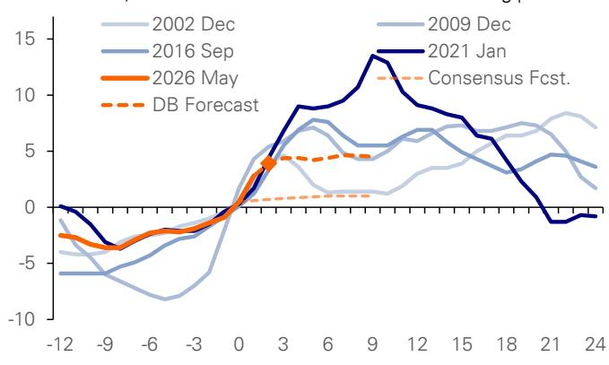  
Source : DB, Wind

Figure 17: The PPI rebound should support an improvement in industrial profits  
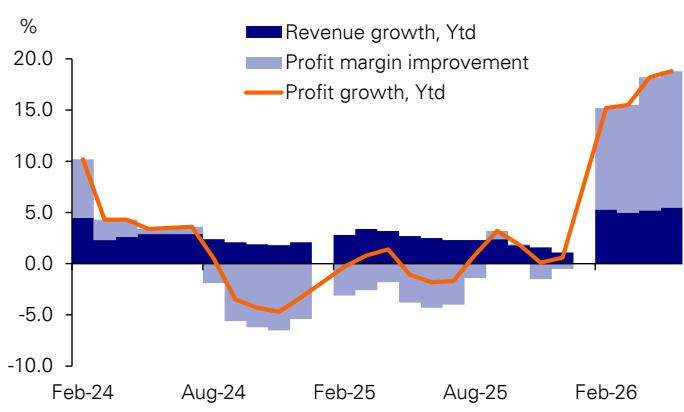  
Source : DB, Wind

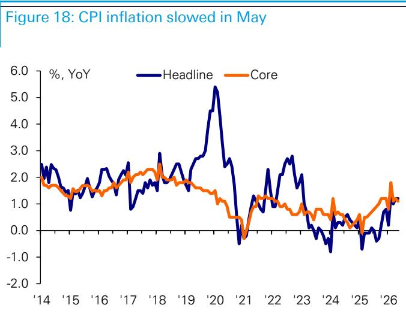  
Source : DB, Wind

Figure 19: Pork prices will likely remain low in the short run  
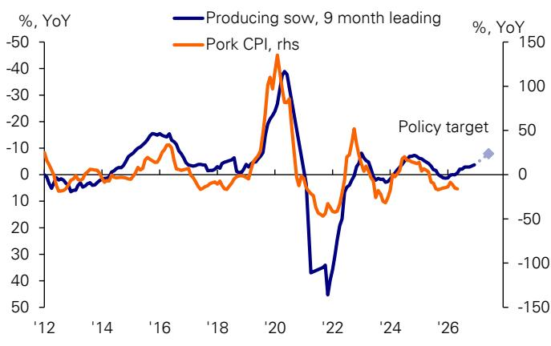  
Source : DB, Wind

## Policy: Fiscal to Take the Lead

The policy mix is set to shift in the second half of 2026, with fiscal policy poised to take the lead in supporting growth while monetary policy remains on a steady course.

Monetary policy is likely to remain supportive, but we see little scope for further broad-based easing. While weak domestic loan and investment demand argues for accommodative conditions, several factors constrain the PBOC. The banking system already has ample liquidity, which has been further boosted by recent FX conversion inflows from strong exports. In addition, banks' net interest margins (NIMs) continue to fall to a new low of 1.40% in Q1. In this context, the PBOC is unlikely to deliver additional policy rate cuts. Instead, we expect the central bank to rely on targeted structural tools to stimulate specific sectors like AI and energy infrastructure, and services activities such as travel and elderly care.

In contrast, fiscal policy is set to re-accelerate in H2. Fiscal momentum slowed significantly in Q2, with expenditure growth falling 7ppt below revenue growth—the first such gap since 2024. This slowdown was driven by a desire to preserve policy ammunition after a strong Q1, underperforming land-sale revenues, and local government caution in launching new projects. Following the Q2 growth moderation, we expect policymakers to pivot back toward stimulus. The upcoming July Politburo meeting will be a key event to watch for this shift.

This renewed fiscal support will likely be anchored by major projects under the 15th Five-Year Plan. As 2026 is the first year of this new cycle, we expect the rollout of key initiatives in areas like urban renewal and infrastructure to ramp up in H2, supporting a gradual rebound in investment and overall domestic demand.

Figure 20: Ample liquidity in the banking system relative to credit demand  
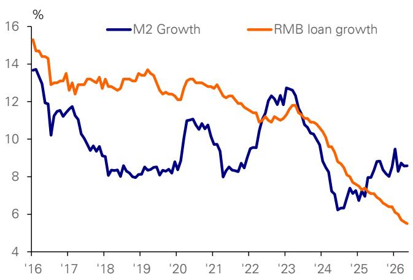  
Source : DB, Haver Analytics

Figure 21: PBOC has withdrawn substantial liquidity in Q2  
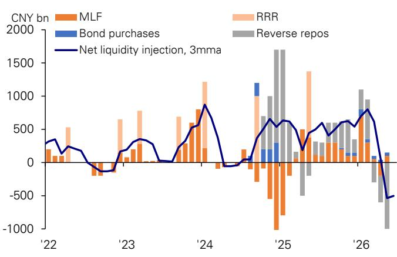  
Source : DB, Wind  
Figure 22: Fiscal spending growth was lower than revenue growth, the first time since 2024

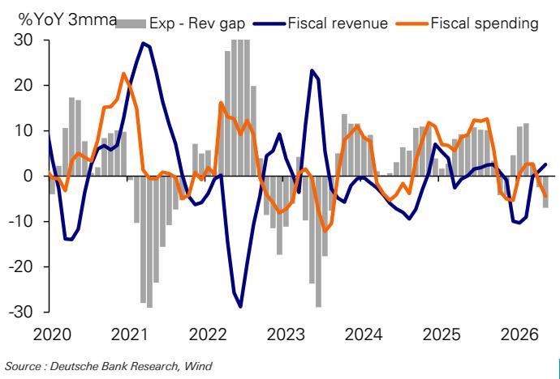  
Source : DB, Wind  
Figure 23: Government bond issuance in H2 will likely increase by 15% YoY, compared to the -16% decline in H1

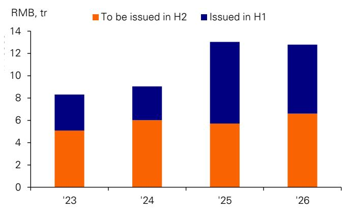  
Source : DB, Wind

## RMB: Steady Appreciation for Internationalization

The Renminbi is poised to continue its appreciation, supported by strong economic fundamentals, sustained export performance, and a shifting geopolitical landscape.

The currency's strength is fundamentally rooted in China's enhanced competitiveness and strong trade flows. Over the past year, the CNY has already appreciated 7% against a trade-weighted basket from its mid-2025 low. However, from a real effective exchange rate (REER) perspective, the RMB remains approximately 10% undervalued relative to its 2015-2020 average. This undervaluation is particularly salient given the significant productivity gains in China's manufacturing sector, suggesting ample room for further appreciation. The continued strength in exports, coupled with an increased propensity for exporters to convert foreign earnings, should maintain this upward pressure on the currency.

From an international relations standpoint, political impetus for a stronger CNY is likely to intensify in H2. As geopolitical tensions de-escalate, international focus will likely pivot back toward global trade imbalances. Europe is already heightening its scrutiny of its trade deficit with China. A steady appreciation of the Renminbi thus serves as a strategic response to these external pressures.

Policy will be supportive to sustained RMB strength. Renminbi internationalization has become a key theme for Chinese policymakers. Since year beginning, we have observed notable progress in the use of RMB for international payments and financing. A stable, steadily appreciating RMB will be optimal for further promoting RMB's use by foreign central banks and businesses. Another interesting development is China is becoming an exporter of capital, recycling a part of its trade surplus inflows as cross-border RMB lending to the rest of the world.

We forecast the Renminbi will strengthen to 6.55/USD by end-2026 and 6.3/USD by end-2027. The primary risk to this forecast is broad-based US dollar strength. In such a scenario, the RMB's appreciation against the dollar could stall, though its appreciation against the broader currency basket would likely continue.

Figure 24: FX settlement by exporters will likely support further RMB strength in H2  
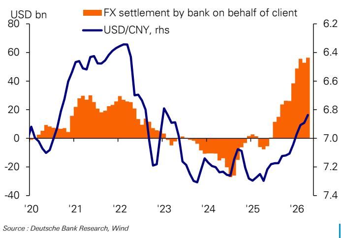

Figure 25: RMB REER is still well below historical levels, suggesting further room for appreciation  
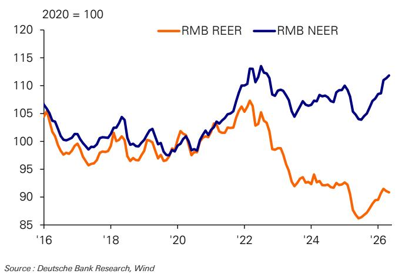

<table><tr><td colspan="6">Figure 26: Chine economic forecast: 2026-27</td></tr><tr><td></td><td></td><td>2024</td><td>2025</td><td>2026F</td><td>2027F</td></tr><tr><td colspan="6">Activities</td></tr><tr><td>GDP, real</td><td>% YoY</td><td>5.0</td><td>5.0</td><td>4.7</td><td>4.5</td></tr><tr><td>GDP, nominal</td><td>% YoY</td><td>4.2</td><td>4.0</td><td>6.8</td><td>6.6</td></tr><tr><td>CPI inflation, p.a.</td><td>% YoY</td><td>-0.1</td><td>0.0</td><td>1.3</td><td>1.6</td></tr><tr><td>Retail sales</td><td>% YoY</td><td>3.5</td><td>3.7</td><td>2.0</td><td>4.0</td></tr><tr><td>Fixed asset investment</td><td>% YoY</td><td>3.2</td><td>-3.8</td><td>1.0</td><td>3.0</td></tr><tr><td>Industrial production</td><td>% YoY</td><td>5.8</td><td>5.9</td><td>5.0</td><td>5.0</td></tr><tr><td colspan="6">Fiscal</td></tr><tr><td>Budgetary balance</td><td>% of GDP</td><td>-3.0</td><td>-4.0</td><td>-4.0</td><td>-3.5</td></tr><tr><td>Total fiscal balance</td><td>% of GDP</td><td>-7.7</td><td>-9.0</td><td>-8.5</td><td>-8.0</td></tr><tr><td>Central government debt</td><td>% of GDP</td><td>25.6</td><td>29.3</td><td>31.3</td><td>32.9</td></tr><tr><td>Augmented public debt</td><td>% of GDP</td><td>99.3</td><td>106.3</td><td>109.0</td><td>111.3</td></tr><tr><td colspan="6">External</td></tr><tr><td>Exports growth</td><td>% YoY</td><td>7.2</td><td>10.1</td><td>14.0</td><td>8.0</td></tr><tr><td>Imports growth</td><td>% YoY</td><td>2.2</td><td>1.9</td><td>16.0</td><td>8.0</td></tr><tr><td>Goods balance</td><td>% of GDP</td><td>4.1</td><td>5.4</td><td>5.2</td><td>5.0</td></tr><tr><td>Current account balance</td><td>% of GDP</td><td>2.3</td><td>3.7</td><td>3.6</td><td>3.5</td></tr><tr><td>USDCNY, eop</td><td></td><td>7.30</td><td>6.99</td><td>6.55</td><td>6.30</td></tr><tr><td>FX reserves</td><td>USD bn</td><td>3,202</td><td>3,358</td><td>3,458</td><td>3,558</td></tr><tr><td colspan="6">Monetary</td></tr><tr><td>TSF growth, eop</td><td>% YoY</td><td>8.0</td><td>8.3</td><td>8.0</td><td>7.8</td></tr><tr><td>RRR</td><td>%</td><td>9.5</td><td>9.0</td><td>8.5</td><td>8.5</td></tr><tr><td>7-day OMO rate, end-year</td><td>%</td><td>1.50</td><td>1.40</td><td>1.40</td><td>1.40</td></tr></table>

Source : DB

## Appendix 1

## Important Disclosures

## \*Other information available upon request

\*Prices are current as of the end of the previous trading session unless otherwise indicated and are sourced from local exchanges via Reuters, Bloomberg and other vendors. Other information is sourced from DB, subject companies, and other sources. For further information regarding disclosures relevant to DB, please visit our global disclosure look-up page on our website at https://research.db.com/Research/Disclosures/FICCDisclosures. Aside from within this report, important risk and conflict disclosures can also be found at https://research.db.com/Research/Disclosures/Disclaimer. Investors are strongly encouraged to review this information before investing.

## Analyst Certification

The views expressed in this report accurately reflect the personal views of the undersigned lead analyst(s). In addition, the undersigned lead analyst(s) has not and will not receive any compensation for providing a specific recommendation or view in this report. Yi Xiong, Deyun Ou.

## Additional Information

The information and opinions in this report were prepared by DB AG or one of its affiliates (collectively 'DB'). Though the information herein is believed to be reliable and has been obtained from public sources believed to be reliable, DB makes no representation as to its accuracy or completeness. Hyperlinks to third-party websites in this report are provided for reader convenience only. DB neither endorses the content nor is responsible for the accuracy or security controls of those websites.

If you use the services of DB in connection with a purchase or sale of a security that is discussed in this report, or is included or discussed in another communication (oral or written) from a DB analyst, DB may act as principal for its own account or as agent for another person.

DB may consider this report in deciding to trade as principal. It may also engage in transactions, for its own account or with customers, in a manner inconsistent with the views taken in this research report. Others within DB, including strategists, sales staff and other analysts, may take views that are inconsistent with those taken in this research report. DB issues a variety of research products, including fundamental analysis, equity-linked analysis, quantitative analysis and trade ideas. Recommendations contained in one type of communication may differ from recommendations contained in others, whether as a result of differing time horizons, methodologies, perspectives or otherwise. DB and/or its affiliates may also be holding debt or equity securities of the issuers it writes on. Analysts are paid in part based on the profitability of DB AG and its affiliates, which includes investment banking, trading and principal trading revenues.

Opinions, estimates and projections constitute the current judgment of the author as of the date of this report. They do not necessarily reflect the opinions of DB and are subject to change without notice. DB provides liquidity for buyers and sellers of securities issued by the companies it covers. DB analysts sometimes have shorter-term trade ideas that may be inconsistent with DB's existing longer-term ratings. Some trade ideas for equities are listed as Catalyst Calls on the Research Website (https://research.db.com/Research/), and can be found on the general coverage list and also on the covered company's page. A Catalyst Call represents a high-conviction belief by an analyst that a stock will outperform or underperform the market and/or a specified sector over a time frame of no less than two weeks and no more than three months. In addition to Catalyst Calls, analysts may occasionally discuss with our clients, and with DB salespersons and traders, trading strategies or ideas that reference catalysts or events that may have a near-term or medium-term impact on the market price of the securities discussed in this report, which impact may be directionally counter to the analysts' current 12-month view of total return or investment return as described herein. DB has no obligation to update, modify or amend this report or to otherwise notify a recipient thereof if an opinion, forecast or estimate changes or becomes inaccurate. Coverage and the frequency of changes in market conditions and in both general and company-specific economic prospects make it difficult to update research at defined intervals. Updates are at the sole discretion of the coverage analyst or of the Research Department Management, and the majority of reports are published at irregular intervals. This report is provided for informational purposes only and does not take into account the particular investment objectives, financial situations, or needs of individual clients. It is not an offer or a solicitation of an offer to buy or sell any financial instruments or to participate in any particular trading strategy. Target prices are inherently imprecise and a product of the analyst's judgment. The financial instruments discussed in this report may not be suitable for all investors, and investors must make their own informed investment decisions. Prices and availability of financial instruments are subject to change without notice, and investment transactions can lead to losses as a result of price fluctuations and other factors. If a financial instrument is denominated in a currency other than an investor's currency, a change in exchange rates may adversely affect the investment. Past performance is not necessarily indicative of future results. Performance calculations exclude transaction costs, unless otherwise indicated. Unless otherwise indicated, prices are current as of the end of the previous trading session and are sourced from local exchanges via Reuters, Bloomberg and other vendors. Data is also sourced from DB, subject companies, and other parties. Artificial intelligence tools may be used in the preparation of this material, including but not limited to assist in fact-finding, data analysis, pattern recognition, content drafting and editorial corrections pertaining to research material.

The DB Department is independent of other business divisions of the Bank. Details regarding our organizational arrangements and information barriers we have to prevent and avoid conflicts of interest with respect to our research are available on our website (https://research.db.com/Research/) under Disclaimer.

Macroeconomic fluctuations often account for most of the risks associated with exposures to instruments that promise to pay fixed or variable interest rates. For an investor who is long fixed-rate instruments (thus receiving these cash flows), increases in interest rates naturally lift the discount factors applied to the expected cash flows and thus cause a loss. The longer the maturity of a certain cash flow and the higher the move in the discount factor, the higher will be the loss. Upside surprises in inflation, fiscal funding needs, and FX depreciation rates are among the most common adverse macroeconomic shocks to receivers. But counterparty exposure, issuer creditworthiness, client segmentation, regulation (including changes in assets holding limits for different types of investors), changes in tax policies, currency convertibility (which may constrain currency conversion, repatriation of profits and/or liquidation of positions), and settlement issues related to local clearing houses are also important risk factors. The sensitivity of fixed-income instruments to macroeconomic shocks may be mitigated by indexing the contracted cash flows to inflation, to FX depreciation, or to specified interest rates - these are common in emerging markets. The index fixings may - by construction - lag or mis-measure the actual move in the underlying variables they are intended to track. The choice of the proper fixing (or metric) is particularly important in swaps markets, where floating coupon rates (i.e., coupons indexed to a typically short-dated interest rate reference index) are exchanged for fixed coupons. Funding in a currency that differs from the currency in which coupons are denominated carries FX risk. Options on swaps (swaptions) the risks typical to options in addition to the risks related to rates movements.

Derivative transactions involve numerous risks including market, counterparty default and illiquidity risk. The appropriateness of these products for use by investors depends on the investors' own circumstances, including their tax position, their regulatory environment and the nature of their other assets and liabilities; as such, investors should take expert legal and financial advice before entering into any transaction similar to or inspired by the contents of this publication. The risk of loss in futures trading and options, foreign or domestic, can be substantial. As a result of the high degree of leverage obtainable in futures and options trading, losses may be incurred that are greater than the amount of funds initially deposited - up to theoretically unlimited losses. Trading in options involves risk and is not suitable for all investors. Prior to buying or selling an option, investors must review the 'Characteristics and Risks of Standardized Options", at https://www.theocc.com/company-information/documents-and-archives/options-disclosure-document. If you are unable to access the website, please contact your DB representative for a copy of this important document.

Participants in foreign exchange transactions may incur risks arising from several factors, including the following: (i) exchange rates can be volatile and are subject to large fluctuations; (ii) the value of currencies may be affected by numerous market factors, including world and national economic, political and regulatory events, events in equity and debt markets and changes in interest rates; and (iii) currencies may be subject to devaluation or government-imposed exchange controls, which could affect the value of the currency. Investors in securities such as ADRs, whose values are affected by the currency of an underlying security, effectively assume currency risk.

Unless governing law provides otherwise, all transactions should be executed through the DB entity in the investor's home jurisdiction. Aside from within this report, important conflict disclosures can also be found at https://research.db.com/Research/ on each company's research page or under the 'Disclosures' tab. Investors are strongly encouraged to review this information before investing.

DB (which includes DB AG, its branches and affiliated companies) is not acting as a financial adviser, consultant or fiduciary to you or any of your agents (collectively, "You" or "Your") with respect to any information provided in this report. DB does not provide investment, legal, tax or accounting advice, DB is not acting as your impartial adviser, and does not express any opinion or recommendation whatsoever as to any strategies, products or any other information presented in the materials. Information contained herein is being provided solely on the basis that the recipient will make an independent assessment of the merits of any investment decision, and it does not constitute a recommendation of, or express an opinion on, any product or service or any trading strategy.

The information presented is general in nature and is not directed to retirement accounts or any specific person or account type, and is therefore provided to You on the express basis that it is not advice, and You may not rely upon it in making Your decision. The information we provide is being directed only to persons we believe to be financially sophisticated, who are capable of evaluating investment risks independently, both in general and with regard to particular transactions and investment strategies, and who understand that DB has financial interests in the offering of its products and services. If this is not the case, or if You are an IRA or other retail investor receiving this directly from us, we ask that you inform us immediately.

In July 2018, DB revised its rating system for short term ideas whereby the branding has been changed to Catalyst Calls ("CC") from SOLAR ideas; the rating categories for Catalyst Calls originated in the Americas region have been made consistent with the categories used by Analysts globally; and the effective time period for CCs has been reduced from a maximum of 180 days to 90 days.

United States: Approved and/or distributed by DB Securities Incorporated, a member of FINRA and SIPC. Analysts located outside of the United States are employed by non-US affiliates and are not registered/qualified as research analysts with FINRA.

European Economic Area (exc. United Kingdom): Approved and/or distributed by DB AG, a joint stock corporation with limited liability incorporated in the Federal Republic of Germany with its principal office in Frankfurt am Main. DB AG is authorized under German Banking Law and is subject to supervision by the European Central Bank and by BaFin, Germany's Federal Financial Supervisory Authority.

United Kingdom: Approved and/or distributed by DB AG acting through its London Branch at 21 Moorfields, London EC2Y 9DB. DB AG in the United Kingdom is authorised by the Prudential Regulation Authority and is subject to limited regulation by the Prudential Regulation Authority and Financial Conduct Authority. Details about the extent of our authorisation and regulation are available on request.

Hong Kong SAR: Distributed by DB AG, Hong Kong Branch, except for any research content relating to futures contracts within the meaning of the Hong Kong Securities and Futures Ordinance Cap. 571. Research reports on such futures contracts are not intended for access by persons who are located, incorporated, constituted or resident in Hong Kong. The author(s) of a research report, and the entities for which they act and/or are affiliated with, may not be licensed to carry on regulated activities in Hong Kong and, if not licensed, do not hold themselves out as being able to do so. The provisions set out above in the 'Additional Information' section shall apply to the fullest extent permissible by local laws and regulations, including without limitation the Code of Conduct for Persons Licensed or Registered with the Securities and Futures Commission. This report is intended for distribution only to 'professional investors' as defined in Part 1 of Schedule of the SFO. This document must not be acted or relied on by persons who are not professional investors. Any investment or investment activity to which this document relates is only available to professional investors and will be engaged only with professional investors.

India: Prepared by Deutsche Equities India Private Limited (DEIPL) having CIN: U65990MH2002PTC137431 and registered office at 14th Floor, The Capital, C-70, G Block, Bandra Kurla Complex, Mumbai (India) 400051. Tel: +91 22 7180 4444. It is registered by the Securities and Exchange Board of India (SEBI) as a Stock broker bearing registration no.: INZ000252437; Merchant Banker bearing SEBI Registration no.: INM000010833 and Research Analyst bearing SEBI Registration no.: INH000001741. DEIPL's Compliance / Grievance officer is Ms. Rashmi Poddar (Tel: +91 22 7180 4929 email ID: complaints.deipl@db.com). Registration granted by SEBI and certification from NISM in no way guarantee performance of DEIPL or provide any assurance of returns to investors. Investment in securities market are subject to market risks. Read all the related documents carefully before investing. DEIPL may have received administrative warnings from the SEBI for breaches of Indian regulations. DB and/or its affiliate(s) may have debt holdings or positions in the subject company. With regard to information on associates, please refer to the "Shareholdings" section in the Annual Report at: https://www.db.com/ir/en/annual-reports.htm. For latest India research audit report, refer https://country.db.com/india/deutsche-equities-india/index?language\_id=1.

Japan: Approved and/or distributed by Deutsche Securities Inc.(DSI). Registration number - Registered as a financial instruments dealer by the Head of the Kanto Local Finance Bureau (Kinsho) No. 117. Member of associations: JSDA, Type II Financial Instruments Firms Association and The Financial Futures Association of Japan. Commissions and risks involved in stock transactions - for stock transactions, we charge stock commissions and consumption tax by multiplying the transaction amount by the commission rate agreed with each customer. Stock transactions can lead to losses as a result of share price fluctuations and other factors. Transactions in foreign stocks can lead to additional losses stemming from foreign exchange fluctuations. We may also charge commissions and fees for certain categories of investment advice, products and services. Recommended investment strategies, products and services carry the risk of losses to principal and other losses as a result of changes in market and/or economic trends, and/or fluctuations in market value. Before deciding on the purchase of financial products and/or services, customers should carefully read the relevant disclosures, prospectuses and other documentation. 'Moody's', 'Standard Poor's', and 'Fitch' mentioned in this report are not registered credit rating agencies in Japan unless Japan or 'Nippon' is specifically designated in the name of the entity. Reports on Japanese listed companies not written by analysts of DSI are written by DB Group's analysts with the coverage companies specified by DSI. Some of the foreign securities stated on this report are not disclosed according to the Financial Instruments and Exchange Law of Japan. Target prices set by DB's equity analysts are based on a 12-month forecast period..

## Korea: Distributed by Deutsche Securities Korea Co.

South Africa: DB AG Johannesburg is incorporated in the Federal Republic of Germany (Branch Register Number in South Africa: 1998/003298/10).

Singapore: This report is issued by DB AG, Singapore Branch (One Raffles Quay #18-00 South Tower Singapore 048583, 65 6423 8001), which may be contacted in respect of any matters arising from, or in connection with, this report. Where this report is issued or promulgated by DB in Singapore to a person who is not an accredited investor, expert investor or institutional investor (as defined in the applicable Singapore laws and regulations), they accept legal responsibility to such person for its contents.

Taiwan: Information on securities/investments that trade in Taiwan is for your reference only. Readers should independently evaluate investment risks and are solely responsible for their investment decisions. DB may not be distributed to the Taiwan public media or quoted or used by the Taiwan public media without written consent. Information on securities/instruments that do not trade in Taiwan is for informational purposes only and is not to be construed as a recommendation to trade in such securities/instruments.

Qatar: DB AG in the Qatar Financial Centre (registered no. 00032) is regulated by the Qatar Financial Centre Regulatory Authority. DB AG - QFC Branch may undertake only the financial services activities that fall within the scope of its existing QFCRA license. Its principal place of business in the QFC: Qatar Financial Centre, Tower, West Bay, Level 5, PO Box 14928, Doha, Qatar. This information has been distributed by DB AG. Related financial products or services are only available only to Business Customers, as defined by the Qatar Financial Centre Regulatory Authority.

Russia: The information, interpretation and opinions submitted herein are not in the context of, and do not constitute, any appraisal or evaluation activity requiring a license in the Russian Federation.

Kingdom of Saudi Arabia: Deutsche Securities Saudi Arabia (DSSA) is a closed joint stock company authorized by the Capital Market Authority of the Kingdom of Saudi Arabia with a license number (No. 37-07073) to conduct the following business activities: Dealing, Arranging, Advising, and Custody activities. DSSA registered office is Faisaliah Tower, 17th Floor, King Fahad Road - Al Olaya District Riyadh, Kingdom of Saudi Arabia P.O. Box 301806.

United Arab Emirates: DB AG in the Dubai International Financial Centre (registered no. 00045) is regulated by the Dubai Financial Services Authority. DB AG - DIFC Branch may only undertake the financial services activities that fall within the scope of its existing DFSA license. Principal place of business in the DIFC: Dubai International Financial Centre, The Gate Village, Building 5, PO Box 504902, Dubai, U.A.E. This information has been distributed by DB AG. Related financial products or services are available only to Professional Clients, as defined by the Dubai Financial Services Authority.

Australia and New Zealand: This research is intended only for 'wholesale clients' within the meaning of the Australian Corporations Act and New Zealand Financial Advisors Act, respectively. Please refer to Australia-specific research disclosures and related information at https://www.dbresearch.com/PROD/RPS\_EN-PROD/PROD0000000000521304.xhtml. Where research refers to any particular financial product recipients of the research should consider any product disclosure statement, prospectus or other applicable disclosure document before making any decision about whether to acquire the product. In preparing this report, the primary analyst or an individual who assisted in the preparation of this report has likely been in contact with the company that is the subject of this research for confirmation/clarification of data, facts, statements, permission to use company-sourced material in the report, and/or site-visit attendance. Without prior approval from Research Management, analysts may not accept from current or potential Banking clients the costs of travel, accommodations, or other expenses incurred by analysts attending site visits, conferences, social events, and the like. Similarly, without prior approval from Research Management and Anti-Bribery and Corruption ("ABC") team, analysts may not accept perks or other items of value for their personal use from issuers they cover.

Additional information relative to securities, other financial products or issuers discussed in this report is available upon request. This report may not be reproduced, distributed or published without DB's prior written consent.

Backtested, hypothetical or simulated performance results have inherent limitations. Unlike an actual performance record based on trading actual client portfolios, simulated results are achieved by means of the retroactive application of a backtested model itself designed with the benefit of hindsight. Taking into account historical events the backtesting of performance also differs from actual account performance because an actual investment strategy may be adjusted any time, for any reason, including a response to material, economic or market factors. The backtested performance includes hypothetical results that do not reflect the reinvestment of dividends and other earnings or the deduction of advisory fees, brokerage or other commissions, and any other expenses that a client would have paid or actually paid. No representation is made that any trading strategy or account will or is likely to achieve profits or losses similar to those shown. Alternative modeling techniques or assumptions might produce significantly different results and prove to be more appropriate. Past hypothetical backtest results are neither an indicator nor guarantee of future returns. Actual results will vary, perhaps materially, from the analysis.

The method for computing individual E,S,G and composite ESG scores set forth herein is a novel method developed by the Research department within DB AG, computed using a systematic approach without human intervention. Different data providers, market sectors and geographies approach ESG analysis and incorporate the findings in a variety of ways. As such, the ESG scores referred to herein may differ from equivalent ratings developed and implemented by other ESG data providers in the market and may also differ from equivalent ratings developed and implemented by other divisions within the DB Group. Such ESG scores also differ from other ratings and rankings that have historically been applied in research reports published by DB AG. Further, such ESG scores do not represent a formal or official view of DB AG.

It should be noted that the decision to incorporate ESG factors into any investment strategy may inhibit the ability to participate in certain investment opportunities that otherwise would be consistent with your investment objective and other principal investment strategies. The returns on a portfolio consisting primarily of sustainable investments may be lower or higher than portfolios where ESG factors, exclusions, or other sustainability issues are not considered, and the investment opportunities available to such portfolios may differ. Companies may not necessarily meet high performance standards on all aspects of ESG or sustainable investing issues; there is also no guarantee that any company will meet expectations in connection with corporate responsibility, sustainability, and/or impact performance.

Copyright © 2026 DB AG

<table><tr><td>DB AG21 MoorfieldsLondon EC2Y 9DBUnited KingdomTel: (44) 20 7545 8000</td><td>DB Securities Inc.The DB Center1 Columbus CircleNew York, NY 10019Tel: (1) 212 250 2500</td><td>DB AGFiliale SingapurOne Raffles Quay, South Tower,Singapore 048583TeL: +65 6423 8001</td></tr></table>

<table><tr><td colspan="4">David Folkerts-LandauGroup Chief Economist and Global Head of Research</td></tr><tr><td>Pam FinelliCOO and Head of Fixed Income Research</td><td>Steve PollardGlobal Head of Company Research and Sales</td><td>Jim ReidGlobal Head of Macro and Thematic Research</td><td>Tim RokossaHead of European Company Research</td></tr><tr><td>Matthew BarnardHead of AmericasCompany Research</td><td>Debbie JonesGlobal Head of Sustainability and Data Innovation, Research</td><td>Robin WinklerHead of German Macro Research</td><td>Sameer GoelGlobal Head of EM &amp; APAC Research</td></tr><tr><td>Francis YaredGlobal Head of Rates Research</td><td>George SaravelosGlobal Head of FX Research</td><td>Peter HooperVice-Chair of Research</td><td>Nilendra de-MelHead of APAC &amp; Middle East Product Development</td></tr></table>

## International Production Locations

<table><tr><td>DB AG</td><td>DB AG</td><td>DB AG</td><td>Deutsche Securities Inc.</td></tr><tr><td>DB Place</td><td>Equity Research</td><td>Filiale Hongkong</td><td>1-3-1 Azabudai</td></tr><tr><td>Level 16</td><td>Mainzer Landstrasse 11-17</td><td>International Commerce</td><td>Azabudai Hills Mori JP Tower</td></tr><tr><td>Corner of Hunter &amp; Phillip</td><td>60329 Frankfurt am Main</td><td>Centre,</td><td>Minato-ku, Tokyo 106-0041</td></tr><tr><td>Streets</td><td>Germany</td><td>1 Austin Road West,Kowloon,</td><td>Japan</td></tr><tr><td>Sydney, NSW 2000</td><td>Tel: (49) 69 910 00</td><td>Hong Kong</td><td>Tel: (81) 3 6730 1000</td></tr><tr><td>Australia</td><td></td><td>Tel: (852) 2203 8888</td><td></td></tr><tr><td>Tel: (61) 2 8258 1234</td><td></td><td></td><td></td></tr></table>