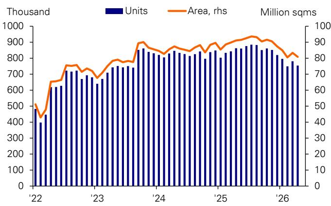

# China’s H2 2026 Outlook: The Two-Speed Economy Is Not a Bug, It Is the Strategy

The Chinese economy is not slowing down uniformly. It is bifurcating. The first half of 2026 has revealed a deepening K-shaped divergence: a blistering export and industrial engine on one side, and a softening, subsidy-dependent domestic consumer on the other. This is not a temporary imbalance awaiting correction. It is the structural expression of a deliberate policy strategy, and understanding it is the single most important analytical task for any investor positioning for the remainder of the year.

After a strong start in the first quarter, the second quarter delivered a sobering slowdown. Growth moderated as the diminishing effects of consumer goods trade-in subsidies, weakening consumer confidence, and the pass-through of higher oil prices combined to depress domestic demand. Fiscal spending, which had provided early-year momentum, turned negative in March and April. The result was a period of confusion: exports surged, yet the broader economy lost steam.

The report we have analyzed argues that this is a temporary pause, not a trend reversal. It forecasts a rebound in the second half of 2026, driven by renewed fiscal spending, a stabilizing property market in top-tier cities, and sustained export strength. But the deeper story is more consequential. The economy is being rewired. The export sector is no longer just a source of demand; it is becoming the primary channel for reflation, currency appreciation, and industrial upgrading. Domestic consumption, meanwhile, is being deliberately deprioritized as a short-term growth lever in favor of longer-term structural goals.

For investors, the key question is not whether the H2 rebound materializes. It is whether you are positioned for the right side of the K-shape. The answer requires a framework that separates the cyclical from the structural, the policy-driven from the market-driven, and the headline numbers from the underlying allocation of capital.

## The Export Engine Is Not Just Strong; It Is Structurally Reinforcing

Exports are forecast to grow 14% for the full year, a notable upward revision that reflects a deepening of the so-called "AHEAD" factors: Agentic AI, heavy assets (HALO), energy cost advantages, accelerating green transition, and diversification of export markets. These are not cyclical tailwinds. They represent a structural reconfiguration of China's comparative advantage.

What makes this export cycle different is its self-reinforcing nature. Strong exports generate foreign exchange inflows, which support RMB appreciation. A stronger RMB, in turn, lowers the cost of imported inputs—particularly semiconductors and advanced machinery—which fuels further industrial upgrading and export competitiveness. This feedback loop is already visible in the data: combined imports and exports of AI-related products surged by over 80% year-on-year in May, exceeding expectations. The export sector is not just earning foreign currency; it is importing the components of its own future growth.

The implication is that the traditional tension between exports and domestic rebalancing is being resolved in a new way. China is not choosing between external demand and internal consumption. It is using external demand to fund the technological transformation that will eventually underpin higher-value domestic consumption. The short-term cost is a K-shaped domestic economy. The long-term bet is that the shape will converge as the benefits of industrial upgrading diffuse.

This creates a strategic question for investors: is the current export strength a peak to be traded, or a platform for further gains? The report's framework suggests the latter, but only for sectors that are directly embedded in the AHEAD ecosystem. The broader manufacturing sector, particularly fossil fuels and chemicals, is already showing signs of drag. The divergence within the export sector itself is as important as the divergence between exports and domestic demand.

## Fiscal Policy Will Lead, But Only in Targeted Channels

The second half of 2026 will see a clear policy pivot. After a period of fiscal restraint in Q2—driven by a desire to preserve ammunition, weak land-sale revenues, and local government caution—fiscal spending is expected to re-accelerate. The July Politburo meeting will be a critical signal of the scale and direction of this stimulus.

However, the nature of this fiscal expansion will differ from previous cycles. It will not be a broad-based demand injection. Instead, it will be anchored by major projects under the 15th Five-Year Plan, which began in 2026. This is a supply-side fiscal strategy, focused on infrastructure that supports the AHEAD sectors: AI data centers, new energy grids, heavy industrial logistics, and advanced manufacturing hubs.

The implication for investors is that fiscal stimulus will not automatically lift all domestic demand. It will create concentrated pockets of activity in specific geographies and sectors, while leaving the broader consumption landscape to recover more slowly. The property market, though showing early signs of stabilization in top-tier cities, will not be a primary beneficiary. The drag from property on growth may narrow, but a positive contribution is not expected this year.

This targeted fiscal approach represents a deliberate choice. Policymakers are prioritizing long-term industrial capacity over short-term consumption support. The risk is that the consumption gap widens further before the supply-side investments begin to generate income and employment. The opportunity is that the investments create the conditions for a more sustainable, technology-driven growth model.

## The Property Market Is Stabilizing, But It Is No Longer the Engine

After five years of correction, with secondary-home prices falling by over 20%, China's property market may be approaching a cyclical bottom. Positive signals are emerging in top-tier cities: secondary-home transaction volumes have reached a one-year high, inventories are declining, and rents are stabilizing. This rebound appears more durable than previous false starts.

But the structural role of property has changed. The sector now amplifies economic trends rather than leading them. A housing recovery will be a consequence of a broader economic upswing, not its cause. The rebound will be geographically specific, emerging first in economically vibrant Tier-1 and Tier-2 cities, while lower-tier markets remain under pressure.

The transmission to the macro economy will be slow. Improvement in the secondary market will take time to filter through to new-home sales, land revenues, and overall investment. For investors, the key insight is that property is no longer a reliable leading indicator for the broader economy. It is a lagging indicator that confirms trends already in motion. The focus should shift from property volumes to the quality of urban economic activity.

This raises an unresolved question: what will replace property as the primary channel for household wealth creation and consumer confidence? The report does not fully answer this. It points to rising corporate profits and potential positive knock-on effects for household income and asset prices, but the mechanism is not yet established. The transition from a property-driven wealth model to a productivity-driven one is the defining structural challenge of the next decade.

## Reflation Is Real, But It Is Not Uniform

The reflationary trend remains a key theme for 2026, but the pace is moderating and the composition is shifting. The Producer Price Index is expected to continue its upward trajectory, driven by domestic factors: "anti-involution" policies that curb excessive price competition, and the inflationary effects of the AI investment boom on non-ferrous metals and optical fiber cables. Full-year PPI inflation is forecast at 3.0%, with year-end PPI at 4.5%.

This PPI rebound is already supporting industrial profits, which grew 18.8% in the first five months of the year—a four-year high. Critically, this improvement is currently concentrated in export, AI, and energy-related sectors. The question is whether it will broaden to midstream and downstream industries as price increases pass through the supply chain.

The Consumer Price Index tells a different story. CPI recovery is expected to be more modest and slower than previously anticipated, reflecting weaker consumer confidence and the impact of earlier price hikes on real demand. Full-year CPI inflation is forecast at 1.3%, rising to only about 1.6% by year-end. Pork prices, a key component, are not expected to return to positive growth until late 2026 or early 2027.

The divergence between PPI and CPI is not just a statistical artifact. It reveals the underlying structure of the two-speed economy. Producer prices are rising because of strong external demand and supply-side constraints. Consumer prices are subdued because domestic demand is weak. The gap between them represents a transfer of purchasing power from consumers to producers—a feature, not a bug, of the current strategy.

For investors, this divergence creates opportunities in sectors that benefit from PPI expansion without being exposed to CPI weakness. It also creates risks for sectors that depend on consumer spending power. The reflation narrative is real, but it is a producer-led, not consumer-led, phenomenon.

## Monetary Policy Will Hold Steady, Creating a Strategic Pause

The People's Bank of China is expected to hold its policy rate unchanged through the second half of 2026. Given that the growth target remains on track, PPI is rebounding sharply, and the banking system already has ample liquidity from exporter FX conversions, the central bank sees no need for further broad-based easing.

This creates a strategic pause. The PBOC will rely on targeted structural tools to channel lending into priority sectors: AI, new infrastructure, services, and energy. The constraint is clear: banks' net interest margins continue to fall, reaching a new low of 1.40% in the first quarter. Further rate cuts would compress margins further, potentially destabilizing the banking system.

The implication is that credit allocation, not credit volume, will be the primary monetary policy lever. Investors should focus on which sectors are designated as priority recipients of structural lending tools. The PBOC's silence on broad rates is not a sign of inaction; it is a signal that the battle is being fought on the allocation front.

This also means that the RMB appreciation story is likely to continue. The currency remains undervalued based on real effective exchange rate analysis, and sustained export strength provides a natural tailwind. The report forecasts the RMB to appreciate to 6.55 per US dollar by end-2026. A stronger RMB supports the internationalization agenda but also creates headwinds for export competitiveness in the longer term. The trade-off is being managed carefully, but it is not risk-free.

## The Report Leaves a Critical Question Unanswered

For all its analytical rigor, the report leaves one question deliberately open: how will the two-speed economy converge? The thesis is that strong exports and fiscal stimulus will eventually lift domestic demand through higher corporate profits, improved labor markets, and rising household income. But the transmission mechanism is not automatic. It depends on corporate willingness to invest domestically, on the pass-through of producer price gains to wages, and on consumer confidence recovering faster than the current trajectory suggests.

The risk is that the divergence persists longer than expected, creating a structural drag on consumption that fiscal stimulus cannot fully offset. The property market, while stabilizing, is not providing the wealth effect it once did. The subsidy-driven consumption model is showing diminishing returns. The inbound tourism boom is real but small relative to the size of the domestic economy.

Investors should monitor three leading indicators for convergence: the breadth of industrial profit growth beyond the AHEAD sectors, the trajectory of consumer confidence surveys, and the pace of fiscal spending implementation under the 15th Five-Year Plan. None of these guarantee a smooth transition, but they will signal whether the strategy is working.

## A Decision Framework for the Second Half

Based on the report's analysis, a practical framework for H2 positioning emerges. First, distinguish between sectors that are structurally aligned with the AHEAD export engine and those that are cyclically exposed to domestic demand weakness. The former are likely to outperform; the latter require a catalyst that may not arrive until 2027.

Second, treat the property stabilization as a risk-reduction signal, not a reflation signal. It reduces downside tail risk but does not create upside momentum. Focus on Tier-1 and Tier-2 city economic activity as a proxy for the quality of the recovery.

Third, monitor the fiscal implementation pipeline. The July Politburo meeting and subsequent project announcements will be the most important policy signal of the year. The speed of execution, not just the size of the announced spending, will determine the macroeconomic impact.

Fourth, recognize that the RMB appreciation trend creates both opportunities and risks. It benefits importers of technology and capital goods, and it supports the internationalization agenda. But it also compresses margins for export-oriented firms that cannot pass through price increases. The divergence between winners and losers within the export sector will widen.

Fifth, accept that the reflation narrative is producer-led and sector-specific. Do not assume that rising PPI automatically translates into broad-based consumer recovery. Position for the divergence, not the convergence.

The second half of 2026 will not resolve the K-shaped economy. It will deepen it. The question is whether you are positioned for the shape as it is, not as you wish it to be.

Join the community to read the full report and review the original charts.

*This article is for learning and discussion only and does not constitute investment advice.*

Personal reading notes and learning share only. Not investment advice.

