US ECONOMICS ANALYST

# From Innovation to Productivity Boom: Lessons from the ICT Revolution for the AI Era

We expect AI to meaningfully boost productivity growth over the next decade. Already, dozens of research studies and corporate anecdotes show evidence of large productivity gains at the micro level in a range of applications. But key questions for both equity and macro investors are when and where we might first see evidence of AI-driven productivity gains at the macro level.

Elsie Peng  
+1(212)357-3137 | elsie.peng@gs.com  
GS & Co. LLC

We look back at the information and communications technology revolution (ICT) from roughly 1980-2000 to draw insights from history. A key lesson of that period is that the path from technological innovation to broad-based productivity gains is neither fast nor uniform.

When did the impact of ICT on productivity first appear? The ICT productivity boom arrived 15 years after the commercialization of the personal computer. While ICT investment began rising sharply in the early 1980s, industry-level data show that its impact on productivity followed a J-curve: a modest drag on measured productivity growth in the first four years, with clear gains emerging only after eight years and peaking at year twelve. The impact was slow because key ICT component costs were initially high, network effects did not kick in until adoption reached a critical mass, and human and institutional impediments slowed technology adoption and were only gradually overcome with substantial investment in intangible organizational capital.

\- Where did convincing evidence that ICT was boosting productivity first appear? Early productivity gains appeared in industries where ICT was already deeply embedded in the production process even before the innovation breakthrough of the early 1980s, in industries that invested in ICT earliest, and especially in industries that invested heavily in reorganization to use ICT more effectively. While productivity growth in these industries picked up earlier and more strongly than in the aggregate statistics, providing persuasive early evidence that ICT was having a meaningful impact, some of the key measures used today to identify these early winners, such as intangible investment, might not have been obvious to observers at the time.

To what degree will these historical lessons from ICT apply to AI? With regard to timing, we expect to see a quicker impact of AI on productivity because costs are falling much faster for AI models than they did for ICT equipment, and network effects are less vital for realizing productivity gains. But similar human and institutional obstacles to adoption are again likely to delay the impact on

productivity. While investment in hardware is already rising even faster than during the ICT buildout, investment in reorganization of work processes appears to be moving more slowly.

With regard to where to look for the earliest tests of whether AI is boosting productivity growth, the industries to watch are clearer today thanks to the availability of higher frequency data on AI exposure and adoption in addition to data on investment in tangible and intangible capital. Our composite ranking across these measures implies that industries such as information, professional services, insurance, and finance should show the earliest and largest pickups in productivity growth. While productivity trends for these industries should provide the earliest test, industry-level data come out with a lag, so even here the evidence will likely take at least several years to arrive.

## From Innovation to Productivity Boom: Lessons from the ICT Revolution for the AI Era

We expect AI to meaningfully boost productivity growth over the next decade. Already, dozens of research studies and corporate anecdotes show evidence of large productivity gains at the micro level in a range of applications. But key questions for both equity and macro investors are when and where we might first see evidence of AI-driven productivity gains at the macro level.

We look back at the information and communications technology revolution (ICT) from roughly 1980-2000 to draw some insight from history. A key lesson of that period is that the path from technological innovation to broad-based productivity gains is neither fast nor uniform.

## When Did the Impact of ICT on Productivity First Appear in the Macro Data?

The commercialization of the personal computer in the early 1980s set off a wave of technological innovation. Exhibit 1 shows that there was a sharp and sustained rise in breakthrough ICT patents per capita through the late 1980s and early 1990s. But productivity growth remained stubbornly flat for nearly 15 years, accelerating only in the second half of the 1990s.

Exhibit 1: The Commercialization of the Personal Computer in the Early 1980s Set Off a Wave of Innovation, but Productivity Growth Did Not See a Meaningful Increase Until the Late 1990s  
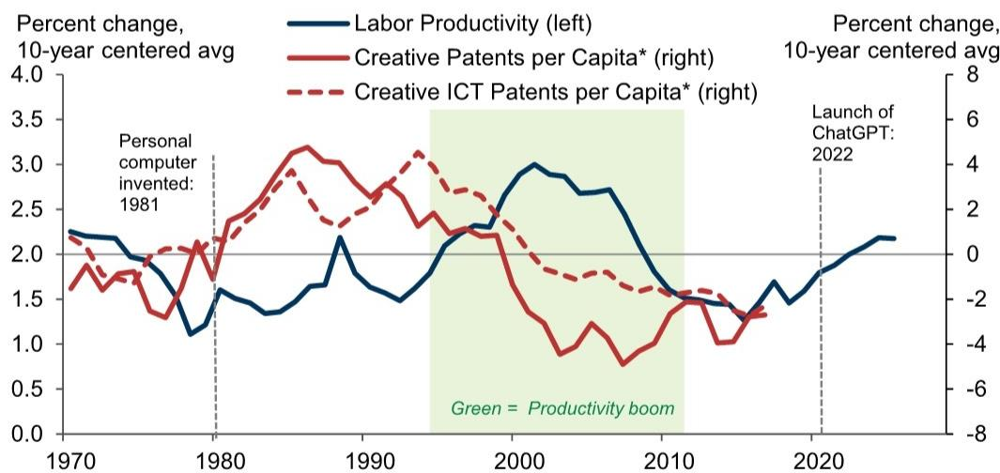  
\*Creative patents are defined as patents that contain original terminologies (e.g. "cloud computing" first emerged in 2007 patents). Patent data are from Kalyani (2024) and Kelly, Papanikolaou, Seru, and Taddy (2021).  
Source: GS Global Investment Research, Department of Labor

The impact on productivity growth took a while to appear even though ICT investment began to rise sharply as early as the 1980s (Exhibit 1, left). The increase in ICT investment was fairly broad-based, though industries like professional services, wholesale trade, transportation, and finance invested much more intensively (Exhibit 2, right).

Exhibit 2: ICT Investment Began Rising Sharply in the Early 1980s, With Increases Seen Across Most Industries  
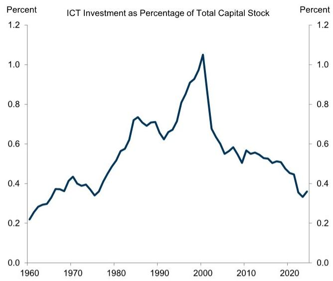

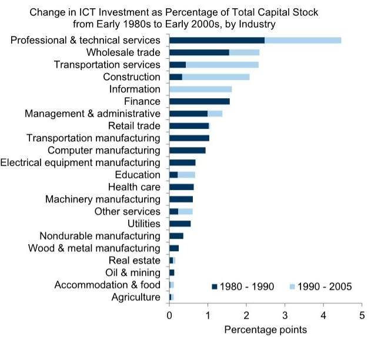  
Note: ICT investment includes investment in personal computers, mainframes, storage devices, printers, terminals, tape drives, system integrators, and communication devices. Data are from BEA's fixed asset survey.  
Source: GS Global Investment Research, Department of Commerce

But it took a long time for an increase in ICT investment to have a notable impact on productivity. Using industry panel data, we find that an increase in ICT investment actually led to a modest decline in measured productivity growth in the first four years. The positive effects emerged only with a substantial lag: a 1pp increase in ICT investment as a percentage of the capital stock did not produce a statistically significant rise in productivity growth until roughly 8 years later, with the impact peaking at around 0.6pp in year twelve. $^{1}$

Exhibit 3: ICT Investment Initially Weighed on Productivity Growth, With Positive Effects Emerging Roughly 8 Years Later  
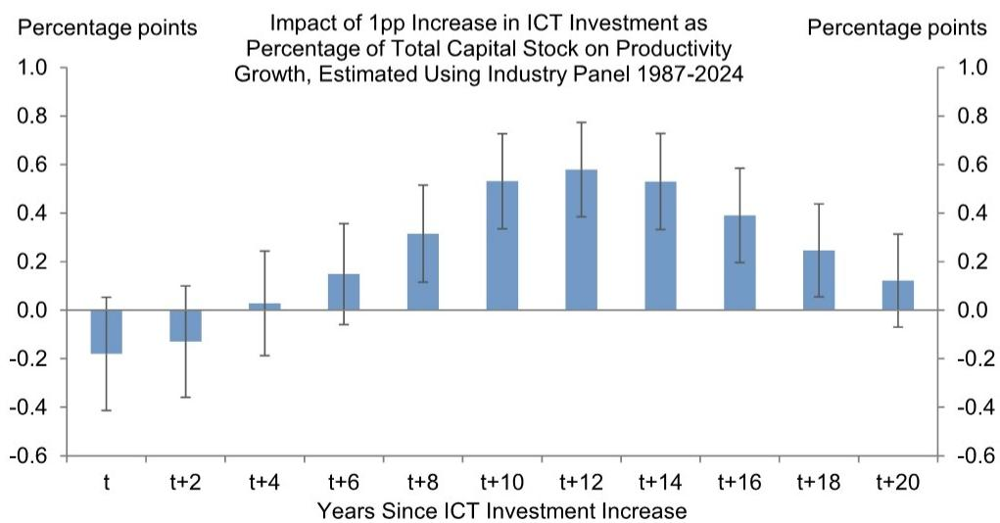  
Note: Error bars indicate $95\%$ confidence interval.  
Source: GS Global Investment Research

We see three factors that delayed productivity gains.

First, key ICT components—such as semiconductors and telecommunication devices—remained expensive throughout the 1980s. Prices only began falling after regulatory interventions and increased competition opened previously concentrated markets in the 1990s.

Exhibit 4: Key ICT Components Remained Expensive Through the 1980s; Prices Only Started to Fall Following Increased Competition and Regulatory Changes in the 1990s

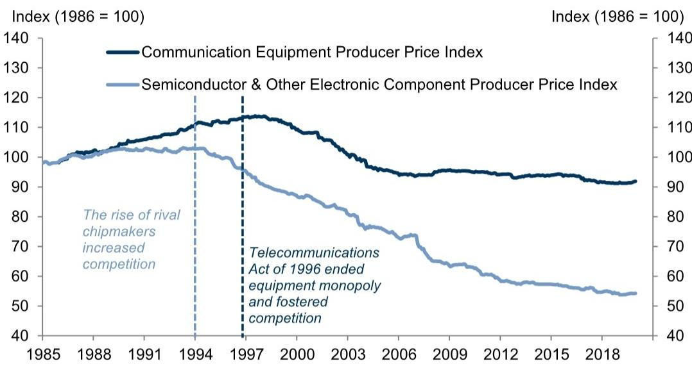  
Source: GS Global Investment Research, Department of Labor

Second, many ICT applications such as the internet exhibited strong network effects, generating far greater value for their users after adoption reached a critical mass. Productivity gains tended to emerge only after adoption rates passed an inflection point in the late 1990s.

Exhibit 5: ICT Applications Exhibited Strong Network Effects, and Productivity Gains Only Emerged After Adoption Rates for Technologies Like the Internet Passed an Inflection Point in the Late 1990s  
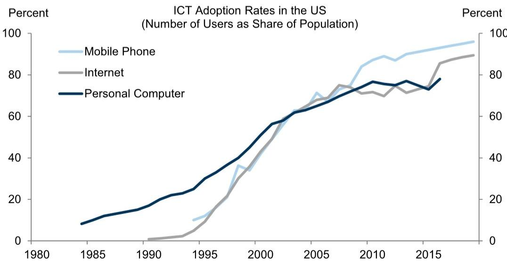  
Source: GS Global Investment Research

Third, an even more important bottleneck was the time and resources required for firms to build intangible assets needed to support the technological transition, such as redesigning workflows, retraining workers, and restructuring organizations, and building new data systems, as discussed in detail in our Global Economics team's prior report. The left panel of Exhibit 6 shows that each \$1 of ICT hardware investment likely required at least an additional \$1.7 of complementary intangible investment, with roughly two-thirds directed toward software and data systems and the remainder toward workforce reorganization. $^{2}$ The right panel of Exhibit 6 shows that there was a clear increase in intangible capital investment in the mid-1990s, and even this likely understates the increase because much of the early spending for reorganization was not captured in the official GDP statistics.

Exhibit 6: ICT Required Meaningful Investment in Intangible Capital to Reach Its Full Productivity Potential, and Companies Only Started to Invest Heavily in Intangible Capital in the Late 1990s  
  
Source: GS Global Investment Research, EUKLEMS, Haver Analytics

## Where Did the Impact of ICT on Productivity First Become Visible?

To identify where the ICT productivity boom first became visible at the industry level, we use a standard statistical test for structural breaks in productivity growth across major industries. Exhibit 7 shows the year in which each industry first exhibited a statistically significant acceleration in productivity growth. We find that education, management, wholesale trade, professional services, and administrative support were among the earliest to show a clear pickup, in some cases several years ahead of the acceleration in the aggregate data.

How confident can we be that these structural breaks were driven by ICT rather than other factors? As a check, we estimate the impact of ICT investment on productivity growth separately for each major industry group and combine these estimates with actual ICT investment data at the detailed industry level to estimate impulses from ICT investment to productivity growth for each industry. We then run the same structural break test on these industry-level ICT impulses to productivity growth and find that the resulting break years are broadly consistent with those identified using productivity data alone, supporting the conclusion that these early productivity pickups were most likely ICT-driven.

Exhibit 7: Some Industries Showed a Clear Pickup in Productivity Growth Several Years Ahead of the Acceleration in the Aggregate Data

  
\*Structural break years are estimated using the supremum Wald test. The test identifies the year in which allowing productivity growth to follow a different statistical relationship before and after that year yields the greatest improvement in model fit.  
Source: GS Global Investment Research, Department of Labor

What characteristics distinguished the earliest and largest beneficiaries of ICT?

We find that industries where ICT was already deeply embedded in the production process before the technological breakthroughs of the early 1980s—or those that were among the earliest to invest heavily in the new technologies when they first became available—tended to see an earlier productivity payoff, with productivity growth in these industries peaking as early as the mid-1990s (Exhibit 8).

Exhibit 8: Industries Where ICT Was Already Deeply Embedded in the Production Process Before the Technological Breakthrough of the Early 1980s or Those That Adopted the New Technologies Earliest Tended to See an Earlier Productivity Payoff

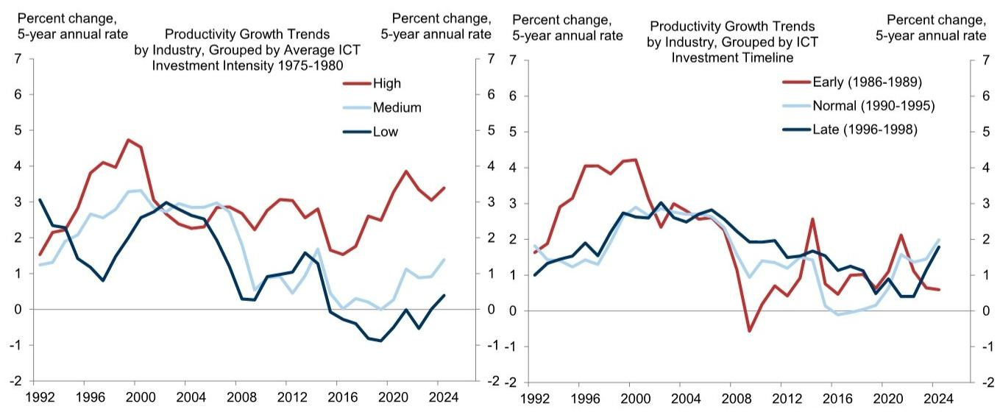  
Source: GS Global Investment Research, Department of Labor

But the ultimate winners were those that invested heavily in intangible organizational capital alongside their ICT investment—restructuring workflows, retraining workers, and redesigning business processes. As Exhibit 9 shows, these industries went from underperforming the rest of the economy in productivity growth to pulling sharply ahead by the early 1990s—and sustained that lead for years afterward. This finding reinforces a central lesson of the ICT experience: the industries that gained the most were not simply those that adopted the technology first or invested the most in hardware, but those that also made the largest complementary investments in reorganizing their operations around it.

Exhibit 9: The Ultimate Industry Winners Were Those That Invested Heavily in Reorganization Capital Alongside Their ICT Investment  
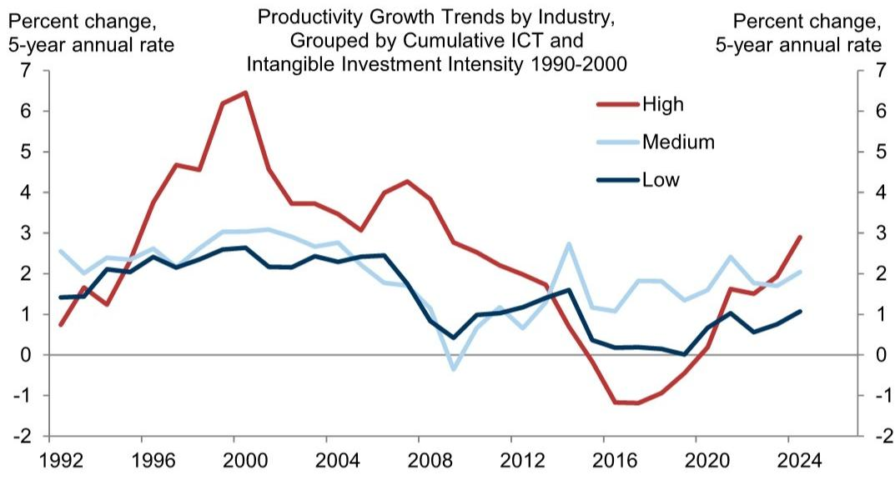  
Source: GS Global Investment Research, Department of Labor

## The Lessons of the ICT Revolution for the AI Era

To what degree will these historical lessons from ICT apply to AI? With regard to timing, we expect to see a quicker impact of AI on productivity because costs are falling faster for AI models than they did for ICT equipment. That said, headline pricing for some frontier US AI models has risen in recent months as leading providers seek to expand margins. Our equity analysts expect overall token prices to stabilize as competitive pressure and continued declines in underlying compute costs limit providers' ability to sustain elevated pricing. In addition, unlike with communication-oriented technologies, network effects are probably less vital for realizing productivity gains from AI.

Exhibit 10: The Price of Using AI Models Is Falling Much More Quickly Than Personal Computer Prices Did  
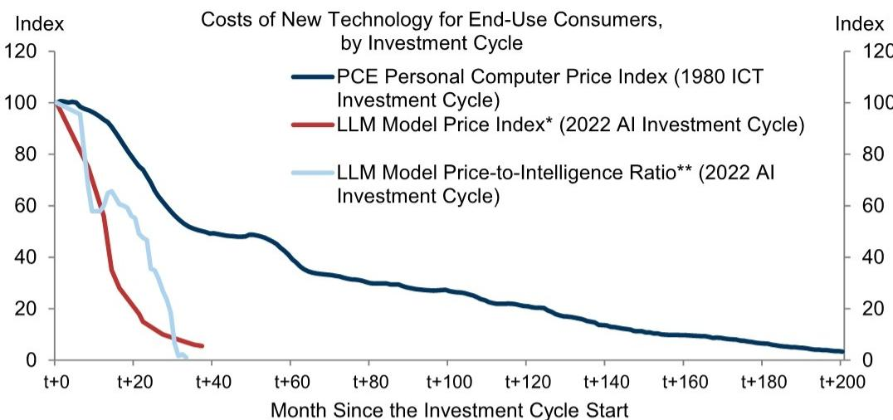  
\*Price per million tokens averaged across different LLM models, indexed to March 2023.  
\*\*Quality-adjusted LLM model price index from Demirer, Fradkin, Tadelis, and Peng (2025)

## Source: GS Global Investment Research, Department of Commerce

But similar human and institutional obstacles to adoption are again likely to delay the impact on productivity. The left side of Exhibit 11 shows that investment in hardware is already rising even faster than during the ICT buildout. Investment in reorganizing work processes—as measured by the share of compensation paid to employees engaging in reorganization—appears to be moving more slowly (Exhibit 11, right), though some intangible investment already underway might not be fully captured by official measures. For example, a recent Atlanta Fed survey of enterprises implies roughly \$280 billion in AI-related intangible capital spending in 2026, and our prior analysis based on company data suggest that labor costs associated with the AI transition are likely running at \$150bn/year in the US, and executive time allocations suggest \$40bn/year in organization capital investment is likely underway.

Exhibit 11: Investment in Hardware Supporting AI Is Already Growing Very Quickly, but the Investment in Intangible Capital That Will Likely Be Required to Fully Exploit AI Appears Not to Have Followed Yet

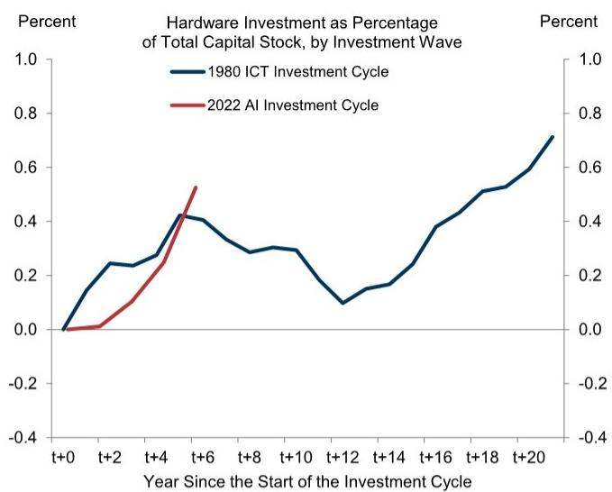

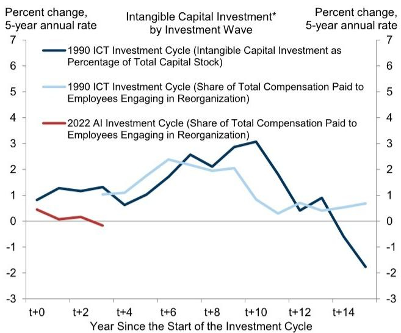  
\* EUKLEMS intangible investment data only starts from 1987, so we also track intangible investment using share of total compensation paid to employees engaging in reorganization activities from the CPS data. To identify employees engaging in reorganization activities, we follow the method proposed by Squicciarini and Le Mouel (2012).  
Source: GS Global Investment Research, Department of Labor, Department of Commerce

With regard to where to look for the earliest tests of whether AI is boosting productivity growth, the industries to watch are clearer today thanks to the availability of data on AI exposure and adoption in addition to data on investment in tangible and intangible capital. Our composite ranking across these measures implies that industries such as information, professional services, insurance, and finance should show the earliest and largest pickups in productivity growth.

Exhibit 12: We Classify Industries by Their Potential for an Early Impact of AI on Productivity Growth Based on Pre-Existing IT Exposure, AI Adoption, AI Exposure, and Investment in Work Reorganization

<table><tr><td colspan="7">AI Potential Early Impact Score</td></tr><tr><td></td><td>Industry Name</td><td>Pre-Exposure to Information Technology*</td><td>AI Adoption Rate** (May 2026)</td><td>AI Exposure Score***</td><td>Reorganization Intensity Since 2022^</td><td>Average Score</td></tr><tr><td rowspan="13">High Potential</td><td>Information &amp; data processing</td><td>4.2</td><td>1.9</td><td>1.8</td><td>0.0</td><td>1.97</td></tr><tr><td>Professional services</td><td>2.4</td><td>2.0</td><td>1.4</td><td>0.1</td><td>1.48</td></tr><tr><td>Motion picture &amp; sound</td><td>1.5</td><td>1.9</td><td>1.0</td><td>0.4</td><td>1.21</td></tr><tr><td>Insurance carriers</td><td>1.9</td><td>0.7</td><td>2.5</td><td>-0.7</td><td>1.09</td></tr><tr><td>Credit intermediation</td><td>0.4</td><td>0.8</td><td>1.9</td><td>0.9</td><td>0.98</td></tr><tr><td>Computer and electronics manufacturing</td><td>2.1</td><td>0.8</td><td>0.7</td><td>0.2</td><td>0.97</td></tr><tr><td>Administrative &amp; support</td><td>1.7</td><td>0.4</td><td>0.3</td><td>0.5</td><td>0.74</td></tr><tr><td>Electrical equipment manufacturing</td><td>0.5</td><td>0.6</td><td>0.4</td><td>1.3</td><td>0.70</td></tr><tr><td>Management of companies</td><td>0.4</td><td>-1.5</td><td>1.3</td><td>2.3</td><td>0.64</td></tr><tr><td>Miscellaneous manufacturing</td><td>0.5</td><td>0.1</td><td>0.7</td><td>0.9</td><td>0.56</td></tr><tr><td>Broadcasting &amp; telecom</td><td>0.9</td><td>0.8</td><td>0.6</td><td>-0.3</td><td>0.48</td></tr><tr><td>Machinery manufacturing</td><td>0.3</td><td>0.3</td><td>0.4</td><td>1.0</td><td>0.48</td></tr><tr><td>Chemical products</td><td>1.1</td><td>1.2</td><td>-0.2</td><td>-0.2</td><td>0.48</td></tr><tr><td rowspan="28">Medium Potential</td><td>Warehousing &amp; storage</td><td>-0.4</td><td>1.8</td><td>-0.9</td><td>1.1</td><td>0.38</td></tr><tr><td>Plastics &amp; rubber products manufacturing</td><td>-0.2</td><td>-0.3</td><td>0.1</td><td>2.0</td><td>0.37</td></tr><tr><td>Real estate</td><td>-0.9</td><td>1.3</td><td>0.2</td><td>0.8</td><td>0.35</td></tr><tr><td>Printing &amp; related support activities</td><td>-0.2</td><td>0.9</td><td>0.8</td><td>-0.1</td><td>0.34</td></tr><tr><td>Rental &amp; leasing services</td><td>-0.5</td><td>0.4</td><td>0.2</td><td>1.1</td><td>0.28</td></tr><tr><td>Transportation equipment manufacturing</td><td>0.9</td><td>-0.4</td><td>0.5</td><td>0.0</td><td>0.27</td></tr><tr><td>Educational services</td><td>-0.5</td><td>1.4</td><td>-0.3</td><td>0.3</td><td>0.23</td></tr><tr><td>Wholesale trade</td><td>0.1</td><td>1.1</td><td>0.3</td><td>-0.7</td><td>0.20</td></tr><tr><td>Performing arts</td><td>0.3</td><td>1.0</td><td>0.0</td><td>-0.5</td><td>0.20</td></tr><tr><td>Nonmetallic mineral</td><td>0.0</td><td>0.0</td><td>-0.6</td><td>1.1</td><td>0.14</td></tr><tr><td>Ambulatory health care</td><td>-0.4</td><td>0.8</td><td>-0.1</td><td>0.0</td><td>0.07</td></tr><tr><td>Accommodation</td><td>-0.7</td><td>-0.6</td><td>0.7</td><td>0.6</td><td>-0.01</td></tr><tr><td>Paper products manufacturing</td><td>-0.4</td><td>1.2</td><td>-0.3</td><td>-0.5</td><td>-0.01</td></tr><tr><td>Furniture and related products manufacturing</td><td>0.0</td><td>0.0</td><td>0.5</td><td>-0.6</td><td>-0.03</td></tr><tr><td>Apparel &amp; leather manufacturing</td><td>0.2</td><td>-0.7</td><td>1.6</td><td>-1.3</td><td>-0.04</td></tr><tr><td>Food &amp; beverage manufacturing</td><td>-0.5</td><td>0.3</td><td>-0.1</td><td>0.1</td><td>-0.06</td></tr><tr><td>Social assistance</td><td>-0.5</td><td>0.7</td><td>-0.1</td><td>-0.3</td><td>-0.06</td></tr><tr><td>Transit &amp; ground passenger transportation</td><td>-0.7</td><td>-0.2</td><td>0.1</td><td>0.6</td><td>-0.06</td></tr><tr><td>Amusements</td><td>-0.6</td><td>0.0</td><td>-0.2</td><td>0.4</td><td>-0.11</td></tr><tr><td>Food services</td><td>-0.6</td><td>-0.8</td><td>0.9</td><td>-0.1</td><td>-0.14</td></tr><tr><td>Retail trade</td><td>-0.3</td><td>-0.4</td><td>0.9</td><td>-0.9</td><td>-0.17</td></tr><tr><td>Oil</td><td>-0.8</td><td>0.0</td><td>-0.3</td><td>0.2</td><td>-0.22</td></tr><tr><td>Other services</td><td>-0.3</td><td>-0.5</td><td>-0.1</td><td>-0.1</td><td>-0.25</td></tr><tr><td>Primary metals</td><td>-0.5</td><td>-1.5</td><td>-0.3</td><td>1.1</td><td>-0.29</td></tr><tr><td>Wood manufacturing</td><td>-0.7</td><td>-0.5</td><td>-0.1</td><td>0.1</td><td>-0.31</td></tr><tr><td>Other transportation &amp; support activities</td><td>-0.2</td><td>-0.8</td><td>-0.3</td><td>0.0</td><td>-0.31</td></tr><tr><td>Waste management</td><td>-0.8</td><td>-0.6</td><td>-1.1</td><td>0.9</td><td>-0.39</td></tr><tr><td>Fabricated metal manufacturing</td><td>-0.4</td><td>-0.6</td><td>0.1</td><td>-0.8</td><td>-0.42</td></tr><tr><td rowspan="13">Low Potential</td><td>Truck transportation</td><td>-0.6</td><td>-0.8</td><td>-1.2</td><td>0.8</td><td>-0.46</td></tr><tr><td>Utilities</td><td>-0.8</td><td>-0.6</td><td>-0.6</td><td>0.1</td><td>-0.47</td></tr><tr><td>Air transportation</td><td>-0.7</td><td>-1.5</td><td>-1.6</td><td>1.4</td><td>-0.61</td></tr><tr><td>Hospitals, nursing &amp; residential care</td><td>-0.6</td><td>-0.7</td><td>-0.8</td><td>-0.5</td><td>-0.63</td></tr><tr><td>Textile mills manufacturing</td><td>-0.5</td><td>-0.7</td><td>1.0</td><td>-2.4</td><td>-0.66</td></tr><tr><td>Construction</td><td>-0.6</td><td>-0.5</td><td>-1.9</td><td>-0.1</td><td>-0.77</td></tr><tr><td>Pipeline transportation</td><td>-0.8</td><td>-1.5</td><td>-1.0</td><td>0.0</td><td>-0.83</td></tr><tr><td>Petroleum &amp; coal products manufacturing</td><td>-0.1</td><td>-1.5</td><td>-1.0</td><td>-1.2</td><td>-0.94</td></tr><tr><td>Forestry</td><td>-0.8</td><td>-0.7</td><td>-0.3</td><td>-2.2</td><td>-0.99</td></tr><tr><td>Support activities for mining</td><td>-0.7</td><td>-0.4</td><td>-2.0</td><td>-1.3</td><td>-1.09</td></tr><tr><td>Water transportation</td><td>-0.4</td><td>-1.5</td><td>-2.0</td><td>-1.6</td><td>-1.38</td></tr><tr><td>Railroad transportation</td><td>-0.8</td><td>-1.5</td><td>-1.5</td><td>-1.7</td><td>-1.39</td></tr><tr><td>Mining</td><td>-0.8</td><td>-1.5</td><td>-1.7</td><td>-2.0</td><td>-1.51</td></tr></table>

Note: The table shows z-scores of different AI-related measures.  
\*Software and ICT investment as share of total capital stock in 2019.  
\*\*Industry AI adoption rate from Census Business Trends and Outlook Survey.  
\*\*\*Share of workers that perform work tasks that can be automated by AI.  
^Change in the share of compensation for employees engaging in reorganization activities since 2022.

## Source: GS Global Investment Research

Potential evidence of an effect of AI on industry-level productivity growth should be judged against prior trends, and Exhibit 13 shows that productivity growth has already been higher in recent decades in industries that are likely to be the earliest and largest beneficiaries of AI. While trends for these industries should provide the earliest test of whether AI is having a macroeconomically meaningful impact on productivity growth, industry-level data are published with a considerable lag, so even here the evidence will likely take at least several years to arrive.

Exhibit 13: Potential Evidence of AI Effects Should Be Judged Against Prior Trends, and Productivity Growth in Industries Likely to Be the Earliest Beneficiaries of AI Has Already Outperformed Recently  
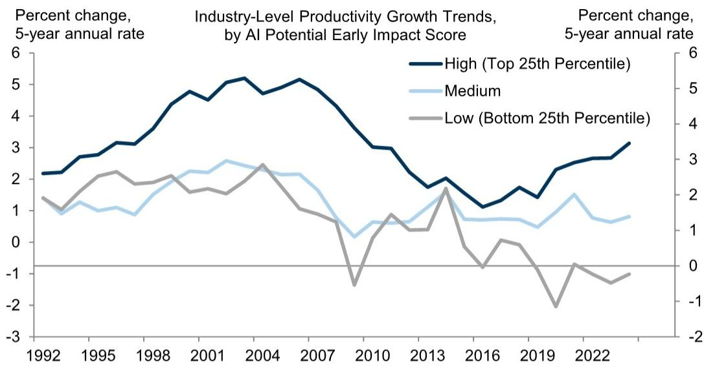  
Source: GS Global Investment Research, Department of Labor

## Elsie Peng

THE US ECONOMIC AND FINANCIAL OUTLOOK (% change on previous period, annualized, except where noted)

\* Weighted average of metro-level HPIs for 381 metro cities where the weights are dollar values of housing stock reported in the American Community Survey. Annual numbers are Q4/Q4.
\*\* Annual inflation numbers are December year-on-year values. Quarterly values are Q4/Q4.

## The US Economic and Financial Outlook

<table><tr><td rowspan="2"></td><td rowspan="2">2023</td><td rowspan="2">2024</td><td rowspan="2">2025</td><td rowspan="2">2026</td><td rowspan="2">2027</td><td rowspan="2">2025 Q4</td><td colspan="4">2026</td><td colspan="4">2027</td></tr><tr><td>Q1</td><td>Q2</td><td>Q3</td><td>Q4</td><td>Q1</td><td>Q2</td><td>Q3</td><td>Q4</td></tr><tr><td colspan="15">OUTPUT AND SPENDING</td></tr><tr><td>Real GDP</td><td>2.9</td><td>2.8</td><td>2.1</td><td>2.2</td><td>2.1</td><td>0.5</td><td>2.1</td><td>2.2</td><td>1.9</td><td>1.9</td><td>2.0</td><td>2.1</td><td>2.2</td><td>2.3</td></tr><tr><td>Real GDP (annual=Q4/Q4, quarterly=yoy)</td><td>3.4</td><td>2.4</td><td>2.0</td><td>2.0</td><td>2.1</td><td>2.0</td><td>2.7</td><td>2.3</td><td>1.7</td><td>2.0</td><td>2.0</td><td>2.0</td><td>2.1</td><td>2.1</td></tr><tr><td>Consumer Expenditures</td><td>2.6</td><td>2.9</td><td>2.6</td><td>1.7</td><td>1.8</td><td>1.9</td><td>0.5</td><td>1.7</td><td>1.5</td><td>1.5</td><td>1.9</td><td>2.0</td><td>2.1</td><td>2.2</td></tr><tr><td>Residential Fixed Investment</td><td>-7.8</td><td>3.2</td><td>-2.2</td><td>-4.5</td><td>1.4</td><td>-1.7</td><td>-7.8</td><td>-6.4</td><td>1.5</td><td>1.5</td><td>2.2</td><td>2.2</td><td>2.2</td><td>2.2</td></tr><tr><td>Business Fixed Investment</td><td>7.3</td><td>2.9</td><td>4.1</td><td>6.8</td><td>5.8</td><td>2.4</td><td>10.6</td><td>7.8</td><td>7.5</td><td>6.9</td><td>4.9</td><td>4.9</td><td>4.9</td><td>4.9</td></tr><tr><td>Structures</td><td>16.7</td><td>1.1</td><td>-5.3</td><td>-3.6</td><td>2.0</td><td>-6.6</td><td>-4.7</td><td>0.4</td><td>-1.0</td><td>-0.2</td><td>3.5</td><td>3.5</td><td>3.5</td><td>3.5</td></tr><tr><td>Equipment</td><td>2.9</td><td>3.5</td><td>8.3</td><td>10.6</td><td>7.1</td><td>4.3</td><td>15.8</td><td>14.7</td><td>11.0</td><td>9.5</td><td>5.0</td><td>5.0</td><td>5.0</td><td>5.0</td></tr><tr><td>Intellectual Property Products</td><td>6.2</td><td>3.5</td><td>5.6</td><td>8.5</td><td>6.2</td><td>5.4</td><td>13.8</td><td>5.0</td><td>8.2</td><td>7.8</td><td>5.5</td><td>5.5</td><td>5.5</td><td>5.5</td></tr><tr><td>Federal Government</td><td>3.3</td><td>3.8</td><td>-1.2</td><td>-1.4</td><td>0.8</td><td>-16.7</td><td>9.4</td><td>-2.0</td><td>1.0</td><td>1.0</td><td>1.0</td><td>1.0</td><td>1.0</td><td>1.0</td></tr><tr><td>State &amp; Local Government</td><td>3.6</td><td>3.8</td><td>2.5</td><td>1.4</td><td>0.9</td><td>1.5</td><td>1.6</td><td>0.8</td><td>0.5</td><td>1.0</td><td>1.0</td><td>1.0</td><td>1.0</td><td>1.0</td></tr><tr><td>Net Exports ($bn, &#x27;17)</td><td>-925</td><td>-1,033</td><td>-1,091</td><td>-1,084</td><td>-1,173</td><td>-969</td><td>-1,002</td><td>-1,086</td><td>-1,113</td><td>-1,134</td><td>-1,150</td><td>-1,165</td><td>-1,181</td><td>-1,197</td></tr><tr><td>Inventory Investment ($bn, &#x27;17)</td><td>47</td><td>44</td><td>29</td><td>44</td><td>65</td><td>-16</td><td>-17</td><td>65</td><td>65</td><td>65</td><td>65</td><td>65</td><td>65</td><td>65</td></tr><tr><td>Nominal GDP</td><td>6.7</td><td>5.3</td><td>5.0</td><td>6.0</td><td>4.7</td><td>4.2</td><td>5.8</td><td>8.7</td><td>3.8</td><td>4.1</td><td>4.7</td><td>4.7</td><td>4.5</td><td>4.3</td></tr><tr><td>Industrial Production, Mfg.</td><td>-1.0</td><td>-1.0</td><td>0.8</td><td>3.1</td><td>3.8</td><td>-3.5</td><td>4.4</td><td>7.7</td><td>4.8</td><td>3.9</td><td>3.3</td><td>3.2</td><td>3.2</td><td>3.3</td></tr><tr><td colspan="15">HOUSING MARKET</td></tr><tr><td>Housing Starts (units, thous)</td><td>1,421</td><td>1,370</td><td>1,356</td><td>1,320</td><td>1,322</td><td>1,323</td><td>1,418</td><td>1,290</td><td>1,280</td><td>1,292</td><td>1,304</td><td>1,316</td><td>1,328</td><td>1,340</td></tr><tr><td>New Home Sales (units, thous)</td><td>666</td><td>684</td><td>679</td><td>653</td><td>644</td><td>711</td><td>623</td><td>690</td><td>662</td><td>638</td><td>626</td><td>632</td><td>649</td><td>670</td></tr><tr><td>Existing Home Sales (units, thous)</td><td>4,103</td><td>4,067</td><td>4,076</td><td>4,095</td><td>4,254</td><td>4,157</td><td>4,053</td><td>4,073</td><td>4,107</td><td>4,149</td><td>4,191</td><td>4,233</td><td>4,275</td><td>4,317</td></tr><tr><td>Case-Shiller Home Prices (%yoy)*</td><td>5.3</td><td>3.8</td><td>0.7</td><td>0.7</td><td>2.2</td><td>0.7</td><td>0.3</td><td>0.8</td><td>0.7</td><td>0.7</td><td>1.1</td><td>1.4</td><td>1.8</td><td>2.2</td></tr><tr><td colspan="15">INFLATION (% ch, yr/yr)</td></tr><tr><td>Consumer Price Index (CPI)**</td><td>3.3</td><td>2.9</td><td>2.7</td><td>3.3</td><td>2.2</td><td>2.7</td><td>2.7</td><td>3.9</td><td>3.4</td><td>3.3</td><td>3.0</td><td>2.0</td><td>2.2</td><td>2.2</td></tr><tr><td>Core CPI **</td><td>3.9</td><td>3.2</td><td>2.6</td><td>2.6</td><td>2.2</td><td>2.7</td><td>2.5</td><td>2.8</td><td>2.5</td><td>2.6</td><td>2.5</td><td>2.2</td><td>2.2</td><td>2.2</td></tr><tr><td>Core PCE** †</td><td>3.1</td><td>3.0</td><td>3.0</td><td>3.0</td><td>2.2</td><td>2.9</td><td>3.1</td><td>3.4</td><td>3.2</td><td>3.1</td><td>2.6</td><td>2.3</td><td>2.3</td><td>2.2</td></tr><tr><td colspan="15">LABOR MARKET</td></tr><tr><td>Unemployment Rate (%)^</td><td>3.8</td><td>4.1</td><td>4.4</td><td>4.4</td><td>4.3</td><td>4.4</td><td>4.3</td><td>4.3</td><td>4.3</td><td>4.4</td><td>4.4</td><td>4.4</td><td>4.3</td><td>4.3</td></tr><tr><td>U6 Underemployment Rate (%)^</td><td>7.2</td><td>7.6</td><td>8.4</td><td>8.2</td><td>8.1</td><td>8.4</td><td>8.0</td><td>8.1</td><td>8.2</td><td>8.2</td><td>8.2</td><td>8.2</td><td>8.1</td><td>8.1</td></tr><tr><td>Payrolls (thous, monthly rate)</td><td>210</td><td>122</td><td>10</td><td>72</td><td>50</td><td>-39</td><td>73</td><td>130</td><td>40</td><td>45</td><td>50</td><td>50</td><td>50</td><td>50</td></tr><tr><td>Employment-Population Ratio (%)^</td><td>60.1</td><td>59.9</td><td>59.7</td><td>59.1</td><td>59.0</td><td>59.7</td><td>59.2</td><td>59.2</td><td>59.1</td><td>59.1</td><td>59.0</td><td>59.0</td><td>59.0</td><td>59.0</td></tr><tr><td>Labor Force Participation Rate (%)^</td><td>62.5</td><td>62.5</td><td>62.4</td><td>61.8</td><td>61.6</td><td>62.4</td><td>61.9</td><td>61.8</td><td>61.8</td><td>61.8</td><td>61.7</td><td>61.7</td><td>61.7</td><td>61.6</td></tr><tr><td>Average Hourly Earnings (%yoy)</td><td>4.4</td><td>3.9</td><td>4.0</td><td>3.9</td><td>3.8</td><td>4.0</td><td>4.0</td><td>4.0</td><td>3.9</td><td>3.8</td><td>3.8</td><td>3.8</td><td>3.8</td><td>3.8</td></tr><tr><td colspan="15">GOVERNMENT FINANCE</td></tr><tr><td>Federal Budget (FY, $bn)</td><td>-1,694</td><td>-1,833</td><td>-1,775</td><td>-1,950</td><td>-2,050</td><td>--</td><td>--</td><td>--</td><td>--</td><td>--</td><td>--</td><td>--</td><td>--</td><td>--</td></tr><tr><td colspan="15">FINANCIAL INDICATORS</td></tr><tr><td>FF Target Range (Bottom-Top, %)^</td><td>5.25-5.5</td><td>4.25-4.5</td><td>3.5-3.75</td><td>3.5-3.75</td><td>3-3.25</td><td>3.5-3.75</td><td>3.5-3.75</td><td>3.5-3.75</td><td>3.5-3.75</td><td>3.5-3.75</td><td>3.5-3.75</td><td>3.25-3.5</td><td>3.25-3.5</td><td>3-3.25</td></tr><tr><td>10-Year Treasury Note^</td><td>3.88</td><td>4.58</td><td>4.18</td><td>4.40</td><td>4.25</td><td>4.18</td><td>4.30</td><td>4.50</td><td>4.45</td><td>4.40</td><td>4.35</td><td>4.30</td><td>4.25</td><td>4.25</td></tr><tr><td>Euro (€/$)^</td><td>1.11</td><td>1.04</td><td>1.17</td><td>1.18</td><td>1.20</td><td>1.17</td><td>1.15</td><td>1.16</td><td>1.19</td><td>1.18</td><td>1.19</td><td>1.20</td><td>1.20</td><td>1.20</td></tr><tr><td>Yen ($/¥)^</td><td>141</td><td>157</td><td>157</td><td>158</td><td>141</td><td>157</td><td>159</td><td>158</td><td>158</td><td>158</td><td>156</td><td>141</td><td>101</td><td>141</td></tr></table>

Source: GS Global Investment Research.

## The US Economics Team

Jan Hatzius +1(212)902-0394 jan.hatzius@gs.com GS & Co. LLC

## Ronnie Walker

+1(917)343-4543
ronnie.walker@gs.com
GS & Co. LLC

## Pierfrancesco Mei

+1(212)902-8809 pierfrancesco.mei@gs.com GS & Co. LLC

Alec Phillips +1(202)637-3746 alec.phillips@gs.com GS & Co. LLC

## Manuel Abecasis

+1(212)902-8357
manuel.abecasis@gs.com
GS & Co. LLC

David Mericle +1(212)357-2619 david.mericle@gs.com GS & Co. LLC

+1(212)357-3137
elsie.peng@gs.com
GS & Co. LLC

## Jessica Rindels

+1(972)368-1516 jessica.rindels@gs.com GS & Co. LLC

## Disclosure Appendix

## Reg AC

I, Elsie Peng, hereby certify that all of the views expressed in this report accurately reflect my personal views, which have not been influenced by considerations of the firm's business or client relationships.

Unless otherwise stated, the individuals listed on the cover page of this report are analysts in GS' Global Investment Research division.

Contributing Authors: Elsie Peng GS & Co. LLC.

Unless otherwise stated, the individuals listed in the Contributing Authors disclosure of this report are analysts in GS' Global Investment Research division.

## Disclosures

## Regulatory disclosures

## Disclosures required by United States laws and regulations

See company-specific regulatory disclosures above for any of the following disclosures required as to companies referred to in this report: manager or co-manager in a pending transaction; $1\%$ or other ownership; compensation for certain services; types of client relationships; managed/co-managed public offerings in prior periods; directorships; for equity securities, market making and/or specialist role. GS trades or may trade as a principal in debt securities (or in related derivatives) of issuers discussed in this report.

The following are additional required disclosures: Ownership and material conflicts of interest: GS policy prohibits its analysts, professionals reporting to analysts and members of their households from owning securities of any company in the analyst's area of coverage. Analyst compensation: Analysts are paid in part based on the profitability of GS, which includes investment banking revenues. Analyst as officer or director: GS policy generally prohibits its analysts, persons reporting to analysts or members of their households from serving as an officer, director or advisor of any company in the analyst's area of coverage. Non-U.S. Analysts: Non-U.S. analysts may not be associated persons of GS & Co. LLC and therefore may not be subject to FINRA Rule 2241 or FINRA Rule 2242 restrictions on communications with a subject company, public appearances and trading in securities covered by the analysts.

## Additional disclosures required under the laws and regulations of jurisdictions other than the United States

Additional disclosures required under the laws and regulations of jurisdictions other than the United States

The following disclosures are those required by the jurisdiction indicated, except to the extent already made above pursuant to United States laws and regulations. Australia: GS Australia Pty Ltd and its affiliates are not authorised deposit-taking institutions (as that term is defined in the Banking Act 1959 (Cth)) in Australia and do not provide banking services, nor carry on a banking business, in Australia. This research, and any access to it, is intended only for “wholesale clients” within the meaning of the Australian Corporations Act, unless otherwise agreed by GS. In producing research reports, members of Global Investment Research of GS Australia may attend site visits and other meetings hosted by the companies and other entities which are the subject of its research reports. In some instances the costs of such site visits or meetings may be met in part or in whole by the issuers concerned if GS Australia considers it is appropriate and reasonable in the specific circumstances relating to the site visit or meeting. To the extent that the contents of this document contains any financial product advice, it is general advice only and has been prepared by GS without taking into account a client’s objectives, financial situation or needs. A client should, before acting on any such advice, consider the appropriateness of the advice having regard to the client’s own objectives, financial situation and needs. A copy of certain GS Australia and New Zealand disclosure of interests and a copy of GS’ Australian Sell-Side Research Independence Policy Statement are available at: https://www.goldmansachs.com/disclosures/australia-new-zealand/index.html. Brazil: Disclosure information in relation to CVM Resolution n. 20 is available at https://www.gs.com/worldwide/brazil/area/gir/index.html. Where applicable, the Brazil-registered analyst primarily responsible for the content of this research report, as defined in Article 20 of CVM Resolution n. 20, is the first author named at the beginning of this report, unless indicated otherwise at the end of the text. Canada: This information is being provided to you for information purposes only and is not, and under no circumstances should be construed as, an advertisement, offering or solicitation by GS & Co. LLC for purchasers of securities in Canada to trade in any Canadian security. GS & Co. LLC is not registered as a dealer in any jurisdiction in Canada under applicable Canadian securities laws and generally is not permitted to trade in Canadian securities and may be prohibited from selling certain securities and products in certain jurisdictions in Canada. If you wish to trade in any Canadian securities or other products in Canada please contact GS Canada Inc., an affiliate of The GS Group Inc., or another registered Canadian dealer. Hong Kong: Further information on the securities of covered companies referred to in this research may be obtained on request from GS (Asia) L.L.C. India: Further information on the subject company or companies referred to in this research may be obtained from GS (India) Securities Private Limited, Research Analyst - SEBI Registration Number INH000001493, 10th Floor, Ascent-Worli, Sudam Kalu Ahire Marg, Worli, Mumbai-400 025, India, Corporate Identity Number U74140MH2006FTC160634, Phone +91 22 6616 9000, Fax +91 22 6616 9001. GS may beneficially own 1% or more of the securities (as such term is defined in clause 2 (h) the Indian Securities Contracts (Regulation) Act, 1956) of the subject company or companies referred to in this research report. Registration granted by SEBI and certification from NISM in no way guarantee performance of the intermediary or provide any assurance of returns to investors. GS (India) Securities Private Limited compliance officer and investor grievance contact details, a copy of the annual compliance audit report and other relevant information and disclosures can be found at this link:

https://www.goldmansachs.com/worldwide/india/research-analyst. Japan: See below. Korea: This research, and any access to it, is intended only for “professional investors” within the meaning of the Financial Services and Capital Markets Act, unless otherwise agreed by GS. Further information on the subject company or companies referred to in this research may be obtained from GS (Asia) L.L.C., Seoul Branch. New Zealand: GS New Zealand Limited and its affiliates are neither “registered banks” nor “deposit takers” (as defined in the Reserve Bank of New Zealand Act 1989) in New Zealand. This research, and any access to it, is intended for “wholesale clients” (as defined in the Financial Advisers Act 2008) unless otherwise agreed by GS. A copy of certain GS Australia and New Zealand disclosure of interests is available at: https://www.goldmansachs.com/disclosures/australia-new-zealand/index.html. Russia: Research reports distributed in the Russian Federation are not advertising as defined in the Russian legislation, but are information and analysis not having product promotion as their main purpose and do not provide appraisal within the meaning of the Russian legislation on appraisal activity. Research reports do not constitute a personalized investment recommendation as defined in Russian laws and regulations, are not addressed to a specific client, and are prepared without analyzing the financial circumstances, investment profiles or risk profiles of clients. GS assumes no responsibility for any investment decisions that may be taken by a client or any other person based on this research report. Singapore: GS (Singapore) Pte. (Company Number: 198602165W), which is regulated by the Monetary Authority of Singapore, accepts legal responsibility for this research, and should be contacted with respect to any matters arising from, or in connection with, this research. Taiwan: This material is for reference only and must not be reprinted without permission. Investors should carefully consider their own investment risk. Investment results are the responsibility of the individual investor. United Kingdom: Persons who would be categorized as retail clients in the United Kingdom, as such term is defined in the rules of the Financial Conduct Authority, should read this research in conjunction with prior GS on the covered companies referred to herein and should refer to the risk warnings that have been sent to them by GS International. A copy of these risks warnings, and a glossary of certain financial terms used in this report, are

available from GS International on request.

European Union and United Kingdom: Disclosure information in relation to Article 6 (2) of the European Commission Delegated Regulation (EU) (2016/958) supplementing Regulation (EU) No 596/2014 of the European Parliament and of the Council (including as that Delegated Regulation is implemented into United Kingdom domestic law and regulation following the United Kingdom's departure from the European Union and the European Economic Area) with regard to regulatory technical standards for the technical arrangements for objective presentation of investment recommendations or other information recommending or suggesting an investment strategy and for disclosure of particular interests or indications of conflicts of interest is available at https://www.gs.com/disclosures/europeanpolicy.html which states the European Policy for Managing Conflicts of Interest in Connection with Investment Research.

Japan: GS Japan Co., Ltd. is a Financial Instrument Dealer registered with the Kanto Financial Bureau under registration number Kinsho 69, and a member of Japan Securities Dealers Association, Financial Futures Association of Japan Type II Financial Instruments Firms Association, and Investment Management Association of Japan. Sales and purchase of equities are subject to commission pre-determined with clients plus consumption tax. See company-specific disclosures as to any applicable disclosures required by Japanese stock exchanges, the Japanese Securities Dealers Association or the Japanese Securities Finance Company.

## Global product; distributing entities

GS Global Investment Research produces and distributes research products for clients of GS on a global basis. Analysts based in GS offices around the world produce research on industries and companies, and research on macroeconomics, currencies, commodities and portfolio strategy. This research is disseminated in Australia by GS Australia Pty Ltd (ABN 21 006 797 897); in Brazil by GS do Brasil Corretora de Títulos e Valores Mobiliários S.A.; Public Communication Channel GS Brazil: 0800 727 5764 and / or contatogoldmanbrasil@gs.com. Available Weekdays (except holidays), from 9am to 6pm. Canal de Comunicação com o Público GS Brasil: 0800 727 5764 e/ou contatogoldmanbrasil@gs.com. Horário de funcionamento: segunda-feira à sexta-feira (exceto feriados), das 9h às 18h; in Canada by GS & Co. LLC; in Hong Kong by GS (Asia) L.L.C.; in India by GS (India) Securities Private Ltd.; in Japan by GS Japan Co., Ltd.; in the Republic of Korea by GS (Asia) L.L.C., Seoul Branch; in New Zealand by GS New Zealand Limited; in Russia by OOO GS; in Singapore by GS (Singapore) Pte. (Company Number: 198602165W); and in the United States of America by GS & Co. LLC. GS International has approved this research in connection with its distribution in the United Kingdom.

GS International (“GSI”), authorised by the Prudential Regulation Authority (“PRA”) and regulated by the Financial Conduct Authority (“FCA”) and the PRA, has approved this research in connection with its distribution in the United Kingdom.

European Economic Area: GS Bank Europe SE (“GSBE”) is a credit institution incorporated in Germany and, within the Single Supervisory Mechanism, subject to direct prudential supervision by the European Central Bank and in other respects supervised by German Federal Financial Supervisory Authority (Bundesanstalt für Finanzdienstleistungsaufsicht, BaFin) and Deutsche Bundesbank and disseminates research within the European Economic Area.

## General disclosures

This research is for our clients only. Other than disclosures relating to GS, this research is based on current public information that we consider reliable, but we do not represent it is accurate or complete, and it should not be relied on as such. The information, opinions, estimates and forecasts contained herein are as of the date hereof and are subject to change without prior notification. We seek to update our research as appropriate, but various regulations may prevent us from doing so. Other than certain industry reports published on a periodic basis, the large majority of reports are published at irregular intervals as appropriate in the analyst's judgment.

GS conducts a global full-service, integrated investment banking, investment management, and brokerage business. We have investment banking and other business relationships with a substantial percentage of the companies covered by Global Investment Research. GS & Co. LLC, the United States broker dealer, is a member of SIPC (https://www.sipc.org).

Our salespeople, traders, and other professionals may provide oral or written market commentary or trading strategies to our clients and principal trading desks that reflect opinions that are contrary to the opinions expressed in this research. Our asset management area, principal trading desks and investing businesses may make investment decisions that are inconsistent with the recommendations or views expressed in this research.

We and our affiliates, officers, directors, and employees will from time to time have long or short positions in, act as principal in, and buy or sell, the securities or derivatives, if any, referred to in this research, unless otherwise prohibited by regulation or GS policy.

The views attributed to third party presenters at GS arranged conferences, including individuals from other parts of GS, do not necessarily reflect those of Global Investment Research and are not an official view of GS.

Any third party referenced herein, including any salespeople, traders and other professionals or members of their household, may have positions in the products mentioned that are inconsistent with the views expressed by analysts named in this report.

This research is focused on investment themes across markets, industries and sectors. It does not attempt to distinguish between the prospects or performance of, or provide analysis of, individual companies within any industry or sector we describe.

Any trading recommendation in this research relating to an equity or credit security or securities within an industry or sector is reflective of the investment theme being discussed and is not a recommendation of any such security in isolation.

This research is not an offer to sell or the solicitation of an offer to buy any security in any jurisdiction where such an offer or solicitation would be illegal. It does not constitute a personal recommendation or take into account the particular investment objectives, financial situations, or needs of individual clients. Clients should consider whether any advice or recommendation in this research is suitable for their particular circumstances and, if appropriate, seek professional advice, including tax advice. The price and value of investments referred to in this research and the income from them may fluctuate. Past performance is not a guide to future performance, future returns are not guaranteed, and a loss of original capital may occur. Fluctuations in exchange rates could have adverse effects on the value or price of, or income derived from, certain investments.

Certain transactions, including those involving futures, options, and other derivatives, give rise to substantial risk and are not suitable for all investors. Investors should review current options and futures disclosure documents which are available from GS sales representatives or at https://www.theocc.com/about/publications/character-risks.jsp and https://www.goldmansachs.com/disclosures/cftc\_fcm\_disclosures. Transaction costs may be significant in option strategies calling for multiple purchase and sales of options such as spreads. Supporting documentation will be supplied upon request.

Differing Levels of Service provided by Global Investment Research: The level and types of services provided to you by GS Global Investment Research may vary as compared to that provided to internal and other external clients of GS, depending on various factors including your individual preferences as to the frequency and manner of receiving communication, your risk profile and investment focus and perspective (e.g., marketwide, sector specific, long term, short term), the size and scope of your overall client relationship with GS, and legal and regulatory constraints.

As an example, certain clients may request to receive notifications when research on specific securities is published, and certain clients may request that specific data underlying analysts' fundamental analysis available on our internal client websites be delivered to them electronically through data feeds or otherwise. No change to an analyst's fundamental research views (e.g., ratings, price targets, or material changes to earnings estimates for equity securities), will be communicated to any client prior to inclusion of such information in a research report broadly disseminated through electronic publication to our internal client websites or through other means, as necessary, to all clients who are entitled to receive such reports.

All research reports are disseminated and available to all clients simultaneously through electronic publication to our internal client websites. Not all research content is redistributed to our clients or available to third-party aggregators, nor is GS responsible for the redistribution of our research by third party aggregators. For research, models or other data related to one or more securities, markets or asset classes (including related services) that may be available to you, please contact your GS representative or go to https://research.gs.com.

Disclosure information is also available at https://www.gs.com/research/hedge.html or from Research Compliance, 200 West Street, New York, NY 10282.

## © 2026 GS.

You are permitted to store, display, analyze, modify, reformat, and print the information made available to you via this service only for your own use. You may not resell or reverse engineer this information to calculate or develop any index for disclosure and/or marketing or create any other derivative works or commercial product(s), data or offering(s) without the express written consent of GS. You are not permitted to publish, transmit, or otherwise reproduce this information, in whole or in part, in any format to any third party without the express written consent of GS. This foregoing restriction includes, without limitation, using, extracting, downloading or retrieving this information, in whole or in part, to train or finetune a machine learning or artificial intelligence system, or to provide or reproduce this information, in whole or in part, as a prompt or input to any such system.