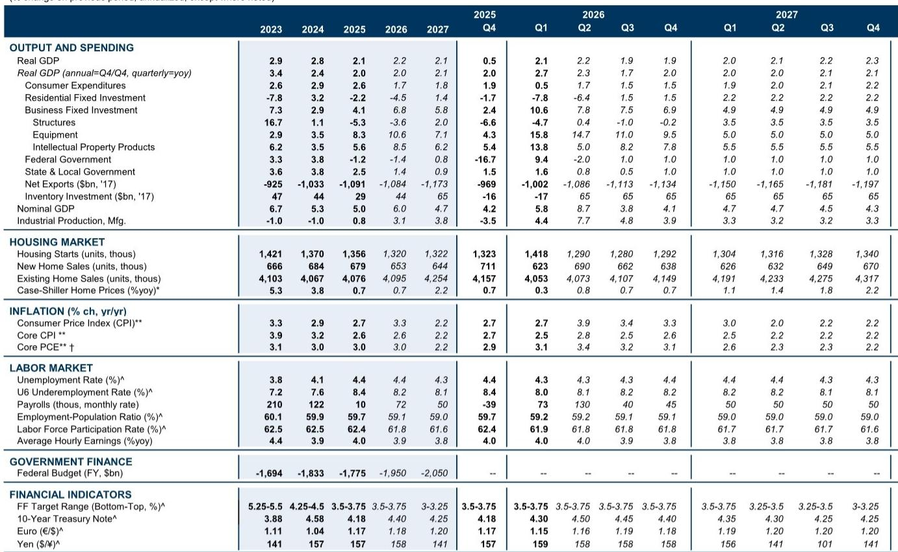
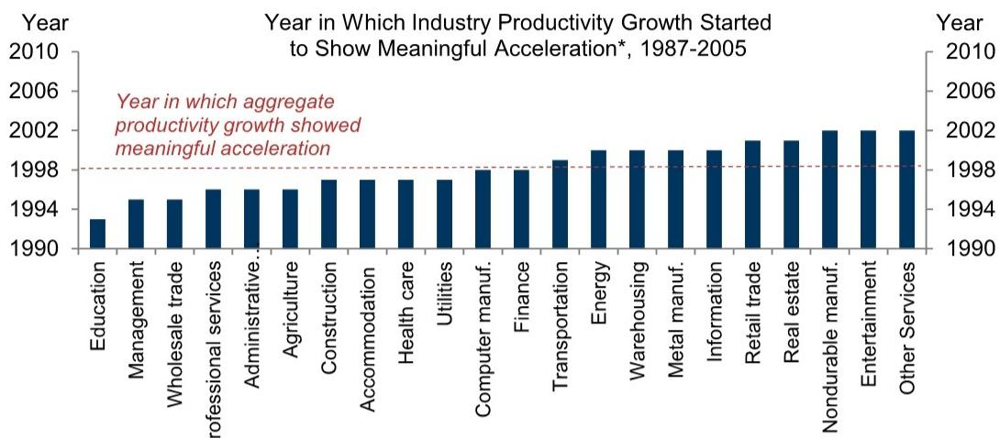
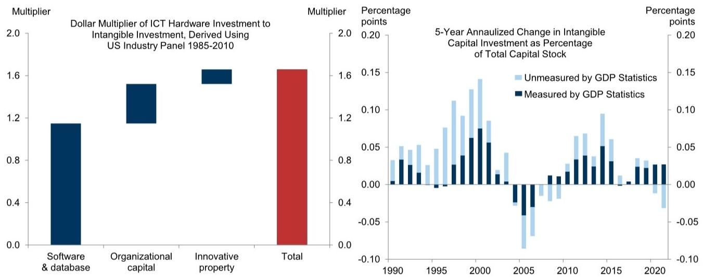

# GS：AI生产力红利不会来得太快，但信息、金融业将是第一个试金石

在技术创新的叙事中，从“发明”到“生产力”之间，往往横亘着一片被低估的、长达十数年的沉默地带。GS最新发布的深度研报，以1980-2000年信息通信技术革命为参照，系统回答了关于AI的两个核心问题：宏观层面的生产力提升何时可见？又将在哪些行业最先显现？

这份报告的核心判断，并不在于AI能否带来生产力提升——GS对此是明确的乐观派，预期AI将在未来十年显著提振生产力增速。真正有价值的信息在于节奏和结构：历史经验表明，从技术创新到广泛的生产力提升，路径既非迅速，也非均匀。而这一次，AI的落地速度可能比ICT更快，但“组织资本”的滞后投资，仍然是最大的变数。

---

## 1. 从PC商业化到生产力起飞，ICT用了15年——AI可能更快，但不会一蹴而就

1980年代初期，个人电脑的商业化拉开了ICT革命的序幕。专利数量飙升，投资激增。然而，宏观生产力数据的显著加速，一直等到1990年代后半期才出现，前后相隔约15年。

GS利用行业面板数据发现，ICT投资对生产力增长的影响呈现明显的J曲线：前四年甚至对可测量的生产力增长产生轻微拖累，正向效应在约8年后才具有统计显著性，并在第12年达到峰值——ICT投资占资本存量每增加1个百分点，大约在12年后拉动生产力增速约0.6个百分点。

为什么这么慢？报告归结为三个因素：关键组件成本居高不下、网络效应需要达到临界点、以及最重要的——企业需要大量投资于无形组织资本（如流程再造、员工培训、组织重构），每1美元ICT硬件投资，大约需要额外1.7美元的互补性无形投资。

> **KC评论：** 这份报告最有价值的分析之一，是将“组织资本”放在了生产力转化的核心位置。对投资者而言，单纯追踪AI硬件采购或模型能力提升是不够的，真正的前瞻指标应该是：企业是否开始在组织重构上花钱。报告中的数据显示，目前AI硬件投资增速远超ICT时代同期，但组织重构类投资似乎尚未跟上。

---

## 2. 早期赢家不是“最先买电脑的”，而是“最先围绕电脑重构组织的”

在ICT革命中，哪些行业最早看到了生产力提升？GS通过结构断点检验发现，教育、管理、批发贸易、专业服务、行政支持等行业的生产力增速，在1990年代初期就已出现显著加速，比宏观数据早了数年。

但更关键的发现是：早期受益者并非随机分布。那些在1980年代技术突破前就已深度嵌入ICT的行业，或者最早大规模投资的行业，确实更早看到回报。然而，最终的赢家是那些同时大量投资于无形组织资本的行业——它们从落后于整体经济，到1990年代初期就大幅领先，并将优势维持了多年。

> **KC评论：** 这一结论对AI时代的投资框架有直接启示。不要只关注“哪些行业AI渗透率高”，更要关注“哪些行业正在系统性地围绕AI重构工作流程”。后者才是生产力的真正催化剂。GS报告中的Exhibit 9（组织资本投入与生产力表现的关系图），是整份报告最值得反复研究的图表之一。

---

## 3. AI这次有三个不同，但一个关键的相似之处可能成为瓶颈

GS认为，AI的生产力落地速度会比ICT更快，理由有三：

第一，成本下降速度不同。AI模型的使用成本下降速度远超当年PC。虽然近期部分前沿模型的价格有所上升，但GS股票分析师预期，随着竞争压力和算力成本持续下降，整体token价格将趋于稳定。

第二，网络效应的重要性不同。通信技术（如互联网）的价值高度依赖用户规模达到临界点，而AI的很多应用场景并不需要网络效应来释放生产力。

第三，数据可得性大幅提升。如今关于AI暴露度、采用率、无形投资的高频数据，远比ICT时代丰富，这让识别早期信号成为可能。

然而，一个关键的相似之处——甚至可能是更严重的瓶颈——是组织资本的滞后投资。报告显示，虽然AI硬件投资增速已超过ICT时代同期，但以“从事组织重构活动的员工薪酬占比”衡量的组织资本投资，似乎进展缓慢。当然，部分无形投资可能未被官方统计完全捕捉，例如亚特兰大联储的企业调查暗示2026年AI相关无形资本支出约2800亿美元，GS基于公司数据估算的劳动力成本约为每年1500亿美元。

> **KC评论：** 这里有一个值得追问的问题：如果组织资本投资确实滞后，那么AI的生产力J曲线可能会被拉长——前几年的“拖累期”可能比市场预期的更久。报告没有直接给出这个判断，但这是历史逻辑的自然延伸。完整报告中关于无形投资的详细拆解和估算方法，值得仔细阅读。

---

## 4. 信息、专业服务、保险、金融——AI生产力最早的四个测试场

基于历史经验，GS构建了一个综合评分体系，从四个维度评估各行业AI生产力提升的潜力：既有IT暴露度、AI采用率、AI暴露度（工作任务可被AI替代或增强的程度）、以及2022年以来的组织重构强度。

综合得分最高的行业依次是：信息与数据处理、专业服务、电影与录音、保险、信贷中介、计算机与电子制造、行政与支持服务。这些行业应该最早、最大幅度地出现生产力提升。

但报告也谨慎地指出：即使在这些行业，行业层面数据也有滞后，证据至少还需要几年才能显现。

> **KC评论：** 对投资者而言，这份评分体系提供了一个比“AI概念股”更精细的观察框架。值得思考的是，得分最高的信息与数据处理行业，其“组织重构强度”指标反而是零——这或许意味着该行业本身就在技术前沿，不需要大规模重构，但也可能意味着潜在的重构投资尚未开始。这个细节在完整报告中有更详细的讨论。

---

## 5. 报告尚未完全回答的关键问题：如何区分“AI驱动”与“其他因素”？

GS在ICT研究中，通过统计方法检验了生产力加速是否确实由ICT驱动，而非其他因素。但在AI部分，报告虽然给出了“应该关注哪些行业”的框架，却没有同样系统地回答：当这些行业的生产力数据终于改善时，如何确信是AI的功劳，而不是周期、政策或其他技术？

这是一个关键的未解问题。ICT时代有长达15年的数据可供回溯验证，而AI时代才刚刚开始。当前的评分体系更多是基于“相关性”而非“因果性”的排序。真正有说服力的证据，可能需要等到行业层面的生产力数据积累足够长的时间序列，才能进行类似的结构断点检验。

---

## 6. 对读者的观察框架：三个信号，而非一个

基于这份报告的逻辑，我们建议读者建立三个层次的观察信号，而非等待一个“宏观生产力加速”的单一时刻：

**第一层：成本信号。** AI模型的使用成本是否在持续下降？这决定了采用门槛。GS认为token价格将趋于稳定，但需要持续跟踪。

**第二层：组织投资信号。** 企业是否开始系统性地增加组织重构类投资？这比硬件投资更能预示生产力的真实转化。目前的数据显示进展缓慢，但部分投资可能未被统计——这是一个需要持续验证的假设。

**第三层：行业信号。** 信息、专业服务、保险、金融这四个高潜力行业的生产力数据，将是AI生产力故事最早的“试金石”。一旦这些行业的生产力增速出现可识别的加速，将是最有说服力的早期证据。

但正如报告所提醒的，即便是这些行业，数据也有滞后，证据至少还需要几年。耐心，可能是AI投资时代最稀缺的品质。

---

这份GS研报的价值不在于给出一个确定的答案，而在于提供了一个经过历史验证的思考框架。它提醒我们：技术创新的叙事往往高估短期影响，而低估长期变革。AI的生产力红利终将到来，但路径可能比市场想象的更曲折、更漫长。

每天，我们的AI agent与人工review会生成国际投行的中文摘要与KC评论，daily更新约10-40页，并整理当天最新数据图表合集，方便喂给AI，也方便人工快速把握market dynamics。欢迎来星球微信群中继续讨论这些未解的问题：组织资本投资何时加速？行业数据何时才能支持因果推断？AI的生产力J曲线是否会比ICT更陡峭或更平缓？这些问题的答案，可能就藏在下一份报告的细节里。

Personal reading notes and learning share only. Not investment advice.

