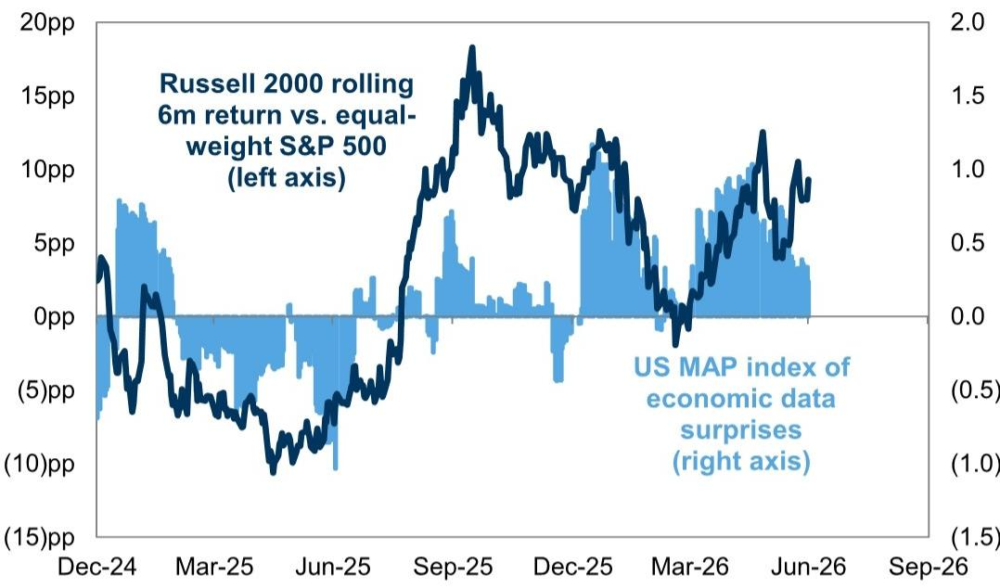
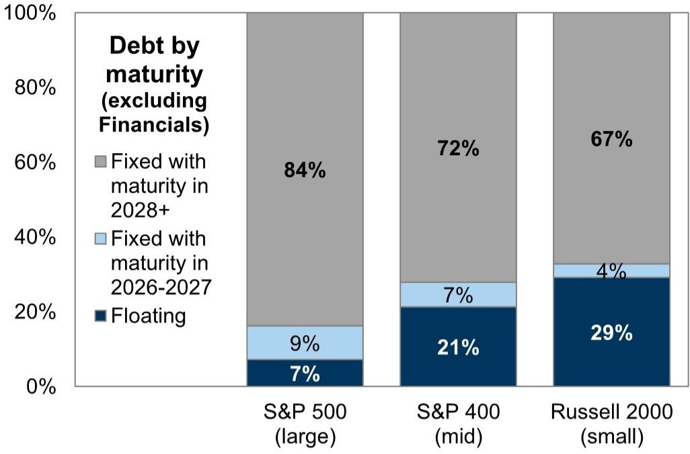
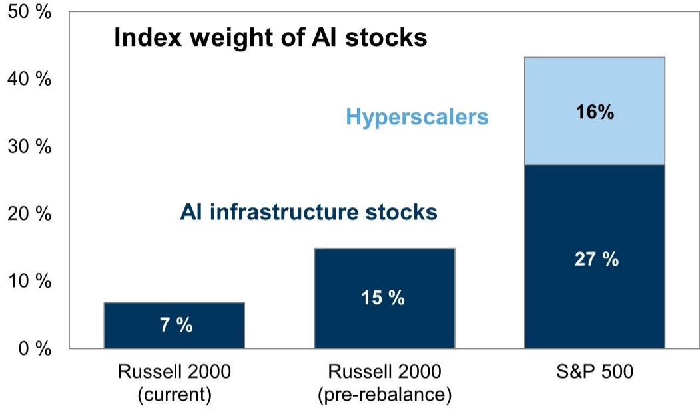

# Small-Cap Outperformance Is Real, But the Easy Money Has Already Been Made

The Russell 2000 returned 23% in the first half of 2026 and 41% over the past twelve months, its strongest run since the COVID recovery. This small-cap index has generated roughly twice the return of the S&P 500 on both a trailing six-month and twelve-month basis. For investors who have been waiting over a decade for this rotation, the moment has finally arrived.

But this outperformance represents only a modest reversal. Over the past fifteen years, the Russell 2000 has underperformed the S&P 500 by nearly 300 percentage points. The S&P 500 has generated almost twice the total return of small caps during that period: 680% versus 375%. The recent surge, while dramatic in percentage terms, barely scratches the surface of that cumulative gap.

The question every serious investor should be asking is not whether small caps have finally broken out. They have. The question is whether this breakout can sustain itself through the second half of the year and beyond. The evidence suggests that the drivers of first-half outperformance are already fading, and that the path forward will be far more selective.

Three forces propelled small caps in early 2026: the AI trade, a resilient economy, and surging healthcare M&A. Each of these factors is now shifting in ways that will reward stock pickers far more than index buyers. The era of broad small-cap beta is giving way to an era of intense alpha dispersion.

## The AI Tailwind That Powered Small Caps Is Now Fading After the Index Rebalance

The most surprising driver of Russell 2000 strength has been artificial intelligence. AI infrastructure stocks contributed roughly 40% of the index's year-to-date return through mid-2026. Semiconductors and companies in various AI infrastructure baskets, including electrical equipment and construction stocks, accounted for 15% of the Russell 2000 index weight and 37% of the index return at the halfway point.

This relationship has intensified over time. The Russell 2000 has been more correlated with the AI basket during the last few months than at any point since the AI boom began in 2023. A regression decomposition shows that AI has recently outweighed the cyclical economy as the most significant macro driver of Russell 2000 returns, at least on a cap-weighted basis.

The small-cap index also benefited from what it did not own. The Magnificent Seven returned zero percent in the first half of 2026, compared with 16% for the rest of the S&P 500. By avoiding that drag, the Russell 2000 gained a structural advantage.

That advantage is now shrinking. Last week's index reconstitution cut the weight of AI infrastructure stocks in the Russell 2000 from 15% to 7%. Some of the largest contributors to the index's year-to-date return were removed entirely. The top ten stocks before the rebalance, which contributed 16% of the index return in the first half, have been replaced by a more diversified set of names with far smaller index weights.

The implications are straightforward. The AI trade will no longer lift the entire small-cap index the way it did in the first half. Individual AI-exposed stocks may still perform well, but their impact on the aggregate index will be roughly half of what it was. Investors who want exposure to the small-cap AI theme will need to be precise about which names they own.

## Economic Resilience Has Supported Small Caps, But Near-Trend Growth Points to Low Single-Digit Returns

The health of the cyclical economy is usually the most important macro driver of small-cap equities, and resilient economic activity has contributed to the Russell 2000 strength so far this year. Despite the energy shock this spring, US economic data have generally remained solid. The current activity indicator points to real growth in the range of 2.5% to 3.0%, and the MAP index signals positive economic data surprises.

This backdrop has been favorable for small caps, which tend to be more economically sensitive than their large-cap counterparts. Russell 2000 stocks have outperformed S&P 500 companies in nine of eleven sectors year to date. Outside of technology, the largest contributors have been cyclical sectors including Industrials and Financials.

The problem is that the market has already priced much of this strength. Given elevated valuations and the forecast for real US GDP growth of roughly 2% in coming quarters, the model suggests low single-digit Russell 2000 returns over the next twelve months. The combination of a 2.4x price-to-book ratio, which ranks in the 76th percentile since 1985, and near-trend growth does not leave much room for further multiple expansion.

The major upside risk would be stronger economic growth than currently forecast, or continued upside surprises to the AI infrastructure boom. The largest downside risks are that those growth tailwinds disappoint or that the Federal Reserve tightens more than the market is currently pricing. Nearly 30% of Russell 2000 stocks are unprofitable, and 29% of Russell 2000 debt is floating rate, compared with 7% for the S&P 500. A hawkish Fed would hit small caps disproportionately hard.

## Earnings Growth Estimates Look Impressive on the Surface but Are Deteriorating Relative to Large Caps

Consensus estimates show the Russell 2000 growing earnings at twice the rate of the S&P 500 this year: 48% versus 24%. If realized, this would be the strongest annual growth rate for small caps in decades, outside of the COVID recovery in 2021 and the earnings rebound in 2009.

But the trend is moving in the wrong direction. Year to date, analysts have lifted 2026 EPS estimates for the S&P 500 by 9% while cutting Russell 2000 estimates by 9%. The entire S&P 500 year-to-date return has been driven by near-term earnings growth. For the Russell 2000, the return can be attributed in roughly equal parts to growing earnings and rising valuations.

This divergence matters. When a rally is supported by both earnings and multiple expansion, it has more staying power. When half the return comes from valuations alone, the risk of mean reversion increases. The Russell 2000 price-to-book ratio has already risen from 2.2x at the start of 2026 to 2.4x currently, though it has fallen from the 2.6x level before the rebalance.

The composition of earnings growth also warrants scrutiny. Roughly a quarter of the Russell 2000 is unprofitable, representing 29% of constituents and 23% of market cap. This unprofitable share has trended higher during the past twenty years and increased slightly following the recent rebalance. The headline EPS growth figure for the index is pulled up by a relatively small number of profitable companies, while a large tail of loss-making firms drags on aggregate returns.

## Surging Return Dispersion Creates an Exceptional Environment for Active Management, Not Passive Indexing

The most important development for serious small-cap investors may not be the index return at all. Return dispersion within the US equity market has surged to elevated levels, and the opportunity set for stock pickers has rarely been more attractive.

Russell 2000 return dispersion has averaged roughly twice the level of S&P 500 dispersion during the past thirty years. Currently, small-cap dispersion registers higher in every single sector relative to large caps. This means that the difference between the best-performing and worst-performing stocks within each sector is wider for small caps than for large caps.

For active managers, this is the ideal environment. When dispersion is low, passive indexing captures most of the available return. When dispersion is high, the gap between skilled stock selection and mediocre stock selection widens dramatically. The Russell 2000 is currently offering more dispersion than the S&P 500 in every sector, which means the potential alpha opportunity is substantially larger in small caps.

This is not a cyclical observation. The structural characteristics of the small-cap universe naturally generate higher dispersion. Smaller companies have less diversified business models, more variable access to capital, and greater sensitivity to idiosyncratic factors. The current environment amplifies these structural features.

The implication for portfolio construction is clear. Investors who treat small caps as a simple beta allocation are leaving a significant amount of potential return on the table. The Russell 2000 index return over the next twelve months may be modest, but the range of outcomes for individual stocks will be extraordinarily wide.

## What the Report Does Not Fully Answer: The Sustainability of Healthcare M&A and the Path of AI Capex

The report identifies two critical drivers that remain highly uncertain. Healthcare M&A has been a significant contributor to Russell 2000 performance, with announced US healthcare M&A totaling $236 billion in the first half of 2026, a 90% increase relative to the first half of 2025 and the strongest start to a year since 2021. Biotechnology accounts for 11% of Russell 2000 index weight, a 9 percentage point tilt relative to the S&P 500, and has driven roughly 10% of the small-cap index year-to-date return.

The question that remains open is whether this M&A wave can sustain its pace. The first-half surge may reflect a catch-up effect after a period of regulatory uncertainty, or it may signal a structural shift in how large pharmaceutical companies view small-cap biotech targets. The report does not provide a clear framework for distinguishing between these two scenarios.

Similarly, the path of AI capital expenditure remains a critical variable. The report notes that revisions to the outlook for AI capex are expected to be less of a catalyst for the AI infrastructure trade in the coming earnings season than in the previous quarter. But it does not specify what would constitute a positive or negative surprise relative to current expectations. Investors are left to monitor this themselves.

## A Decision Framework for Small-Cap Allocation in the Second Half

For investors constructing their small-cap exposure for the remainder of 2026, three questions should guide the decision process.

First, what is your view on AI capex sustainability? If you believe the current pace of AI infrastructure investment will continue or accelerate, the post-rebalance Russell 2000 still offers selective exposure to this theme, albeit at half the weight it carried before. If you believe AI capex will decelerate, the small-cap index has already reduced its sensitivity to this factor.

Second, what is your view on interest rates? With 29% of Russell 2000 debt at floating rates and nearly 30% of constituents unprofitable, small caps are highly sensitive to Fed policy. If you expect the Fed to remain on hold or cut, small caps can work. If you expect tightening, the floating-rate exposure becomes a significant headwind.

Third, what is your conviction in your stock selection ability? If you have low conviction, the index-level outlook for low single-digit returns may not justify the risk. If you have high conviction, the elevated dispersion environment offers one of the best opportunities for alpha generation in years. The Russell 2000 is not a buy-the-index story for the second half. It is a stock-picker's market.

Join the community to read the full report and review the original charts.

*This article is for learning and discussion only and does not constitute investment advice.*

Personal reading notes and learning share only. Not investment advice.

