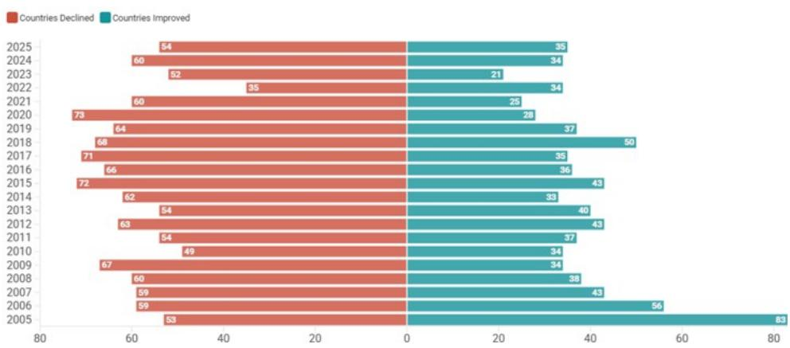
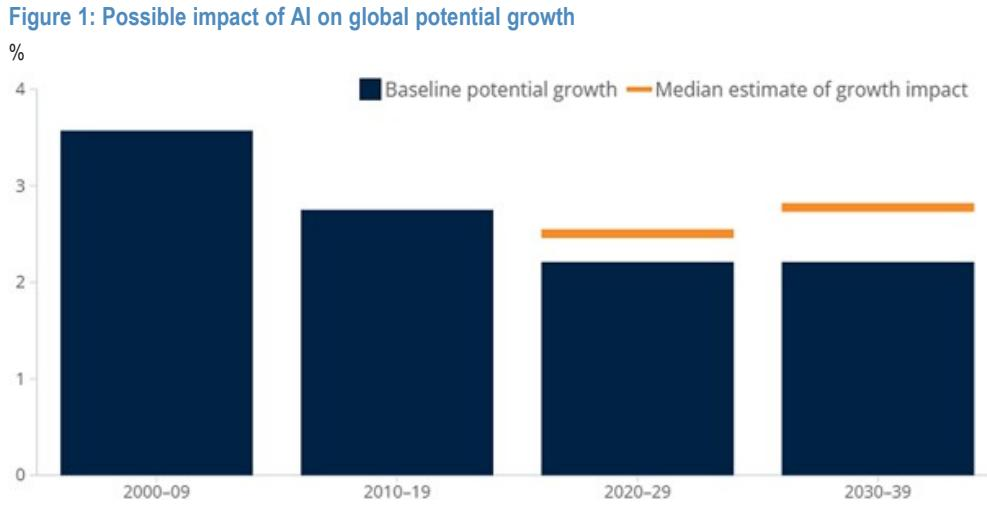
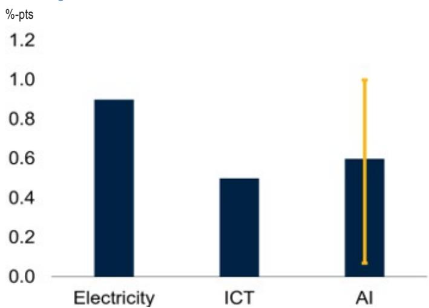

# JPM：美国例外论回归，但市场对通胀和财政的定价仍过于乐观

华盛顿的共识正在形成，但这份共识里藏着一条危险的裂缝。

JPM于6月25日在华盛顿举办的政策闭门会议，汇集了政策制定者、官方债权人以及智库专家。会后发布的报告《Washington Policy Perspectives》给出了一个核心判断：美国金融的“例外论”依然坚挺，AI驱动的资本开支、宽松的金融条件和放松监管的冲动，共同指向经济增长的上行风险。但与此同时，一个“更高、更久”的宏观与市场新常态正在被市场参与者被动接受，而其中最关键的两个变量——财政可持续性与债务风险——在资产定价中仍然被显著低估。

这不是一份简单的乐观清单。它更像是一份关于“市场正在相信什么，以及可能忽略了什么”的预警。

> **KC评论：** JPM这份报告的独特价值不在于总结华盛顿的主流观点，而在于指出了主流观点与市场定价之间的偏差。市场正在拥抱“美国例外论”和“AI超级周期”的故事，但对这个故事背后的代价——结构性通胀、更高的期限溢价、以及悬而未决的财政问题——定价不足。这种偏差，往往就是下一轮资产价格重估的起点。

## 1. 这轮“美国例外论”的真正引擎是AI，而非宏观政策

报告的第一个关键洞察是：推动美国经济增长预期的核心变量已从传统的货币或财政政策，转向了AI驱动的资本开支。这与市场近年来反复讨论的“软着陆”或“不着陆”叙事有本质区别。

JPM美国股票策略团队的数据显示，AI资本开支和数据中心建设正在推动前所未有的盈利修正浪潮。未来两年的共识盈利增长预期已被平均上调约20%，与AI资本开支近乎翻倍的趋势高度吻合。超大规模科技公司（Hyperscaler）预计今年资本开支将达到约7300亿美元，2027年预计超过9000亿美元，而到本十年末，AI相关投资总额可能达到5.5万亿美元。AI数据中心债务发行已超过3000亿美元，成为美国投资级公司债券市场中最大的“板块”。

这意味着什么？它意味着美国经济的增长故事正在从“周期复苏”切换为“技术革命”。这种切换带来了更高的增长上限，但也带来了更高的不确定性——因为AI对生产力的提升幅度和时点，目前仍是一个巨大的未知数。世界银行的估算显示，如果AI能实现类似历史上最强十年生产力增长率的“变革性复制”，全球生产力增长可能达到每年约2.7%。但即使是国际货币基金组织，也认为短期内0.2-0.3个百分点的生产力提升已经意义重大，而超出这一预期的乐观情绪可能过于乐观。

> **KC评论：** 理解这一点的关键在于区分“增长故事”和“增长现实”。市场现在买入的是AI的“故事”，但报告明确指出，官方债权人和国际机构对AI的实际短期影响持谨慎态度。这个预期差本身就是风险。完整报告中包含了一张非常关键的图（Figure 1），对比了AI对全球潜在增长的不同影响情景，从基准情景到“变革性”情景的跨度极大，这正是我们需要在社群中深入拆解的核心图表。

## 2. “更高、更久”已成共识，但通胀中枢上移的幅度被低估

会议达成的另一个广泛共识是，我们已进入一个供给侧冲击更频繁、期限溢价更高、财政动态更重要的新世界。市场不再假设长期利率会自然回归到疫情前的水平。

报告引用世界银行的预测，预计今年全球整体通胀率将回升至4%，主要源于能源成本上升。核心PCE通胀在2026年和2027年分别为3.3%和2.5%，较此前的预测显著上移。美联储的6月点阵图显示，有9位委员预计今年将加息，其中6位预计加息两次或以上。这已经远远超出了“移除2026年降息预期”的范畴。

更值得关注的是，市场参与者似乎正在迅速“常态化”这种高波动、高通胀的环境。报告提到，“结构性更高的通胀、更高的期限溢价和超出规模的日间市场波动，正日益被视为‘新常态’”。这种心态上的“适应”，恰恰是危险的来源。当投资者开始接受3%的通胀为“新常态”时，他们对美联储可能被迫加息的定价就会不足。

## 3. 美元信用依然稳固，但黄金的叙事拐点可能正在形成

对于全球资产配置者而言，报告中最具冲击力的判断或许在于：美元贬值交易（dollar debasement trade）已暂时从市场雷达上消失。对美元金融资产的强劲需求压过了去美元化的担忧；随着利率的重新定价，增加黄金配置的边际紧迫性正在下降。

这一判断与当前许多市场参与者的直觉相悖。近年来，地缘政治冲突、美国财政赤字膨胀和央行购金潮，让“去美元化”和“黄金重估”成为热门叙事。但JPM报告指出，在华盛顿的政策圈和官方债权人中，美元的吸引力并未受到实质性挑战。美国金融市场的深度、流动性和制度优势，依然是其他市场难以匹敌的。

但这并不意味着黄金的故事就此终结。报告隐含的另一层意思是：当前市场对黄金的定价，是基于“美元信用依然稳固”这一前提。如果未来美国财政问题真的引发市场信任危机，或者AI驱动的增长红利被证明是幻觉，那么黄金的叙事逻辑将重新激活。目前，市场只是在等待一个触发点。

> **KC评论：** 这里有一个重要的投资框架问题：黄金的定价逻辑正在从“实际利率”驱动转向“信用风险”驱动。JPM认为当前美元信用风险被低估，因此黄金的“保险价值”未被充分定价。但报告没有展开的是，如果美联储被迫加息，实际利率上升，黄金又会面临短期压力。这种多因子博弈的复杂性，正是完整报告中最值得反复研读的部分。

## 4. 财政问题仍是房间里的大象，但市场选择视而不见

报告中最坦诚也最令人不安的部分，是关于财政可持续性的讨论。报告直言：“财政问题仍然无法解决，政客们越来越多地寻求私营部门的指导。” 财政数学是不可持续的，但看似实际的解决方案仍然会沦为政治博弈的牺牲品。

一个关键的数据点被强调：一旦债务与GDP之比超过约25-30%，借贷成本就会急剧上升。而新兴市场的债务与GDP之比已从历史水平的约35%上升至约75%，偿债比率也从约6-7%上升至约10-11%。发达经济体的情况同样不容乐观。

报告还指出，市场定价中“财政和债务担忧仍然显著权重不足”。这意味着，当前美债收益率曲线所反映的，更多是对通胀和货币政策的预期，而非对长期财政可持续性的担忧。一旦市场的焦点从“通胀”转向“财政”，可能引发一轮剧烈的期限溢价重定价。

## 5. 报告尚未回答的关键问题：AI的政治后果与中美关系的“平静期”

报告提出了两个值得持续追踪的关键问题，但它们本身并未给出确定答案。

第一，AI的政治后果正在成为新的断层线。围绕收入不平等、数据中心选址以及监管权限的反弹风险正在积聚。AI带来的生产力红利可能高度集中于少数科技巨头和高端劳动力，而中低端岗位的替代效应和收入分配恶化，可能在未来引发强烈的政治反冲。这种反冲是否会反过来阻碍AI投资，或导致更严格的监管，目前仍无法判断。

第二，中美关系被描述为“建设性的战略稳定”，美国专注于争取时间来减少关键依赖。但这种“平静期”能持续多久，取决于双方博弈的节奏。报告提到，G2动态仍然主导着全球秩序叙事，而“中等强国”正在淡出焦点。AI超级周期可能进一步拉大美国与欧洲、英国和新兴市场之间的差距，这本身会加剧地缘政治的张力。

## 6. 投资者的观察框架：从“通货膨胀”到“通胀制度”

读完这份报告，一个清晰的观察框架浮现出来：我们正在从“通胀是暂时的”和“通胀是周期性的”这两个旧框架，转向“通胀是结构性的”这一新框架。这个新框架的核心要素包括：

第一，AI投资的短期通胀效应。大规模资本开支本身会推高建筑成本、电力需求和高端人才薪酬，这在中短期内是通胀性的。

第二，供给侧冲击的常态化。贸易和地缘政治碎片化带来的供给冲击，不再是偶发事件，而是新制度的一部分。

第三，美联储政策框架的模糊化。放弃前瞻指引、依赖任务组（task forces）的决策模式，可能加剧市场波动，并削弱美联储作为“稳定锚”的功能。

第四，财政主导的风险。当政客开始向私营部门寻求财政解决方案时，意味着政治体系已经难以独立解决债务问题，最终可能需要通过通胀或金融压制来化解。

对于投资者而言，这意味着传统的“买入并持有”债券策略可能需要重新审视，而对股票资产的估值模型，也需要将更高的风险溢价和更高的长期贴现率纳入考量。

---

这份报告的完整版本包含了更多关于美联储加息路径的详细讨论、AI对不同行业生产力的量化影响，以及全球主权债务风险的地图式分析。这些图表和细节，是做出独立判断的基础，而不是仅仅依赖摘要。

我们的社群每天由AI agent和人工review生成国际投行中文摘要与KC评论，daily更新约10-40页，并整理当天最新数据图表合集。这些材料既方便喂给AI进行深度分析，也方便人工快速把握全球市场动态。欢迎来星球和微信群中继续讨论，一起拆解这份报告背后的完整逻辑链条。

Personal reading notes and learning share only. Not investment advice.

