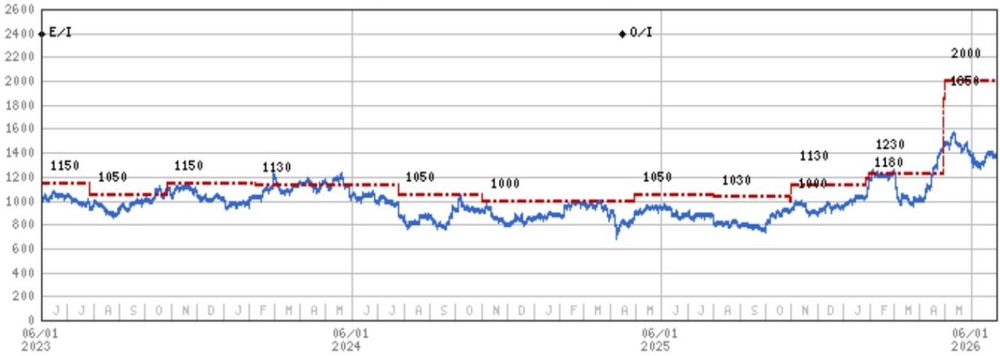
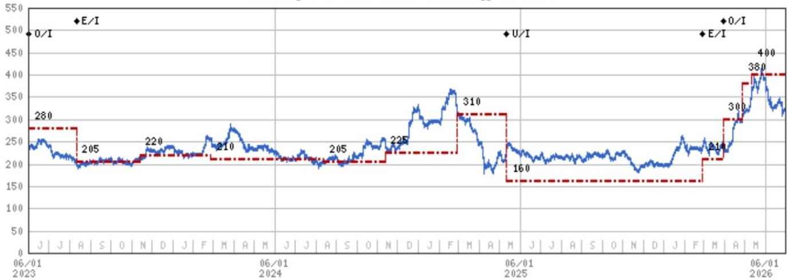
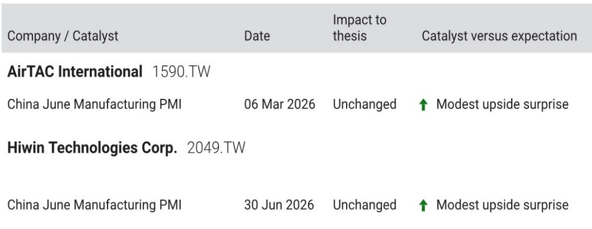

# 摩根斯坦利：MS：中国PMI微升，自动化板块的真正机会不在宏观，而在微观议价权

中国6月制造业PMI从50.0微升至50.3，略高于市场预期的50.1。这个数字不大，但MS在第一时间发布了一份专门针对自动化板块的解读报告，重点落在两家台湾自动化零部件公司——亚德客（AirTAC）和上银科技（Hiwin）。核心判断是：PMI数据本身不是关键，关键在它验证了工业自动化正在进入一个“宽基复苏”阶段，而在这个阶段，真正值得关注的不是行业整体增速，而是哪些公司有能力把规模转化为议价权。

这份报告很短，但信息密度不低。它没有讨论中国宏观经济的长期走向，也没有泛泛而谈“自动化趋势”，而是直接给出了两个具体标的的估值逻辑和风险收益比。这种聚焦，恰恰是当前市场最需要的——在宏观噪音中，找到微观上可执行的判断。

## 1. 这轮复苏不是V型反转，而是“宽基复苏”，意味着选股逻辑变了

MS用“broad-based recovery”来描述当前的自动化需求。这个词值得拆解。宽基复苏，意味着需求不是来自单一爆发点，而是来自多个终端市场的同步改善：科技、电池、以及其他传统制造业。

这与2020-2021年的自动化周期有本质区别。当时的需求高度集中在半导体和消费电子，带动了一批专用设备公司。而当前的需求结构更分散，这意味着：

- 单一客户的订单波动对整体收入的影响在减弱。
- 公司需要同时服务多个行业，才能享受复苏红利。
- 产品线越宽、渠道覆盖越广的公司，受益越确定。

从这个角度看，亚德客和上银的定位恰好契合。亚德客的核心产品是气动元件，广泛应用于各类制造产线；上银则聚焦线性导轨和滚珠丝杠，是自动化设备的基础传动部件。两家公司的客户群都横跨多个制造业子行业，而非押注单一赛道。

> **KC评论：** MS没有说“自动化要爆发了”，而是说“复苏正在变宽”。这个区别很重要：爆发意味着买最弹性的公司，宽基复苏意味着买最稳健的公司。完整报告里对两家公司的估值分析和风险拆解，能帮你理解这种“稳健”到底值多少钱。

## 2. 亚德客的估值逻辑：21倍PE买的是“份额扩张+新产品线”的确定性

MS对亚德客给出了“Overweight”评级，目标价基于30倍2027年预期PE。当前股价对应21倍2027年PE，低于2020年以来25倍的平均水平。

这个估值折价反映的是市场对两个问题的疑虑：第一，亚德客在气动元件领域已经做到了中国第一，份额还能不能继续扩张？第二，线性导轨这个新产品线，能不能贡献增量？

MS的回答是肯定的。报告指出，亚德客将继续受益于“own share gains”——内部份额提升。这意味着公司的增长不依赖行业整体蛋糕做大，而是靠从竞争对手手中抢份额。这在当前中国制造业竞争格局分化、中小企业出清的背景下，是一个合理的假设。

线性导轨的增量贡献则是第二个增长引擎。这个产品线如果跑通，相当于在原有气动元件之外，开辟了一个同等体量的新市场。但报告没有详细展开线性导轨的客户验证进度和毛利率爬坡路径——这部分信息，可能在完整报告里有更细致的拆解。

> **KC评论：** 21倍PE买亚德客，本质上是在买“份额提升+产品线扩张”的双重确定性。但线性导轨的放量节奏和盈利能力，是这个逻辑的关键假设。如果你想知道这个假设有多可靠，需要看完整报告里对产品线进度和客户反馈的详细分析。

## 3. 上银的弹性在于“产能利用率+涨价”，30倍PE离历史顶部还有空间

上银的情况与亚德客不同。MS认为，上银未来几个季度将展现更大的利润率弹性，驱动力来自两个因素：产能利用率提升，以及交期延长带来的涨价空间。

上银的线性导轨和滚珠丝杠是自动化设备的关键零部件，其供应紧张程度可以直接反映制造业投资的活跃度。报告提到“delivery lead times keep lengthening”——交期持续拉长，这通常意味着供不应求，厂商有提价能力。

当前上银的PE约为30倍2027年预期盈利，而MS给出的目标价隐含37倍PE，并指出历史上景气高峰时PE可达35-40倍。这意味着，即便不考虑盈利超预期，仅估值修复就有约20%的上行空间。

但这里有一个关键变量：涨价能否持续。交期拉长可以支撑短期涨价，但如果下游客户开始囤货、或者竞争对手扩产导致供需逆转，涨价逻辑就会松动。报告没有深入讨论竞争格局的变化——这可能是完整报告里更详细分析的部分。

> **KC评论：** 上银的弹性比亚德客大，但风险也更高。30倍PE买的是“涨价能持续”的假设。完整报告里应该有关于行业产能扩张节奏和客户库存水平的分析，这是判断涨价可持续性的关键。

## 4. 报告没有完全回答的问题：全球工业超级周期到底有多“超级”？

MS在报告里提到一个词：“global industrial super-cycle”。这是一个很大的判断。如果全球确实进入了工业超级周期，那么当前自动化板块的估值可能只是起点。

但问题在于，这个“超级周期”的具体驱动力是什么？报告没有展开。是AI带动的算力基础设施投资？是新能源产能扩张？还是制造业回流带来的资本开支？不同驱动力对应的自动化需求结构和持续性截然不同。

此外，中国PMI在50附近徘徊，显示制造业仍在扩张和收缩的边缘。如果下半年PMI再次回落，自动化板块的订单预期会迅速修正。MS在报告里给出的风险提示包括“中国更严重的经济下行”，但并没有量化这个风险的概率和对目标价的影响。

这些未解答的问题，恰恰是深入阅读完整报告的价值所在——它可能包含更详细的行业需求拆解、竞争格局分析、以及对超级周期驱动因素的判断。

## 5. 对决策者的观察框架：不要只看PMI，要看PMI背后的“订单结构”

如果你是一名产业投资者或资产配置者，这份报告给了你一个具体的观察框架：PMI不是终点，而是起点。更重要的指标是PMI内部的订单结构。

6月PMI数据显示，生产指数微升0.2个百分点至51.4，而新订单指数上升1.3个百分点至51.2。订单增速明显快于生产增速，这是一个积极的信号——说明需求在改善，而库存还没有被动累积。这种“订单-生产”的剪刀差，通常是自动化设备订单领先指标。

MS提到，新订单改善部分来自“quarter-end push”和“stronger exports amid the global industrial super-cycle”。季度末冲量是短期因素，但出口改善如果能够持续，就会为自动化板块提供更持久的需求支撑。

所以，接下来的关键观察点不是PMI本身是50.3还是50.5，而是：新订单指数能否继续上行？出口订单是否持续改善？以及，自动化公司的交期是否继续拉长——这比任何宏观数据都更能反映真实供需。

---

以上是基于这份MS研报的解读与推演。报告本身只有几页，但包含的信息密度和判断框架，值得反复咀嚼。如果你想看到完整的原始报告图表、估值模型的详细拆解、以及对亚德客和上银竞争格局的深度分析，欢迎加入我们的社群。

我们每天由AI agent加人工review，生成国际投行中文摘要与KC评论，daily更新约10到40页，并整理当天最新数据图表合集。这些内容既方便喂给AI做进一步分析，也方便人工快速把握market dynamics。欢迎来星球微信群里继续讨论。

Personal reading notes and learning share only. Not investment advice.

