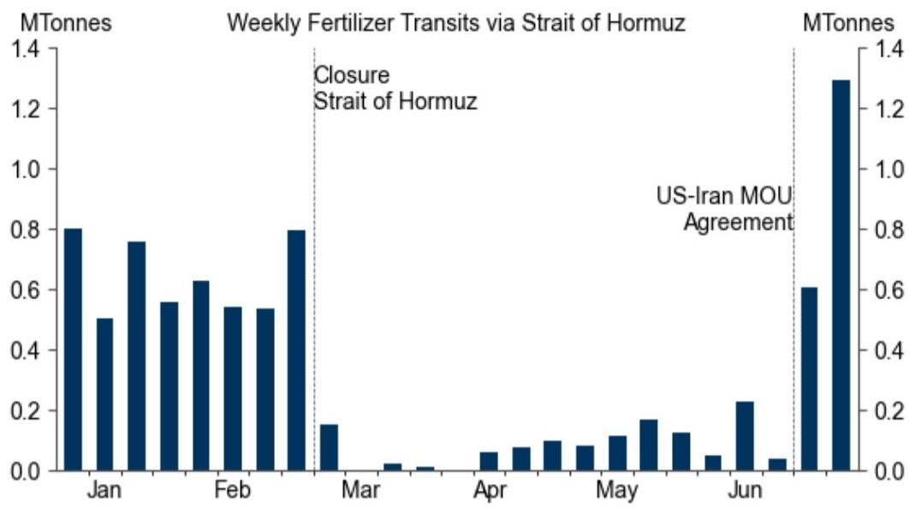
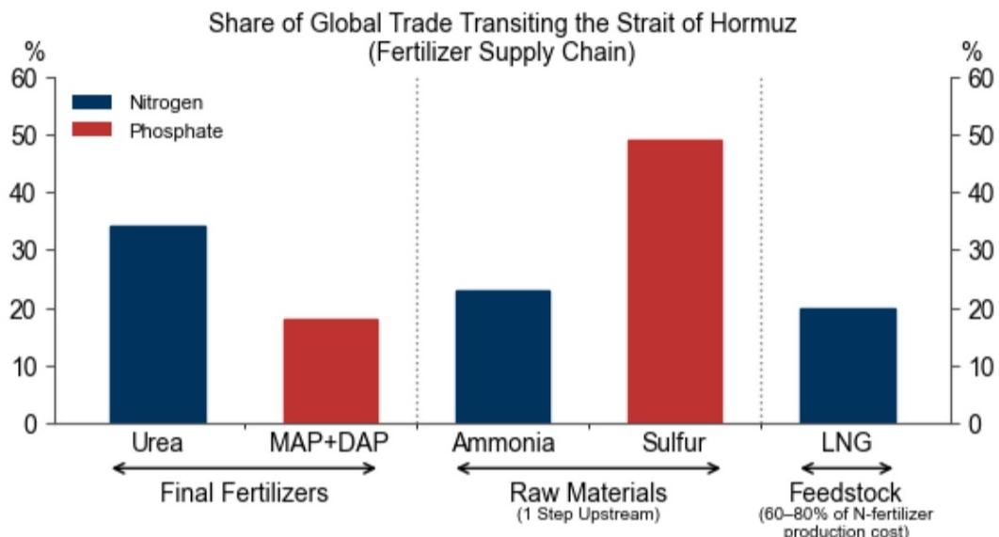
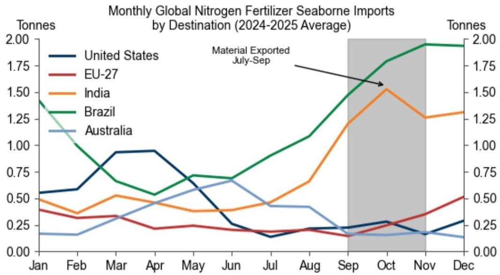

# GS：化肥危机未了，Q3才是真正考验

全球农产品市场的参与者刚刚经历了一次惊心动魄的供给冲击。霍尔木兹海峡的短暂关闭，让三分之一全球化肥贸易量瞬间冻结，尿素价格一度飙升50%。虽然海峡在6月中旬重新开放，化肥运输量已恢复，但GS最新发布的这份报告传递了一个清晰的信号：风险远未解除，真正的考验可能在第三季度。

这份报告的核心判断是：化肥市场的脆弱性并未因海峡重开而消失，反而因为不同化肥品种的刚性需求差异，将风险集中到了未来三个月。对于依赖进口的巴西大豆、印度水稻和欧盟小麦而言，任何一次新的中断都可能产生比二季度更严重的后果。

GS大宗商品分析师Lina Thomas、Samantha Dart和Daan Struyven在报告中详细拆解了氮肥与磷肥的差异化风险，并给出了一个值得所有农业投资者和产业链决策者认真审视的时间窗口。

> **KC评论：** 这份报告的价值不在于告诉你“霍尔木兹海峡开了，没事了”，而在于它用季节性和刚性需求框架，定位了真正的风险时间点。如果你只看到尿素价格回落就认为危机结束，可能会错过Q3的关键变量。报告里的Exhibit 4那张时间轴图表，值得仔细看。

## 1. 氮肥的“刚性”决定了Q3一旦中断，冲击将不可比

氮肥是谷物生产的“速效药”。玉米、小麦、水稻的产量在每季都高度依赖氮肥的及时施用，且无法被土壤储备替代。GS报告明确指出，二季度的中断之所以“相对可控”，是因为它恰好发生在北半球农户已基本完成采购、下一轮采购周期尚未开始的季节性低谷。

但一旦进入三季度，情况将截然不同。巴西玉米、印度水稻和甘蔗、欧盟冬小麦的种植季即将开启，这些主要进口国将在Q3集中采购氮肥。报告援引Kpler的数据显示，如果海峡在Q3再次出现中断，其影响将直接传导至种植季的肥料供应，对当季产量构成实质性威胁。

尿素价格在中断初期上涨约50%，随后在6月随着运输恢复和需求疲软而回落。但GS认为，这种价格回撤并不能被视为风险解除的信号。它只是反映了“需求缺位”下的暂时平衡，而非供给弹性的恢复。

**这意味着什么？** 对于持有农产品期货或相关股票的投资人而言，Q3的霍尔木兹海峡动态将成为一个必须持续跟踪的变量。任何地缘政治紧张信号，都可能触发比二季度更剧烈的价格反应。

## 2. 磷肥的“隐性消耗”：巴西大豆的慢性压力

与氮肥的即时冲击不同，磷肥的风险更加隐蔽，但可能更具破坏性。GS报告指出，磷肥可以从土壤储备中短期提取，不会立即影响产量，但持续的“少施”会逐步消耗土壤肥力，最终削弱作物产量、抗逆性和长期生产力。

巴西大豆是全球最大的出口来源，占全球大豆出口的62%，而其磷肥进口依赖度高达约80%。报告揭示了一个令人担忧的数据：截至6月中旬，巴西大豆农户仅锁定了预期化肥需求的约68%，而历史同期水平约为75%。更关键的是，尽管海峡运输已恢复，磷肥价格并未显著回落。

这意味着巴西大豆农户正面临双重挤压：一方面，自2022年俄乌冲突以来，磷肥的可负担性已持续恶化；另一方面，最新的供给冲击进一步压缩了他们的采购窗口和议价空间。

> **KC评论：** 磷肥的“隐性消耗”是一个容易被忽视的长期风险。如果你只看大豆的当期价格，可能看不出问题。但GS这份报告提醒我们，土壤肥力的透支是一个慢变量，它的影响会在未来1-2个种植季逐步显现。对于关注巴西农业长期竞争力的投资者，报告中的Exhibit 5和Exhibit 6是必看的数据。

**这意味着什么？** 巴西大豆产量的潜在风险，将间接影响全球大豆价格中枢。如果农户因成本压力持续减少磷肥施用，未来巴西大豆的单产可能出现系统性下降，这将为全球大豆价格提供长期支撑。

## 3. 报告尚未完全回答的关键问题：霍尔木兹的“脆弱性溢价”是否会持续

GS这份报告的核心贡献在于建立了“化肥品种-季节性-刚性需求”的分析框架，但它也留下了一个未充分展开的问题：即使霍尔木兹海峡保持开放，已经发生的供给冲击是否会改变市场定价结构？

报告提到，磷肥价格在海峡重开后并未显著下降。这可能意味着市场已经将“霍尔木兹风险”部分纳入了定价，形成了一种“脆弱性溢价”。但这份溢价会持续多久？它是否会扩散到其他化肥品种？GS没有给出明确答案。

此外，报告虽然强调了Q3是氮肥的关键窗口，但没有深入讨论：如果Q3不发生中断，但农户因担忧中断而提前备货或超额采购，是否会人为推高Q2末到Q3初的价格？这种“预防性采购”行为本身，就可能改变供需平衡。

**这意味着什么？** 对于产业链上的采购决策者而言，当前的价格信号可能已经包含了风险溢价。在制定采购计划时，不能简单以历史价格作为锚点，而需要将“霍尔木兹风险”作为一个持续的成本变量纳入预算。

## 4. 一个可操作的观察框架：三个信号决定化肥市场的下一步走向

基于GS报告的逻辑，我们提炼出三个需要持续跟踪的信号，帮助读者自己判断市场走向：

**信号一：霍尔木兹海峡的通航稳定性。** 这是最直接的变量。任何关于海峡通行受阻的新闻，都应被视为Q3的预警信号。建议关注Kpler等机构的实时航运数据，而不仅仅是新闻标题。

**信号二：巴西大豆的磷肥采购进度。** 报告显示截至6月中旬仅完成68%。接下来的几周，如果采购速度仍低于历史均值，将意味着农户对价格敏感度极高，可能进一步减少施用。这将是巴西大豆远期产量的一个先行指标。

**信号三：尿素价格的季节性走势。** 如果Q3初尿素价格在需求回升时未能明显上涨，可能意味着市场对供给恢复的信心较强；反之，如果价格在需求启动前就已走高，则说明市场已经在为潜在中断定价。

> **KC评论：** 这三个信号构成了一个简单的“观察框架”，但GS报告里还有更多细节没有在本文展开——比如不同化肥品种的贸易流向图、上游原料（硫磺、氨、天然气）的间接约束，以及历史中断案例的对比。这些内容在完整报告中都有详尽的图表和分析，值得花时间细读。

## 5. 结语：风险没有消失，只是换了一种存在形式

GS这份报告的价值，不在于给出了一个简单的“看多”或“看空”结论，而在于它帮助读者建立了一个理解化肥市场风险的“时间-品种-刚性”三维框架。

二季度的中断是一次“预警演习”，它暴露了全球化肥供应链在关键节点的脆弱性。虽然这次冲击被季节性低谷所缓冲，但Q3的采购季将是一次真正的压力测试。对于农业产业链的参与者、大宗商品投资者，以及关注全球粮食安全的决策者而言，现在不是放松警惕的时候，而是应该开始为可能的变数做准备。

这份报告里还有更多关于上游原料约束、区域替代方案和价格弹性分析的细节，受限于篇幅无法一一展开。如果你希望获得完整的报告解读，包括GS原始图表、关键数据表格，以及我们团队每天整理的投行研报摘要（约10-40页），欢迎加入我们的知识星球社群。每天由AI agent和人工review共同生成，既方便喂给AI做进一步分析，也方便人工快速把握全球市场动态。在社群里，我们可以继续讨论：Q3的氮肥采购节奏是否会因为这次预警而提前？巴西大豆农户的磷肥困境是否会引发政策干预？这些问题的答案，可能就在下一份报告中。

Personal reading notes and learning share only. Not investment advice.

