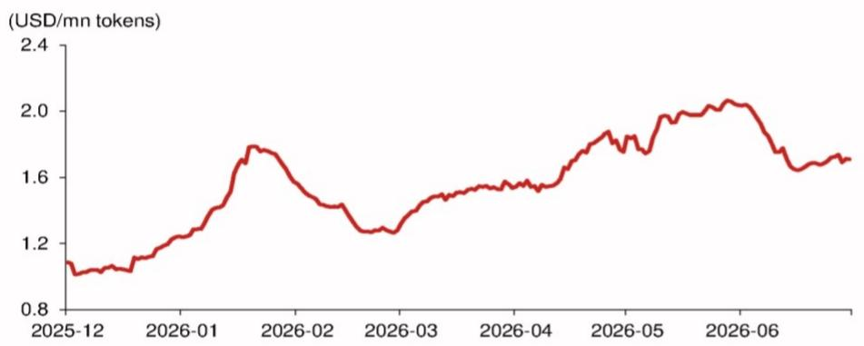

# NOM：市场对存储芯片的恐慌过度了，真正的拐点远未到来

当韩国政府与本土存储巨头联合宣布一项高达4800万亿韩元的中长期投资计划时，全球投资者的第一反应是“供应过剩”。存储芯片股价应声承压。但NOM在最新发布的研报中给出了一个反直觉的判断：市场对这一信号的解读出现了偏差。这份报告的核心主张是，当前市场对两大负面消息——韩国存储巨头的扩产计划与Meta出售闲置算力的决定——的担忧被过度放大。真正的供需拐点，至少还需要5到10年才能看到实质影响。而在这个过程中，AI驱动的结构性需求增长，正在改变存储芯片行业的周期逻辑。

## 1. 韩国存储巨头的“天量投资”并非即时供应冲击，而是应对未来10年缺口的战略储备

NOM明确指出，市场将韩国政府的投资公告误读为“政府指令下的盲目扩产”。报告强调，韩国存储企业没有任何理由在政府要求下进行不必要的投资。这些投资计划高度依赖于市场条件，具有极大的灵活性。

以已启动九年的龙仁半导体集群为例，其第一个洁净室要到2027年2月才能完工，真正的小规模芯片生产可能要到2027年底。这意味着，从投资到产出，周期超过10年。因此，这份投资计划即便加速，其实际影响也至少要在5到10年后才会显现。

> **KC评论：** 投资者常常把“宣布投资”等同于“产能立刻释放”。但存储行业建厂周期极长，且企业会根据市场景气度动态调整节奏。NOM提醒我们，当前市场担忧的“供应过剩”是远期的、高度不确定的叙事，而非近在眼前的现实。完整报告中还包含了存储企业历史投资周期与产能爬坡时间的详细对比，这些数据能帮助你更清晰地判断这个时间差。

## 2. 当前真正的矛盾不是“供过于求”，而是前所未有的供应短缺

NOM认为，市场对“供应过剩”的担忧与行业实际状况严重脱节。AI产业催生了前所未有的强劲需求，这种需求已经导致智能手机、PC等领域的生产中断和价格上涨，甚至引发了消费者对存储行业的反垄断诉讼。

报告指出，所谓的“全球存储企业通过控制供应来操纵价格”的指控是站不住脚的。过去几年，存储企业一直在全力扩产。它们之所以优先生产高利润的HBM（高带宽内存），客观上延缓了通用存储芯片的产量增长。自2025年下半年以来，通用存储的强劲需求已导致严重的供应短缺。企业正在以远超以往计划的力度扩产，但仍无法满足需求。

> **KC评论：** 这是一个关键的认知差。市场看到的是“企业扩产，未来可能过剩”，但NOM看到的是“企业拼命扩产，仍然供不应求”。这种错位恰恰是投资机会的来源。完整报告中对HBM与通用存储的产能分配、以及不同产品线的供需缺口有更精细的测算，值得你仔细阅读。

## 3. Meta出售闲置算力不是需求见顶的信号，而是AI算力民主化的加速器

Meta宣布向外部客户出售闲置算力，引发市场对AI硬件需求见顶的担忧。NOM对此给出了完全不同的解读：这恰恰是AI算力走向高效利用和规模化的必然一步。

报告以亚马逊AWS为例，指出数据中心必须按峰值算力配置，非高峰时段必然存在大量闲置。Meta作为唯一未涉足云业务的头部CSP（云服务提供商），其算力利用率同样存在显著的峰谷差异。将闲置算力出售给像Anthropic、OpenAI这类没有自有数据中心但对算力极度饥渴的企业，是提升ROIC（投入资本回报率）的自然选择。

NOM认为，Meta的决定非但不会减少AI硬件需求，反而可能通过降低每Token的价格，强化杰文斯悖论——算力成本下降将催生更多新的AI应用，从而刺激更大规模的需求。

## 4. 利润挂钩的奖金机制正在成为抑制过度投资的新“安全阀”

这是一个NOM报告中非常新颖的观察角度。传统的存储周期中，企业由于在景气低谷投资不足或在高峰过度投资，导致了行业固有的周期性。但这一次，情况有所不同。

报告指出，韩国存储企业的员工奖金与公司利润直接挂钩。这一机制在某种程度上形成了一个抑制过度投资和利润下滑的内生约束。当企业大规模扩产导致利润承压时，员工奖金将自动减少，从而反向制约管理层的投资冲动。这与过去“政府强迫投资”或“管理层盲目乐观”的历史模式有本质区别。

> **KC评论：** 这个机制非常巧妙。它意味着，即使韩国政府和企业宣布了宏大的投资计划，企业内部也存在一个自我调节的“刹车”。这一微观激励机制的变化，可能比宏观的供需预测更能决定未来周期的形态。报告对这一机制的背景和运行逻辑有更深入的阐述，是理解本次周期独特性的关键。

## 5. 报告尚未回答的关键问题：HBM的结构性需求是否真的能消化所有新增产能？

尽管NOM对供给侧的担忧给出了有力反驳，但报告本身也留下了一个值得追问的问题：AI驱动的HBM需求增长，能否持续且足够强劲，以吸收未来所有新增的通用存储产能？

报告中提到，企业优先生产HBM导致了通用存储的短缺。但当HBM产能大规模释放后，如果AI需求增速放缓，或者HBM技术路线出现变化，那些为HBM准备的产能是否会转向通用市场，从而造成真正的供应过剩？NOM强调了“结构性增长”的可能性，但并未对这一转折点进行量化推演。这恰恰是投资者需要独立判断的核心风险。

## 6. 给读者的观察框架：如何区分“噪音”与“信号”

结合NOM的这份报告，我们建议读者在跟踪存储行业时，建立以下三层观察框架：

第一层，区分“宣布计划”与“实际产出”。任何投资公告，都要关注其建设周期和资金到位节奏。韩国龙仁集群的案例表明，从宣布到量产的时间差，足以让一个完整的周期走完。

第二层，关注“利润导向”而非“规模导向”。员工奖金与利润挂钩的机制，意味着企业行为会比过去更理性。当行业利润率开始下滑时，扩产意愿会自然减弱。

第三层，跟踪“算力成本”与“AI应用”的正反馈。Meta的决定如果成功，将加速Token价格下降。这是一个比任何单一大厂资本开支计划都更重要的长期需求指标。

NOM这份研报的价值，不在于告诉我们“该买还是该卖”，而在于它系统性地拆解了市场当前的两个核心恐慌，并提供了全新的观察视角。它提醒我们，在AI驱动的产业变革中，用旧的周期框架去套用新的现实，往往会导致误判。

每天，我们的AI agent会与人工review相结合，生成国际投行中文摘要与KC评论，daily更新约10-40页，并整理当天最新数据图表合集，方便喂给AI，也方便人工快速把握market dynamics。如果你对存储芯片、AI算力或更广泛的科技硬件周期有深入研究的兴趣，欢迎来我们的星球微信群里继续讨论，一起追踪这些关键变量的演变。

Personal reading notes and learning share only. Not investment advice.

