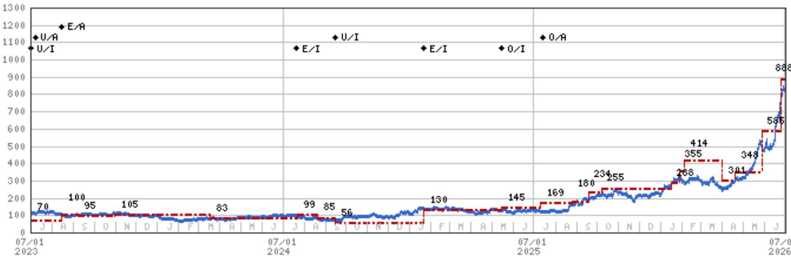

# 摩根斯坦利：MS：旧存储涨价周期还未走完，但公司自己先预警了

2026年6月29日晚间，兆易创新发布了一则看似矛盾的公告。公司承认，其利基型存储产品因主流厂商聚焦主流存储导致供应缺口，正在涨价。但紧接着，它又警告：终端总需求相对稳定，涨价已在一定程度上抑制了需求，随着利基型存储产能扩张，未来可能出现大幅价格下跌。

市场的第一反应是困惑。一家公司在涨价周期中主动提示远期风险，这在半导体行业并不常见。但MS在次日发布的研报中给出了一个简洁而有力的判断：不要过度解读这个预警。

这份由Daniel Yen、Charlie Chan、Daisy Dai和Tiffany Yeh共同署名的报告，核心主张只有一句话——**旧存储（Old Memory）的涨价周期至少能持续到2026年底，兆易创新预警的是一个“相对遥远”的行业风险，而非近期拐点。** MS维持对覆盖范围内所有旧存储标的的超配评级。

这则判断背后，映射出当前存储市场一个被低估的结构性特征：主流厂商的战略性产能转移，正在为利基型存储创造一段“意外”的涨价窗口。而这个窗口何时关闭，取决于一个尚不明朗的变量——产能扩张的速度与终端需求的韧性之间，谁先打破平衡。

## 1. 这轮涨价的核心驱动力是供给侧的结构性缺口，而非需求爆发

理解这轮旧存储涨价的关键，在于区分它和过去几轮周期的本质不同。

过去，存储涨价通常由需求驱动——服务器扩容、智能手机换机潮、PC补库存。但这一次，涨价的核心驱动力来自供给侧。主流存储厂商（三星、SK海力士、美光）在过去两年中将大量资本开支和产能转向HBM（高带宽内存）和DDR5等先进产品，导致DDR4、SLC/MLC NAND和NOR Flash等“旧存储”的供应出现结构性缺口。

兆易创新在公告中提到的“主流厂商聚焦主流存储产品”，恰恰印证了这一判断。当行业巨头把最先进的产线用于生产利润更高的产品时，利基型存储市场就出现了一个短暂的供给真空。这不是需求太好，而是供给太少。

MS认为，这个缺口至少在2026年底之前不会自然弥合。报告明确表示，在DDR4、SLC/MLC NAND和NOR Flash三个市场中，定价强势将持续至2026年末。

> **KC评论：** 这轮存储涨价的“剧本”和过去不一样。过去投资者习惯于用“需求见顶”来预判存储周期拐点，但这一次，需求端并没有出现爆发式增长，问题出在供给端。这意味着，即使宏观经济出现温和放缓，只要主流厂商不回头扩产旧产品，涨价周期就可能比市场预期的更长。完整报告中包含了对三大旧存储产品供需缺口的量化测算，以及各厂商产能切换的时间表，这些细节对于判断拐点时机至关重要。

## 2. 兆易创新的预警是“理性自保”，不是“见顶信号”

兆易创新作为一家利基型存储厂商，其公告中关于“未来可能出现大幅价格下跌”的表述，很容易被市场解读为公司管理层在暗示行业景气度即将见顶。

但MS的解读提供了一个不同的视角：这更像是一种“理性自保”式的预期管理。

当一家公司身处涨价周期时，主动向市场提示远期风险，有几个合理的商业动机。第一，避免客户因恐慌性囤货而过度下单，造成未来需求的“虚假繁荣”和库存堆积。第二，为未来产能扩张后的价格回落提前铺垫，避免届时市场因预期落差而过度反应。第三，在监管和投资者关系层面展现“审慎经营”的姿态。

报告的核心判断是：兆易创新预警的“未来”，可能比市场想象的更远。MS没有看到近期内出现大幅价格下跌的迹象。

这并不意味着预警毫无价值。它揭示了一个真实的行业风险：随着利基型存储产能的逐步扩张，供需关系终将逆转。问题的关键在于这个“终将”是2027年还是2028年，以及逆转的方式是“渐进式回落”还是“雪崩式下跌”。

> **KC评论：** 管理层预警不等于周期见顶，这一点在半导体历史上有很多先例。2017年NOR Flash涨价周期中，多家厂商也曾发出类似预警，但实际涨价持续了超过四个季度。关键区别在于，当时的产能扩张速度远慢于预期。今天的旧存储市场面临类似情境——新建产能从动工到量产通常需要12-18个月，而主流厂商对旧产品的扩产意愿并不强烈。完整报告中包含了对各厂商产能扩张节奏的详细对比，以及不同情景下的供需平衡时间点推演。

## 3. 旧存储的“意外窗口”正在重塑竞争格局

这轮涨价周期的一个潜在影响，是它正在重塑利基型存储市场的竞争格局。

传统上，利基型存储是一个高度分散、价格敏感的市场。但这一次，那些能够获得稳定产能、拥有成熟产品组合的厂商，正在享受一个罕见的“定价权窗口”。兆易创新在NOR Flash和SLC NAND领域的市场地位，使其成为这一窗口的主要受益者之一。

更重要的是，这个窗口正在改变客户行为。当涨价持续时，下游客户开始重新评估供应链策略。一些客户可能会加速向国产替代方案切换，以寻求更稳定的供应和定价；另一些客户则可能增加长期订单锁定，以避免未来更大的价格波动。

这两种行为对利基型存储厂商的影响截然不同。前者意味着市场份额的再分配，后者则意味着收入可见度的提升。

MS对兆易创新维持超配评级，其目标价设定基于剩余收益模型，隐含了对公司中期增长率的乐观预期。但报告也明确指出，风险在于NOR Flash需求周期的逆转，以及DRAM开发进度不及预期。

## 4. 报告尚未完全回答的关键问题：需求端的真实韧性

尽管MS对供给侧的判断相当清晰，但报告对需求端的分析相对克制。

兆易创新在公告中提到，“终端总需求相对稳定，并在一定程度上因涨价而受到抑制”。这是一个值得深挖的表述。如果涨价已经开始抑制需求，那么当前的供需缺口有多大程度是“真实需求”驱动的，又有多少是“囤货需求”驱动的？

如果下游客户因预期涨价而提前下单、超额备货，那么一旦价格停止上涨或出现回落信号，库存调整可能迅速放大需求的下滑幅度。这正是半导体周期中常见的“库存修正”陷阱。

MS在报告中没有详细展开需求端的弹性分析，也没有给出终端市场（如物联网、工业、汽车电子等）的具体需求增速预测。这些信息对于判断涨价周期的可持续性至关重要。

> **KC评论：** 当前市场最大的不确定性，其实不在供给端，而在需求端。如果终端需求能够保持温和增长，那么即使产能逐步释放，供需关系也可能实现“软着陆”。但如果需求出现超预期下滑，那么供给缺口可能迅速演变为供给过剩。完整报告中包含了对各下游应用领域的需求增速预测，以及不同情景下的价格路径推演，这些数据对于判断投资时机非常关键。

## 5. 投资者需要关注的三个核心观察变量

基于MS的分析框架，投资者可以建立以下三个观察变量，用于跟踪旧存储周期的演进：

**第一，主流厂商的产能分配决策。** 三星、SK海力士和美光是否会调整其资本开支计划，将部分产能重新分配给DDR4或NAND Flash？如果出现这种转向，将是旧存储涨价周期最明确的拐点信号。

**第二，利基型存储厂商的产能扩张节奏。** 兆易创新、华邦电子、旺宏电子等厂商的新建产能何时投产？报告提到“利基型存储产能扩张”，但具体的时间表和规模是判断供需平衡点的关键。

**第三，终端需求的真实韧性。** 物联网、工业自动化和汽车电子等利基存储的主要应用领域，其需求增速是否能消化即将释放的产能？这是一个需要持续跟踪的高频变量。

这三个变量中，任何一个出现超预期变化，都可能改变MS“涨价至少持续到2026年底”的核心判断。投资者不应将这份报告视为一成不变的结论，而应将其作为一个动态的分析框架。

---

以上是对MS这份旧存储研报的核心解读。报告本身还包含了大量未在本文中展开的信息：各厂商的产能扩张时间表、不同情景下的供需平衡点推演、以及MS对覆盖标的具体的目标价和估值逻辑。这些细节对于深入理解这轮周期的演进路径至关重要。

在我们的知识星球和微信群里，每天会由AI agent加上人工review，生成国际投行的中文摘要与KC评论，daily更新约10到40页，同时整理当天最新数据图表合集。这些内容既方便喂给AI做进一步分析，也方便人工快速把握market dynamics。如果你对这轮存储周期的后续演进感兴趣，欢迎来继续讨论。

Personal reading notes and learning share only. Not investment advice.

