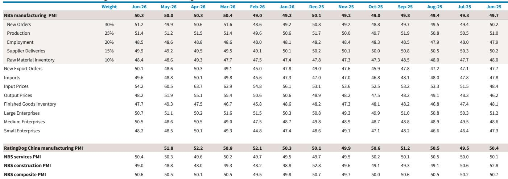
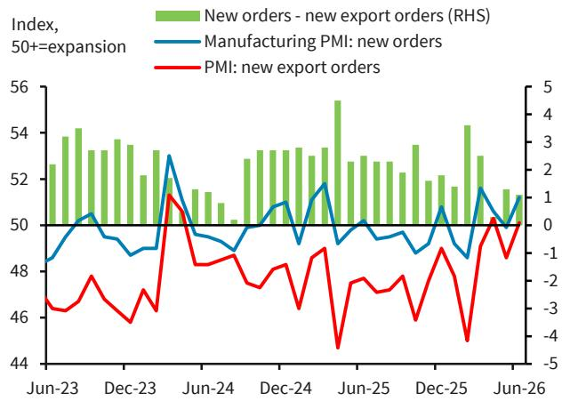
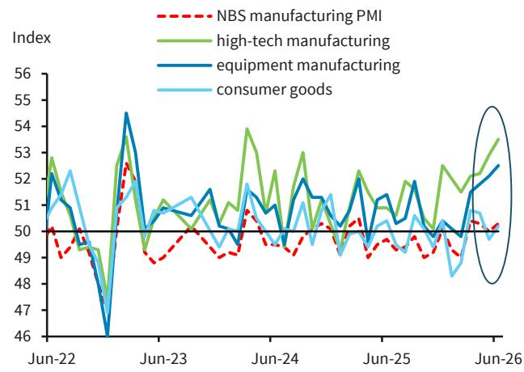

# China's Diverging Growth: The Real Story Behind the PMI Numbers Is Not a Recovery, But a Structural Reordering

The headline number looked reassuring. China's NBS manufacturing PMI edged up to 50.3 in June, beating both consensus and a global investment bank's forecast. After months of hovering near the contraction threshold, a reading above 50 suggests stabilization, maybe even a modest upturn. But a single number masks a more consequential truth: the Chinese economy is not healing uniformly. It is splitting.

The June PMI data reveal an economy with two distinct engines. One engine, powered by high-tech manufacturing and export-oriented industries, is accelerating. The other, rooted in traditional manufacturing, construction, and domestic consumption, is still losing momentum. This is not a temporary divergence. It is a structural reordering that will reshape investment strategies, sector allocations, and risk assessments for the quarters ahead.

For investors, the critical question is no longer "Is China growing?" It is "Which China are you betting on?" The answer will determine whether your portfolio captures the upside of the new economy or gets trapped in the undertow of the old one. The June data provide the clearest roadmap yet for navigating this divide.

---

## The High-Tech Engine Is Running Hot, But Traditional Sectors Are Still in Contraction

The most striking feature of the June PMI release is the sheer distance between sector performance. High-tech manufacturing PMI surged to 53.5, its highest level in more than two years and its 17th consecutive month in expansion. Equipment manufacturing hit a three-year high of 52.5. These are not marginal improvements. They are sustained, accelerating strength in industries tied to artificial intelligence, semiconductors, green technology, and advanced machinery.

Meanwhile, the rest of manufacturing tells a different story. Energy-intensive sectors, including chemical fibers, rubber and plastics, and ferrous metals processing, remain in contraction with a PMI of just 47.1. Consumer goods manufacturing barely crossed into expansion at 50.2, still lagging the headline index. The gap between the strongest and weakest sectors has widened to levels that demand attention.

What explains this bifurcation? On the supply side, high-tech industries benefit from policy support, strong export demand, and structural tailwinds from global supply chain reconfiguration. On the demand side, they serve markets that are growing -- data centers, electric vehicles, renewable energy infrastructure, and advanced electronics. Traditional industries, by contrast, are tethered to domestic real estate, infrastructure, and consumer spending, all of which remain subdued.

The so-what for investors is straightforward. A portfolio that treats "China manufacturing" as a single exposure is increasingly dangerous. Sector selection is no longer a secondary consideration. It is the primary determinant of returns.

---

## Export Demand Is Holding Up, But Domestic Demand Is Searching for a Bottom

If there is one bright spot that cuts across sectors, it is external demand. The new export orders PMI rebounded to 50.1 in June after falling to 48.6 in May, returning to expansion territory. Port cargo throughput data reinforces this picture, with volumes growing 5.2% year-on-year in June, up from 4.6% in May.

But the domestic demand side tells a different story. Major e-commerce platforms reported slower sales growth during the midyear shopping festival. Auto sales remained in double-digit decline. Property market indicators softened further, with new home sales growth slowing and secondary-market transactions easing, even as they maintained low double-digit growth. Home prices continued to fall in both new and secondary markets.

This divergence matters because it suggests that the current growth dynamic is externally driven and thus vulnerable to shifts in global trade policy, demand cycles, and geopolitical tensions. The domestic economy, which should provide a buffer, is not yet contributing meaningfully. The search for a domestic demand floor continues, and the data suggest that floor has not been found.

For investors, this creates a risk asymmetry. Export-oriented positions benefit from current momentum but carry policy and cyclical tail risk. Domestic-demand-exposed sectors carry the opposite profile: near-term weakness but potential upside if stimulus or a natural recovery materializes. The question is which scenario you believe is more likely in the second half of the year.

---

## Margin Pressures Are Easing, But Have Not Fully Normalized

One of the more encouraging developments in the June data is the narrowing of the gap between input and output price PMIs. The input price index fell to 54.2 from 60.5 in May, while the output price index slipped back into contraction at 48.2 from 51.9. The gap narrowed to 6.0 percentage points from a four-year high of 8.6 points in April-May.

This suggests that the commodity price shock that squeezed margins earlier in the year is fading. Lower energy prices and improved supply dynamics are providing relief to manufacturers. But the gap remains wider than the roughly 5-point average seen in January-February, before the Middle East conflict escalated. Margin pressures have eased but have not fully returned to pre-conflict levels.

The implication is that corporate profitability may improve modestly in the coming months, but the improvement will be uneven. Sectors that faced the steepest input cost increases -- chemicals, metals, and energy-intensive industries -- will see the most relief. But for those sectors, demand weakness may offset any margin benefit. Conversely, high-tech manufacturers, which faced less severe input cost pressures, may see a more direct boost to profitability.

Investors should look beyond aggregate margin data and examine sector-level pricing power. The companies that can pass through costs or maintain pricing despite input volatility are the ones that will emerge stronger.

---

## The Construction and Property Drag Is Persistent, and Policy Is Not Yet Enough

The construction PMI edged higher for a second month to 49.0 in June, but it remains in contraction territory. The new orders sub-index improved to 46.3 from 43.5, but that is still deeply below 50. This is not a recovery. It is a stabilization at a low level.

The acceleration in local government special bond issuance in June -- 13% of the annual quota in a single month, versus a monthly average of 4% in April-May -- suggests policymakers are trying to support infrastructure spending. But cumulative year-to-date issuance is still 2.1% below the same period last year. The pipeline may be improving, but the impact has not yet reached the real economy in a meaningful way.

The property sector remains the core drag. New home sales growth weakened further in June. Property investment and new starts remain in deep contraction. The secondary market is holding up better, with low double-digit growth, but that may reflect a shift in transaction volume rather than genuine demand recovery.

The open question is whether the combination of faster bond issuance, monetary easing, and selective property support measures will be sufficient to turn the construction cycle. History suggests that property downturns in China take time to resolve. The current policy response, while moving in the right direction, has not yet reached the scale or specificity required to reverse the trend.

---

## What the Report Does Not Fully Answer: The Sustainability of the High-Tech Export Cycle

The June data paint a clear picture of high-tech strength, but they leave an important question unanswered: How sustainable is this cycle?

The report notes that high-tech manufacturing PMI has been in expansion for 17 consecutive months, reaching its highest level in over two years. Equipment manufacturing is at a three-year high. But the report does not fully disaggregate whether this strength is driven by structural demand -- such as AI infrastructure buildout and green energy transition -- or by cyclical factors such as inventory restocking, pre-tariff front-loading, or temporary export demand from specific regions.

If the high-tech cycle is structural, then the current divergence is a long-term investment signal. If it is partly cyclical, then the risk of mean reversion is real. The report also does not address the potential impact of escalating trade restrictions on high-tech exports, which could alter the trajectory quickly.

For readers seeking a deeper understanding, these are the questions that warrant further analysis. The full report likely contains additional data on shipment volumes, order backlogs, and regional export breakdowns that could help answer them.

---

## A Decision Framework for Investors: How to Position in a Two-Speed Economy

The June PMI data provide a clear framework for portfolio positioning. The key is to recognize that the Chinese economy is no longer a single-factor story. Investors need to make three sequential decisions.

First, decide your exposure to the high-tech versus traditional economy. High-tech sectors are showing momentum, policy support, and structural demand. Traditional sectors face headwinds from property, weak consumption, and slow infrastructure transmission. The data suggest overweighting high-tech and export-oriented manufacturing while underweighting or hedging exposure to real estate-linked industries, energy-intensive manufacturing, and consumer discretionary sectors reliant on domestic demand.

Second, assess your margin sensitivity. Input cost pressures are easing, but pricing power varies by sector. Favor industries where the gap between input and output prices is narrowing most rapidly and where demand is strong enough to support pricing. Avoid sectors where margin relief is offset by volume weakness.

Third, watch the policy transmission mechanism. The acceleration in local government bond issuance is a positive signal, but the impact on construction and infrastructure has not yet materialized. Monitor monthly issuance data and construction PMI for confirmation. If the policy impulse gains traction, it could create tactical opportunities in materials and infrastructure-related sectors. If it does not, the divergence will persist.

The most dangerous position in this environment is a passive, broad-based China exposure. The most rewarding is a deliberate, sector-specific allocation that reflects the structural reordering underway.

---

## Join the community to read the full report and review the original charts.

The June PMI data offer a snapshot, but the full picture requires examining the underlying sub-indices, historical comparisons, and high-frequency indicators that the original report provides in detail. For investors who want to move beyond headlines and build a data-driven thesis, the full report and accompanying charts are essential.

*This article is for learning and discussion only and does not constitute investment advice.*

Personal reading notes and learning share only. Not investment advice.

