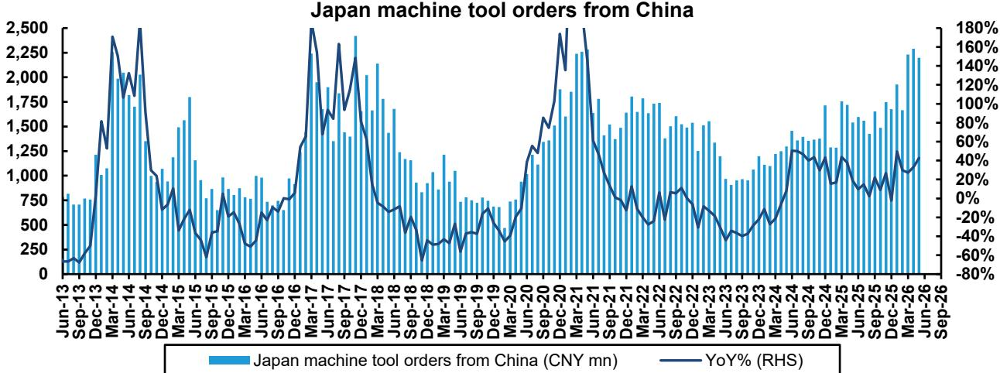
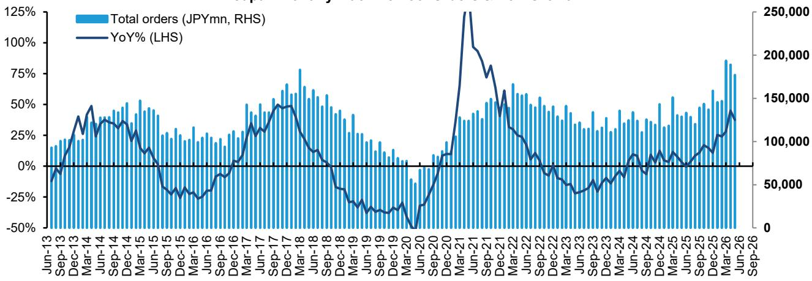
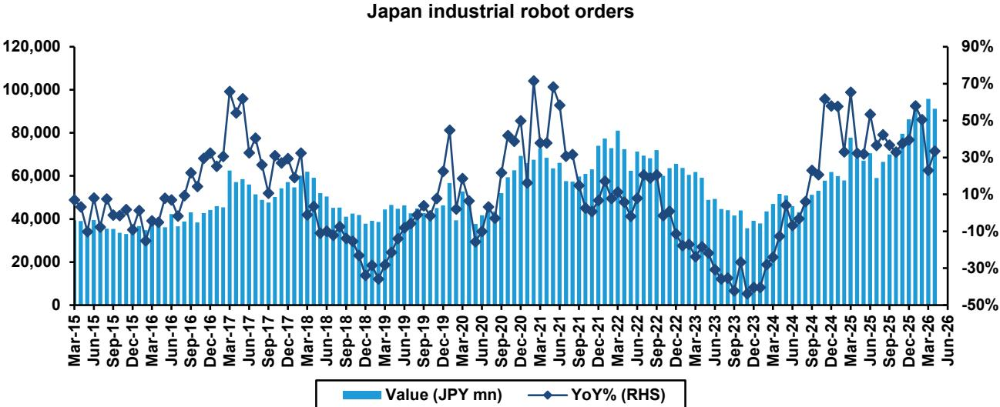

# The Asian Industrial Cycle Is Entering a Distinctive "Twin Peaks" Phase That Rewrites the Investment Playbook

The data from May and June 2026 tells a story that is far more interesting than a simple cyclical recovery. China's factory automation sector is not just rebounding; it is growing at near-peak rates, driven by a structural demand pulse that is increasingly decoupled from the broader macroeconomic slowdown in fixed asset investment. Meanwhile, the rest of the world is experiencing a more fragile, yet genuine, recovery punctuated by regional divergences. For investors accustomed to treating industrial tech as a simple global beta play, this moment demands a more nuanced framework.

The central argument is this: we are witnessing the formation of a "twin peaks" cycle in Asian industrial technology, particularly in China. The first peak, driven by post-pandemic restocking and export demand, has given way to a second, more structurally interesting peak, fueled by high-end manufacturing and electronics upgrading. This is not a replay of the 2021 cycle. It is a rotation from volume-driven demand to value-driven demand, and it has profound implications for which companies and sub-sectors will outperform.

The evidence is accumulating across multiple independent data streams. Japan's machine tool orders from China grew 42.7% year-on-year in May, accelerating from 33.2% in April. China's industrial profits grew 21.1% year-on-year in May, with the high-end manufacturing and electronics segments surging 44.7% and 103.9% respectively. The official manufacturing PMI for June returned to expansion at 50.3, with the high-tech and equipment manufacturing sub-indices reaching 53.5 and 52.5. These are not isolated data points; they form a coherent pattern that demands a strategic reassessment.

The critical question is not whether the cycle is real, but whether its composition has fundamentally changed. The data suggests it has, and the implications for portfolio construction are significant.

## The "Twin Peaks" Pattern in China Signals a Structural Shift, Not a Mere Cyclical Repeat

The most important chart in the entire report is the one showing Japan's machine tool orders from China. The data reveals a pattern that the analysts explicitly identify as a "twin peaks" formation, similar to previous cycles. But the similarity ends at the shape. The composition of this second peak is qualitatively different.

In previous cycles, the first peak was typically driven by broad-based capacity expansion across manufacturing sectors. The second peak, when it occurred, often reflected a last wave of catch-up investment before a downturn. This time, the second peak is being driven by a narrow but powerful set of forces: high-end manufacturing, electronics, and automation-intensive upgrading. The breakdown of Japan machine tool order growth by industry shows that the strength is "broad-based," but the real story is in the magnitude of the electronics contribution.

Consider the profit data. In the first five months of 2026, manufacturing sector profits grew 20.0% year-on-year, outpacing the overall industrial sector's 18.8% growth. But within manufacturing, the dispersion is extreme. High-end manufacturing grew 44.7%. Electronics grew 103.9%. These are not normal cyclical numbers. They suggest that a structural wave of investment in semiconductor equipment, advanced electronics manufacturing, and precision automation is underway, driven by both domestic upgrading and supply chain diversification.

The implication is clear: a passive, market-cap-weighted exposure to Asian industrial tech will capture the average, but the average is being pulled down by weaker segments like packaging machinery (-7.5% year-on-year in May) and general manufacturing. The active investor must tilt toward the structural winners.

## China's Manufacturing PMI Has Recovered, But the Real Signal Is in the Divergence Between Production and Investment

The headline manufacturing PMI for June returned to 50.3, with the production sub-index at 51.4 and, more importantly, the new orders sub-index returning to expansion at 51.2 after contracting in May. This is a positive signal. However, the real insight lies in the divergence between these soft indicators and the hard data on fixed asset investment.

Total fixed asset investment in China declined 4.1% year-to-date in May. Manufacturing FAI declined 0.4%. Even equipment purchase FAI, which had been a bright spot, slowed to 9.3% growth from 11.5% in April. On the surface, this looks like a contradiction: PMIs are expanding, but investment is slowing. The resolution to this puzzle is crucial for understanding the cycle.

The answer lies in capacity utilization. Manufacturing capacity utilization fell to 73.6% in the first quarter of 2026, down from 74.9% in the previous quarter. Companies are not investing in new plants because they have excess capacity. Instead, they are investing in upgrading existing facilities with higher-value automation equipment. This explains why Japan machine tool orders are surging while overall FAI is weak. It is a replacement and upgrading cycle, not a greenfield expansion cycle.

This has a direct "so what" for investors. Companies that sell into greenfield projects (construction equipment, basic machinery) will face headwinds. Companies that sell precision machine tools, industrial robots, and automation components into existing factories will benefit. The data confirms this: industrial robot production grew 27.9% year-on-year in May, accelerating from 15.1% in April. Metal-cutting machine tool production grew 10.7%. These are the beneficiaries of the upgrading cycle.

## The Global Recovery Is Real but Fragile, and the Divergence Between Regions Is a Key Risk Factor

Outside China, the industrial recovery is proceeding, but with notable fragility. Japan's machine tool orders grew 37.5% year-on-year in May, but declined 6.3% month-on-month. The sequential softening is not alarming by itself, but the regional breakdown reveals important fault lines.

North American machine tool orders grew only 4.2% year-on-year in May, down sharply from 16.2% in April. The report attributes this partly to weakness in automotive, a sector that is undergoing its own painful transition. European orders turned temporarily negative at -13.2% year-on-year, partly due to a high base effect from the previous year. Japan's domestic orders remained strong at 37.3% growth.

The global manufacturing PMIs remain in expansion territory across all major economies: the US at 55.7, Eurozone at 51.3, and Japan at 54.8. This provides a supportive backdrop. However, the divergence between the US and Europe is widening, and the fragility of the European recovery is a risk for Asian industrial exporters that rely on European demand.

The robot export data adds another layer of caution. Japan's robot export volume growth temporarily weakened to 9.1% year-on-year in May, down from 40.7% in April. The report attributes this to month-on-month fluctuations, which is plausible given that all major regions remained in positive growth territory. But the deceleration in China-bound robot exports to 5.7% growth is notable, especially given the strength of China's domestic robot production. This suggests that China's domestic automation industry is increasingly competing with Japanese imports.

For investors, the takeaway is that the global recovery is real but not synchronized. The US is strong, Japan is strong, Europe is questionable, and China is structurally upgrading. A global industrial tech portfolio must be positioned to benefit from this divergence, not assume uniform strength.

## The Report Leaves an Unanswered Question: How Much of China's Automation Boom Is Domestic Substitution vs. Genuine Demand Expansion?

This is the single most important unresolved analytical question in the report. The data shows that China's domestic industrial robot production grew 27.9% year-on-year in May, while Japan's robot exports to China grew only 5.7%. The gap is striking. It suggests that Chinese domestic automation suppliers are gaining market share rapidly.

But is this a zero-sum substitution, or is the total pie expanding? The answer determines whether the investment opportunity is in the global leaders or the domestic champions. The report provides data that supports both interpretations. On the one hand, China's high-end manufacturing and electronics profits are growing at extraordinary rates, suggesting genuine demand expansion. On the other hand, the capacity utilization data suggests that overall industrial capacity is not being added, which would imply substitution.

The report does not fully resolve this tension. It provides the data but leaves the interpretation to the reader. This is where a deeper dive into the original charts and sub-sector breakdowns would be invaluable. The full report likely contains the granularity needed to answer this question, but the summary alone leaves it open.

For investors, this means that a binary bet on "China automation" is too simplistic. The winners will be those companies that can navigate the substitution dynamic, whether by being the low-cost domestic supplier or the high-value global supplier that cannot be easily replaced. The report's data provides the raw material for this analysis, but the conclusion requires additional work.

## A Decision Framework for Navigating the Twin Peaks Cycle

Given the structural shift in the cycle, a static investment approach is inadequate. The following framework translates the report's insights into actionable strategic questions for portfolio construction.

First, distinguish between volume-driven and value-driven automation demand. Companies that benefit from volume growth (basic sensors, standard robots, commodity components) will face margin pressure as capacity utilization remains low. Companies that benefit from value-driven upgrading (precision machine tools, high-end servo motors, advanced vision systems) will see both volume and pricing power. The report's data on Japan machine tool orders versus robot exports is a proxy for this distinction.

Second, assess exposure to end-market concentration risk. The electronics sector is growing at over 100% profit growth, but this creates concentration risk. If the electronics cycle turns, the impact on automation demand will be severe. Diversification across high-end manufacturing, automotive (despite current weakness), and general industrial is essential.

Third, monitor the divergence between China and the rest of the world. The report shows that China is in a different phase of the cycle than North America or Europe. A portfolio that is overweight China automation must be prepared for the possibility that the rest of the world slows while China continues to upgrade, or vice versa. This argues for a barbell strategy: structural exposure to China's high-end upgrading plus tactical exposure to global recovery plays.

Fourth, pay attention to the lead-lag relationships within the data. Japan machine tool orders lead actual production by several months. China's PMI new orders lead production. The robot order data leads robot production. By mapping these lead-lag relationships, an investor can position ahead of the data rather than react to it.

## The Full Report Contains the Charts That Turn These Insights Into Investment Decisions

The analysis above is based on the summary data provided, but the real power of the original report lies in its charts. The momentum tracker table, the PMI trend lines, the Japan machine tool order breakdown by industry, and the profit growth decomposition by subsector are not just illustrations. They are the analytical tools that allow an investor to test the hypotheses presented here.

For example, the chart showing Japan machine tool order growth contribution by industry (Exhibit 18) would reveal exactly which end markets are driving the "twin peaks" pattern. The chart showing China's emerging industries PMI (Exhibit 5) would show whether the structural upgrading is broadening or narrowing. The chart showing Japan automation production and order data (Exhibits 45-46) would clarify whether the temporary weakness in robot exports is noise or signal.

These are the details that separate a good investment thesis from a great one. The summary provides the framework. The full report provides the evidence.

Join the community to read the full report and review the original charts.

*This article is for learning and discussion only and does not constitute investment advice.*

Personal reading notes and learning share only. Not investment advice.

