# Americas Technology: Hardware: Data center & campus networking preview

We update our industry networking model to reflect the latest C1Q26 data from 650 Group. 650 Group upgraded its outlook for the AI Ethernet data center switching market, where spending should reach \~\$89 bn in 2030, growing at a 61% 2025-30 CAGR with stronger demand across all customer verticals (hyperscalers, tier 2 cloud, and enterprise). We view the outlook for increased networking spend as a result of the growing complexity of AI data center builds which should require greater networking attach to support high-performance, low-latency data traffic flows. Within the campus market: (1) WLAN (indoor + cloud)'s 2026-2030 outlook was raised by \~10% on average (now expecting \~\$13.4 bn in 2030, growing at a \~7% 5-yr CAGR v. \~\$10.6 bn prior), primarily driven by higher WiFi 7 estimates (+13% on average across 2026-2030); (2) Enterprise switching estimates grew by \~3% on average to reach \~\$28 bn by 2030 (v. \$27 bn prior). We view upgraded campus spending outlooks as a result of (a) continued need for network modernization to support greater network data traffic flows, as well as (b) partial impact of memory price increases (for campus switches). We highlight market share shifts by equipment market below.

Set up into C2Q26 earnings: Across our networking coverage, we believe ANET & CLS are well set up into earnings. Quarter-to-date, CLS (+26% in C2Q26) and ANET (+36% in C2Q26) underperformed the rest of our networking coverage (CSCO +51%, HPE +88%, FFIV +41%). We believe the relative underperformance of these two companies may be in part due to supply chain constraints on switching silicon that limits near-term revenue upside to guidance. However, we believe demand for AI Ethernet data center networking switches, for which spending by hyperscalers (their largest customers) should grow by \~10X by 2030 (Exhibit 1), should be non-perishable and further benefit 2028/29 growth. For HPE, we remain constructive on the positive synergies in HPE's campus portfolio with stable market share in WLAN and campus switching in the 3 quarters post acquisition of Juniper, and continue to see upside to F2027 networking outlook (+8-12% revenue growth) on strong industry trends in data center switching & DCI.

Michael Ng, CFA +1(212)902-8618 | michael.ng@gs.com GS & Co. LLC

Zorayda Montemayor +1(212)357-6403 | zorayda.montemayor@gs.com GS & Co. LLC

Katherine Murphy  
+1(212)902-1151 |  
katherine.a.murphy@gs.com  
GS & Co. LLC

## Data center networking forecast updates

Exhibit 1: Global data center switching spend is expected to grow robustly, quadrupling by 2030 (relative to 2025) Global data center switching spend by vertical and AI/traditional (\$, mn)

<table><tr><td rowspan="2">($, mn)</td><td colspan="3">AI Data Center Switching*</td></tr><tr><td>2025</td><td>2030</td><td>5-yr CAGR</td></tr><tr><td>Hyperscalers</td><td>$4,948</td><td>$52,717</td><td>61%</td></tr><tr><td>Tier 2 Cloud + SP</td><td>$2,606</td><td>$28,249</td><td>61%</td></tr><tr><td>Enterprise</td><td>$553</td><td>$7,933</td><td>70%</td></tr><tr><td>Total AI Data Center</td><td>$8,107</td><td>$88,899</td><td>61%</td></tr></table>

<table><tr><td rowspan="2"></td><td colspan="3">Traditional Data Center Switching</td></tr><tr><td>2025</td><td>2030</td><td>5-yr CAGR</td></tr><tr><td>Hyperscalers</td><td>$7,708</td><td>$7,573</td><td>0%</td></tr><tr><td>Tier 2 Cloud + SP</td><td>$7,013</td><td>$18,497</td><td>21%</td></tr><tr><td>Enterprise</td><td>$8,960</td><td>$9,570</td><td>1%</td></tr><tr><td>Total Traditional Data Center</td><td>$23,682</td><td>$35,640</td><td>9%</td></tr></table>

<table><tr><td rowspan="2"></td><td colspan="3">Total Data Center Switching*</td></tr><tr><td>2025</td><td>2030</td><td>5-yr CAGR</td></tr><tr><td>Hyperscalers</td><td>$12,656</td><td>$60,289</td><td>37%</td></tr><tr><td>Tier 2 Cloud + SP</td><td>$9,619</td><td>$46,746</td><td>37%</td></tr><tr><td>Enterprise</td><td>$9,514</td><td>$17,503</td><td>13%</td></tr><tr><td>Total Data Center</td><td>$31,788</td><td>$124,538</td><td>31%</td></tr></table>

\*Includes Ethernet (frontend, backend) switches  
Source: 650 Group

Exhibit 2: 650 Group's AI data center switching 2026-2030 outlook was raised by $9 \%$ on average annually Industry AI data center switching estimate revisions, ( $, mn$ )  
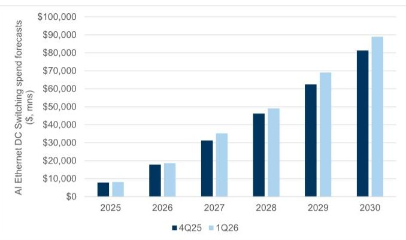  
Only includes AI Ethernet Front-end & Back-end switching

Exhibit 3: The outlook for the rest of the data center switching market (excluding AI Ethernet) was revised upwards by 9% on average as well for 2026-2030 Non-AI Ethernet DC switching estimate revisions (\$, mn)  
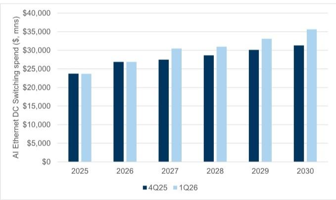  
Source: 650 Group  
Excludes AI Ethernet front end & back end switching

Source: 650 Group

Exhibit 4: Celestica and Nvidia lead the back-end AI Ethernet networking market, with Arista closely following Backend AI Ethernet networking revenue market share (%)  
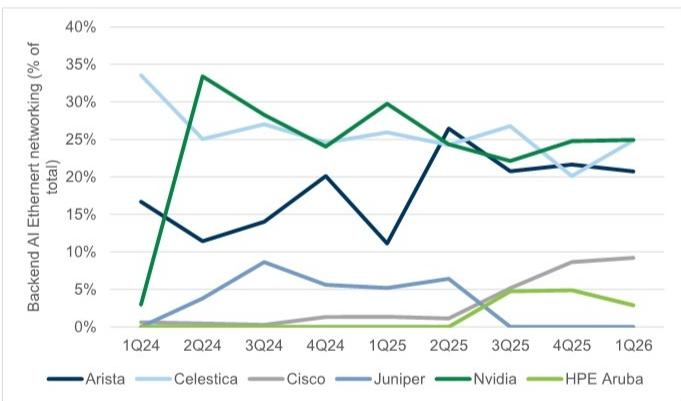  
Source: 650 Group

Exhibit 5: Celestica and Arista lead the front-end networking market with $30\%+$ share, though Cisco has gained 12pp of share over the past 3 quarters Front-end AI Ethernet networking revenue market share (\% of total)

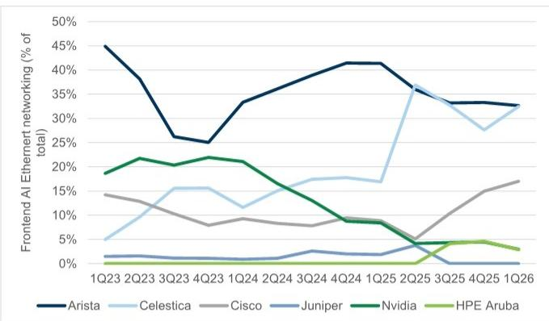  
Source: 650 Group

Exhibit 6: 800G should comprise \~80% of total AI DC Ethernet Switching revenue in 2026, before 1.6T begins to meaningfully ramp in 2027
Share of AI Ethernet data center switching revenue (%) by port speed  
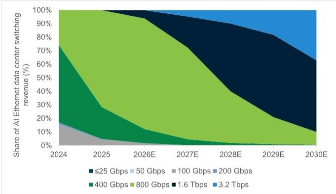  
Source: 650 Group  
Share of 800G switching revenue (%)

Exhibit 7: Celestica continues to lead the 800G switching market, though Arista and Nvidia have gained share over the past year

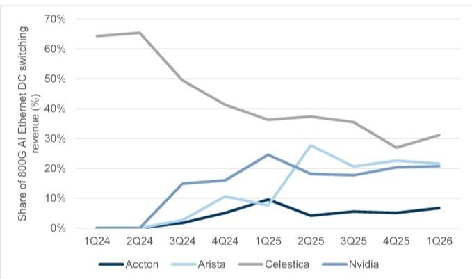  
Source: 650 Group

Exhibit 8: DCI spending growth, nearly a $100\%$ 5-yr CAGR through 2030, should be roughly evenly distributed across switching and routing  
DCI revenue by switching vs routing  
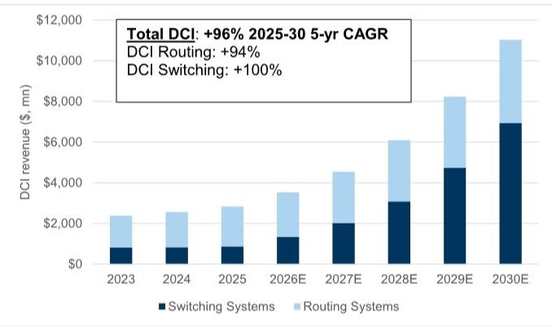  
Exhibit 9: Arista strongly leads the overall DCI switching market  
Source: 650 Group

DCI switching market revenue share by vendor $(\%)$  
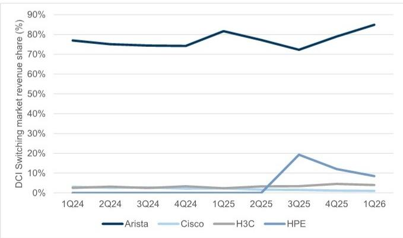  
Source: 650 Group

Exhibit 10: Cisco & HPE closely lead the DCI routing market with 39% and 36% of market revenue respectively
DCI revenue market share (%)  
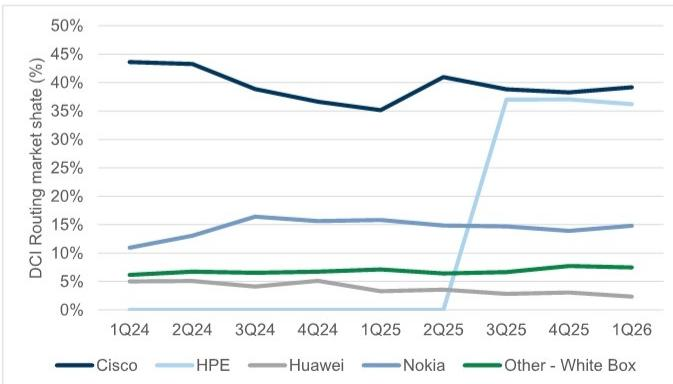  
Source: 650 Group

Exhibit 11: The overall scale-up switching market should grow from \~\$7 bn in 2025 to \~\$100 bn in 2030, with Ethernet growing to make up \~20% of industry revenues
Scale up switching market revenue (\$, mn)  
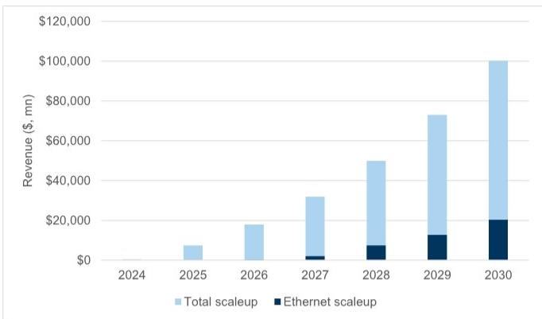  
Source: 650 Group  
Exhibit 13: Cloud data center equipment capital expenditures are expected to grow at a 33% 2025-2030 CAGR to \~\$3.2 trillion in 2030, in-line with total cloud provider capex growing at a 34% 5-year CAGR over the same period  
Cloud capital expenditures over time (\$, bn)

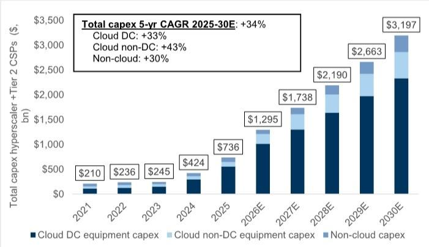  
Source: 650 Group  
Exhibit 12: 2026-2030 forecasts for cloud data center equipment capital expenditures were raised by \~28% on average relative to forecasts from 4Q25
Cloud DC equipment capital expenditures (\$, mn)

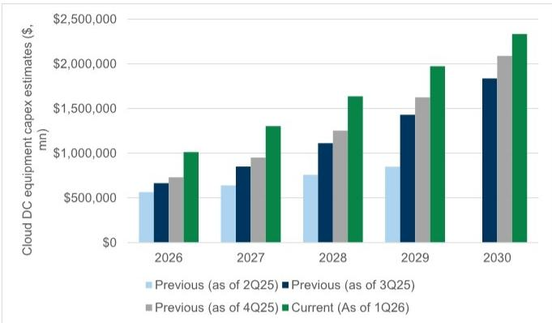  
Source: 650 Group, Data compiled by GS Global Investment Research

## Campus networking forecast updates

Exhibit 14: The enterprise switching market should grow 7% year-over-year in 2026, in-line its 7% 5-yr 2025-30 CAGR

Enterprise switching revenue (\$, mn) & year-over-year change (%)

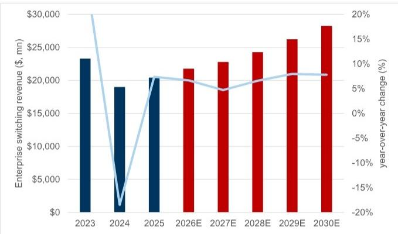  
Source: 659 Group, Data compiled by GS Global Investment Research  
Exhibit 15: Cisco continues to dominate the enterprise switching market Enterprise switching market share by vendor (%)

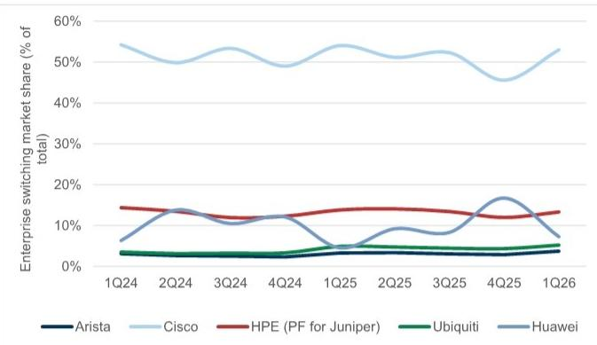  
Source: 650 Group, Data compiled by GS Global Investment Research

Exhibit 16: The enterprise WLAN (indoor & cloud) market should grow 11% year-over-year in 2026, though should decelerate to MSD% annual growth thereafter
WLAN market revenue (\$, mn) & year-over-year change (%)  
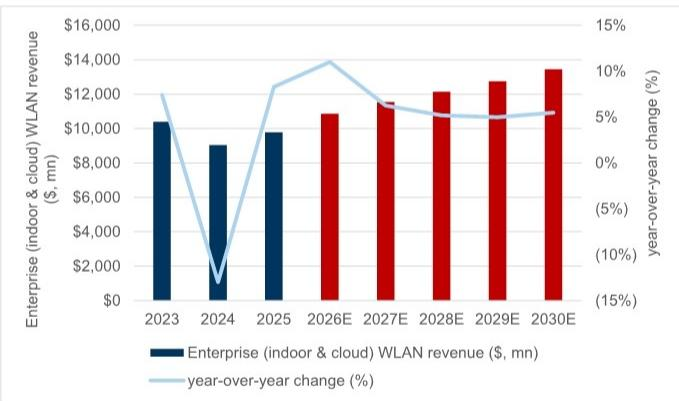  
Source: 650 Group, Data compiled by GS Global Investment Research  
Exhibit 17: Cisco leads the Enterprise WLAN (indoor & cloud) market at $36\%$ , followed by HPE Aruba at $20\%$ , Huawei $(13\%)$ , and Ubiquiti $(8\%)$ WLAN (indoor + cloud) market share by vendor $(\%)$

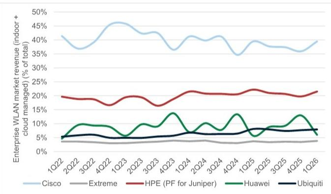  
Source: 650 Group, Data compiled by GS Global Investment Research

Exhibit 18: Wi-Fi 7 grew its share of the total Enterprise WLAN market (including cloud) to 39% of total market revenue in 1Q26 and should grow its share towards \~60-70% by 4Q26-1Q27
Enterprise WLAN revenue by infrastructure type (\$, mn)  
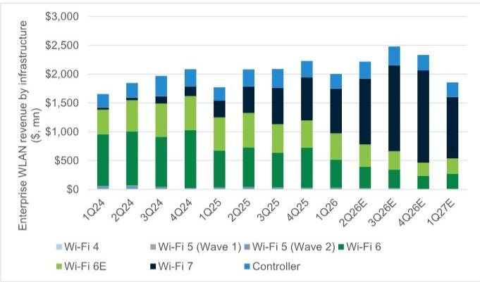  
Source: 650 Group, Data compiled by GS Global Investment Research

Exhibit 19: Within the WiFi 7 market, Cisco was the biggest sequential share gainer in 1Q26 (+6 pp to 31% share), followed by HPE which gained \~2 pp share (18%)
Wi-Fi 7 revenue by vendor (\$, mn)  
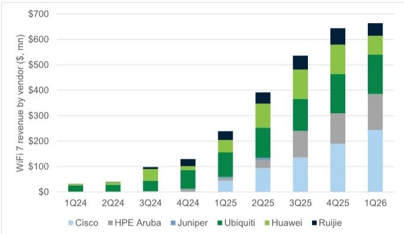  
Includes select vendors  
Source: 650 Group, Data compiled by GS Global Investment Research

## Historical stock performance around earnings

Exhibit 20: Across our networking coverage, all companies outperformed SPX  
C2Q26 stock performance  
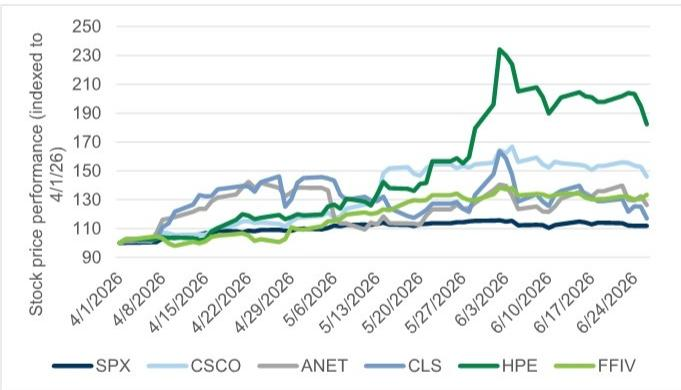  
Source: FactSet

Exhibit 21: With CLS most deviated from its 1Y average P/E (NTM) multiple  
P/E (NTM) multiples across networking companies  
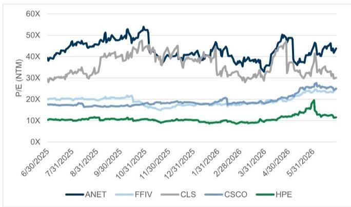  
Source: FactSet

Exhibit 22: Across our networking coverage, ANET has the strongest historical average performance in the two weeks leading up to earnings (but flat performance day of) while HPE has the strongest performance on the day following earnings (but worst average performance leading up to the print)  
Historical stock performance around earnings

<table><tr><td></td><td colspan="3">Performance</td></tr><tr><td>CSCO</td><td>2 wks prior</td><td>Earnings</td><td>2 wks after</td></tr><tr><td>F3Q26</td><td>(14.9%)</td><td>13.4%</td><td>(12.1%)</td></tr><tr><td>F2Q26</td><td>8.1%</td><td>(12.3%)</td><td>(7.7%)</td></tr><tr><td>F1Q26</td><td>(2.8%)</td><td>4.6%</td><td>(3.6%)</td></tr><tr><td>F4Q25</td><td>2.9%</td><td>(1.6%)</td><td>(3.0%)</td></tr><tr><td>Average</td><td>(1.7%)</td><td>1.0%</td><td>(6.6%)</td></tr><tr><td>ANET</td><td>2 wks prior</td><td>Earnings</td><td>2 wks after</td></tr><tr><td>C1Q26</td><td>20.2%</td><td>(13.6%)</td><td>1.6%</td></tr><tr><td>C4Q25</td><td>3.7%</td><td>4.8%</td><td>9.6%</td></tr><tr><td>C3Q25</td><td>24.4%</td><td>(8.6%)</td><td>(5.0%)</td></tr><tr><td>C2Q25</td><td>(11.0%)</td><td>17.5%</td><td>(7.1%)</td></tr><tr><td>Average</td><td>9.3%</td><td>0.0%</td><td>(0.2%)</td></tr><tr><td>CLS</td><td>2 wks prior</td><td>Earnings</td><td>2 wks after</td></tr><tr><td>C1Q26</td><td>10.8%</td><td>(14.4%)</td><td>(13.4%)</td></tr><tr><td>C4Q25</td><td>16.8%</td><td>(13.1%)</td><td>(10.2%)</td></tr><tr><td>C3Q25</td><td>(12.4%)</td><td>8.2%</td><td>(13.5%)</td></tr><tr><td>C2Q25</td><td>(15.3%)</td><td>16.5%</td><td>(6.4%)</td></tr><tr><td>Average</td><td>(0.0%)</td><td>(0.7%)</td><td>(10.9%)</td></tr><tr><td>HPE</td><td>2 wks prior</td><td>Earnings</td><td>2 wks after</td></tr><tr><td>F2Q26</td><td>(4.1%)</td><td>19.5%</td><td>(29.8%)</td></tr><tr><td>F1Q26</td><td>(2.3%)</td><td>(3.3%)</td><td>(8.3%)</td></tr><tr><td>F4Q25</td><td>(4.3%)</td><td>1.9%</td><td>(12.6%)</td></tr><tr><td>F3Q25</td><td>(7.7%)</td><td>1.5%</td><td>(7.8%)</td></tr><tr><td>Average</td><td>(4.6%)</td><td>4.9%</td><td>(14.6%)</td></tr><tr><td>FFIV</td><td>2 wks prior</td><td>Earnings</td><td>2 wks after</td></tr><tr><td>C1Q26</td><td>(0.3%)</td><td>3.4%</td><td>(4.0%)</td></tr><tr><td>C4Q25</td><td>(1.5%)</td><td>0.3%</td><td>(5.5%)</td></tr><tr><td>C3Q25</td><td>(6.1%)</td><td>2.0%</td><td>(7.2%)</td></tr><tr><td>C2Q25</td><td>(4.6%)</td><td>1.7%</td><td>2.2%</td></tr><tr><td>Average</td><td>(3.1%)</td><td>1.8%</td><td>(3.6%)</td></tr></table>

2 weeks prior & after refers to 10 workdays before and after the earnings print  
Source: FactSet

## Rating, price target, valuation, and key risks

## Arista Networks Inc (ANET, Buy)

We are Buy-rated on ANET with a 12-month target price of \$196 (unchanged) based on 36X (unchanged) our NTM+1Y EPS.

Key downside risks include slower cloud capex spending; customer concentration, with META and MSFT representing 16% and 26% of total revenue in 2025 respectively; competition, including from Cisco, major Chinese providers Huawei & H3C and whitebox switching solutions; margin degradation from investment in enterprise sales force, elevated costs associated with supply chain headwinds; broader pricing pressure from commoditization of networking hardware; inability to execute on enterprise/campus strategy & development of new SD-WAN platform.

## Cisco Systems, Inc (CSCO, Neutral)

We are Neutral-rated on CSCO with a 12-month target price of \$125 (unchanged) based on 25x (unchanged) our NTM+1Y (Q5-Q8) EPS.

Key upside risks include secular tailwinds including hybrid work, multi-cloud network architecture adoption, broader roll-out of WiFi 6/6E and 5G, increasing edge compute use cases; New disaggregated consumption models to target previously underserved cloud providers, near-term revenue visibility from elevated backlog; downside risks include competition, including from major Chinese providers Huawei & H3C and White Box solutions; margin degradation from mix shift into more cloud customers, elevated costs associated with supply chain headwinds; broader pricing pressure from commoditization of networking hardware; dilutive acquisitions.

## Hewlett Packard Enterprise Co. (HPE, Buy)

We are Buy rated on HPE with a 12-month target price of \$79 (unchanged) based on 18x (unchanged) our NTM+1Y EPS.

Key risks: (-) Lower-than-expected corporate IT spending and data center capex could result in worse-than-expected hardware sales; (-) Competition from white box manufacturers could result in cannibalization in HPE's server market share; (-) Market share loss from customer churn during Juniper integration; (-) Component costs could be higher than expected, resulting in worse gross margins; (-) Corporate actions from strategic investors; (-) Failure to deliver market share gains in storage driven by a strategy shift towards selling more owned-IP storage products that carry higher gross margins; (-) Worse-than-expected demand for enterprise and sovereign AI data center infrastructure.

## Celestica Inc (CLS, Buy)

We are Buy rated on CLS with a 12-month target price of \$475 (unchanged), reflecting 28X (unchanged) our NTM+1Y EPS.

Key downside risks include: (-) continued competition from branded data center equipment OEMs and ODMs, which could pressure market share; (-) AI server market competitive intensity, which can pressure AI server margins; (-) high customer concentration could cause revenue volatility; (-) potential declines in data center investment demand; (-) reductions in CLS's ability to win higher margin design-deals, which could limit CLS' ability to grow EBIAT margins over time; and (-) volatility in end-market demand within CLS' ATS segment.

## Disclosure Appendix

## Reg AC

I, Michael Ng, CFA, hereby certify that all of the views expressed in this report accurately reflect my personal views about the subject company or companies and its or their securities. I also certify that no part of my compensation was, is or will be, directly or indirectly, related to the specific recommendations or views expressed in this report.

Unless otherwise stated, the individuals listed on the cover page of this report are analysts in GS' Global Investment Research division.

Contributing Authors: Michael Ng, CFA GS & Co. LLC, Zorayda Montemayor GS & Co. LLC, Katherine Murphy GS & Co. LLC.

Unless otherwise stated, the individuals listed in the Contributing Authors disclosure of this report are analysts in GS' Global Investment Research division.

## GS Factor Profile

The GS Factor Profile provides investment context for a stock by comparing key attributes to the market (i.e. our universe of rated stocks) and its sector peers. The four key attributes depicted are: Growth, Financial Returns, Multiple (e.g. valuation) and Integrated (a composite of Growth, Financial Returns and Multiple). Growth, Financial Returns and Multiple are calculated by using normalized ranks for specific metrics for each stock. The normalized ranks for the metrics are then averaged and converted into percentiles for the relevant attribute. The precise calculation of each metric may vary depending on the fiscal year, industry and region, but the standard approach is as follows:

Growth is based on a stock's forward-looking sales growth, EBITDA growth and EPS growth (for financial stocks, only EPS and sales growth), with a higher percentile indicating a higher growth company. Financial Returns is based on a stock's forward-looking ROE, ROCE and CROCI (for financial stocks, only ROE), with a higher percentile indicating a company with higher financial returns. Multiple is based on a stock's forward-looking P/E, P/B, price/dividend (P/D), EV/EBITDA, EV/FCF and EV/Debt Adjusted Cash Flow (DACF) (for financial stocks, only P/E, P/B and P/D), with a higher percentile indicating a stock trading at a higher multiple. The Integrated percentile is calculated as the average of the Growth percentile, Financial Returns percentile and (100% - Multiple percentile).

Financial Returns and Multiple use the GS analyst forecasts at the fiscal year-end at least three quarters in the future. Growth uses inputs for the fiscal year at least seven quarters in the future compared with the year at least three quarters in the future (on a per-share basis for all metrics).

For a more detailed description of how we calculate the GS Factor Profile, please contact your GS representative.

## M&A Rank

Across our global coverage, we examine stocks using an M&A framework, considering both qualitative factors and quantitative factors (which may vary across sectors and regions) to incorporate the potential that certain companies could be acquired. We then assign a M&A rank as a means of scoring companies under our rated coverage from 1 to 3, with 1 representing high (30%-50%) probability of the company becoming an acquisition target, 2 representing medium (15%-30%) probability and 3 representing low (0%-15%) probability. For companies ranked 1 or 2, in line with our standard departmental guidelines we incorporate an M&A component into our target price. M&A rank of 3 is considered immaterial and therefore does not factor into our price target, and may or may not be discussed in research.

## Quantum

Quantum is GS' proprietary database providing access to detailed financial statement histories, forecasts and ratios. It can be used for in-depth analysis of a single company, or to make comparisons between companies in different sectors and markets.

## Disclosures

## Rating and pricing information

Arista Networks Inc. (Buy, \$169.88), Celestica Inc. (Buy, \$364.80), Cisco Systems Inc. (Neutral, \$117.46), F5 Inc. (Neutral, \$415.96) and Hewlett Packard Enterprise Co. (Buy, \$45.11).

## The rating(s) for Arista Networks Inc., Celestica Inc., Cisco Systems Inc. and Hewlett Packard Enterprise Co. is/are relative to the other

companies in its/their coverage universe: AT&T Inc., American Tower Corp., Apple Inc., Arista Networks Inc., Axon Enterprise Inc., Blend Labs, Celestica Inc., Charter Communications Inc., Cisco Systems Inc., Cogent Communications Holdings, Comcast Corp., Compass Inc., Crown Castle Inc., Dell Technologies Inc., Digital Realty Trust Inc., Equinix Inc., F5 Inc., HP Inc., Hewlett Packard Enterprise Co., IREN Ltd., Ingram Micro, Lumen Technologies Inc., NetApp Inc., Opendoor Technologies Inc., Optimum Communications Inc., Penguin Solutions Inc., SBA Communications Corp., Stagwell Inc., Super Micro Computer Inc., T-Mobile US Inc., TD SYNNEX Corp., Verizon Communications, Versant Media Group, Walt Disney Co., Zillow Group

## Company-specific regulatory disclosures

The following disclosures relate to relationships between The GS Group, Inc. (with its affiliates, “GS”) and companies covered by GS Global Investment Research and referred to in this research.

GS beneficially owned 1% or more of common equity (excluding positions managed by affiliates and business units not required to be aggregated under US securities law) as of the second most recent month end: Hewlett Packard Enterprise Co. (\$45.11)

GS has received compensation for investment banking services in the past 12 months: Cisco Systems Inc. (\$117.46) and Hewlett Packard Enterprise Co. (\$45.11)

GS expects to receive or intends to seek compensation for investment banking services in the next 3 months: Arista Networks Inc. (\$169.88), Celestica Inc. (\$364.80), Cisco Systems Inc. (\$117.46) and Hewlett Packard Enterprise Co. (\$45.11)

GS has received compensation for non-investment banking services during the past 12 months: Cisco Systems Inc. (\$117.46) and Hewlett Packard Enterprise Co. (\$45.11)

GS had an investment banking services client relationship during the past 12 months with: Arista Networks Inc. (\$169.88), Celestica Inc. (\$364.80), Cisco Systems Inc. (\$117.46) and Hewlett Packard Enterprise Co. (\$45.11)

GS had a non-investment banking securities-related services client relationship during the past 12 months with: Celestica Inc. (\$364.80), Cisco Systems Inc. (\$117.46) and Hewlett Packard Enterprise Co. (\$45.11)

<table><tr><td>Date of report</td><td>Target price ($)</td><td>Closing price ($)</td><td>Date of report</td><td>Target price ($)</td><td>Closing price ($)</td></tr><tr><td>02-Jun-26</td><td>79.00</td><td>56.15</td><td>03-Jun-26</td><td>125.00</td><td>126.50</td></tr><tr><td>29-Apr-26</td><td>32.00</td><td>28.30</td><td>14-May-26</td><td>116.00</td><td>115.53</td></tr><tr><td>15-Apr-26</td><td>30.00</td><td>24.62</td><td>13-Nov-25</td><td>75.00</td><td>77.38</td></tr><tr><td>10-Mar-26</td><td>29.00</td><td>21.10</td><td>14-Aug-25</td><td>71.00</td><td>69.30</td></tr><tr><td>13-Jan-26</td><td>31.00</td><td>22.29</td><td>13-Jun-25</td><td>67.00</td><td>64.09</td></tr><tr><td>05-Dec-25</td><td>28.00</td><td>23.33</td><td>13-Feb-25</td><td>63.00</td><td>63.84</td></tr></table>

GS had a non-securities services client relationship during the past 12 months with: Cisco Systems Inc. (\$117.46) and Hewlett Packard Enterprise Co. (\$45.11)

GS has managed or co-managed a public or Rule 144A offering in the past 12 months: Hewlett Packard Enterprise Co. (\$45.11)

GS makes a market in the securities or derivatives thereof: Arista Networks Inc. (\$169.88), Celestica Inc. (\$364.80), Cisco Systems Inc. (\$117.46) and Hewlett Packard Enterprise Co. (\$45.11)

## Distribution of ratings/investment banking relationships

GS Investment Research global Equity coverage universe

<table><tr><td rowspan="2"></td><td colspan="3">Rating Distribution</td><td colspan="3">Investment Banking Relationships</td></tr><tr><td>Buy</td><td>Hold</td><td>Sell</td><td>Buy</td><td>Hold</td><td>Sell</td></tr><tr><td>Global</td><td>50%</td><td>34%</td><td>16%</td><td>65%</td><td>60%</td><td>45%</td></tr></table>

As of April 1, 2026, GS Global Investment Research had investment ratings on 3,074 equity securities. GS assigns stocks as Buys and Sells on various regional Investment Lists; stocks not so assigned are deemed Neutral. Such assignments equate to Buy, Hold and Sell for the purposes of the above disclosure required by the FINRA Rules. See ‘Ratings, Coverage universe and related definitions’ below. The Investment Banking Relationships chart reflects the percentage of subject companies within each rating category for whom GS has provided investment banking services within the previous twelve months.

## Price target and rating history chart(s)

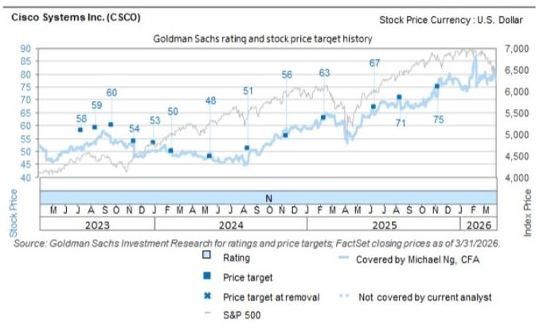  
The price targets shown should be considered in the context of all prior published GS, which may or may not have included price targets, as well as developments relating to the company, its industry and financial markets.

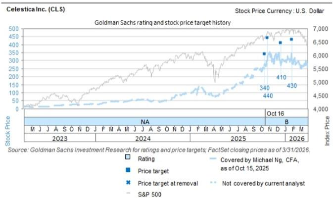  
The price targets shown should be considered in the context of all prior published GS, which may or may not have included price targets, as well as developments relating to the company, its industry and financial markets.

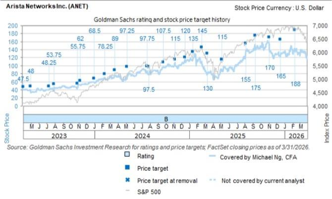  
The price targets shown should be considered in the context of all prior published GS, which may or may not have included price targets, as well as developments relating to the company, its industry and financial markets.

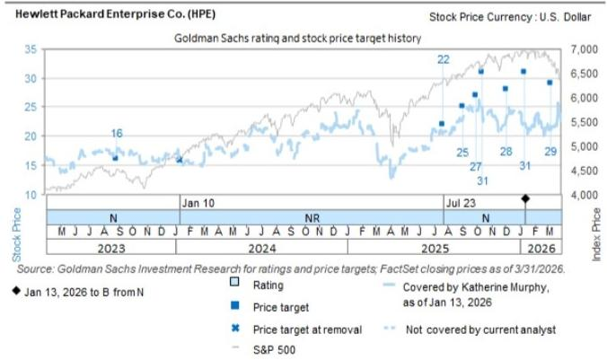  
The price targets shown should be considered in the context of all prior published GS, which may or may not have included price targets, as well as developments relating to the company, its industry and financial markets.

## Target price history table(s)

Hewlett Packard Enterprise Co. (HPE)

Cisco Systems Inc. (CSCO)

Hewlett Packard Enterprise Co. (HPE)

<table><tr><td>Date of report</td><td>Target price ($)</td><td>Closing price ($)</td></tr><tr><td>16-Oct-25</td><td>31.00</td><td>22.50</td></tr><tr><td>01-Oct-25</td><td>27.00</td><td>24.93</td></tr><tr><td>04-Sep-25</td><td>25.00</td><td>23.16</td></tr><tr><td>23-Jul-25</td><td>22.00</td><td>20.76</td></tr><tr><td>30-Aug-23</td><td>16.00</td><td>17.36</td></tr></table>

<table><tr><td colspan="3">Cisco Systems Inc. (CSCO)</td></tr><tr><td>Date of report</td><td>Target price ($)</td><td>Closing price ($)</td></tr><tr><td>14-Nov-24</td><td>56.00</td><td>57.92</td></tr><tr><td>15-Aug-24</td><td>51.00</td><td>48.53</td></tr><tr><td>16-May-24</td><td>48.00</td><td>48.34</td></tr><tr><td>15-Feb-24</td><td>50.00</td><td>49.06</td></tr><tr><td>02-Jan-24</td><td>53.00</td><td>50.51</td></tr><tr><td>16-Nov-23</td><td>54.00</td><td>48.04</td></tr><tr><td>22-Sep-23</td><td>60.00</td><td>53.57</td></tr><tr><td>17-Aug-23</td><td>59.00</td><td>54.73</td></tr><tr><td>11-Jul-23</td><td>58.00</td><td>52.12</td></tr></table>

Arista Networks Inc. (ANET)

<table><tr><td>Date of report</td><td>Target price ($)</td><td>Closing price ($)</td></tr><tr><td>06-May-26</td><td>196.00</td><td>147.06</td></tr><tr><td>13-Feb-26</td><td>188.00</td><td>141.59</td></tr><tr><td>18-Dec-25</td><td>165.00</td><td>124.62</td></tr><tr><td>05-Nov-25</td><td>170.00</td><td>140.42</td></tr><tr><td>12-Sep-25</td><td>175.00</td><td>139.39</td></tr><tr><td>06-Aug-25</td><td>155.00</td><td>138.78</td></tr><tr><td>07-May-25</td><td>115.00</td><td>86.45</td></tr><tr><td>13-Mar-25</td><td>130.00</td><td>80.14</td></tr><tr><td>19-Feb-25</td><td>145.00</td><td>103.92</td></tr><tr><td>16-Jan-25</td><td>135.00</td><td>118.13</td></tr><tr><td>17-Dec-24</td><td>120.00</td><td>112.95</td></tr><tr><td>08-Nov-24</td><td>460.00</td><td>100.11</td></tr><tr><td>23-Sep-24</td><td>430.00</td><td>96.39</td></tr><tr><td>31-Jul-24</td><td>390.00</td><td>86.64</td></tr><tr><td>24-Jul-24</td><td>391.00</td><td>81.47</td></tr><tr><td>08-May-24</td><td>389.00</td><td>72.92</td></tr><tr><td>21-Mar-24</td><td>356.00</td><td>76.15</td></tr><tr><td>13-Feb-24</td><td>313.00</td><td>66.38</td></tr><tr><td>02-Jan-24</td><td>274.00</td><td>57.89</td></tr><tr><td>10-Nov-23</td><td>248.00</td><td>51.71</td></tr><tr><td>31-Oct-23</td><td>223.00</td><td>50.09</td></tr><tr><td>01-Aug-23</td><td>215.00</td><td>46.40</td></tr><tr><td>11-Jul-23</td><td>193.00</td><td>40.04</td></tr></table>

Celestica Inc. (CLS)

<table><tr><td>Date of report</td><td>Target price ($)</td><td>Closing price ($)</td></tr><tr><td>28-Apr-26</td><td>475.00</td><td>361.54</td></tr><tr><td>29-Jan-26</td><td>430.00</td><td>300.00</td></tr><tr><td>18-Dec-25</td><td>410.00</td><td>270.92</td></tr><tr><td>29-Oct-25</td><td>440.00</td><td>337.77</td></tr><tr><td>16-Oct-25</td><td>340.00</td><td>279.86</td></tr></table>

Price targets shown in table(s) are unadjusted for corporate actions.

## Regulatory disclosures

## Disclosures required by United States laws and regulations

See company-specific regulatory disclosures above for any of the following disclosures required as to companies referred to in this report: manager or co-manager in a pending transaction; 1% or other ownership; compensation for certain services; types of client relationships; managed/co-managed public offerings in prior periods; directorships; for equity securities, market making and/or specialist role. GS trades or may trade as a principal in debt securities (or in related derivatives) of issuers discussed in this report.

The following are additional required disclosures: Ownership and material conflicts of interest: GS policy prohibits its analysts, professionals reporting to analysts and members of their households from owning securities of any company in the analyst's area of coverage. Analyst compensation: Analysts are paid in part based on the profitability of GS, which includes investment banking revenues. Analyst as officer or director: GS policy generally prohibits its analysts, persons reporting to analysts or members of their households from serving as an officer, director or advisor of any company in the analyst's area of coverage. Non-U.S. Analysts: Non-U.S. analysts may not be associated persons of GS & Co. LLC and therefore may not be subject to FINRA Rule 2241 or FINRA Rule 2242 restrictions on communications with a subject company, public appearances and trading in securities covered by the analysts.

Additional disclosures required under the laws and regulations of jurisdictions other than the United States

The following disclosures are those required by the jurisdiction indicated, except to the extent already made above pursuant to United States laws and regulations. Australia: GS Australia Pty Ltd and its affiliates are not authorised deposit-taking institutions (as that term is defined in the Banking Act 1959 (Cth)) in Australia and do not provide banking services, nor carry on a banking business, in Australia. This research, and any access to it, is intended only for “wholesale clients” within the meaning of the Australian Corporations Act, unless otherwise agreed by GS. In producing research reports, members of Global Investment Research of GS Australia may attend site visits and other meetings hosted by the companies and other entities which are the subject of its research reports. In some instances the costs of such site visits or meetings may be met in part or in whole by the issuers concerned if GS Australia considers it is appropriate and reasonable in the specific circumstances relating to the site visit or meeting. To the extent that the contents of this document contains any financial product advice, it is general advice only and has been prepared by GS without taking into account a client’s objectives, financial situation or needs. A client should, before acting on any such advice, consider the appropriateness of the advice having regard to the client’s own objectives, financial situation and needs. A copy of certain

GS Australia and New Zealand disclosure of interests and a copy of GS' Australian Sell-Side Research Independence Policy Statement are available at: https://www.goldmansachs.com/disclosures/australia-new-zealand/index.html. Brazil: Disclosure information in relation to CVM Resolution n. 20 is available at https://www.gs.com/worldwide/brazil/area/gir/index.html. Where applicable, the Brazil-registered analyst primarily responsible for the content of this research report, as defined in Article 20 of CVM Resolution n. 20, is the first author named at the beginning of this report, unless indicated otherwise at the end of the text. Canada: This information is being provided to you for information purposes only and is not, and under no circumstances should be construed as, an advertisement, offering or solicitation by GS & Co. LLC for purchasers of securities in Canada to trade in any Canadian security. GS & Co. LLC is not registered as a dealer in any jurisdiction in Canada under applicable Canadian securities laws and generally is not permitted to trade in Canadian securities and may be prohibited from selling certain securities and products in certain jurisdictions in Canada. If you wish to trade in any Canadian securities or other products in Canada please contact GS Canada Inc., an affiliate of The GS Group Inc., or another registered Canadian dealer. Hong Kong: Further information on the securities of covered companies referred to in this research may be obtained on request from GS (Asia) L.L.C. India: Further information on the subject company or companies referred to in this research may be obtained from GS (India) Securities Private Limited, Research Analyst - SEBI Registration Number INH000001493, 10th Floor, Ascent-Worli, Sudam Kalu Ahire Marg, Worli, Mumbai-400 025, India, Corporate Identity Number U74140MH2006FTC160634, Phone +91 22 6616 9000, Fax +91 22 6616 9001. GS may beneficially own 1% or more of the securities (as such term is defined in clause 2 (h) the Indian Securities Contracts (Regulation) Act, 1956) of the subject company or companies referred to in this research report. Registration granted by SEBI and certification from NISM in no way guarantee performance of the intermediary or provide any assurance of returns to investors. GS (India) Securities Private Limited compliance officer and investor grievance contact details, a copy of the annual compliance audit report and other relevant information and disclosures can be found at this link:

https://www.goldmansachs.com/worldwide/india/research-analyst. Japan: See below. Korea: This research, and any access to it, is intended only for “professional investors” within the meaning of the Financial Services and Capital Markets Act, unless otherwise agreed by GS. Further information on the subject company or companies referred to in this research may be obtained from GS (Asia) L.L.C., Seoul Branch. New Zealand: GS New Zealand Limited and its affiliates are neither “registered banks” nor “deposit takers” (as defined in the Reserve Bank of New Zealand Act 1989) in New Zealand. This research, and any access to it, is intended for “wholesale clients” (as defined in the Financial Advisers Act 2008) unless otherwise agreed by GS. A copy of certain GS Australia and New Zealand disclosure of interests is available at: https://www.goldmansachs.com/disclosures/australia-new-zealand/index.html. Russia: Research reports distributed in the Russian Federation are not advertising as defined in the Russian legislation, but are information and analysis not having product promotion as their main purpose and do not provide appraisal within the meaning of the Russian legislation on appraisal activity. Research reports do not constitute a personalized investment recommendation as defined in Russian laws and regulations, are not addressed to a specific client, and are prepared without analyzing the financial circumstances, investment profiles or risk profiles of clients. GS assumes no responsibility for any investment decisions that may be taken by a client or any other person based on this research report. Singapore: GS (Singapore) Pte. (Company Number: 198602165W), which is regulated by the Monetary Authority of Singapore, accepts legal responsibility for this research, and should be contacted with respect to any matters arising from, or in connection with, this research. Taiwan: This material is for reference only and must not be reprinted without permission. Investors should carefully consider their own investment risk. Investment results are the responsibility of the individual investor. United Kingdom: Persons who would be categorized as retail clients in the United Kingdom, as such term is defined in the rules of the Financial Conduct Authority, should read this research in conjunction with prior GS on the covered companies referred to herein and should refer to the risk warnings that have been sent to them by GS International. A copy of these risks warnings, and a glossary of certain financial terms used in this report, are available from GS International on request.

European Union and United Kingdom: Disclosure information in relation to Article 6 (2) of the European Commission Delegated Regulation (EU) (2016/958) supplementing Regulation (EU) No 596/2014 of the European Parliament and of the Council (including as that Delegated Regulation is implemented into United Kingdom domestic law and regulation following the United Kingdom's departure from the European Union and the European Economic Area) with regard to regulatory technical standards for the technical arrangements for objective presentation of investment recommendations or other information recommending or suggesting an investment strategy and for disclosure of particular interests or indications of conflicts of interest is available at https://www.gs.com/disclosures/europeanpolicy.html which states the European Policy for Managing Conflicts of Interest in Connection with Investment Research.

Japan: GS Japan Co., Ltd. is a Financial Instrument Dealer registered with the Kanto Financial Bureau under registration number Kinsho 69, and a member of Japan Securities Dealers Association, Financial Futures Association of Japan Type II Financial Instruments Firms Association, and Investment Management Association of Japan. Sales and purchase of equities are subject to commission pre-determined with clients plus consumption tax. See company-specific disclosures as to any applicable disclosures required by Japanese stock exchanges, the Japanese Securities Dealers Association or the Japanese Securities Finance Company.

## Ratings, coverage universe and related definitions

Buy (B), Neutral (N), Sell (S) Analysts recommend stocks as Buys or Sells for inclusion on various regional Investment Lists. Being assigned a Buy or Sell on an Investment List is determined by a stock's total return potential relative to its coverage universe. Any stock not assigned as a Buy or a Sell on an Investment List with an active rating (i.e., a stock that is not Rating Suspended, Not Rated, Early-Stage Biotech, Coverage Suspended or Not Covered), is deemed Neutral. Each region manages Regional Conviction Lists, which are selected from Buy rated stocks on the respective region's Investment Lists and represent investment recommendations focused on the size of the total return potential and/or the likelihood of the realization of the return across their respective areas of coverage. The addition or removal of stocks from such Conviction Lists are managed by the Investment Review Committee or other designated committee in each respective region and do not represent a change in the analysts' investment rating for such stocks.

Total return potential represents the upside or downside differential between the current share price and the price target, including all paid or anticipated dividends, expected during the time horizon associated with the price target. Price targets are required for all covered stocks. The total return potential, price target and associated time horizon are stated in each report adding or reiterating an Investment List membership.

Coverage Universe: A list of all stocks in each coverage universe is available by primary analyst, stock and coverage universe at https://www.gs.com/research/hedge.html.

Not Rated (NR). The investment rating, target price and earnings estimates (where relevant) are removed pursuant to GS policy when GS is acting in an advisory capacity in a merger or in a strategic transaction involving this company, when there are legal, regulatory or policy constraints due to GS' involvement in a transaction, and in certain other circumstances. Early-Stage Biotech (ES). An investment rating and a target price are not assigned pursuant to GS policy when this company has neither a drug, treatment or medical device that has passed a Phase II clinical trial nor a license to distribute a post-Phase II drug, treatment or medical device. Rating Suspended (RS). GS has suspended the investment rating and price target for this stock, because there is not a sufficient fundamental basis for determining an investment rating or target price. The previous investment rating and target price, if any, are no longer in effect for this stock and should not be relied upon. Coverage Suspended (CS). GS has suspended coverage of this company. Not Covered (NC). GS does not cover this company.

## Global product; distributing entities

GS Global Investment Research produces and distributes research products for clients of GS on a global basis. Analysts based in GS offices around the world produce research on industries and companies, and research on macroeconomics, currencies, commodities and portfolio strategy. This research is disseminated in Australia by GS Australia Pty Ltd (ABN 21 006 797 897); in Brazil by GS do Brasil Corretora de Títulos e Valores Mobiliários S.A.; Public Communication Channel GS Brazil: 0800 727 5764 and / or contatogoldmanbrasil@gs.com. Available Weekdays (except holidays), from 9am to 6pm. Canal de Comunicação com o Público GS Brasil: 0800 727 5764 e/ou contatogoldmanbrasil@gs.com. Horário de funcionamento: segunda-feira à sexta-feira (exceto feriados), das 9h às 18h; in Canada by GS & Co. LLC; in Hong Kong by GS (Asia) L.L.C.; in India by GS (India) Securities Private Ltd.; in Japan by GS Japan Co., Ltd.; in the Republic of Korea by GS (Asia) L.L.C., Seoul Branch; in New Zealand by GS New Zealand Limited; in Russia by OOO GS; in Singapore by GS (Singapore) Pte. (Company Number: 198602165W); and in the United States of America by GS & Co. LLC. GS International has approved this research in connection with its distribution in the United Kingdom.

GS International (“GSI”), authorised by the Prudential Regulation Authority (“PRA”) and regulated by the Financial Conduct Authority (“FCA”) and the PRA, has approved this research in connection with its distribution in the United Kingdom.

European Economic Area: GS Bank Europe SE (“GSBE”) is a credit institution incorporated in Germany and, within the Single Supervisory Mechanism, subject to direct prudential supervision by the European Central Bank and in other respects supervised by German Federal Financial Supervisory Authority (Bundesanstalt für Finanzdienstleistungsaufsicht, BaFin) and Deutsche Bundesbank and disseminates research within the European Economic Area.

## General disclosures

This research is for our clients only. Other than disclosures relating to GS, this research is based on current public information that we consider reliable, but we do not represent it is accurate or complete, and it should not be relied on as such. The information, opinions, estimates and forecasts contained herein are as of the date hereof and are subject to change without prior notification. We seek to update our research as appropriate, but various regulations may prevent us from doing so. Other than certain industry reports published on a periodic basis, the large majority of reports are published at irregular intervals as appropriate in the analyst's judgment.

GS conducts a global full-service, integrated investment banking, investment management, and brokerage business. We have investment banking and other business relationships with a substantial percentage of the companies covered by Global Investment Research. GS & Co. LLC, the United States broker dealer, is a member of SIPC (https://www.sipc.org).

Our salespeople, traders, and other professionals may provide oral or written market commentary or trading strategies to our clients and principal trading desks that reflect opinions that are contrary to the opinions expressed in this research. Our asset management area, principal trading desks and investing businesses may make investment decisions that are inconsistent with the recommendations or views expressed in this research.

The analysts named in this report may have from time to time discussed with our clients, including GS salespersons and traders, or may discuss in this report, trading strategies that reference catalysts or events that may have a near-term impact on the market price of the equity securities discussed in this report, which impact may be directionally counter to the analyst's published price target expectations for such stocks. Any such trading strategies are distinct from and do not affect the analyst's fundamental equity rating for such stocks, which rating reflects a stock's return potential relative to its coverage universe as described herein.

We and our affiliates, officers, directors, and employees will from time to time have long or short positions in, act as principal in, and buy or sell, the securities or derivatives, if any, referred to in this research, unless otherwise prohibited by regulation or GS policy.

The views attributed to third party presenters at GS arranged conferences, including individuals from other parts of GS, do not necessarily reflect those of Global Investment Research and are not an official view of GS.

Any third party referenced herein, including any salespeople, traders and other professionals or members of their household, may have positions in the products mentioned that are inconsistent with the views expressed by analysts named in this report.

This research is not an offer to sell or the solicitation of an offer to buy any security in any jurisdiction where such an offer or solicitation would be illegal. It does not constitute a personal recommendation or take into account the particular investment objectives, financial situations, or needs of individual clients. Clients should consider whether any advice or recommendation in this research is suitable for their particular circumstances and, if appropriate, seek professional advice, including tax advice. The price and value of investments referred to in this research and the income from them may fluctuate. Past performance is not a guide to future performance, future returns are not guaranteed, and a loss of original capital may occur. Fluctuations in exchange rates could have adverse effects on the value or price of, or income derived from, certain investments.

Certain transactions, including those involving futures, options, and other derivatives, give rise to substantial risk and are not suitable for all investors. Investors should review current options and futures disclosure documents which are available from GS sales representatives or at https://www.theocc.com/about/publications/character-risks.jsp and https://www.goldmansachs.com/disclosures/cftc\_fcm\_disclosures. Transaction costs may be significant in option strategies calling for multiple purchase and sales of options such as spreads. Supporting documentation will be supplied upon request.

Differing Levels of Service provided by Global Investment Research: The level and types of services provided to you by GS Global Investment Research may vary as compared to that provided to internal and other external clients of GS, depending on various factors including your individual preferences as to the frequency and manner of receiving communication, your risk profile and investment focus and perspective (e.g., marketwide, sector specific, long term, short term), the size and scope of your overall client relationship with GS, and legal and regulatory constraints. As an example, certain clients may request to receive notifications when research on specific securities is published, and certain clients may request that specific data underlying analysts' fundamental analysis available on our internal client websites be delivered to them electronically through data feeds or otherwise. No change to an analyst's fundamental research views (e.g., ratings, price targets, or material changes to earnings estimates for equity securities), will be communicated to any client prior to inclusion of such information in a research report broadly disseminated through electronic publication to our internal client websites or through other means, as necessary, to all clients who are entitled to receive such reports.

All research reports are disseminated and available to all clients simultaneously through electronic publication to our internal client websites. Not all research content is redistributed to our clients or available to third-party aggregators, nor is GS responsible for the redistribution of our research by third party aggregators. For research, models or other data related to one or more securities, markets or asset classes (including related services) that may be available to you, please contact your GS representative or go to https://research.gs.com.

Disclosure information is also available at https://www.gs.com/research/hedge.html or from Research Compliance, 200 West Street, New York, NY 10282.

## © 2026 GS.

You are permitted to store, display, analyze, modify, reformat, and print the information made available to you via this service only for your own use. You may not resell or reverse engineer this information to calculate or develop any index for disclosure and/or marketing or create any other derivative works or commercial product(s), data or offering(s) without the express written consent of GS. You are not permitted to publish, transmit, or otherwise reproduce this information, in whole or in part, in any format to any third party without the express written consent of GS.

This foregoing restriction includes, without limitation, using, extracting, downloading or retrieving this information, in whole or in part, to train or finetune a machine learning or artificial intelligence system, or to provide or reproduce this information, in whole or in part, as a prompt or input to any such system.