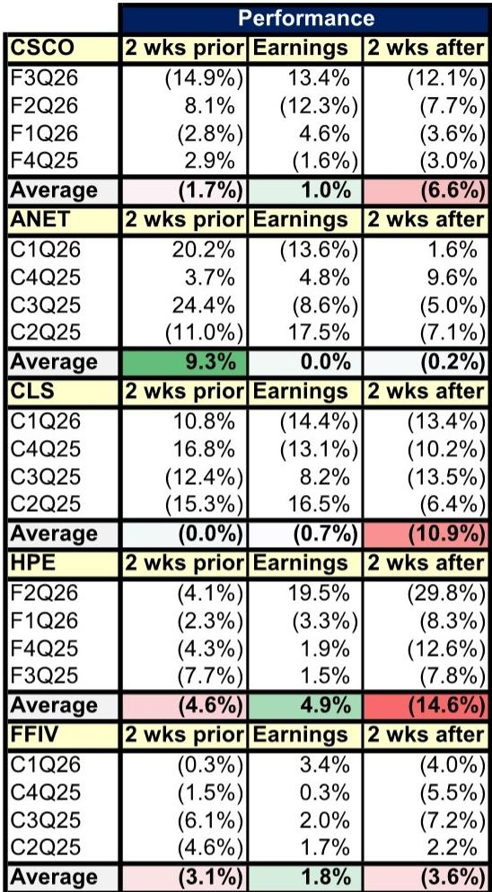

# AI Ethernet Is Not a Side Bet: It Is the Infrastructure Backbone of the Next Computing Cycle

The most consequential insight from the latest networking industry data is not the magnitude of spending growth, but the structural shift in *what* is being built. A global investment bank report, drawing on updated forecasts from 650 Group, now projects that AI Ethernet data center switching spending will reach approximately $89 billion by 2030, growing at a 61% compound annual rate from 2025. This is not a forecast of incremental expansion; it is a declaration that the networking architecture for artificial intelligence is decoupling from traditional data center networking entirely. The implications for investors, strategists, and technology decision-makers are profound, because this decoupling rewrites the competitive dynamics of the entire networking value chain.

The report makes a critical distinction that many market observers miss. Traditional data center switching spending is essentially flat for hyperscalers through 2030, growing at 0% CAGR. Meanwhile, AI Ethernet switching for the same customer segment is expected to grow roughly tenfold, from $4.9 billion to $52.7 billion. This is not a cyclical upswing; it is a technology regime change. The traditional data center network, optimized for general-purpose compute and storage traffic, is being supplemented and in many cases superseded by a new network purpose-built for high-performance, low-latency data flows required by AI workloads.

For senior decision-makers, the strategic question is no longer whether to invest in AI networking, but how to position for a market that is simultaneously scaling at an unprecedented rate and undergoing a fundamental technology transition. The report provides the data to frame that decision, but it also exposes several critical uncertainties that will determine which companies emerge as long-term winners.

## The AI Ethernet Market Is Growing Faster Than Anticipated, and the Revision Cycle Is Not Over

The report reveals that 650 Group raised its 2026-2030 outlook for AI data center switching by an average of 9% annually relative to its previous forecast. This upward revision is broad-based, affecting hyperscalers, tier 2 cloud providers, and enterprise customers alike. The enterprise vertical, in fact, shows the highest five-year CAGR at 70%, albeit from a much smaller base of $553 million in 2025.

What matters here is not just the magnitude of the revision, but the pattern. The upgrade occurred across all customer verticals simultaneously, which suggests that the underlying driver is structural rather than idiosyncratic. The report attributes this to "the growing complexity of AI data center builds which should require greater networking attach." This is a critical insight: as AI clusters scale from thousands to tens of thousands of accelerators, the networking fabric becomes proportionally more important. The network is no longer a peripheral cost; it is a core determinant of cluster utilization and performance.

The upward revision also implies that previous forecasts systematically underestimated the networking content per AI dollar spent. If this pattern continues, and there is no reason to believe it will not, the $89 billion figure for 2030 may itself prove conservative. The question for investors is whether current valuations for networking companies already discount this trajectory or whether further upside remains to be captured.

## Supply Chain Constraints Are Masking Near-Term Revenue Potential, Creating a Tactical Disconnect

One of the most intriguing observations in the report concerns the relative stock performance of certain networking companies heading into earnings. Arista Networks and Celestica, both of which the report identifies as well-positioned fundamentally, have underperformed their peers quarter-to-date, with Celestica up 26% and Arista up 36%, compared to Cisco at 51%, HPE at 88%, and F5 at 41%.

The report suggests that this relative underperformance may be partly due to supply chain constraints on switching silicon that limit near-term revenue upside to guidance. This is a classic tension in technology investing: near-term noise obscuring long-term signal. The demand for AI Ethernet data center networking switches, particularly from hyperscalers, is described as "non-perishable." This means that any revenue delayed by supply constraints is likely to be realized in subsequent periods, not lost permanently.

For investors, this creates a potential opportunity. If the market is discounting near-term guidance misses without fully pricing in the multi-year demand visibility, then companies like Arista and Celestica may offer asymmetric risk-reward profiles. The report explicitly states that the demand should "further benefit 2028/29 growth," implying that the current supply constraints are not a demand problem but a timing problem. The key analytical question is whether these constraints will ease in the next two to four quarters, and whether the companies can convert their order backlogs into revenue without significant margin erosion.

## The Campus Networking Market Is Undergoing a Quiet but Meaningful Upgrade Cycle

While the AI data center story dominates headlines, the campus networking market is also seeing a material improvement in its outlook. The report indicates that the WLAN market's 2026-2030 forecast was raised by approximately 10% on average, now expecting $13.4 billion in 2030 versus $10.6 billion previously. Enterprise switching estimates were raised by roughly 3% on average to reach $28 billion by 2030.

The primary driver of this upgrade is WiFi 7, for which estimates were raised by 13% on average across 2026-2030. WiFi 7's share of total enterprise WLAN revenue reached 39% in the first quarter of 2026 and is expected to grow toward 60-70% by late 2026 or early 2027. This is a rapid adoption curve that has implications for both incumbent vendors and challengers.

The report also notes that the upgraded campus spending outlook reflects "continued need for network modernization to support greater network data traffic flows, as well as partial impact of memory price increases." The memory price component is worth highlighting because it suggests that some of the revenue growth in campus switching is inflation-driven rather than volume-driven. Investors should distinguish between these two sources of growth when evaluating company-level margins and competitive positioning.

## Market Share Dynamics Are Shifting in Both Data Center and Campus, with Clear Winners and Ambiguous Losers

The report provides detailed market share data across multiple networking segments, and the patterns are revealing. In the back-end AI Ethernet networking market, Celestica and Nvidia lead, with Arista closely following. In the front-end market, Celestica and Arista each hold over 30% share, but critically, Cisco has gained 12 percentage points of share over the past three quarters. This suggests that Cisco, despite being late to the AI Ethernet party, is leveraging its incumbent relationships and broad portfolio to reclaim ground.

In the campus market, Cisco continues to dominate enterprise switching, but the WLAN market shows a more fragmented structure. Cisco leads at 36%, followed by HPE Aruba at 20%, Huawei at 13%, and Ubiquiti at 8%. Within the WiFi 7 segment specifically, Cisco was the biggest sequential share gainer in the first quarter of 2026, adding 6 percentage points to reach 31%, while HPE gained approximately 2 percentage points to reach 18%.

The report also highlights the data center interconnect market, where Arista strongly leads the switching segment, while Cisco and HPE closely lead the routing segment with 39% and 36% market share respectively. The DCI market is expected to grow at nearly a 100% five-year CAGR through 2030, with spending roughly evenly distributed between switching and routing.

The strategic implication is clear: the networking market is not a monolith. Different segments have different leaders, different growth rates, and different competitive dynamics. A company that dominates campus switching may have no presence in AI Ethernet back-end networking, and vice versa. Investors need to disaggregate their analysis by segment rather than treating networking as a single industry.

## What the Report Does Not Fully Answer: The Unresolved Questions That Define the Next Investment Horizon

For all its data richness, the report leaves several critical questions unanswered, and these gaps are where the most important analytical work remains to be done.

First, the report does not fully address the competitive threat from white-box and open networking solutions. In the AI Ethernet market, the line between branded equipment and commodity hardware is blurring. Several hyperscalers are known to be developing their own networking silicon or using merchant silicon from Broadcom in white-box switches. The report acknowledges competition from "whitebox switching solutions" as a risk factor for Arista and Cisco, but it does not quantify how much of the $89 billion AI Ethernet market is addressable by branded vendors versus captive or white-box solutions. This is a first-order question for revenue modeling.

Second, the report does not provide a detailed view of the transition from 800G to 1.6T port speeds. It notes that 800G should comprise approximately 80% of AI Ethernet data center switching revenue in 2026, with 1.6T beginning to meaningfully ramp in 2027. But the pace of this transition will have major implications for vendor market share, because technology transitions are typically when incumbents are disrupted. Which companies are best positioned for the 1.6T cycle? The report provides hints through its market share data, but it does not offer a forward-looking framework.

Third, the report does not address the potential for a slowdown in hyperscaler capex. The cloud data center equipment capital expenditure forecast is raised by approximately 28% on average for 2026-2030, reaching roughly $3.2 trillion in 2030. But this assumes that the current pace of AI infrastructure investment continues without interruption. If the return on invested capital for AI clusters proves disappointing, or if a new technology paradigm reduces the networking intensity per compute unit, these forecasts could prove optimistic. The report does not stress-test its assumptions under alternative scenarios.

## A Decision Framework for Investors: Three Lenses to Evaluate Networking Exposure

Given the complexity and segmentation of the networking market, investors need a structured approach to evaluate opportunities. Based on the report's data and analysis, three lenses are particularly useful.

The first lens is **end-market exposure**. Investors should assess which customer verticals a company serves and how those verticals are growing. The report shows that hyperscaler AI Ethernet spending is expected to grow at a 61% CAGR through 2030, while enterprise AI Ethernet spending grows at a 70% CAGR from a smaller base. Companies with high exposure to hyperscaler AI Ethernet, such as Arista and Celestica, have a different risk-return profile than companies with heavy enterprise exposure. The former offers higher growth but greater customer concentration risk; the latter offers more diversified revenue but slower growth.

The second lens is **technology transition readiness**. The networking industry is undergoing multiple simultaneous transitions: from 400G to 800G to 1.6T, from traditional to AI-optimized architectures, and from proprietary to open ecosystems. Companies that lead in each transition tend to gain share; those that lag tend to lose it. The report's market share data for 800G switching, where Celestica leads but Arista and Nvidia have gained share, provides a real-time indicator of competitive momentum. Investors should monitor these share trends quarterly to identify inflection points.

The third lens is **margin structure and sustainability**. The report notes that supply chain constraints on switching silicon are limiting near-term revenue, but it does not analyze the margin implications. In a constrained supply environment, companies with strong supplier relationships and design flexibility may be able to maintain or even expand margins. Conversely, companies that are forced to pay spot prices for components may see margin compression. Investors should examine each company's gross margin trajectory relative to its revenue growth to determine whether growth is profitable and sustainable.

## The Full Report Contains the Granular Data Required for Informed Decision-Making

The analysis presented here is based on a comprehensive report that includes detailed exhibits on market sizing, share trends, and forecast revisions across multiple networking segments. The report covers data center switching by vertical and technology type, campus networking by segment and vendor, historical stock performance around earnings, and individual company ratings with specific price targets and risk factors.

For investors who want to move beyond the high-level narrative and build their own quantitative models, the full report provides the underlying data tables and charts necessary for rigorous analysis. The exhibits on AI Ethernet switching by port speed, vendor market share trends across front-end and back-end networks, and DCI market segmentation are particularly valuable for constructing bottom-up forecasts.

Join the community to read the full report and review the original charts.

*This article is for learning and discussion only and does not constitute investment advice.*

Personal reading notes and learning share only. Not investment advice.

