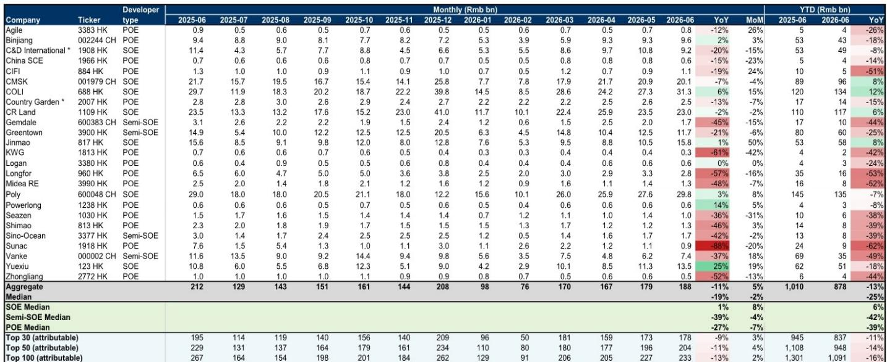
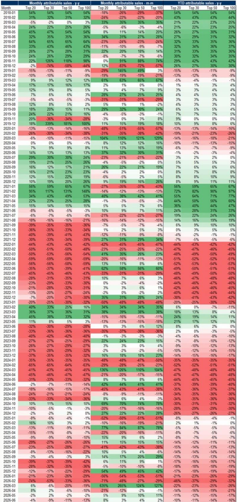
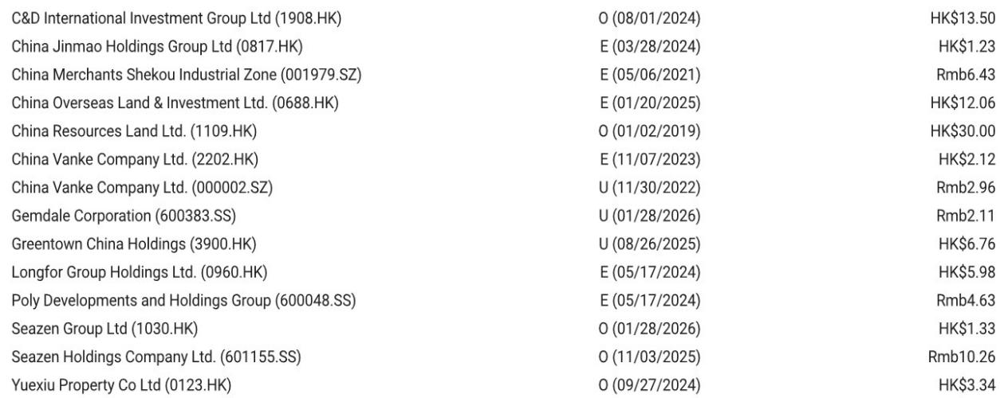

# 摩根斯坦利：MS：房地产销售二次探底，等待比抄底更重要

6月销售数据印证了市场最不愿意看到的情景：政策脉冲已经耗尽，需求再次走弱，而这一次，连二手房这个“最后堡垒”也开始松动。

MS最新发布的6月中国房地产销售跟踪报告显示，百强房企全口径销售金额同比下降13%，较5月的-2%大幅扩大。更值得警惕的是，25城二手房成交同比增速从4月的30%骤降至6月的约10%，MS预计三季度将正式转负。

这不是一次简单的月度波动。这是一轮“政策效力递减+供给端收缩+居民信心脆弱”三重叠加的二次探底。报告明确提出，建议投资者等待更好的入场时机，并坚持选择具备“自下而上alpha”的优质标的。

> **KC评论：** MS这份报告的核心判断，不是“销售又不好了”，而是“这轮走弱的性质与之前不同”。之前是政策退潮后的正常回落，这次是二手房领先指标也在恶化，意味着市场缺乏新的需求引擎。完整报告中有25个主要开发商的月度销售明细表，能清晰看到国企与民企的分化有多深——这是判断行业底部结构的关键数据。

## 1. 国企的“正增长”是个假象，掩盖了行业整体失速的深度

6月数据中最显眼的是国企阵营的亮眼表现：越秀地产同比+25%，中国海外发展+6%，保利发展+3%，金茂+1%。在行业整体两位数下跌的背景下，这些数字确实让人眼前一亮。

但MS的数据揭示了一个更完整的图景：即便国企表现突出，其绝对销售规模也在环比走弱。以华润置地为例，6月销售额230亿元，同比-2%，环比-2%，已经连续两个月出现同比负增长。招商蛇口同比-7%，建发国际更是同比-20%。

国企的“正增长”更多是基数效应和推盘节奏的结果，并非需求端出现了结构性改善。当我们将视线拉长到YTD维度，国企中位数增速为+6%，而民企中位数为-39%，半国企为-42%——这才是行业真实的温度。

MS将国企的韧性归因于更强的品牌力和在一线城市的新增可售资源。但这个优势正在被逐渐消耗。如果三季度整体市场继续走弱，国企也难以独善其身。

> **KC评论：** 很多投资者看到国企销售正增长就认为可以“抄底国企”。但MS的报告实际上在提醒：国企的优势是相对的不是绝对的，是暂时的不是永久的。完整报告中有一张表详细列出了25家开发商的月度销售数据和YTD累计增速，这张表的价值在于能帮读者判断：哪些国企的销售韧性是真实的alpha，哪些只是暂时性的推盘节奏优势。

## 2. 二手房的“最后堡垒”正在失守，这才是三季度最大的风险变量

新房销售走弱并不意外，毕竟开发商可售资源持续收缩，推盘意愿也在下降。真正值得警惕的是二手房市场的急剧降温。

MS数据显示，25个重点城市二手房成交面积同比增速从4月的30%和5月的25%，骤降至6月的约10%。更重要的是，这一趋势还在加速恶化。报告明确预期，三季度二手房成交将转为同比负增长。

为什么二手房如此重要？因为在此前的市场修复中，二手房一直是领先指标和需求信心的“温度计”。当二手房交易活跃时，意味着“卖旧买新”的置换链条能够运转，新房市场才能获得增量需求。现在二手房成交放缓，意味着这条链条正在断裂。

MS对此的判断是：“政策效果和积压需求正在消退。”这意味着，即便7月政治局会议可能释放一些维稳信号，市场也难以重现4-5月的修复力度。

> **KC评论：** 二手房转负的信号比新房数据更值得关注。如果二手房成交持续走弱，接下来就是二手房价格的加速下跌，进而拖累新房定价和土地市场。MS报告里有一张25城二手房成交的月度趋势图，清晰展示了从4月到6月的下滑斜率——这张图是三季度最需要关注的风险指标。

## 3. 7月政治局会议的政策空间，可能比市场预期的更有限

MS在报告中对政策面给出了一个非常克制的判断：“7月政治局会议的政策上行空间有限”。这个判断与当前市场上一些期待“更强刺激”的声音形成了鲜明对比。

为什么MS认为政策空间有限？结合报告上下文和近期政策动向，可以梳理出三个逻辑：

第一，此前几轮政策（降首付、取消限购、收储等）的效果都在递减，边际效用已经很低。第二，地方政府和中央在财政空间上受到制约，大规模需求侧刺激的可能性不大。第三，政策重心可能已经从“救市场”转向“稳主体”，即更关注优质开发商的生存而非整体市场的V型反转。

MS的潜台词是：不要押注政策反转，而要接受“市场需要更长时间出清”的现实。这也是为什么他们强调“等待更好的入场时机”，而不是在估值低位盲目抄底。

## 4. 估值已到历史低位，但“便宜”不等于“该买”

报告提到，尽管近期股价大幅下跌，行业P/B估值已回到历史低位，但MS仍建议保持谨慎，等待更好的入场时机。

这是一个经典的“价值陷阱”警示。当行业基本面仍在恶化时，低估值本身并不构成买入理由。更关键的问题是：盈利预期是否还会下调？现金流是否还会恶化？

MS明确指出，1H26业绩可能偏弱，而资金流中断的风险仍在持续。这意味着，当前的低估值可能是在反映一个尚未完全price in的盈利下修周期。如果后续业绩继续低于预期，估值底部可能还会被打破。

> **KC评论：** 这是MS报告中最容易被忽略但最重要的判断之一。很多投资者看到P/B回到历史低位就认为“底部到了”，但MS在提醒：估值底需要盈利底来确认，而盈利底目前还看不到。完整报告中有MS对主要开发商的盈利预测和目标价调整，这些数据能帮助判断当前估值是否真的具有安全边际。

## 5. MS尚未完全回答的关键问题：alpha的可持续性如何检验？

MS在报告中推荐了三个“alpha标的”：华润置地（Top Pick）、建发国际和新城控股。其逻辑是：这些公司拥有可靠的EPS前景和中期重估潜力，即使没有市场整体复苏也能跑赢。

但这个判断有一个悬而未决的问题：如果三季度二手房转负、新房跌幅扩大、房价加速下跌，这些公司的“独立行情”还能持续多久？华润置地的商业地产和物业管理板块确实提供了防御性，但住宅开发仍然是其利润核心。建发国际的国企背景和厦门区域优势能否对冲全国性下行？新城控股的商业模式转型是否已经足够支撑估值？

MS的报告给出了方向，但没有完全展开这些alpha标的的压力测试。这正是完整报告的价值所在——它包含了更详细的财务模型、估值对比和风险因素分析，能帮助投资者自己判断这些alpha的“安全边际”到底有多厚。

## 6. 投资者需要建立的新观察框架

基于MS这份报告，投资者需要建立一个新的行业观察框架，而不是简单盯着月度销售数据做判断：

第一，不再关注“销售增速是否转正”，而是关注“二手房与新房的联动是否断裂”。如果二手房成交持续走弱，新房市场很难独立复苏。

第二，不再关注“政策是否出台”，而是关注“政策效果是否可持续”。三轮政策后效果递减，说明问题不在政策力度，而在居民部门的资产负债表修复需要时间。

第三，不再关注“估值是否够低”，而是关注“盈利预期是否已经充分下调”。只有当市场对2026-2027年的EPS预期不再大幅下修时，估值底部才真正成立。

第四，不再关注“国企vs民企”的简单二分法，而是关注“哪些公司拥有真正的自下而上alpha”——即不依赖市场复苏也能实现EPS增长的能力。这需要拆解公司的土储质量、融资成本、运营效率和多元化收入结构。

MS这份报告的核心价值，不是给出了一个“买”或“卖”的结论，而是为投资者提供了一个更精细的行业分析框架。它告诉我们：这轮地产下行不是周期的简单重复，而是一个结构性的资产负债表调整过程。在这个过程中，等待比盲目抄底更重要，选择比配置更重要。

---

**顺着这些未解问题，值得继续深入阅读完整报告。**

每天我们会由AI agent配合人工review，生成国际投行中文摘要与KC评论，日均更新约10-40页，覆盖MS、GS、JPM、UBS等主流机构的最新研报，同时整理当天最新数据图表合集。这些内容既方便直接喂给AI做进一步分析，也方便人工快速把握全球市场动态。欢迎来星球和微信群继续讨论，一起跟踪这些关键假设的验证过程。

Personal reading notes and learning share only. Not investment advice.

