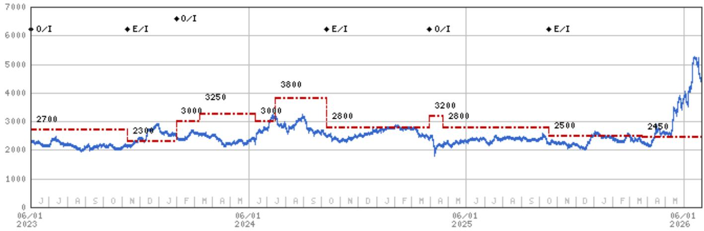
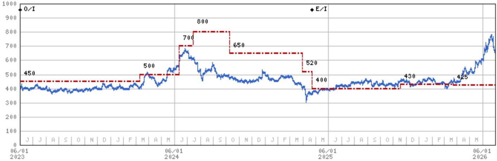
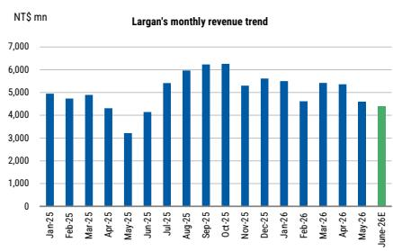

# 摩根斯坦利：MS：台湾光学双雄的六月，比想象中更值得关注

一份来自MS的最新研报，在看似平淡的月度销售数据预览背后，藏着一个可能重塑手机光学产业链格局的技术变量。

6月30日，MS发布了针对台湾光学镜头厂商大立光与玉晶光的催化剂前瞻报告。报告的核心判断并不复杂：两家公司6月销售额预计将呈现季节性疲弱，主要原因是关键客户的新产品预计在2026年第三季度才推出，因此6月的需求处于青黄不接的阶段。真正的环比复苏要等到7月才会启动。

然而，这份报告真正的价值，不在于对短期月度数据的预判，而在于它首次以正式研报的篇幅，详细讨论了“GlassBridge”这一新兴技术路径对现有镜头模组供应链可能带来的颠覆性影响。

> **KC评论：** 许多投资者习惯于将目光聚焦在月度营收数据的同比环比上，试图从中捕捉下一个季度的业绩信号。但MS这份报告提醒我们，真正改变行业竞争格局的，往往是那些隐藏在技术路线图中的“未来变量”。GlassBridge就是这样一个变量。它目前可能只是增加了供应链的波动性，但长期看，它可能重新定义“镜头”的价值。

基于这份研报，我们提炼出以下四个核心洞察，它们共同指向一个判断：**台湾光学双雄的短期业绩有底可循，但真正的投资故事，正在从“产能利用率”转向“技术路线选择权”。**

## 1. 6月销售疲弱已被市场预期，真正的观察窗口在7月

MS明确指出，大立光和玉晶光6月的月度销售额将呈现疲软。这一判断的逻辑链条清晰：苹果新机型的拉货动能通常在第三季度才会显著启动，而在6月这个传统的“空窗期”，季节性因素占据主导。

报告将7月5日（大立光）和7月（玉晶光）的月度销售数据公布列为“高重要性”催化剂，但预期“符合预期”。这本身就是一个信号：市场对6月的数据已经充分定价，股价的短期波动可能有限。

真正需要投资者关注的，是7月数据公布后，管理层对第三季度展望的措辞。如果7月销售额的环比增长幅度超出历史季节性均值，那将是一个比6月绝对值更重要的积极信号。这背后反映的是新机种备货的力度和进度。

## 2. GlassBridge：一个被低估的供应链“破坏性变量”

这是整份报告最具含金量的部分。MS将GlassBridge定义为一种“新兴技术路径”，并指出其对现有的FAU（Flange Assembly Unit，法兰组装单元）及相关组件构成了“潜在的颠覆性风险”。

GlassBridge的核心逻辑是什么？它试图通过一种新的光学架构，减少或替代传统镜头模组中对精密塑料镜片和金属部件的依赖。如果这一技术路径被主流客户采纳，将直接冲击以大立光和玉晶光为代表的传统镜头供应商的商业模式。

> **KC评论：** 理解GlassBridge的重要性，需要跳出“镜头片数”的思维定式。过去几年，手机镜头的竞争焦点是“1G6P”（1片玻璃镜片+6片塑料镜片）还是“1G7P”。GlassBridge则可能从根本上改变这个游戏规则。它不再是在原有架构上做加法，而是试图引入一种全新的光学设计，让部分光学功能从“物理镜片”转移到“光学结构”上。这意味着，传统镜片的价值量可能会被压缩。

对于大立光和玉晶光而言，GlassBridge带来的不是“订单能否持续”的问题，而是“未来5年后的市场空间还有多大”的问题。这解释了为何MS在报告中特别强调，GlassBridge“增加了那些在FAU组件上拥有高期权价值的公司的波动性”。这里的“高期权价值”，指的就是市场对这两家公司未来在高端镜头领域持续获得份额的预期。

## 3. 大立光与玉晶光的风险暴露并不对称

尽管同属“光学双雄”，且都面临GlassBridge的潜在威胁，但MS对两家公司的风险描述存在微妙差异，这值得投资者仔细推敲。

在“上行风险”中，大立光被提及的因素包括“高端智能手机需求超预期”、“1G6P渗透速度超预期”、“潜望式镜头渗透速度超预期”。这些更多是行业层面的beta因素。而玉晶光的“上行风险”则更具体地指向了“在iPhone中获得更多份额”和“苹果混合现实需求超预期”。

这种差异反映出：玉晶光的估值弹性更大程度上依赖于其在苹果供应链中的份额提升，而大立光则更依赖于整个高端手机市场的景气度以及技术升级带来的ASP提升。因此，当GlassBridge这类技术变革发生时，玉晶光面临的“份额被侵蚀”的风险可能更大，而大立光面临的则是“ASP天花板被压低”的风险。

## 4. 报告尚未完全回答的关键问题：GlassBridge的商用时间表和成本曲线

MS在报告中提出了GlassBridge的威胁，但并没有给出这一技术路径走向量产的时间表。这正是这份报告留下的最大悬念，也是投资者最需要持续跟踪的核心问题。

GlassBridge目前处于什么阶段？是实验室原型，还是已经进入了客户的A样阶段？它的良率表现如何？更重要的是，它的制造成本是否能够接近或低于现有FAU方案？如果成本过高，它可能只会停留在高端旗舰机型上，对主流市场的影响有限。但如果成本能够快速下降，它将对整个供应链的估值体系产生重构。

此外，报告没有深入讨论的是，GlassBridge对供应链其他环节的影响。例如，如果镜头模组的物理结构发生变化，对VCM（音圈马达）和图像传感器的需求是否会随之改变？这些二阶效应，可能比镜头厂商自身的业绩波动更具投资意义。

对于高净值投资者和产业决策者而言，这份MS报告的价值不在于告诉你6月卖了多少货，而在于它为你画出了一张“技术路线图上的分岔口”。短期看，大立光和玉晶光的股价会随着月度数据的公布而波动，但中期看，GlassBridge的进展将是决定这两家公司估值中枢能否维持的关键变量。

这正是我们每天做的事情。我们的团队通过AI agent配合人工review，将MS、GS、JPM等国际投行的核心研报转化为中文摘要与洞察评论，每天更新约10-40页，并整理当天最新数据图表合集。这些内容既方便你直接喂给AI模型进行二次分析，也方便你在几分钟内快速把握全球市场的核心动态。欢迎加入我们的星球微信群，与数百位产业和投资界朋友一起，持续追踪GlassBridge这类关键变量的最新进展。

Personal reading notes and learning share only. Not investment advice.

