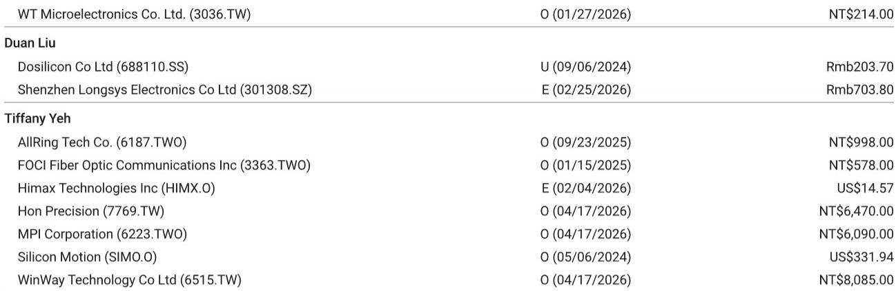
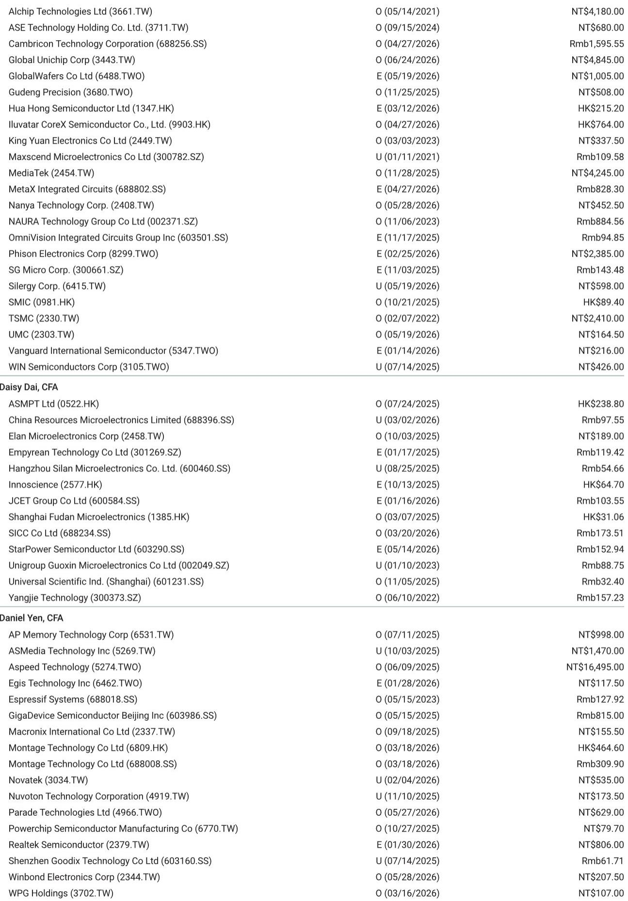

# 摩根斯坦利：MS：半导体测试耗材涨价箭在弦上，这两家公司最受益

半导体产业链的涨价潮正在向一个容易被忽视的环节蔓延。当市场目光聚焦于AI芯片和先进封装时，MS最新研报指出，探针卡和测试插座等测试耗材正面临严峻的供给瓶颈，涨价已经不可避免。这不是一个简单的成本传导故事，而是测试环节定价权转移的信号。

这份由Tiffany Yeh、Charlie Chan等分析师共同撰写的报告，核心判断是：贵金属价格持续上涨叠加测试探针产能严重短缺，将迫使探针卡和测试插座供应商启动涨价，将成本压力转嫁给客户。与半导体行业其他环节类似，测试耗材供应商正在获得前所未有的议价能力。

报告特别强调，MPI Corporation和WinWay Technology这两家公司将是这轮涨价周期的最大受益者。MS维持对这两只股票的“Overweight”评级，并指出其当前估值提供了有吸引力的入场窗口。

## 1. 测试耗材的供给瓶颈比想象中更紧，涨价不是选项而是必然

MS通过供应链调研发现，测试探针的产能短缺已经达到“severe”级别。这不是一个边际紧张的状态，而是供需缺口已经大到足以改变行业定价规则的程度。

测试探针是探针卡和测试插座的核心部件，其制造工艺复杂、精度要求极高，新产能的爬坡需要相当长的时间。在需求端，AI/HPC芯片的快速放量正在吞噬大量测试产能，而DDIC（显示驱动芯片）需求的边际回暖进一步加剧了供给压力。

报告指出，这种供给紧张与贵金属价格上涨形成了双重挤压。探针卡和测试插座大量使用贵金属材料，原材料成本上升叠加产能不足，使得供应商的涨价意愿和能力都达到了近年来的高点。这与半导体行业其他环节已经发生的涨价逻辑高度一致，测试耗材环节只是时间上滞后了一些。

> **KC评论：** 很多人以为半导体测试是个成熟、低增长的行业，但MS揭示了一个反直觉的事实：测试耗材正在成为AI芯片放量的关键瓶颈之一。这意味着，这个细分赛道的投资逻辑正在从“跟随增长”转向“定价权溢价”。完整报告中对产能缺口的具体量化测算和供应链调研细节，值得仔细阅读。

## 2. 6月业绩可能超预期，AI/HPC需求是核心驱动力

报告明确指出，基于探针卡和测试插座的强劲需求，相关公司6月业绩“likely to be very strong”。这不是一个模糊的乐观预期，而是基于对AI/HPC ramp和DDIC增量需求的清晰判断。

AI/HPC芯片的测试需求与传统芯片有本质区别。高端AI芯片的引脚数量更多、测试频率更高、测试时间更长，这意味着单颗芯片消耗的测试耗材价值量远高于传统芯片。随着AI芯片出货量的指数级增长，测试耗材的需求弹性被显著放大。

DDIC需求的边际改善则提供了额外的增长动力。虽然DDIC不是市场关注的焦点，但作为半导体周期的重要风向标，其回暖信号对整个测试耗材行业具有支撑意义。当AI/HPC提供高增长、DDIC提供底部支撑时，测试耗材供应商的业绩确定性显著提高。

> **KC评论：** MS对6月业绩的判断值得重视，但更重要的是理解其背后的结构性变化：测试耗材的需求正在从“周期性”转向“成长性”。AI芯片的测试复杂度提升，意味着即使芯片出货量增速放缓，测试耗材的价值量仍可能继续增长。完整报告中对AI/HPC测试需求的具体测算和驱动因素拆解，是理解这个逻辑的关键。

## 3. MPI的CPO担忧被过度放大，核心逻辑并未改变

MPI的股价近期表现落后于同业，市场担忧主要来自CPO（共同封装光学）技术可能改变测试需求结构。但MS认为这种担忧被夸大了。

报告的核心论点是：无论FAU采用何种新技术，光引擎仍然是必需的，而光引擎的插入测试需求不会消失。CPO技术可能会改变封装形式，但不会改变芯片需要测试这一基本事实。实际上，CPO技术可能反而增加了对某些类型测试的需求。

从估值角度看，报告认为MPI目前约43倍2027年预期市盈率是一个有吸引力的入场点。支撑这一估值的是公司2025-2028年高达105%的每股收益复合年增长率。在如此强劲的盈利增长面前，当前估值并不显得昂贵。

> **KC评论：** 市场总是喜欢对新技术带来的颠覆性影响过度反应。MS对MPI的分析提供了一个很好的分析框架：区分“技术变化”和“需求消失”。CPO确实会改变封装结构，但测试作为芯片制造的刚需环节，其底层逻辑很难被颠覆。完整报告中对CPO技术对测试需求影响的详细分析，以及MPI在不同情景下的盈利预测，是理解这个判断的关键支撑。

## 4. WinWay新产能即将释放，积压订单开始兑现

WinWay的催化剂更为直接：从6月开始，公司新产能将开始全面爬坡，以消化强劲的积压订单。对于一家产能受限的公司来说，新产能的释放意味着收入增长的直接加速。

报告指出，WinWay的估值约为39倍2027年预期市盈率，而公司2025-2028年的每股收益复合年增长率预计高达111%。这意味着，即使考虑到高增长预期，当前估值仍然具有吸引力。

WinWay的核心竞争力在于其hyper socket和MEMS探针卡技术，这些产品在高端测试领域具有明显的技术壁垒。随着AI芯片对测试精度和效率的要求不断提高，WinWay的技术优势正在转化为市场份额的提升。

> **KC评论：** 对于产能驱动的成长股，市场最关注的是“产能释放能否如期实现”和“积压订单能否顺利转化”。MS对WinWay的看好建立在对这两个关键变量的信心之上。但投资者需要警惕的是，产能爬坡过程中的执行风险，以及客户订单节奏的波动。完整报告中对WinWay产能计划、客户结构和订单能见度的详细分析，是评估这些风险的必要信息。

## 5. 报告尚未完全回答的关键问题：涨价持续性和竞争格局变化

尽管MS的分析逻辑严密，但仍有几个关键问题值得进一步探讨。

第一，涨价的可持续性。当前测试耗材的供需紧张是结构性还是周期性的？如果AI芯片的需求增速放缓，或者新产能集中释放，测试耗材的定价权还能维持多久？报告给出了看多的逻辑，但对定价权的时间维度讨论不够充分。

第二，竞争格局的变化。测试耗材行业的技术壁垒虽然高，但高利润率和强劲需求必然会吸引新进入者和现有竞争对手的扩产。当供给端开始响应时，现有玩家的超额利润能否持续？报告对MPI和WinWay的竞争优势有分析，但对潜在竞争压力的讨论相对有限。

第三，客户集中度风险。测试耗材的客户高度集中于少数几家大型芯片厂商和封测厂。如果大客户开始自研测试耗材或通过长协锁定价格，供应商的议价能力可能受到侵蚀。报告对此着墨不多，但这恰恰是投资者需要密切关注的变量。

这些问题并非否定报告的核心判断，而是提醒读者：任何投资逻辑都有其边界条件。理解这些边界条件，才能更好地判断当前的投资机会是否适合自己。

## 6. 给读者的观察框架：如何跟踪测试耗材行业的投资逻辑

基于MS的分析，我们可以建立一个简单的观察框架来跟踪这个行业的投资逻辑变化。

第一，关注贵金属价格走势。这是测试耗材成本端最直接的驱动因素，也是涨价的直接催化剂。如果贵金属价格出现趋势性回落，涨价的紧迫性会减弱。

第二，跟踪AI芯片的测试需求变化。AI芯片的出货量和测试复杂度是需求端的核心变量。可以关注主要AI芯片厂商的资本开支计划和测试设备采购情况。

第三，观察新产能投放节奏。测试探针和探针卡的新产能建设周期较长，但一旦集中释放，可能改变供需格局。需要跟踪主要供应商的产能扩张计划和实际执行情况。

第四，关注客户关系和订单能见度。测试耗材供应商与客户的绑定程度很深，长协订单和战略合作关系是判断收入稳定性的重要依据。

第五，留意技术路线的变化。虽然CPO等技术不会消灭测试需求，但可能改变测试耗材的结构和价值量分布。持续跟踪技术演进方向是保持前瞻性的关键。

这些观察维度可以帮助投资者在MS报告的基础上，形成自己的判断框架，而不是简单跟随研报的结论。

---

测试耗材这个看似小众的赛道，正在AI浪潮中展现出超出预期的投资价值。MS的报告提供了一个清晰的分析起点，但真正的投资决策需要更深入的理解和持续的跟踪。

我们会持续关注这个行业的变化，每天由AI agent加上人工review，生成国际投行中文摘要与KC评论，daily更新约10-40页，并整理当天最新数据图表合集，方便喂给AI，也方便人工快速把握market dynamics。欢迎来星球微信群里继续讨论，一起跟踪测试耗材涨价周期的演绎。

Personal reading notes and learning share only. Not investment advice.

