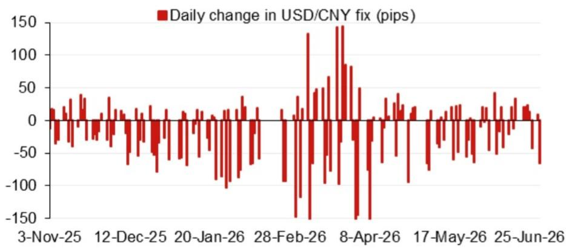
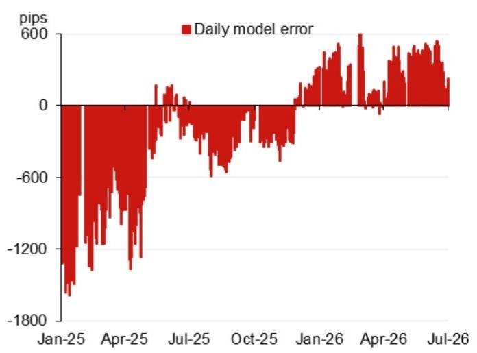

# The Yuan Fix Model Is Sending a Signal: Don't Confuse Technical Calibration for Policy Easing

The People's Bank of China sets the daily USD/CNY fixing rate through a three-part formula: the previous day's closing spot rate, an overnight basket movement adjustment, and a counter-cyclical factor that the central bank can dial up or down. This mechanism is not a free market price. It is a policy instrument. And right now, the model-based projection of 6.7863 against a prior fix of 6.8109 represents a 246-pip downward revision that demands a careful strategic reading, not a reflexive bullish bet on the renminbi.

A global investment bank's Asia FX strategy team has published a detailed model-based projection that strips out the counter-cyclical factor to reveal what the pure technical inputs are saying. The unadjusted model projects 6.7863. The adjusted version, which includes the counter-cyclical factor, lands at 6.7951. That 88-pip gap between the two numbers is the analytical center of gravity. It tells you that the central bank is actively leaning against the model's implied direction. The question is why, and what happens next.

This matters now because the calendar ahead is dense with political and policy events that will test the PBOC's willingness to let the market drive the fix. The Politburo meeting in late July, the Central Economic Work Conference in mid-December, and President Xi's expected visit to Washington toward the end of 2026 all create discrete windows where currency stability becomes a higher-order objective. The model is a technical tool. But the fix is a strategic decision. Investors who conflate the two will misread the signal.

## The Model's Pure Signal Is Bearish USD/CNY, But the Counter-Cyclical Factor Reveals Official Caution

The unadjusted model projection of 6.7863 represents a mechanical reading of the overnight inputs. The report identifies four weighted contributors to this projected change. The fact that the projection moved 246 pips lower from the previous fix tells you that the basket dynamics and closing spot are aligned in one direction: a weaker dollar, or a stronger renminbi, depending on your framing. But the model's job is to reflect inputs, not to predict policy.

The counter-cyclical factor adjustment of 6.7951 is only 158 pips lower from the previous official fix, compared to the unadjusted model's 246-pip decline. That 88-pip wedge is the footprint of central bank intervention. It is not large in absolute terms, but it is analytically significant. It tells you that the PBOC is willing to slow the pace of renminbi appreciation, even when the technical inputs support a faster move. This is not a signal of a change in direction. It is a signal of a change in speed.

The so-what here is straightforward: if you are positioning for a near-term renminbi rally based purely on the model's projection, you are ignoring the policy layer. The counter-cyclical factor exists precisely to prevent the fix from becoming a self-fulfilling prophecy driven by short-term market flows. The central bank is not fighting the model. It is managing the optics and the volatility.

## The Calendar of Upcoming Events Creates a Sequence of Windows Where Stability Will Override Technical Signals

The report includes a calendar of events that runs from late July 2026 through the end of the year. This is not a background detail. It is a forward-looking constraint on the model's applicability. Each of these events creates a political or economic reason for the PBOC to prioritize fix stability over mechanical accuracy.

The July Politburo meeting is the first test. The readout from this meeting typically includes a to-do list for the economy and clues to the leadership's priorities. If the economic tone is cautious, the central bank will want a stable currency backdrop. The National Day Golden Week in early October is a period of reduced liquidity and heightened sensitivity to external signals. The APEC meeting in Shenzhen in November puts China in the global spotlight as host. The Central Economic Work Conference in December sets the policy agenda for the following year. And President Xi's visit to Washington, likely in late 2026, introduces a diplomatic dimension that will make currency volatility a liability.

Each of these events creates a reason for the counter-cyclical factor to remain in play. The model may project one thing. The policy imperative may demand another. Investors who treat the model as a trading signal without adjusting for these calendar constraints are effectively assuming that the PBOC will cede control to technical inputs. That assumption has historically been wrong at moments of political or economic significance.

## The Model's Recent Error Pattern Raises an Unanswered Question About Structural Drift

The report presents data on recent model errors without the counter-cyclical factor adjustment. This is the section that deserves the most careful scrutiny, because it reveals something the report does not fully answer: whether the model's forecast errors are random noise or evidence of a structural shift in the relationship between the model inputs and the actual fix.

If the errors are random and mean-reverting, then the current projection is a useful signal. But if the errors show a persistent directional bias, then the model may be systematically overstating or understating the PBOC's willingness to follow the basket. The report provides the error data but does not offer a definitive conclusion on this question. That is not a criticism. It is an invitation for the reader to dig deeper.

The strategic implication is that you cannot rely on the model alone. You need a second layer of analysis that tracks the gap between the unadjusted projection and the actual fix over time. If that gap is widening or becoming more persistent, it tells you that the PBOC is changing its behavior. If the gap is narrowing, it tells you that the model is becoming more predictive. The report gives you the data to start this analysis. It does not do it for you.

## A Decision Framework for Using Fix Projections Without Mistaking Them for Policy Signals

The report provides the raw material for a structured decision process. Here is a framework that translates the technical projection into an actionable approach.

First, separate the direction from the magnitude. The model is more reliable on direction than on magnitude. If the unadjusted projection moves sharply lower, it is telling you that the overnight inputs are aligned for a weaker dollar. That directional signal is robust. But the exact pip level is less reliable, because the counter-cyclical factor can shift it by 50 to 100 pips without warning.

Second, monitor the gap between the adjusted and unadjusted projections. When this gap is large, the PBOC is actively leaning against the model. That is a signal of policy concern, not a signal of a change in the underlying trend. When the gap narrows, the central bank is becoming more comfortable with the model's direction.

Third, overlay the calendar. Before each of the events listed in the report, expect the counter-cyclical factor to be used more aggressively to keep the fix stable. After the events, expect a potential release of pent-up adjustment. The model may project a move that does not materialize for weeks, then materializes all at once.

Fourth, use the error data to calibrate your conviction. If the model has been consistently overestimating the fix change in recent days, reduce your position size. If the errors are small and alternating, increase conviction. The error pattern is a meta-signal about the model's current reliability.

## The Report Leaves Open the Question of What Happens When the Counter-Cyclical Factor Is Removed

The most interesting analytical question that emerges from this report is not about the current fix level. It is about the exit scenario. The counter-cyclical factor is a temporary tool. It was introduced during a period of one-way depreciation pressure to break the feedback loop between spot depreciation and fix depreciation. At some point, the PBOC will reduce its use or remove it entirely.

The report does not address this question directly, but the data it provides allows you to think about it. If the unadjusted model is consistently projecting a stronger renminbi, and the PBOC is consistently leaning against it with the counter-cyclical factor, then the removal of that factor would release a significant amount of pent-up adjustment. The question is whether the PBOC would remove it during a period of strength or wait until pressure subsides.

This is not an idle question. If the PBOC signals a reduction in the counter-cyclical factor, the market will front-run the adjustment. The model's unadjusted projection would become the relevant benchmark, and the fix would converge toward it rapidly. Investors who understand the mechanism will be positioned for that convergence. Investors who treat the current fix as a stable equilibrium will be caught off guard.

Join the community to read the full report and review the original charts that show the model inputs, error patterns, and event calendar in detail.

*This article is for learning and discussion only and does not constitute investment advice.*

Personal reading notes and learning share only. Not investment advice.

