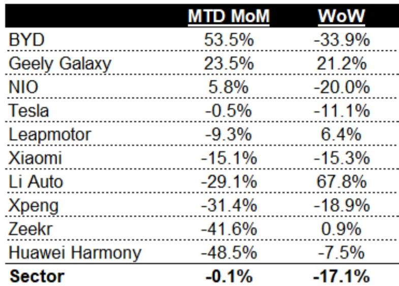
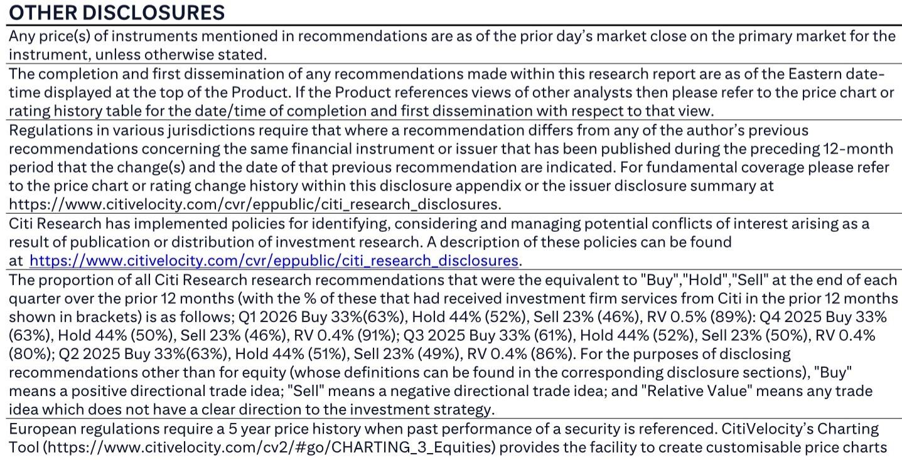

# China’s EV Market Is Splitting Into Two Speeds, and the Slow Lane Is Getting Wider

The fourth week of June 2026 delivered a stark message to anyone watching China’s electric vehicle market: the sector-wide order growth that investors have come to expect is no longer guaranteed. According to dealer industry checks, overall EV orders declined 17% week-over-week during the period of June 22 to 28, significantly below what most models had anticipated. Month-to-date orders came in essentially flat versus May, a sharp departure from the historical pattern of greater than 10% month-over-month growth during this period. This is not a temporary dip. It is a signal that the competitive dynamics of China’s EV market are undergoing a structural shift that will separate winners from also-rans with far greater clarity than any previous cycle.

The conventional narrative has been that China’s EV market is a growth story with periodic volatility. That framing is becoming dangerous. What the latest data reveals is a market bifurcating into two distinct regimes: a small group of brands that can still generate accelerating demand momentum, and a much larger group that is experiencing demand fatigue despite aggressive pricing and product launches. The implications for investors, supply chain partners, and strategic planners are profound. The question is no longer whether the market will grow, but which companies will capture that growth and which will be left holding excess capacity and declining margins.

This analysis draws on proprietary dealer channel checks that provide a granular, week-by-week view of order intake across the major EV brands in China. The data cuts through the noise of monthly delivery announcements and reveals the underlying demand trajectory with unusual precision. What it shows is that the market is not simply slowing; it is reordering itself around a handful of brands that have cracked the code of sustained order generation, while the rest face an increasingly hostile demand environment.

## BYD’s Dominance Is Not Just About Scale; It Is About Product Cycle Timing That No Competitor Can Replicate

The standout performer in the latest data is BYD, which posted month-to-date month-over-month order growth of 53.5%. This is not merely a function of BYD’s size or brand recognition. It is a direct consequence of the Great Tang launch, which has generated a demand spike that has lifted the entire brand’s order trajectory. BYD’s fourth-week orders of 70.6 thousand units, while down from the third-week peak of 106.8 thousand, still represent a level that dwarfs every other player in the market.

What makes BYD’s performance strategically significant is not the absolute number but the pattern. BYD has demonstrated an ability to use new product launches to reset its demand curve, creating a step-change in orders that persists beyond the initial launch week. The Great Tang launch generated a 150% week-over-week surge in the third week, and while the fourth week saw a normalization, orders remained at levels that would represent a strong week for most competitors even at their peak.

The deeper insight is that BYD has built a product cycle machine. Each major launch does not merely cannibalize existing BYD sales; it expands the total addressable demand for the brand by attracting new customer segments. This is the hallmark of a platform strategy executed at scale. BYD can afford to launch products that target specific niches because its manufacturing and supply chain infrastructure allows it to capture margin even at relatively lower volumes per model. For competitors, each new launch carries existential risk: if it fails to generate sufficient orders, the fixed costs of development and tooling become a permanent drag on profitability.

The question that BYD’s performance raises for the rest of the market is whether any other brand can replicate this product cycle model. The answer, based on the data, appears to be no. Geely Galaxy’s 23.5% month-to-date month-over-month growth is respectable, but it is less than half of BYD’s rate. NIO’s 5.8% growth is barely above flat. The rest of the market is in negative territory. BYD is not just winning; it is winning in a way that is structurally unattainable for its competitors given their current scale and product development cadence.

## The Demand Cliff Is Real for the Middle Tier, and It Is Accelerating

Perhaps the most concerning data point in the report is not BYD’s strength but the breadth and depth of weakness across the rest of the market. Huawei Harmony, which has been one of the most talked-about entrants in China’s EV space, posted a staggering 48.5% month-to-date month-over-month decline. Zeekr was close behind at negative 41.6%. Xpeng, Li Auto, and Xiaomi all recorded double-digit negative growth rates.

This is not a market correction. It is a demand cliff. The historical pattern for June has been month-over-month growth of greater than 10%. This year, the sector as a whole is flat. If that flat trajectory continues through the end of the month, the implied June EV retail sales would be approximately 915,000 units, representing a 17.6% year-over-year decline. For the first half of 2026 as a whole, that would translate to a 15.8% year-over-year contraction.

The conventional explanation for this weakness would be macroeconomic headwinds or consumer sentiment. But that explanation collapses when you consider BYD’s performance. If the overall market were simply facing demand headwinds, BYD would also be struggling. It is not. The demand is there; it is just being concentrated into a smaller number of brands. The middle tier of the market is being squeezed from both sides: BYD captures the volume-sensitive mainstream consumer, while premium brands like NIO and Li Auto struggle to differentiate themselves in a market where feature parity is rapidly increasing.

The strategic implication is uncomfortable for investors who have treated the Chinese EV market as a rising tide that lifts all boats. The tide is still rising, but it is rising in only a few harbors. Brands that cannot generate organic demand momentum will be forced to compete on price, which will compress margins across the industry. The data suggests that several brands are already in this trap, and the window to escape is closing.

## Product Launches Are No Longer a Reliable Catalyst; Only Launches That Reset Category Expectations Matter

The conventional wisdom in the EV industry has been that new product launches are the primary catalyst for demand generation. The data from this report challenges that assumption in a fundamental way. While BYD’s Great Tang launch clearly moved the needle, the launches from other brands during the same period did not produce comparable results.

Huawei Harmony, despite its substantial marketing investment and brand partnerships, saw its orders decline by nearly half month-over-month. Zeekr, which has been aggressive in expanding its model lineup, experienced a similar decline. Li Auto, which has been one of the most consistent performers in the premium segment, saw orders drop by 29.1% month-to-date month-over-month, even though its fourth-week orders actually increased 67.8% week-over-week, suggesting a late-month push that may not be sustainable.

The pattern suggests that the market has become desensitized to incremental product improvements. A new model that offers slightly better range, slightly faster charging, or slightly more autonomous driving features is no longer sufficient to generate a sustained demand response. Consumers have become sophisticated enough to recognize when a product is genuinely category-defining versus merely competitive.

This has profound implications for product development strategy. The cost of developing a new EV platform is measured in the billions of dollars. If that investment can no longer be relied upon to generate a meaningful demand lift, then the economics of the industry change fundamentally. Companies must either achieve the scale to amortize development costs across a very large volume of sales, or they must find ways to extend the lifecycle of existing platforms without requiring full-scale redesigns.

The data suggests that only BYD has achieved the former. For everyone else, the latter strategy is the only viable path, and it requires a level of operational discipline that few Chinese EV startups have demonstrated.

## What the Report Does Not Fully Answer: The Role of Pricing, Channel Inventory, and Consumer Financing

For all its granularity, the dealer check data leaves several critical questions unanswered. The most important of these is the role of pricing. The report provides order volumes but does not disclose the pricing environment in which those orders were generated. Were the orders achieved through normal market demand, or were they subsidized by aggressive discounting? This distinction is crucial because it determines whether the order numbers are sustainable or whether they represent demand pulled forward from future months at the expense of margin.

A second unanswered question concerns channel inventory. The data tracks orders placed by consumers, not deliveries. If dealers are carrying elevated inventory levels, the apparent demand weakness could be partially offset by destocking. Conversely, if inventory is lean, the order weakness translates directly into production cuts. The report does not provide this context, and it matters enormously for supply chain planning and earnings forecasts.

The third unknown is the role of consumer financing. China has seen significant shifts in auto loan availability and interest rates over the past year. If financing conditions have tightened, that would explain some of the demand weakness, particularly for mid-tier brands that rely on credit-constrained consumers. But if financing is readily available, then the demand weakness is purely a product of consumer preference, which is a much more difficult problem to solve.

These open questions are not criticisms of the report; they are the natural boundaries of any channel check methodology. But they mean that investors should treat the order data as a directional signal rather than a precise forecast. The direction is clear, but the magnitude of the impact on earnings and cash flows depends on factors that the report does not capture.

## A Decision Framework for Navigating the Two-Speed Market

For investors and strategists, the data points toward a clear decision framework. The first step is to classify every EV brand in China into one of three categories based on their order momentum trajectory: accelerating, stable, or declining. BYD is the only clear accelerating brand. Geely Galaxy and NIO are in the stable category, though NIO’s growth is marginal enough to warrant close monitoring. Everyone else in the sample is in the declining category.

The second step is to assess each declining brand’s capacity to reverse its trajectory. This requires evaluating three factors: the pipeline of genuinely category-defining product launches, the strength of the brand’s balance sheet to withstand a prolonged period of weak orders, and the flexibility of its supply chain to adjust production without incurring severe fixed-cost penalties.

Brands that score poorly on all three factors face a high probability of needing external capital or consolidation. The data suggests that several brands in the declining category are running out of time. The market is unlikely to wait for them to turn around, and the window for raising capital in the current environment is narrowing.

For investors, the framework suggests a barbell strategy. On one end, BYD offers the clearest demand momentum and the strongest competitive position. On the other end, the declining brands may offer distressed value if they can execute a turnaround, but the risk of permanent capital impairment is high. The middle ground of stable but not accelerating brands is the most dangerous territory, because they lack the upside of the leader and the potential catalyst of a distressed restructuring.

## The Full Picture Requires Deeper Data Than Any Single Week Can Provide

This analysis is based on a single week of order data, and it would be a mistake to extrapolate too aggressively from one data point. The fourth week of June could be an anomaly driven by holiday timing, weather, or other temporary factors. The month-to-date trends are more reliable, but even they represent only a snapshot of a market that is evolving rapidly.

The full report from which this data is drawn contains additional weeks of history, brand-level breakdowns, and contextual analysis that provides a much richer picture of the underlying dynamics. It includes the dealer commentary that explains why certain brands are outperforming or underperforming, and it offers a framework for thinking about how the second half of 2026 is likely to unfold.

For serious investors and industry professionals, the weekly order data is just the starting point. The real value comes from understanding the patterns across multiple weeks, the relationship between orders and deliveries, and the strategic moves that each brand is making in response to the changing demand environment. The report provides all of this, along with the original charts that allow readers to visualize the trends for themselves.

Join the community to read the full report and review the original charts.

*This article is for learning and discussion only and does not constitute investment advice.*

Personal reading notes and learning share only. Not investment advice.

