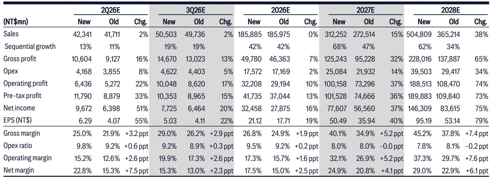
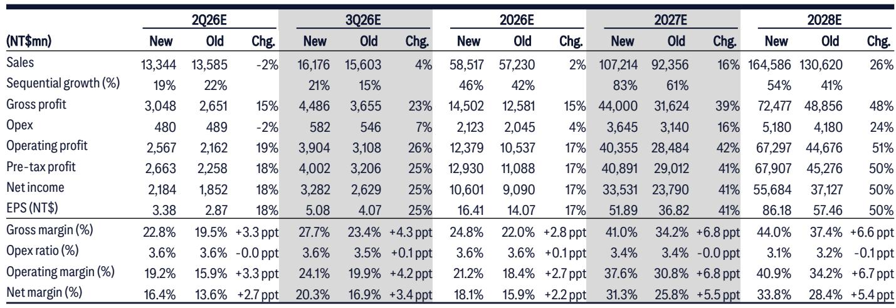
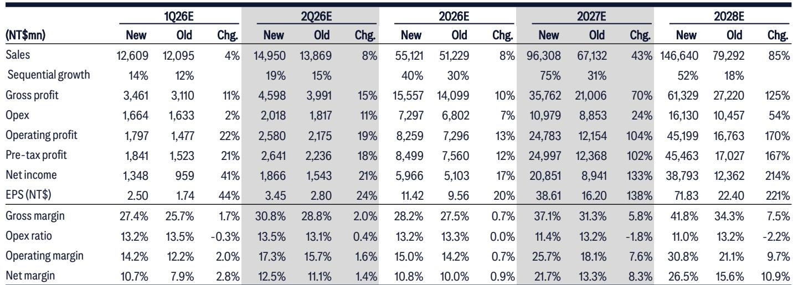

# The PCB Substrate Pricing Upcycle Has Begun: Why Margins Will Expand Faster Than Shipments Through 2027

The semiconductor substrate industry is entering a pricing upcycle that will reward investors not through volume growth but through the strategic capture of scarcity premiums. Taiwanese ABF and BT substrate makers are now demonstrating that margin expansion can outpace revenue growth when supply constraints meet accelerating AI demand. This is not a cyclical recovery. It is a structural repricing of capacity that will persist through at least 2027, driven by three reinforcing forces: the T-glass bottleneck that limits the number of usable substrates, the deliberate capacity reduction in BT by major players, and the willingness of fabless customers to pay premium prices for guaranteed access. The market has not fully priced in the magnitude of gross margin expansion that these dynamics will produce. Investors who focus only on unit shipment growth will miss the real story.

## The T-Glass Constraint Is the Unseen Bottleneck That Gives Substrate Makers Pricing Power

The single most important structural factor in this cycle is not the demand for AI chips, but the supply of the material required to package them. T-glass, a specialized glass cloth produced almost entirely by Nittobo, is the critical input for advanced ABF substrates used in AI GPUs, ASICs, and CPUs. New vendors are qualifying slowly. Taiwan Glass Industry leads among the challengers, but its thick glass quality still falls short of Nittobo's standards. End customers and fabless companies are exploring alternatives—EMC's ABF CCL, MGC's RS Resin solution, Nanya Plastics' T-glass—but none have been proven at scale.

The implication is clear: even if every substrate maker runs at full utilization, the industry cannot produce enough high-end substrates to meet AI chip demand through 2027. This is not a temporary shortage. It is a multi-year supply ceiling that transfers pricing power from customers to suppliers. The key question is not whether Nittobo will expand capacity, but whether it will raise prices again. That decision, as addressed in a separate Japan-focused analysis, will determine the floor for substrate pricing across the entire value chain.

What matters for substrate makers is that they do not need unlimited T-glass supply to grow profits. They can raise prices to achieve revenue growth even if unit shipments are constrained. Fabless companies in the queue will eventually need to pay a premium for scarce substrate capacity, unless they delay their AI chip development programs. This dynamic creates an environment where pricing becomes the primary driver of financial performance, not volume.

## The BT Market Is Undergoing a Structural Supply Reduction That Creates a Second Pricing Opportunity

While much of the attention is on ABF substrates for AI, the BT substrate market is experiencing a quieter but equally powerful transformation. Major players are actively reducing their BT capacity, recognizing that ABF production offers superior profitability and better long-term visibility. Unimicron, which accounts for approximately 11 percent of global BT sales from major peers, now targets a reduction of at least 15 percent of its total BT capacity by end of 2026, primarily in its Taiwan plants for WBCSP-related products.

This is not a cyclical downturn. It is a strategic reallocation of manufacturing resources toward higher-margin products. As Unimicron cuts 40 to 50 percent of its BT capacity in the mid-term, orders will flow to other Taiwanese peers. Kinsus, with 35 to 40 percent BT sales exposure, is the primary beneficiary. The result is an improving supply-demand dynamic for BT substrates that will drive utilization rates higher and, critically, push gross margins well above historical levels.

The historical range for BT gross margins has been 5 to 15 percent. This cycle, margins are expected to surpass 20 percent. That is not a small improvement. It is a structural shift in profitability for a product category that many had written off as commoditized. The key insight is that the BT margin expansion is not dependent on AI demand. It is driven by supply rationalization. Even if AI-related BT demand grows modestly, the capacity reduction alone is sufficient to create pricing power.

## The Three Taiwanese Leaders Offer Different Exposures to the Same Upcycle

Each of the three major Taiwanese substrate makers has a distinct position in this cycle, and understanding the differences is essential for portfolio construction.

Nan Ya PCB (NYPCB) is the most aggressive player on pricing. The company is a key beneficiary of Broadcom's Tomahawk products for ABF and also supplies some ASIC projects with minority share. For BT, demand is strong from memory customers. Critically, NYPCB is reluctant to enter long-term agreements with customers, preferring high exposure to the spot market. Based on the last cycle experience, this strategy is expected to deliver aggressive price hikes in both ABF and BT in the coming quarters. The earnings impact is substantial: 2027E profit estimates have been raised by approximately 40 percent to NT$33.5 billion, driven by pricing rather than volume.

Kinsus is positioned differently. The company is bullish on its market share in the Vera CPU, where it holds more than 50 percent share. The upside depends on its capacity expansion pace. For BT, Kinsus benefits directly from the outflowing orders from Unimicron's capacity reduction, driving utilization quarter after quarter. Both ABF and BT utilization are expected to reach full levels by end of 2026. With 35 to 40 percent BT sales exposure, Kinsus is the most leveraged to the BT margin expansion story. The 2027E profit estimate has more than doubled to NT$20.8 billion.

Unimicron is the long-term leader but faces a different near-term dynamic. The company has more sufficient T-glass supply than its peers, which gives it more bargaining power with customers. It also has HDI upside as mass production kicks off. However, investors have shown a short-term preference for names with higher spot-price exposure and earnings growth. Unimicron's current gross margin uptick is driven by rising ABF demand rather than HDI utilization improvement. The company's earnings upside comes from gross margin benefits from long-term agreements, HDI margin improvement, and its T-glass advantage. The 2027E profit forecast has been raised by 37 percent to NT$77.6 billion.

In the short term, NYPCB and Kinsus offer more aggressive earnings growth from pricing strategies and improving BT sentiment. In the long term, Unimicron's leadership position and supply advantages make it the structural winner.

## What the Report Does Not Fully Answer: The Duration of the Pricing Cycle and the Risk of Demand Disruption

The analysis presents a compelling case for margin expansion through 2027, but it leaves several critical questions unanswered. The first is the duration of the pricing cycle. The report assumes that T-glass constraints will persist through 2027, but what happens if new vendors qualify faster than expected? Taiwan Glass Industry is taking the lead, but its product quality still falls short. If Nittobo accelerates its own capacity expansion or if alternative solutions like EMC's ABF CCL prove viable, the supply ceiling could lift earlier than modeled.

The second question is about demand risk. The entire thesis rests on continued acceleration of AI GPU, ASIC, and CPU demand. What if fabless companies delay their AI chip development programs? The report notes this possibility but does not quantify the impact. If a major customer pushes out a product cycle by six months, the supply-demand balance could shift dramatically, reducing pricing power.

The third question is about the sustainability of aggressive pricing strategies. NYPCB's reluctance to enter long-term agreements and preference for spot market exposure is a double-edged sword. In a rising market, it maximizes profit. In a downturn, it exposes the company to rapid price erosion. The report does not stress-test this strategy against a demand slowdown.

These are not flaws in the analysis. They are the natural boundaries of a forward-looking thesis. Investors should monitor T-glass qualification progress, AI chip development timelines, and the willingness of customers to enter long-term agreements as leading indicators of whether the cycle will extend or contract.

## A Decision Framework for Investors: How to Position Across the Cycle

For investors looking to act on this thesis, a structured decision framework is essential. The cycle can be divided into three phases, each requiring a different portfolio emphasis.

Phase One, the current environment, is characterized by accelerating pricing and improving gross margins. The optimal positioning is toward names with high spot-price exposure and aggressive pricing strategies. NYPCB and Kinsus fit this profile. Their earnings revisions are the most dramatic because they capture the full benefit of price hikes without the smoothing effect of long-term contracts.

Phase Two will emerge when utilization rates approach full capacity across the industry. At this point, the focus should shift to names with superior T-glass access and diversified product portfolios. Unimicron becomes more attractive as its T-glass advantage allows it to serve customers when competitors cannot. The HDI upside also becomes more meaningful as mass production scales.

Phase Three will arrive when new T-glass capacity comes online or demand growth decelerates. In this phase, pricing power will fade, and the market will return to volume-based valuation. Companies with the strongest customer relationships and most efficient manufacturing will outperform. Unimicron's leadership position and long-term agreements provide the most protection in this scenario.

The key risk in this framework is timing. Investors who rotate too early from Phase One names to Phase Two names may miss the bulk of the earnings revisions. Those who rotate too late may hold spot-price-exposed names as pricing power erodes. The solution is to watch three indicators: monthly pre-tax margins, which are already improving; T-glass qualification announcements from new vendors; and the cadence of AI chip launches from major fabless customers.

## The Full Picture Requires Access to the Original Data and Charts

This analysis is based on a detailed research report that includes proprietary earnings estimates, monthly financial data, and market share calculations that cannot be fully reproduced here. The original charts show the month-by-month improvement in pre-tax margins for all three companies, the estimated BT sales of major global peers, and the earnings revision trajectories that underpin the target price increases. These data points are essential for constructing conviction positions and for monitoring the thesis over time.

Join the community to read the full report and review the original charts.

*This article is for learning and discussion only and does not constitute investment advice.*

Personal reading notes and learning share only. Not investment advice.

