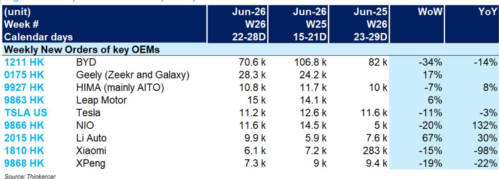
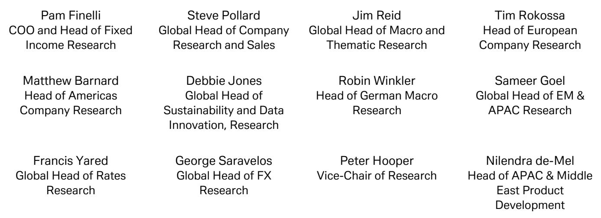
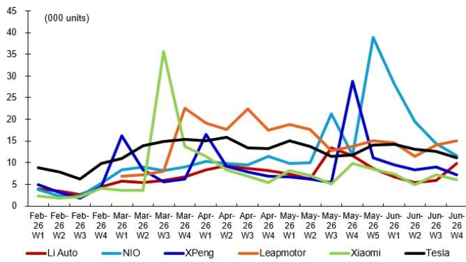

# DB：中国新能源车订单的“冰火两重天”已到关键节点

当市场还在为“价格战结束了吗”争论不休时，一份来自DB的周度订单监测报告，揭示了一个更真实的图景：中国新能源车市场正在经历的不是整体回暖，而是结构性的“订单裂谷”。

这份覆盖比亚迪、吉利、理想、蔚来、小鹏、特斯拉等核心玩家的周度追踪，数据截至2026年6月第四周，给出了一个值得所有产业决策者认真对待的信号。它不是关于“销量还会不会涨”的老问题，而是关于“谁在真正吞噬需求”的新答案。

报告的核心判断是：头部企业的订单集中度正在加速提升，但这一轮增长并非普惠式的行业红利。订单流向正在发生一次无声的“再分配”，而这次分配的结果，将直接决定未来12个月竞争格局的轮廓。

## 1. 比亚迪的周度订单波动，暴露了规模效应的另一面

报告中最引人注目的数据点来自比亚迪。6月第四周，其新订单录得70.6k，环比骤降34%，同比也下滑14%。对比前一周的106.8k，这种周度波动幅度令人侧目。

关键在于如何解读这个波动。这不是需求崩塌的信号，而是“脉冲式”订单获取模式的体现。比亚迪在特定促销节点或新车型交付周期内能够集中吸纳订单，但这种集中性也意味着，一旦节点过去，周度数据会迅速回落。这恰恰说明，即使是行业龙头，也在面临“如何将规模优势转化为持续的订单流”这一挑战。

更深层的含义在于：当一家企业的周度订单可以出现超过30%的环比波动时，整个供应链的排产、库存和资金规划都会面临巨大的不确定性。对于投资者而言，关注比亚迪的月度或季度订单均值，可能比紧盯周度数据更有意义。但周度数据揭示的波动性本身，就是对“规模即安全”这一传统认知的修正。

> **KC评论：** 比亚迪的“订单脉冲”现象，其实是一个行业进入成熟期的典型特征。当一个市场从增量扩张转向存量博弈，龙头企业的订单波动性反而会加大，因为它要同时应对竞争对手的针对性打击和自身产品周期的切换。这份报告里关于比亚迪订单趋势的图表，值得仔细看——它不只是数字的跳动，而是企业运营节奏的映射。

## 2. 蔚来的同比暴增，是“触底反弹”还是“基数游戏”？

蔚来是这份周度报告中另一个极端案例。6月第四周，蔚来新订单为11.6k，环比下滑20%，但同比暴增132%。这个132%的同比数字，很容易被解读为“蔚来回来了”。

但需要冷静拆解。同比基数低是核心原因——去年同期蔚来正处于产品迭代和渠道调整的低谷期。132%的同比增长，更多反映的是蔚来从“非正常低位”恢复到了“正常水平”，而非已经进入高速增长通道。环比的下滑也提示，这种恢复的持续性仍需验证。

更值得关注的，是蔚来在高端纯电市场的份额稳定性。在理想和问界持续施压的背景下，蔚来能够维持周度订单在1万以上，说明其品牌护城河和换电体系的用户粘性依然存在。但问题是，这个“1万+”的周度订单水平，是否足以支撑其庞大的研发和渠道成本？报告没有给出答案，但这正是需要深入探讨的关键。

## 3. 理想的“周度爆发”，揭示了产品周期的强大威力

理想汽车是本周订单环比增长最显著的车企。6月第四周，理想新订单录得9.9k，环比大幅增长67%，同比增长30%。这个数字在整体平淡的市场中显得格外突出。

理想的订单爆发，直接指向其产品周期的正向驱动。无论是L系列的持续放量，还是新车型的拉动，理想的订单数据表明，在当前的竞争环境下，产品力仍然是最有效的“订单生成器”。但67%的环比增长也意味着，其订单获取高度依赖于特定车型的交付节奏和营销活动，可持续性同样需要观察。

一个值得注意的对比是，理想的周度订单绝对量（9.9k）仍低于蔚来（11.6k）和特斯拉（11.2k）。这意味着，即使环比增速亮眼，理想在高端市场的份额争夺战中，仍未取得压倒性优势。这种“增速高但基数偏低”的格局，恰恰是竞争最激烈、变数最大的阶段。

> **KC评论：** 理想的案例说明，在新能源车行业，产品周期的力量远大于品牌忠诚度。一个爆款车型可以瞬间改变一家企业的订单曲线。但这也意味着，任何一家车企都无法“躺赢”——一旦产品进入生命周期后半段，订单下滑的速度可能比上升时更快。报告中的理想订单趋势图，是理解“产品周期管理”这一课题的最佳素材。

## 4. 小鹏和特斯拉的“双双下滑”，是共性压力还是个性问题？

小鹏和特斯拉在本周的表现，呈现出一种“难兄难弟”的态势。小鹏新订单7.3k，环比下滑19%，同比下滑22%；特斯拉新订单11.2k，环比下滑11%，同比下滑3%。

两者的下滑，原因却截然不同。特斯拉的下滑，更多是产品周期老化的体现。Model 3和Model Y已经进入生命周期的中后段，虽然品牌号召力仍在，但面对中国本土竞品的“围剿”，增量空间正在收窄。环比和同比的双双微降，印证了这一点。

小鹏的问题则更为复杂。环比和同比的双位数下滑，说明其面临的不只是产品周期问题，还有品牌定位和渠道效率的挑战。在15-25万这个最拥挤的价格带，小鹏既要面对比亚迪的规模碾压，又要应对零跑、哪吒等新势力的性价比竞争。周度订单的持续低迷，反映出小鹏的“智能化”标签，在当前的消费环境下，尚未转化为足够的订单吸引力。

## 5. 报告尚未完全回答的关键问题：订单结构背后的“利润真相”

这份DB的报告，提供了一个极其宝贵的“订单流量”视角，但它也有一个天然的局限：它只告诉我们“谁在卖”，没有告诉我们“谁在赚钱”。

订单量不等于利润量。比亚迪的70k周度订单，和蔚来的11k周度订单，其背后的单车利润、现金流贡献和资本回报率，可能天差地别。报告没有展开的是：在高订单量的背后，有多少是低利润的“走量车型”？而在订单量相对较小的品牌中，是否存在“高利润、高粘性”的优质订单结构？

对于产业决策者而言，这个问题的答案，可能比订单总量本身更重要。因为在一个资本回报率普遍承压的行业里，最终活下来的，不一定是卖得最多的，而是“卖得最聪明”的。

## 6. 一个观察框架：从“订单流量”到“竞争韧性”

基于这份报告，我们可以构建一个简单的观察框架，用于评估各家车企的“竞争韧性”：

第一层，看订单的绝对规模和增速。这是最直接的指标，但也是最容易误导的。比亚迪的规模和理想的高增速，都需要放在各自的基数上理解。

第二层，看订单的波动性。一个周度订单波动超过30%的企业，其运营稳定性和供应链管理能力，必然面临更大挑战。波动性越低，说明需求越稳健，品牌忠诚度和产品吸引力越强。

第三层，看订单结构。这是报告没有提供，但投资者必须追问的信息。高价值车型的订单占比、复购率、用户推荐指数，这些才是衡量一个品牌长期价值的核心指标。

第四层，看订单转化为交付和利润的效率。即使有高订单量，如果产能跟不上，或者成本结构不合理，最终也无法转化为股东价值。

这个框架的价值在于，它提醒我们：不要被周度订单的“头条数字”牵着走。真正的洞察，藏在数字背后的结构里。

---

这份DB的周度监测报告，只是一扇窗。窗外的风景是：中国新能源车市场正在经历一场“订单的再分配”，而这场再分配的结果，将重塑未来3-5年的行业版图。

但报告没有展开的，是订单背后的成本结构、利润模型和资本效率。这些才是决定谁能笑到最后的关键变量。

在我们的知识星球中，每天由AI agent与人工review结合，生成国际投行的中文摘要与KC评论，每日更新约10-40页，同时整理当天最新的数据图表合集。这些内容既方便直接喂给AI进行二次分析，也方便人工快速把握全球市场的动态变化。如果你想继续探讨这份报告背后的“利润真相”，或者获取更完整的原始图表与数据，欢迎加入我们的社群，继续讨论。

Personal reading notes and learning share only. Not investment advice.

