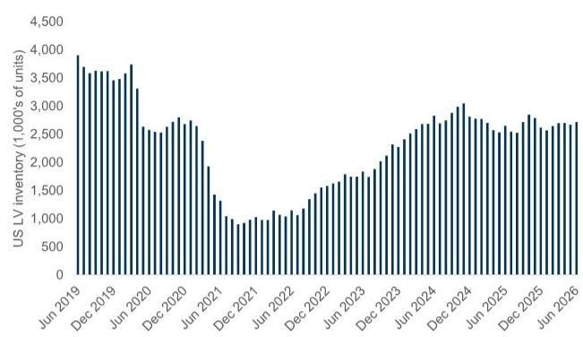
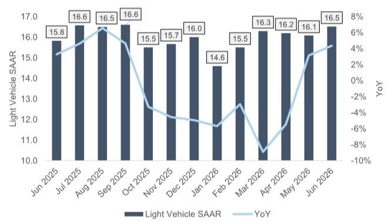
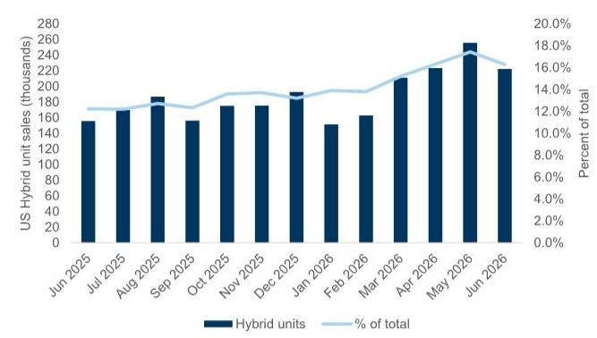

# US Auto Demand Is Defying Consumer Sentiment, But The Real Story Lies In The Powertrain Divergence

The June US auto sales data delivers a clear and somewhat surprising message: the American consumer is still buying vehicles at a pace that exceeds analyst expectations. With a seasonally adjusted annualized rate (SAAR) landing between 16.5 and 16.7 million units, the industry has decisively outperformed the consensus forecast of 16.3 million. This is not a marginal beat. It is a signal that the underlying demand structure for light vehicles remains more resilient than the prevailing narrative of consumer weakness would suggest. For strategists and investors, the immediate implication is that the widely anticipated demand pullback has not materialized, at least not yet.

But a superficial reading of the headline number misses the critical shifts occurring beneath the surface. The June data reveals a deepening divergence in powertrain adoption, a material restructuring of market share among the Detroit 3, and an inventory dynamic that is healing but still historically constrained. The most striking pattern is not the overall volume, but the collapse of battery electric vehicle (BEV) sales relative to the explosive growth of hybrids. This is not a temporary blip; it suggests a fundamental reassessment by consumers of what they value in a vehicle purchase today.

The strategic question for industry participants and investors is no longer simply whether demand will hold up. It is about which product segments, which OEMs, and which powertrain strategies are positioned to capture value in an environment where pricing power remains intact, but the competitive landscape is shifting rapidly. The June report from a global investment bank provides the raw data, but the strategic interpretation requires connecting the dots across inventory, incentives, and product cycle timing. This article unpacks those connections and lays out a framework for decision-making.

## The June SAAR Beat Is Real, But It Masks A Sequential Volume Decline That Demands Attention

The headline SAAR figure of 16.5 to 16.7 million is undoubtedly positive. It represents a meaningful acceleration from the 16.1 million SAAR recorded in May and the 15.8 million from June of the prior year. On a year-over-year basis, absolute unit sales grew in the mid-to-high single digits, supported by one additional selling day. This is consistent with the directional improvement signaled by recent leading indicators, including consumer surveys and online search traffic, and it stands in contrast to persistently soft consumer sentiment readings.

However, the sequential monthly picture tells a more nuanced story. Total units sold in June fell to approximately 1.38 million, down from 1.48 million in May, a decline of roughly 7%. This is not unusual seasonally, but it does highlight that the annualized rate is being pulled upward by the extrapolation of a sales pace that, in absolute terms, moderated. The strength of the SAAR is therefore partly a function of the calculation methodology. The real question for the second half of the year is whether the underlying monthly run rate can sustain itself as inventory continues to build and incentives begin to creep higher.

The implication for investors is clear: the demand environment is supportive but not exuberant. The risk is not an imminent collapse, but rather a gradual softening if macroeconomic headwinds intensify. The data does not yet support a bearish call on aggregate volumes, but it does argue against aggressive upward revisions to full-year forecasts. The year-to-date SAAR average of 15.9 units keeps the full-year 16 million forecast within reach, but the margin for error is narrowing.

## The Collapse In BEV Sales And The Surge In Hybrids Represent A Structural Recalibration, Not A Cyclical Pause

The most consequential data point in the June report is the dramatic divergence between BEV and hybrid sales. BEV sales fell approximately 30% year-over-year, while hybrid sales surged roughly 43%. The BEV mix dropped to about 5% of total monthly sales, down from approximately 8% a year ago. This is not a minor correction; it is a near-halving of market share in twelve months. For an industry that has been investing billions in electrification, this trend demands a fundamental reassessment of consumer adoption timelines.

Several factors are likely at play. First, the data suffers from estimation challenges because Tesla, the dominant BEV player, does not report US-specific monthly sales. The reported decline of 27% for Tesla overall, with the Model 3 down 40% and the Model S and X down over 70%, must be interpreted with caution. However, the magnitude of the decline across multiple OEMs suggests a broader phenomenon. Ford's Mach-E fell 32%, the F-150 Lightning dropped 78%, and GM's Equinox EV cratered by 82%. These are not isolated product issues; they reflect a market that is voting with its wallet against the current generation of BEVs, likely due to concerns about charging infrastructure, residual values, and upfront pricing.

In contrast, hybrids are experiencing a renaissance. The 43% year-over-year growth indicates that consumers are willing to pay for fuel efficiency but are not yet ready to commit to full electrification. This is a rational consumer response to a market where gasoline prices remain volatile and the total cost of ownership for BEVs is still uncertain. The strategic implication is stark: OEMs that have over-allocated capital to BEV-only platforms may face a period of underutilized capacity, while those with flexible architectures that can accommodate hybrids will be better positioned to capture demand. The industry may need to recalibrate its product mix more quickly than previously planned.

## Market Share Dynamics Are Shifting Beneath The Surface, With GM Gaining Ground And Ford Still Recovering From Supply Disruptions

The aggregate sales numbers obscure meaningful shifts in competitive positioning. In June, General Motors reported a 6% year-over-year increase in sales, while Ford saw a 2% decline. This divergence is even more pronounced when looking at the second quarter as a whole: GM's units were down 4% year-over-year, while Ford's were down 10%. GM's explanation for its own decline cited discontinued vehicles, EV weakness, and supply constraints, which suggests the underlying core business may be healthier than the headline number implies.

The large pickup truck segment, a critical profit pool for both companies, tells a similar story. GM's share of large pickups increased to 40.3% in June, up from 38.6% a year ago. Ford's share declined to 33.1% from 35.1%. This is partly attributable to the lingering effects of the Novelis fire in 2025, which disrupted F-Series production by approximately 100,000 units. Ford expects to recover 50,000 to 60,000 of those units in 2026, but the competitive damage may already be done. Consumers who switched to GM or Stellantis may not return.

The implication for investors is that product cycle timing is becoming a decisive factor. GM appears to be in a relative sweet spot, while Ford is navigating a recovery that will take time. Stellantis, with a pickup share of 17.9%, is also showing signs of life. The second half of 2026 will be telling, as Ford attempts to regain lost ground and GM prepares for its next generation of full-size pickups for model year 2027. The competitive dynamics in this segment alone can swing billions in operating profit.

## Inventory Is Recovering But Remains Below Historical Norms, Capping The Potential For Aggressive Incentive Wars

Finished vehicle inventory rose sequentially to approximately 2.72 million units in June, up from 2.67 million in May. While this is a positive sign for supply normalization, it remains below the historical range of 3 to 4 million units. Days of inventory (DOI) stood at 49 days, compared to 47 days in May and 50 days a year ago. Critically, pickup truck DOI was 70 days, significantly higher than the industry average, indicating that the segment is beginning to see some stock building.

The strategic implication here is that the industry is still operating in a relatively tight supply environment. This has been a key factor supporting pricing power and keeping incentive spending in check. June incentive spending was up only 2% year-over-year and down 1% sequentially, averaging approximately $3,464 per vehicle. As long as inventory remains below the historical comfort zone, OEMs have little reason to engage in destructive discounting.

However, the trajectory is worth watching. If inventory continues to build toward the 3-million-unit mark, particularly in the pickup segment where DOI is already elevated, the risk of a more aggressive incentive cycle increases. The current environment is favorable for margins, but it is not stable. Investors should monitor monthly inventory data closely as a leading indicator of pricing pressure.

## One Critical Question The Report Leaves Unanswered: How Will Tariff And USMCA Uncertainty Reshape Production And Pricing?

The report identifies tariffs and USMCA uncertainty as a key theme for the coming period, but it does not fully explore the second-order implications. With the US opting not to renew the USMCA, the agreement is now subject to annual reviews. This creates a persistent overhang for an industry that relies on deeply integrated North American supply chains.

The unanswered question is how OEMs will adjust their production footprints in response to this regulatory uncertainty. Will they accelerate the reshoring of certain components, accepting higher costs for greater certainty? Or will they maintain current configurations and absorb the risk of potential tariff shocks? The answer will have significant implications for capital expenditure plans, profit margins, and competitive positioning. Investors should be asking which OEMs have the most flexible supply chains and the strongest balance sheets to weather potential disruptions.

## A Decision Framework For Navigating The Auto Sector In The Current Environment

Based on the data and analysis, investors and industry participants should consider a structured framework for evaluating opportunities and risks. First, assess powertrain exposure. Companies with strong hybrid offerings and flexible manufacturing platforms are better positioned than those with aggressive BEV-only strategies. Second, evaluate inventory and incentives. OEMs with lean inventory and low incentive spend have more pricing power and margin protection. Third, monitor product cycle timing. Companies entering a new generation of high-volume, high-margin products have a competitive advantage. Fourth, stress-test supply chain resilience. Firms with diversified North American production and minimal exposure to tariff-sensitive components will face fewer headwinds.

This framework suggests that the current environment favors OEMs with balanced powertrain portfolios, disciplined inventory management, and upcoming product launches. It also suggests that the BEV pure plays face a more challenging demand environment than the market may be pricing in. The data does not support a thesis of rapid BEV adoption, and the hybrid surge indicates that the transition will be longer and more complicated than many expected.

## The Full Picture Requires Deeper Analysis Of The Charts And Data

The patterns discussed in this article are derived from a single month of data, but they are consistent with a broader trend that is reshaping the auto industry. To fully understand the implications for your investment or strategic decisions, you need to see the original charts and data tables that show the trends over time. The SAAR trajectory, the BEV and hybrid sales curves, the inventory build rates, and the OEM market share shifts all contain nuances that cannot be fully captured in a written summary.

Join the community to read the full report and review the original charts. The data reveals the story, but the charts show the pattern.

*This article is for learning and discussion only and does not constitute investment advice.*

Personal reading notes and learning share only. Not investment advice.

