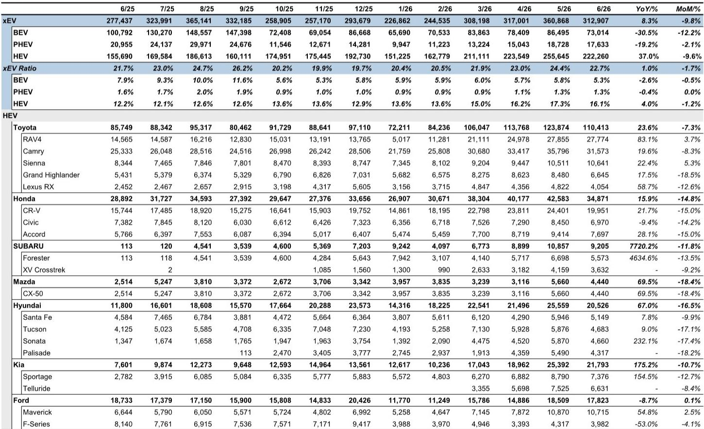
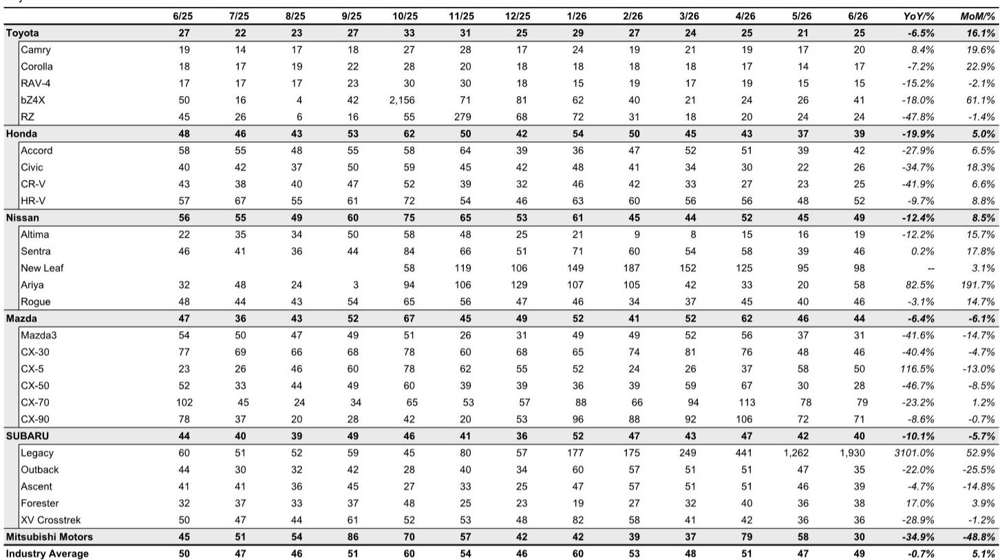
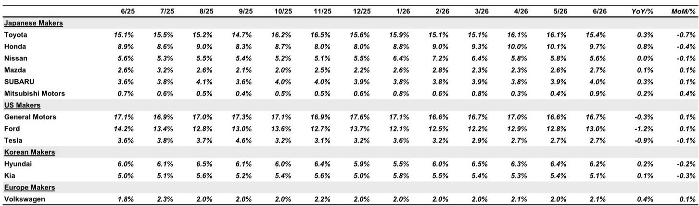

# JPM：美国车市在油价压力下没有崩塌，但真正的分化才刚刚开始

市场对高油价的担忧从未停止，尤其是中东局势持续升温的背景下，美国汽车需求是否已经受到实质性冲击，是今年下半年全球汽车股最重要的观察变量之一。JPM刚刚发布的6月美国汽车月度报告给出了一个明确但容易被忽视的判断：需求没有崩塌，但结构正在发生不可逆的分化。

这份报告的核心信号是：美国新车销量SAAR（年化销售速率）在6月达到1667万辆，不仅高于JPM自己预期的1620万辆，也是连续第四个月保持在1600万辆以上。对于一个被反复贴上“高利率、高油价、高库存”标签的市场，这个数字本身就是一个值得重新审视的锚点。

但真正重要的不是总量，而是总量之下的三股力量：HEV（混合动力）的持续渗透正在改写竞争格局，丰田在换代周期的阵痛中让出了部分市场份额，而纯电动的增长势头在6月出现了明显的放缓。这些变化叠加在一起，指向一个更深刻的结论：美国车市正在从“供给驱动”切换到“产品力驱动”的竞争阶段，而这一阶段的赢家逻辑，和过去几年完全不同。

> **KC评论：** JPM这篇报告最值得注意的不是销量超预期本身，而是它揭示了一个反直觉的事实——市场对宏观风险的定价可能已经过度。如果需求端没有出现趋势性下行，那么当前汽车股的估值中隐含的“衰退折扣”就需要被重新审视。完整报告中有详细的品牌层面库存和激励数据，这是判断后续价格战是否会加剧的关键。

---

## 1. 连续四个月站上1600万辆，美国车市的需求韧性被低估了

JPM的数据显示，6月美国新车销量SAAR为1667万辆，环比5月的1621万辆继续上行。按单月销量计算，6月共售出138万辆新车，同比增长3.4%。其中轿车24万辆，微增1.2%；轻型卡车114万辆，增长3.9%。

从更长的周期来看，自3月以来SAAR始终保持在1600万辆以上，这在一个被普遍认为“需求正在冷却”的市场中并不常见。JPM的分析师在报告中明确指出，尽管中东紧张局势导致汽油价格上涨，但需求端并未出现有意义的下降，这一事实本身就会给市场带来一定程度的安心。

但需要注意一个细节：6月的销售天数比5月少一天，因此环比销量下降3.1%更多是日历效应，而非需求走弱。如果按日均销售速率（DSR）计算，同比增速依然为正。这也意味着，当前的需求基础比表面数据看起来更稳固。

> **KC评论：** 对投资者而言，1600万辆SAAR是一个重要的心理阈值。2022-2023年供应链瓶颈时期，SAAR长期在1500万辆以下徘徊。回到1600万辆以上意味着行业已经走出了最坏的供给短缺阶段，接下来的竞争将从“谁能造出车”转向“谁能卖出车”。完整报告中包含了分品牌的库存和激励数据，这些数据可以帮助判断哪些车企在终端价格战中处于更有利的位置。

---

## 2. HEV正在成为真正的增长引擎，而BEV的增速拐点已经出现

6月美国新能源车总销量为31.3万辆，同比增长8.3%。但拆开来看，纯电动（BEV）和混合动力（HEV）的走势出现了显著分化。

BEV销量仅为7.3万辆，同比大幅下降30.5%。特斯拉6月销量3.66万辆，同比下降22.9%，市场份额从去年同期的3.6%降至2.7%。这已经不是单月波动，而是连续数月出现的趋势性下滑。

与此形成鲜明对比的是HEV。6月HEV销量达到22.2万辆，同比增长37.0%，渗透率维持在16.1%的高位。丰田仍然是HEV市场的绝对主力，单月销售11万辆HEV，同比增长23.6%；本田销售3.5万辆，增长15.9%；现代和起亚的HEV销量增速更为惊人，分别达到67.0%和175.2%。

JPM在报告中特别指出，丰田的HEV销售势头要等到新RAV4全面放量后才能加速，而这一时间点预计在10月之后。这意味着HEV的增长可能还有进一步的加速空间。

> **KC评论：** 市场对电动化的讨论往往集中在纯电动的渗透率上，但JPM的数据清楚地表明，在当前阶段，HEV才是真正的增量来源。对于整车厂而言，HEV不需要巨额充电基础设施投入，消费者也没有里程焦虑，这使其成为当前宏观环境下最“务实”的电动化路径。完整报告中有更细分的HEV车型销售数据，可以帮助判断哪些品牌在这一轮HEV红利中受益最大。

---

## 3. 丰田的换代阵痛：市场份额下滑背后是一个值得警惕的信号

在日系三大车企中，6月的表现出现了明显的分化。本田继续维持强劲势头，单月销售13.4万辆，同比增长12.2%，市场份额达到9.7%，处于高位。而丰田虽然单月销量21.3万辆，同比增长5.7%，但市场份额从5月的16.1%降至15.4%，环比继续下滑。

JPM将丰田市场份额下滑的主要原因归结为“新RAV4切换期的谨慎策略”。RAV4是丰田在美国最畅销的车型之一，但6月销量仅为3.24万辆，同比下降15.6%。在新老车型交替期间，丰田显然选择了控制库存节奏，而非激进促销。

这一策略本身是理性的，但问题在于：切换期会持续多久？如果新RAV4的产能爬坡慢于预期，丰田可能面临更长的市场份额真空期。而竞争对手——尤其是本田的CR-V和现代的途胜——正在这个窗口期加速抢占客户。

> **KC评论：** 丰田的份额下滑不是需求问题，而是产品周期问题。但对于投资者而言，需要区分“暂时性”和“结构性”的份额损失。如果新RAV4在10月后如期放量，丰田的份额回升将是大概率事件；但如果切换期出现供应链或质量问题，市场可能会重新评估丰田的竞争护城河。完整报告中有丰田各车型的详细库存数据，这是判断切换节奏的关键输入。

---

## 4. 斯巴鲁的复苏信号：二线品牌也能跑出阿尔法

在二线日系品牌中，斯巴鲁6月销量5.49万辆，同比增长13.3%，表现超出预期。尤其是其核心车型Outback，6月销量达到1.41万辆，同比增长27.4%，环比增长30.0%，显示出明显的复苏迹象。

斯巴鲁的复苏有两个值得关注的点。第一，Outback是斯巴鲁在美国最核心的利润车型，其销量恢复直接关系到公司的盈利能力。第二，斯巴鲁的HEV产品线相对薄弱，在整体市场向HEV倾斜的背景下，斯巴鲁仍然能靠传统燃油动力车型实现增长，说明其品牌忠诚度和细分市场定位仍然有效。

但这也带来一个追问：如果HEV渗透率继续提升，斯巴鲁能否及时补齐产品线的短板？目前斯巴鲁的Solterra纯电动车型6月仅销售218辆，同比下降82.2%，几乎可以忽略不计。在电动化转型的长期叙事中，斯巴鲁的位置仍然存在不确定性。

> **KC评论：** 斯巴鲁的案例说明，在美国车市，品牌力和细分市场定位仍然可以对抗产品周期的逆风。但这一逻辑的可持续性取决于HEV渗透率的上限。如果HEV渗透率在未来12-18个月突破20%甚至25%，没有HEV产品线支撑的品牌将面临更大的竞争压力。完整报告中有斯巴鲁各车型的月度销量趋势图，可以更清晰地看到复苏的广度。

---

## 5. 报告尚未完全回答的关键问题：HEV的利润率和纯电动的底部在哪里

JPM这份报告在需求端给出了清晰的判断，但有两个关键问题没有被充分展开。

第一个问题是HEV的利润率。HEV的制造成本高于传统燃油车，但低于纯电动。在价格战持续的背景下，HEV销量的增长能否转化为利润的增长，取决于车企是否有足够的定价权。从报告中的数据来看，丰田和本田的HEV销量在增长，但市场份额和激励数据之间的张力尚未被充分讨论。

第二个问题是纯电动的底部。6月BEV销量同比下降30.5%，特斯拉的市场份额已经降至2.7%。这是否意味着BEV已经触底，还是说下行趋势仍将持续？报告没有给出明确的判断，但指出“Middle East risk”是影响需求的一个重要变量。如果油价继续上涨，理论上BEV的吸引力会上升，但实际数据并未支持这一逻辑。

这两个问题的答案，将决定汽车股未来6-12个月的投资逻辑。如果HEV利润率能够维持甚至改善，那么HEV领先者（如丰田、本田）的估值重估空间可能被打开。如果BEV继续探底，那么纯电动标的的估值压力将难以缓解。

---

## 6. 对读者的观察框架：三个指标决定下半年汽车股的方向

基于JPM的这份报告，我们认为以下三个指标值得持续跟踪：

第一，美国SAAR能否在传统淡季（7-8月）维持在1600万辆以上。如果9月之前SAAR跌破1600万辆，市场对需求的担忧将重新升温。

第二，丰田新RAV4的产能爬坡速度。这不仅是丰田一家的问题，更是一个行业信号——如果丰田在换代周期中能够顺利切换，说明供应链已经恢复正常；如果出现延迟，则意味着供给端的扰动可能比市场预期的更持久。

第三，HEV渗透率是否在年底前突破18%。如果HEV渗透率加速上行，那么传统车企的电动化转型叙事将面临重估，市场可能会更关注HEV领先者的盈利改善，而非纯电动新势力的销量增速。

---

这些问题的答案，都在JPM这份报告的完整版本中。报告包含了分品牌、分车型的月度销量数据、库存水平和激励金额的详细表格，这些数据是判断上述三个指标的底层输入。每天，我们的AI agent会结合人工review，生成国际投行中文摘要与KC评论，daily更新约10-40页，并整理当天最新数据图表合集，方便喂给AI，也方便人工快速把握market dynamics。欢迎来星球微信群里继续讨论。

Personal reading notes and learning share only. Not investment advice.

