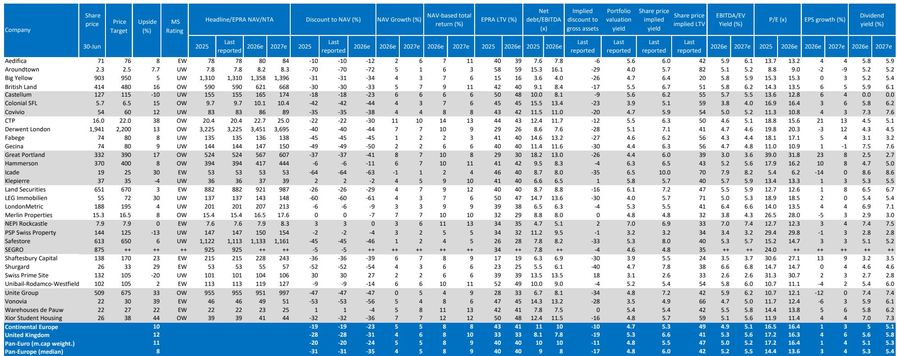
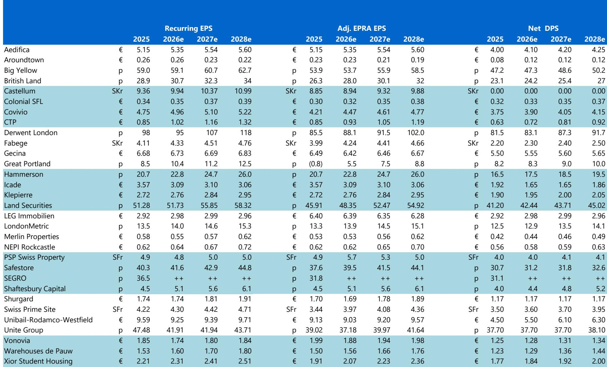
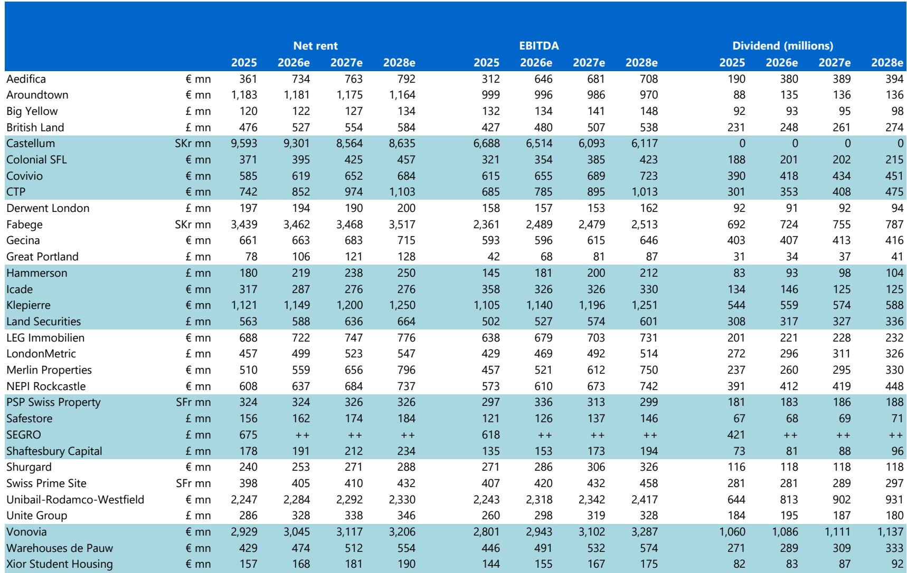

# 摩根斯坦利：欧洲地产股跌出了“不对称回报”，但真正的分化才刚刚开始

欧洲地产股在2026年6月微涨1%，但年初至今几乎原地踏步，而同期欧洲大盘股上涨了9%。这组数据本身并不令人意外——地产板块在过去几年一直是利率上行周期中受冲击最严重的资产之一。但摩根斯坦利在最新发布的月度图册中，给出了一个比表面行情更有价值的判断：板块的估值分歧正在极端化，而这种极端化本身，正在创造一种从“不对称风险”向“更对称风险回报”转变的条件。

简单说，欧洲地产股整体便宜，但真正值得下注的，不是便宜本身，而是哪些子行业和区域正在从“被无差别抛售”进入“被重新定价”的阶段。

这份报告覆盖了欧洲主要地产上市公司的估值、业绩分化、直接物业市场假设和宏观数据。它没有给出一个简单的“买入”或“卖出”指令，而是提供了一套判断框架。以下是我们从中提炼出的四个关键洞察。

## 1. 32%的NAV折价不是机会信号，而是市场在惩罚“没有故事”的公司

截至6月底，欧洲地产板块整体交易价格较净资产价值折价32%，远高于17%的历史平均水平。这个数字看起来像深度价值陷阱，但摩根斯坦利的数据揭示了一个更微妙的图景：估值离散度在过去几个月显著扩大，且仍高于10年均值。

这意味着，市场不是在无差别抛售所有地产股，而是在极其精细地区分谁有增长叙事、谁没有。折价的中位数是32%，但头部和尾部公司之间的差距已经拉大到历史极端水平。

从EPS收益率（每股收益/股价）的离散度来看，当前处于历史最低水平。这听起来矛盾，但解释起来并不复杂：EPS收益率离散度低，说明市场对盈利能力的定价趋同；而NAV折价离散度高，说明市场对资产质量的定价分歧极大。换句话说，市场对“这些公司今年能赚多少钱”的判断比较一致，但对“这些资产到底值多少钱”的判断出现了巨大分裂。

> **KC评论：** 这意味着，如果你只盯着“整体折价32%”这个数字去买地产ETF，你可能买到的是一篮子被市场认为“资产质量存疑”的公司。真正的机会在于识别那些被错误归类到“资产质量差”篮子里的公司。完整报告中的Exhibit 45和46提供了长达10年的估值离散度时间序列，是判断当前分歧是否已到极值的关键图表。

## 2. 英国正在跑赢欧洲大陆，但真正的分化在子行业之间

6月份的数据显示，英国地产股表现优于欧洲大陆，且这种优势在年初至今的维度上也在持续。摩根斯坦利对2026年的直接物业市场假设也支持这一分化：英国覆盖股票的平均资本价值增长预测为3%，而欧洲大陆仅为1%。

但更有意思的分化发生在子行业之间。零售和物流是年初至今表现最好的子板块，而住宅和自助仓储则落后。这背后是不同资产类别对利率环境和消费趋势的敏感度差异。

物流地产受益于电商渗透率的持续提升和供应链重构，租金增长预期相对稳定。零售地产则在经历了多年的“被抛弃”后，开始出现边际改善——英国零售物业2026年资本增长预测为3%，2027-2028年进一步提升至4%，且租金增长稳定在每年3%。这与市场普遍认为“零售地产已死”的叙事形成了有趣的对比。

> **KC评论：** “零售地产已死”可能是过去五年最被高估的市场共识。摩根斯坦利对英国零售物业的假设显示，2026-2028年资本增长和租金增长都处于正区间，且收益率压缩空间有限但存在。完整报告中的Exhibit 49和50提供了按国家、子行业拆解的资本增长、收益率变动和租金增长假设，是判断哪些子行业真正进入“修复期”的核心依据。

## 3. 伦敦和巴黎办公室市场正在走向完全不同的剧本

办公室资产是欧洲地产板块中争议最大的部分。摩根斯坦利的数据显示，伦敦和巴黎办公室市场正在走向完全不同的方向。

伦敦办公室2026年资本增长预测为3%，2027-2028年进一步提升至4%，租金增长在2026年达到5%，随后小幅回落。巴黎办公室则完全相反：资本增长预测为0，租金增长也为0，且收益率在2026年仍在扩张（4个基点），2027-2028年继续扩张。德国办公室和斯德哥尔摩办公室的预测甚至更悲观——资本增长均为负值。

这背后的驱动因素不难理解：伦敦办公室受益于相对灵活的监管环境和国际资本的持续流入，而巴黎和德国办公室则面临更严格的监管约束和结构性需求疲软。但真正值得关注的是，这种分化是否被当前股价充分定价。

从Exhibit 51和52的长期数据来看，伦敦、巴黎和法兰克福的租金走势和空置率变化存在明显的时滞和不对称性。伦敦租金在疫情后已经出现修复，而巴黎和法兰克福仍在底部徘徊。这意味着，即使宏观经济环境改善，不同城市办公室市场的复苏节奏也可能相差12-18个月。

> **KC评论：** 办公室投资不是“买欧洲还是买英国”的问题，而是“买伦敦还是买巴黎”的问题。摩根斯坦利的假设显示，伦敦办公室的修复周期可能比欧洲大陆领先至少一年。但完整报告中的Exhibit 51和52提供了1990年代至今的长期租金和空置率数据，能帮助判断当前伦敦的修复是否已进入“再加速”阶段，还是仅仅是“温和反弹”。

## 4. 报告尚未完全回答的关键问题：利率路径和资本流向

尽管摩根斯坦利的图册提供了详尽的估值和物业市场假设，但有一个关键变量并未被充分展开：利率路径的变化如何影响不同子行业的估值重估。

当前板块整体交易在14倍中位数PE，EBITDA/EV收益率与5年期互换利率之间的利差处于历史高位。这意味着地产股相对于债券的“风险溢价”很厚，但这也意味着如果利率维持高位或进一步上行，这种利差的保护垫会被快速侵蚀。

报告中对资本可用性的数据有提及，但没有给出具体的预测。从历史经验看，地产板块的估值修复通常需要两个条件同时具备：一是利率预期稳定或下行，二是资本重新流入。目前欧洲利率环境仍处于“higher for longer”的叙事中，而资本流向数据显示，机构资金对欧洲地产的配置仍在低位徘徊。

另一个未被充分回答的问题是：德国住宅市场何时触底。摩根斯坦利对德国住宅2026-2028年的资本增长预测仅为2%，远低于历史均值。考虑到德国住宅是欧洲地产板块中市值最大的子行业之一，它的企稳对整个板块的估值修复至关重要。但报告没有给出德国住宅市场触底的具体催化剂或时间表。

## 顺着这些未解问题，继续读完整报告

摩根斯坦利的这份月度图册不是一份“买入建议”，而是一套判断框架。它告诉你：当前欧洲地产股的整体估值处于历史低位，但真正的机会不在整体，而在分化——英国vs欧洲大陆、零售vs办公室、伦敦vs巴黎。它给出了一套完整的假设和数据，但最终的投资决策需要你自己判断哪些假设是合理的，哪些可能被打破。

我们每天由AI agent + 人工review生成国际投行中文摘要与KC评论，daily更新约10-40页，并整理当天最新数据图表合集，方便喂给AI，也方便人工快速把握market dynamics。如果你对欧洲地产的细分机会、利率敏感度分析或具体公司的估值拆解感兴趣，欢迎来星球微信群里继续讨论。

Personal reading notes and learning share only. Not investment advice.

