AI ADOPTION TRACKER

# June 2026: Adoption Rises to $20.6\%$

■ We update our AI adoption tracker through June 2026.

■ AI-related investment growth remains strong, particularly for semiconductors, where equity analysts expect global revenue to reach \$826bn (ann.) by the end of 2026. Consensus revenue forecasts for memory producers has been revised up by \$173bn (ann.) since the public release of ChatGPT in November 2022. AI-related investment in the US national accounts also continues to rise and now stands at \$425bn (1.3% of GDP) above its 2022 level. AI-related hardware shipments from South Korea rose to an all-time high of \$36bn/month USD in May and US AI hardware net imports remained elevated at \$52bn in April.

Sarah Dong
+1(212)357-9741 | sarah.dong@gs.com
GS & Co. LLC

Joseph Briggs
+1(212)902-2163 |
joseph.briggs@gs.com
GS & Co. LLC

AI adoption by firms rose by 1.1pp to $20.6\%$ among US establishments (with adoption expected to rise to $23.9\%$ in the next 6 months) according to the Census Bureau's Business Trends and Outlook Survey (BTOS). Information, professional services, finance, and education firms continue to lead adoption. At a detailed subsector level, publishing and some finance firms report adoption levels at or exceeding $50\%$ , and beverage and tobacco manufacturing and transportation firms report the largest expected increase in adoption over the next six months. Establishments with over 250 employees continue to lead in adoption $(40.7\%)$ , but medium-sized firms with 100-250 employees have accelerated their pace of adoption in recent months. Other business surveys note that many firms are beginning to experiment with agentic AI systems.

AI's labor market impact remains visible but narrow. We continue to observe employment drags in specific industries where AI-use cases have been established such as marketing, graphic design, customer service, and some tech occupations. However, this is offset by construction job growth in data center-exposed categories, which is up 251k since 2022 (relative to broader construction employment trends) and around 9k per month (latest 3m trend). The tech share of total employment continues to decline relative to the pre-2022 trend. The correlation between AI adoption and broad labor market slack measures remains limited, but there are early signs of a negative relationship with job growth and hours growth. Corporate layoffs attributed to AI accelerated to 38.6k employees in May, continuing a notable acceleration since the start of the year. $24\%$ of Russell 3000 companies mentioned AI and labor-related keywords in 2026Q1 earnings calls.

We continue to observe large impacts on labor productivity in the limited areas where generative AI has been deployed. Academic studies imply a 23% average uplift to productivity, while company anecdotes imply slightly larger efficiency gains of around 34%. Industries with higher AI adoption rates are now showing a slight acceleration in productivity growth over the past year in official US data.

## June 2026: Adoption Rises to $20.6\%$

## AI Investment

Exhibit 1: Semiconductor Company Revenues Are Projected to Rise to \$826bn (Annualized) by Year-end  
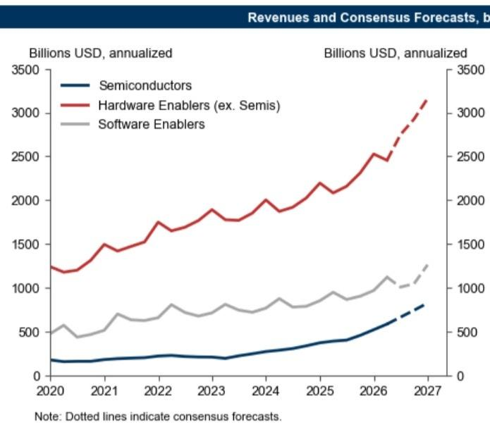  
Source: FactSet, GS Global Investment Research

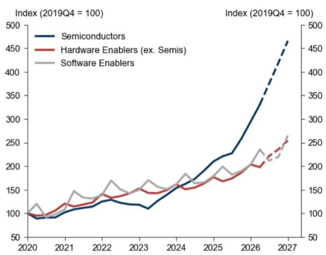  
Exhibit 2: Revenue Forecast Revisions Have Risen Notably for Memory Producers Over the Past Month

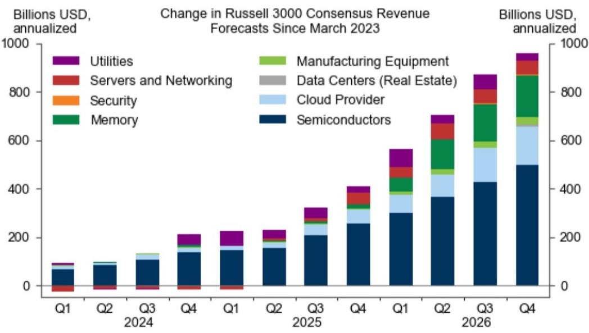  
Source: FactSet, GS Global Investment Research

AI-Related Investment Categories: National Accounts

## Exhibit 3: AI Hardware Investment in the US National Accounts Has Increased by \$425bn Since 2022 on a Three-Month Annualized Basis

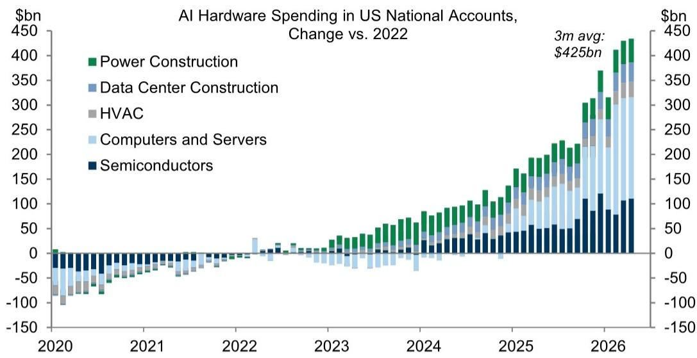  
Source: Census Bureau, Bureau of Economic Analysis, Haver Analytics, GS Global Investment Research

Exhibit 4: US Investment in AI-Related Hardware and Software Continued to Rise in Q1  
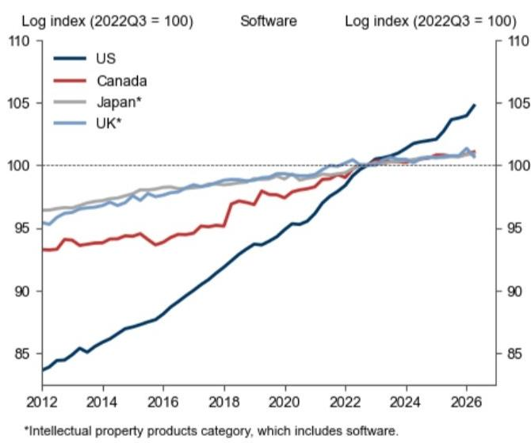  
Source: Haver Analytics, GS Global Investment Research

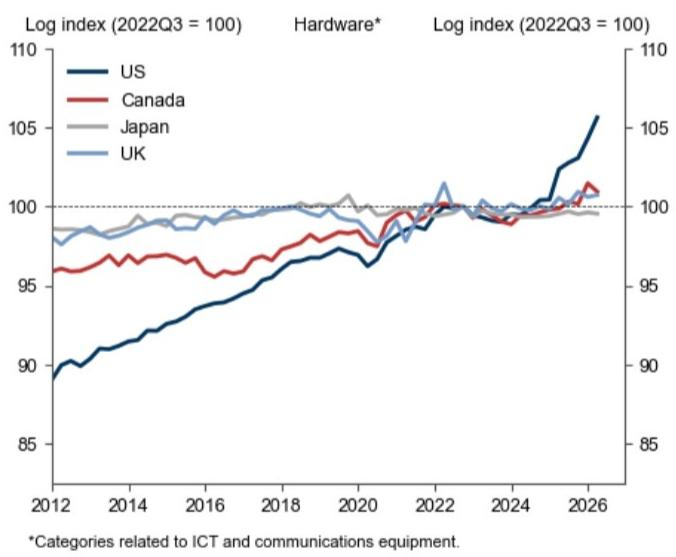

## Exhibit 5: AI-Related Manufacturing Shipments Soared to All-time Highs in South Korea...

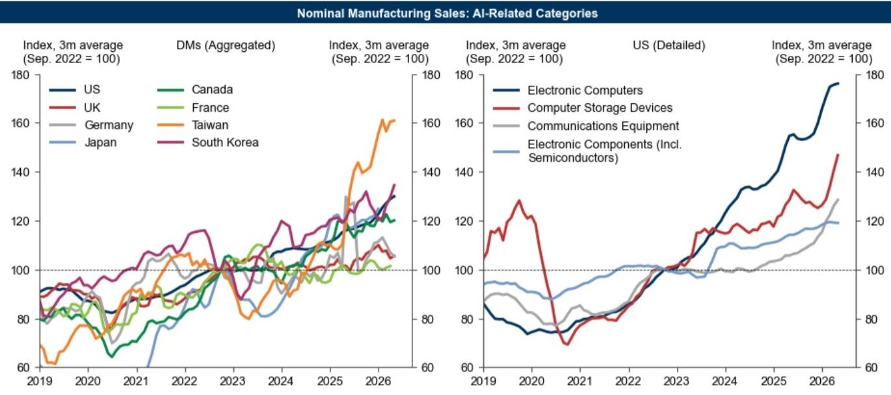  
Source: Haver Analytics, GS Global Investment Research

Exhibit 6: ...and US AI Hardware Net Imports Remained Elevated at \$52bn in April  
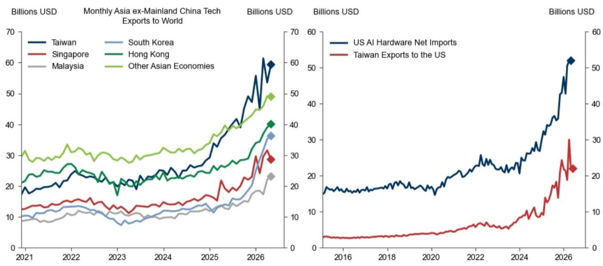  
Source: Haver Analytics, GS Global Investment Research

## AI Adoption by Firms

Note: The Census Bureau has rephrased questions from asking about AI use in “producing goods and services” to asking about AI use in “any business functions” starting from the December 4, 2025 release. There was a level shift observed in conjunction with the new question wording, and we will be tracking adoption rates under the new methodology going forward.

Exhibit 7: 20.6% of Firms Are Using Artificial Intelligence in Their Regular Business Functions (+1.1pp From May); 23.9% Expect to Use AI In the Next 6 Months  
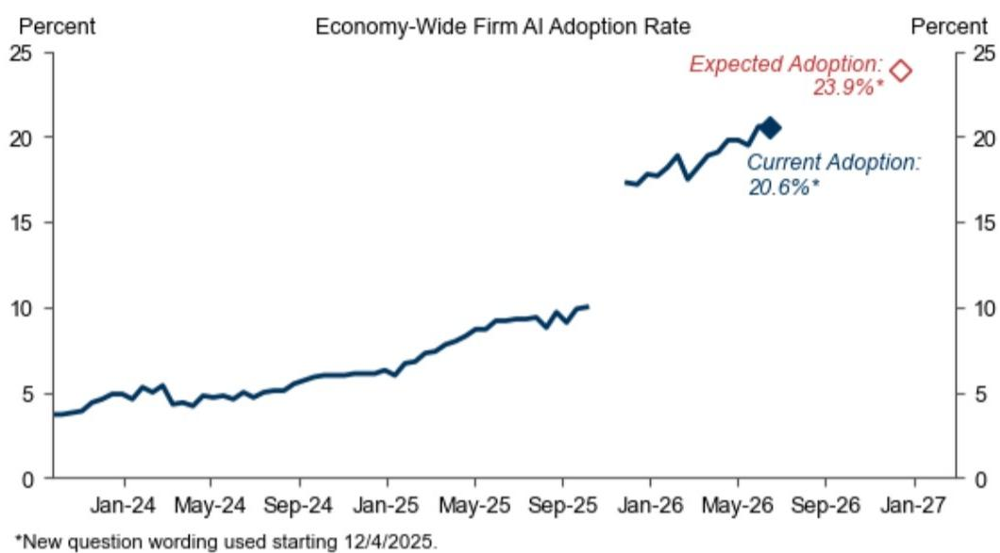  
\*New question wording used starting 12/4/2025.  
Source: Census Bureau, GS Global Investment Research

Exhibit 8: Over a Third of Information, Professional Services, Finance, and Education Firms Have Already Adopted AI  
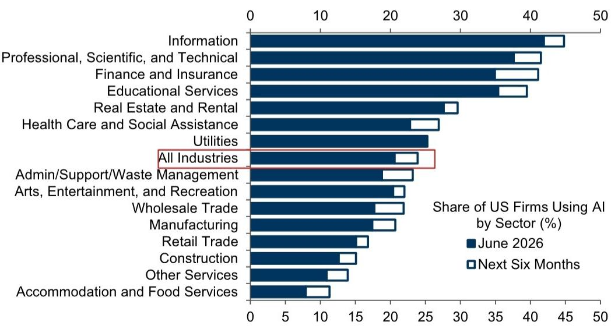  
Source: Census Bureau, GS Global Investment Research

Exhibit 9: Utilities and Education Firms Had the Largest Gains in Adoption Since Our Last Update

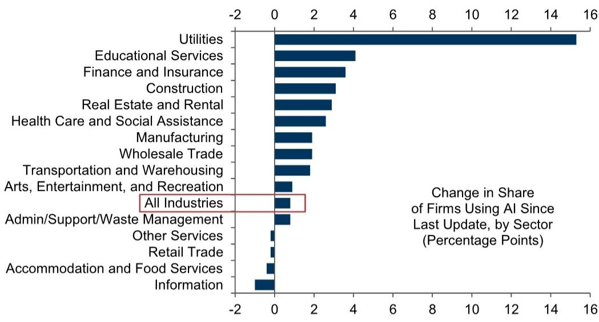  
Source: Census Bureau, GS Global Investment Research  
Exhibit 10: Among Subsectors, Current Adoption Stands Above $50\%$ in Publishing and Some Finance Firms

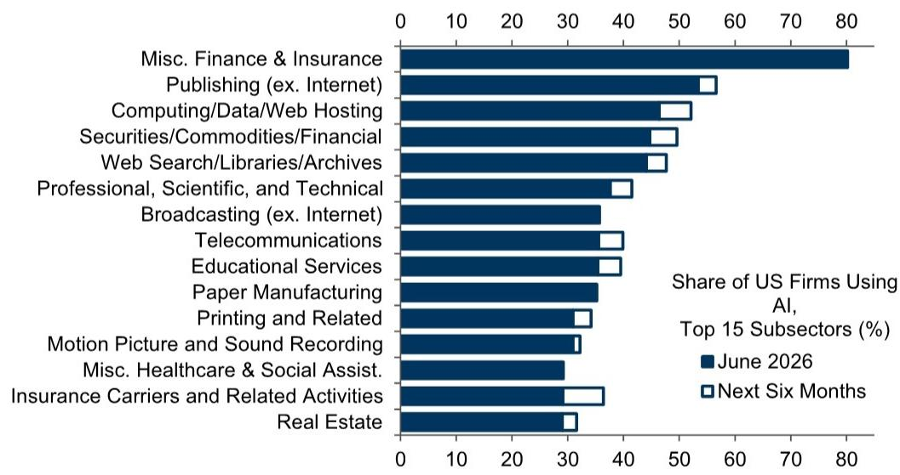  
Source: Census Bureau, GS Global Investment Research

Exhibit 11: Beverage and Tobacco Manufacturing and Transportation Firms Report the Largest Expected Adoption Increases in the Next 6 Months  
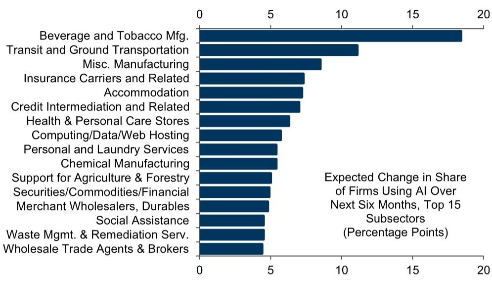  
Source: Census Bureau, GS Global Investment Research

Exhibit 12: Large Firms With 250+ Employees Continue to Lead Adoption at $40.7\%$

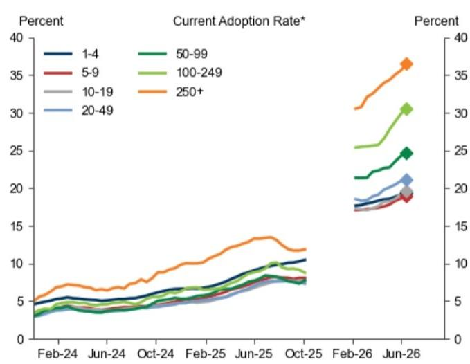  
Share of US Firms Using AI by Number of Employees  
\*6 survey moving average.

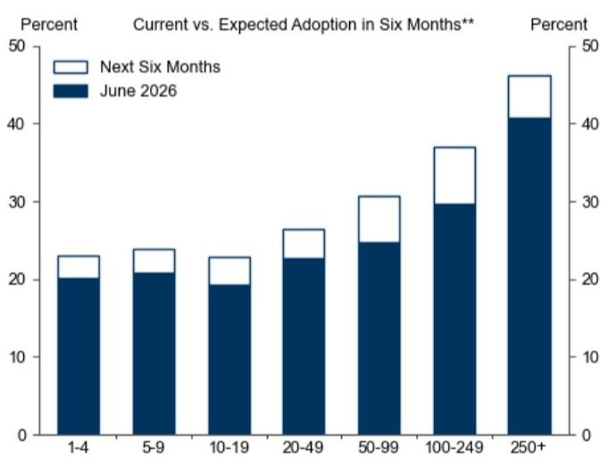  
\*\*Latest survey spot value.  
Source: Census Bureau, GS Global Investment Research

Exhibit 13: AI Adoption Remains Strongly Correlated With Our Subsector AI Automation Exposure Scores  
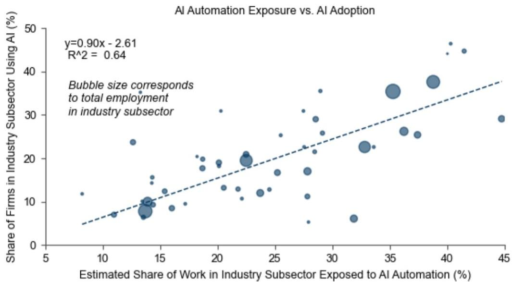  
Share of work exposed to AI automation is a GS estimate based on the methodology in “Global Economics Analyst: The Potentially Large Effects of Artificial Intelligence on Economic Growth” (March 26, 2023).  
Source: Census Bureau, GS Global Investment Research

Exhibit 14: $52\%$ of Surveyed Employees Have Adopted AI Agents at Work

<table><tr><td>Source</td><td>Date</td><td>Current Adoption / Impacts</td><td>Future Adoption / Impacts</td></tr><tr><td>WRITER</td><td>April 2026</td><td>52% of employees say they&#x27;ve used AI agents over the past year. Employees reported saving around 6 hours per week with AI tools, while executives reported saving twice as much time at nearly 12 hours per week. The top use cases include editing and proofreading, personalized communication, and data analysis and insights. Few surveyed leaders reported seeing significant ROI from generative AI (29%) or AI agents (23%).</td><td>69% of executives report doing layoffs due to AI, but 39% admit their company doesn&#x27;t have a formal strategy to drive revenue from AI.</td></tr><tr><td>Harvard Business Review and Appian</td><td>April 2026</td><td>Most organizations have moved beyond the experimentation phase with AI and 58% of surveyed organizations have AI in production. 69% of respondents reported that legacy systems are limiting their organization&#x27;s ability to scale AI. Most respondents are seeing some returns from AI investments, but only 16% report realizing a high degree of measurable value.</td><td>Many organizations are currently exploring agentic AI systems (under consideration by 62% of respondents and currently used by 25%). Although nearly all organizations agree that clear guardrails are needed for AI agent adoption, fewer than half say their organization has defined such rules.</td></tr><tr><td>Gallup</td><td>April 2026</td><td>Half of all surveyed adults reported using AI in their jobs and 27% of employees in AI-adopting organizations say that their workplace has changed in disruptive ways due to AI in the past year. 65% of adopters said that AI has improved their productivity and efficiency, regardless of how often they personally use AI at work.</td><td>Eighteen percent of all U.S. employees say it is very or somewhat likely their job will be eliminated within the next five years due to AI or automation. Among employees working in organizations that have adopted AI, that share rises to 23%. However, employees in AI-adopting organizations were more likely to report both current expansions and reductions in headcount.</td></tr><tr><td>NVIDIA</td><td>March 2026</td><td>64% of respondents said their organizations are actively using AI in their operations. 28% said they&#x27;re still in the assessment phase, while 8% said they&#x27;re not using AI and have no plans to. Regional adoption among respondents was 70% in North America, 65% in EMEA, and 63% in APAC. Larger companies (with over 1000 employees) demonstrated broader adoption, deployed more use cases, and reported greater ROI. More than half of respondents (53%) said improved employee productivity was one of the biggest impacts AI had on business operations.</td><td>86% of respondents said their AI budgets would increase this year and nearly 40% said budgets would increase by 10% or more. Respondents reported that workflow and operations and retaining the right expertise to scale AI solutions were the key challenges to adoption.</td></tr><tr><td>Thomson Reuters</td><td>February 2026</td><td>40% of respondents said their organizations were using generative AI, up from 22% a year ago. Publicly available tools such as ChatGPT are still the most commonly used platform. In contrast, only 15% of respondents said their organization use agentic AI tools.</td><td>53% of respondents said their organizations are either in the planning or consideration phase for agentic AI. 77% of professionals say they expect it to be a central part of their workflow by 2030.</td></tr><tr><td>Deloitte</td><td>January 2026</td><td>In the latest survey, 34% of companies were starting to use AI to deeply transform their businesses, 30% were designing key processes around AI, and the remaining 37% were using AI at the surface level with little or no change to underlying business processes. 84% of companies have not redesignated jobs or work tasks around AI capabilities. 25% of surveyed leaders reported that AI is having a transformative effect on their organizations, more than double from 12% a year ago.</td><td>Survey results showed that insufficient employee skills were the largest barrier to integrating AI into existing workflows. Nearly three-quarters of surveyed companies expect to be using agentic AI at least moderately in two years.</td></tr><tr><td>Gallup</td><td>December 2025</td><td>The percentage of US employees who reported using AI at work at least a few times a week increased from 19% in 2025Q2 to 23% in Q3. Unsurprisingly, employees working in knowledge-based jobs (such as tech or professional services) were more likely to use AI than those in frontline positions. Most common use cases include using AI to consolidate information or data, idea generation, and automating basic tasks. Users most often use AI chatbots and virtual assistants.</td><td>Gallup research has shown that employee AI adoption is strongly associated with having greater managerial support for AI and strategic integration of AI in their role, indicating that a strategic people-first approach is needed for effective AI adoption.</td></tr><tr><td>McKinsey</td><td>November 2025</td><td>88% of surveyed organizations are regularly using AI in at least one business function, up from 78% last year. However, most surveyed organizations are still in the experimentation / piloting phase of AI and nearly two-thirds have not begun scaling AI across the enterprise. 39% reported experimenting with AI agents specifically and the use of AI agents is most commonly reported among TMT and healthcare businesses. Respondents reported the greatest revenue benefits from AI in marketing and sales, strategy and corporate finance, and product development. A plurality of respondents had little to no change in employee headcount due to AI use over the past year.</td><td>32% of respondents expect an overall workforce reduction of 3% or more due to AI use and larger organizations are more likely to expect workforce reductions. Inaccuracy is the AI-related risk that was most commonly experienced and the top priority that organizations are working to mitigate going forward.</td></tr><tr><td>Wharton Human-AI Research and GBK Collective</td><td>October 2025</td><td>Usage of generative AI among enterprise leaders has risen sharply this year and stands at 46% (+17pp yoy). The most common use cases include data analysis, document summarization, and document editing / writing. Nearly three-quarters already see positive ROI on generative AI and four in five expect positive returns within two to three years. Larger enterprises with over $2B in annual revenue were more likely to report that it is &quot;too early&quot; to measure productivity outcomes of their AI initiatives as they navigate integration complexity.</td><td>88% of surveyed business leaders expected an increase in AI spend at their organization in the next 12 months (+16pp yoy). 11% of these leaders are funding AI by cutting spending in other areas, with reallocation most commonly coming from legacy IT and HR programs.</td></tr><tr><td>Gartner</td><td>June 2025</td><td>45% of surveyed firms with high AI maturity reported that their AI initiatives remained in production for 3+ years to ensure sustained impact and value, compared to 20% in low-maturity organizations. 91% of leaders from high-maturity organizations have appointed dedicated AI leaders.</td><td>Security threats, finding the right use cases, and data availability / quality were among the top barriers for AI implementation reported.</td></tr></table>

Green shading indicates surveys added since the last update.  
Source: GS Global Investment Research

## AI's Impact on the Labor Market

Labor Outcomes  
Exhibit 15: Some Signs of a Negative Relationship Between AI Adoption and Job Growth and Hours Worked Growth  
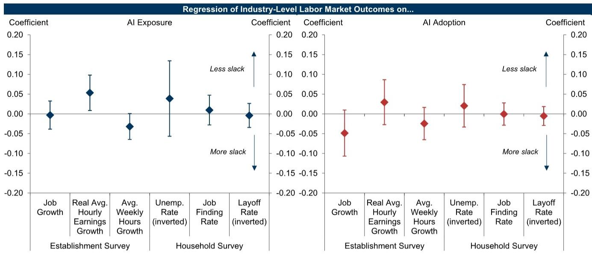  
Note: All dependent variables are taken as the deviation from 2015-19 averages. Average coefficient over the past three months is plotted.  
Source: IPUMS, US Bureau of Labor Statistics, Census Bureau, GS Global Investment Research

## Exhibit 16: Still No Statistically Significant Relationship Between AI and Unemployment or Employment Growth

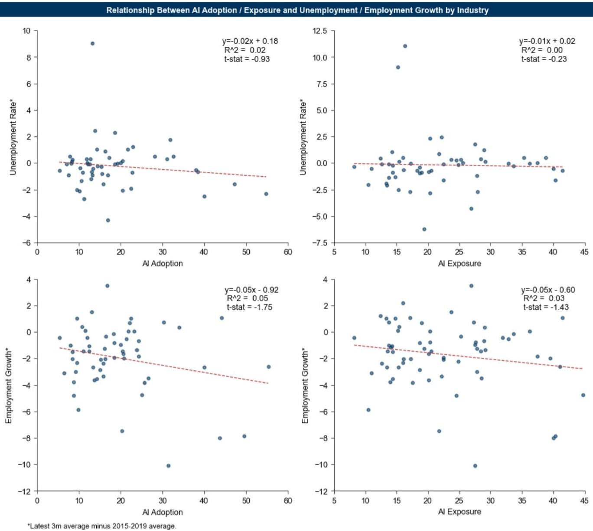  
Source: US Bureau of Labor Statistics, IPUMS, GS Global Investment Research

Source: US Bureau of Labor Statistics, GS Global Investment Research

Exhibit 17: Employment Growth Continues to Underperform in Occupations Where Anecdotes Suggest AI Is Having an Impact, but Has Recovered in Some Non-Tech Sectors...

Year-over-year Payrolls Growth Deviation From 2015-2019 Trend  
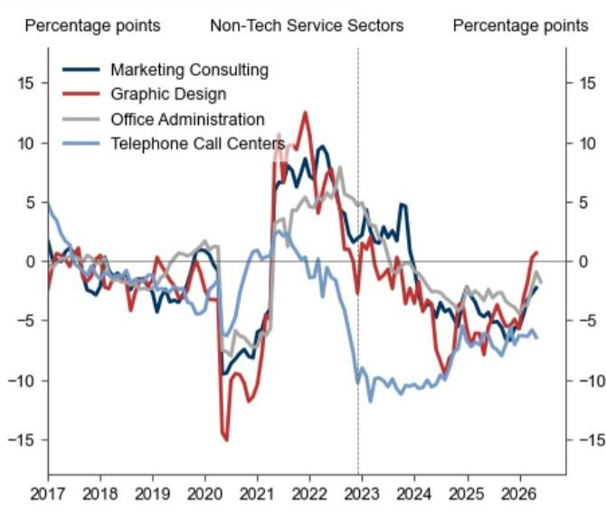  
Source: US Bureau of Labor Statistics, Haver Analytics, GS Global Investment Research

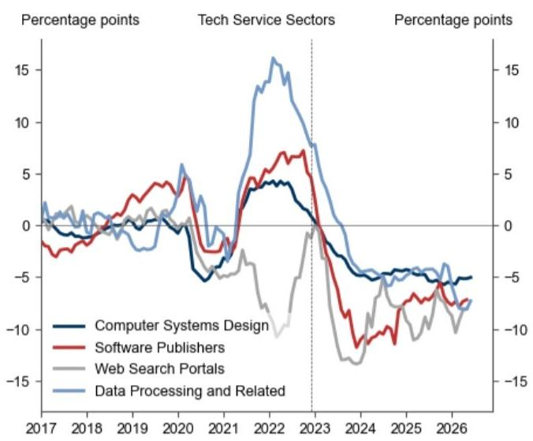

Exhibit 18: ...But the Latest Impulse Has Softened Somewhat at Just -2k Jobs  
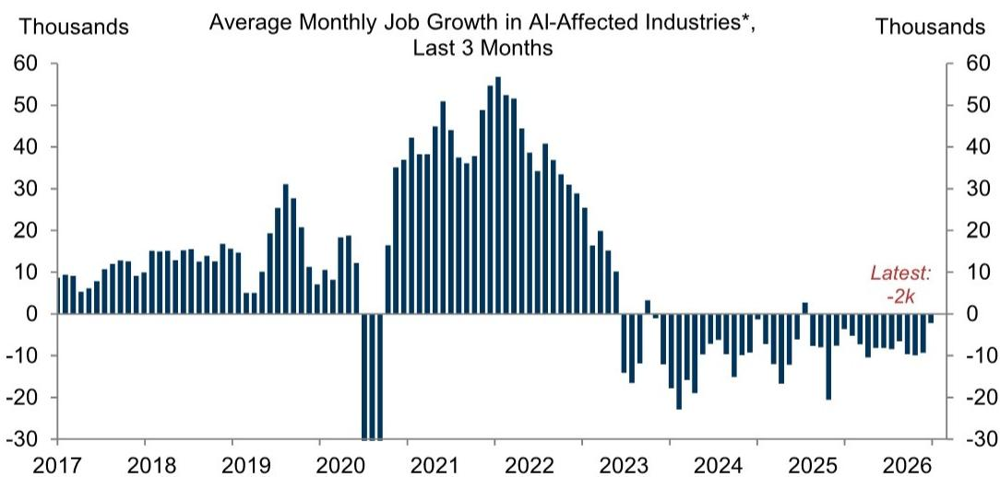  
\*Management consulting, graphic design, office administration, telephone call centers, computer systems, software publishers, web search, data processing, movie production, broadcasting, publishing, document preparation services.

Exhibit 19: Tech's Employment Share Remains Low Relative to Its Long-run Trend  
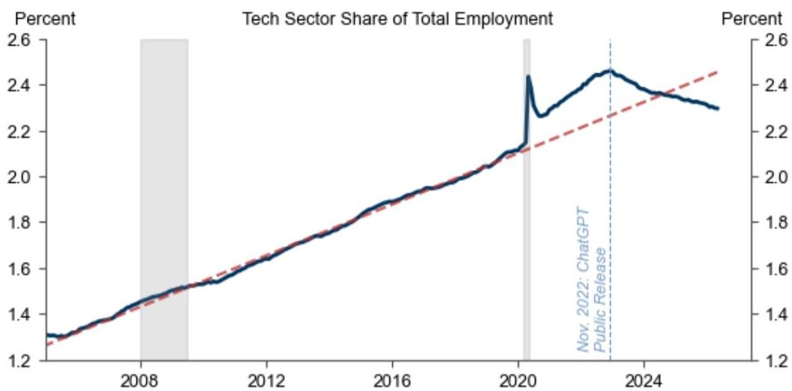  
Note: Tech refers to the software publishers, data processing and related, web search and related, and computer systems design subsectors. Red line represents 2007-2019 trend.  
Source: US Bureau of Labor Statistics, Haver Analytics, GS Global Investment Research  
Exhibit 20: Unemployment Among Young Tech Workers Has Fallen Back in Line With Unemployment for All Tech Workers

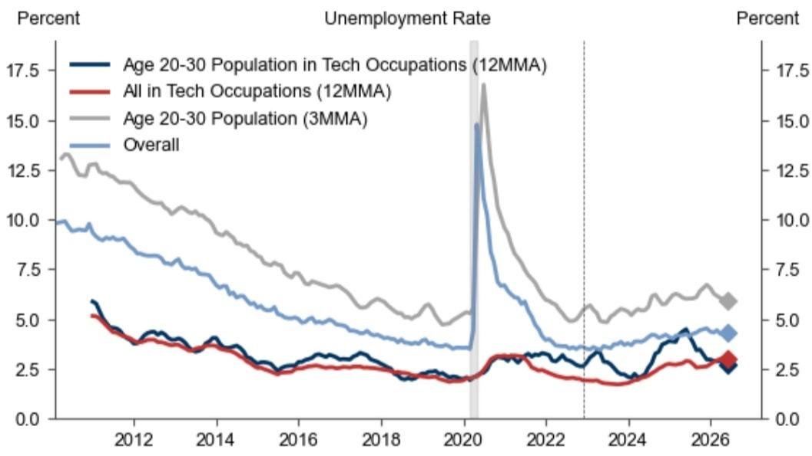  
Source: US Bureau of Labor Statistics, IPUMS, GS Global Investment Research

## Exhibit 21: We Continue to Observe a Slight Positive Correlation Between AI Adoption and Unemployment Among Younger Workers

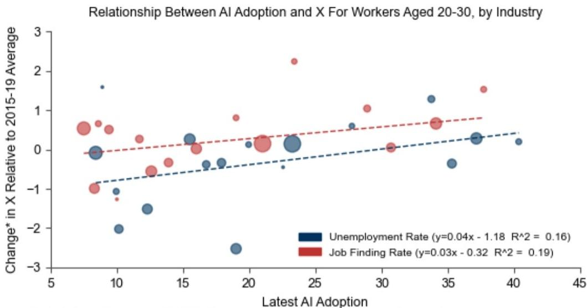  
\*Latest 6-month average. Bubble size corresponds to total industry employment.  
Source: IPUMS, US Bureau of Labor Statistics, Census Bureau, GS Global Investment Research

Exhibit 22: AI Was Cited in Layoff Announcements Affecting 38.6k Employees in May  
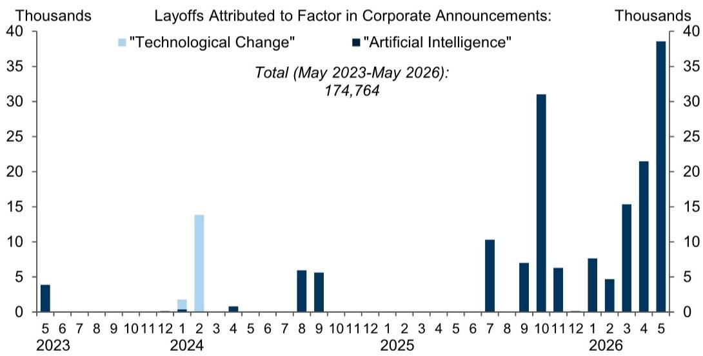  
Source: Challenger, Gray & Christmas, GS Global Investment Research

## Labor Demand

Exhibit 23: AI Job Postings Remain Skewed Toward Information and Professional Services in the US  
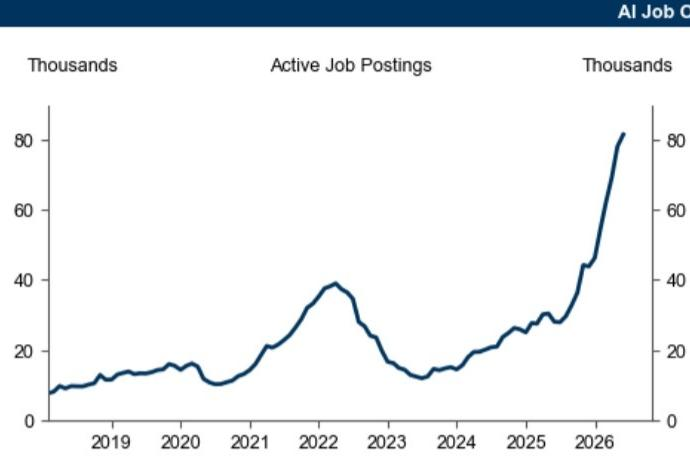

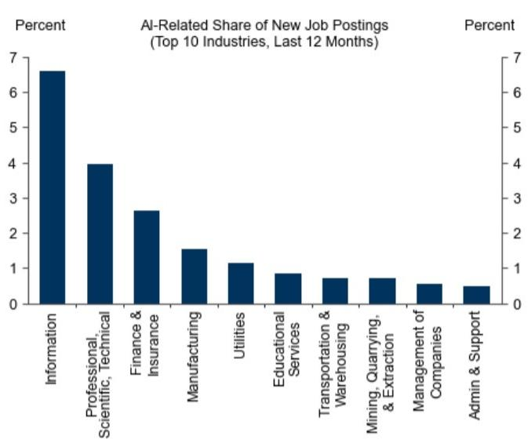  
Source: University of Maryland, LinkUp, GS Global Investment Research

Exhibit 24: Share of AI-Related Job Postings Has Risen in Most DMs and Accelerated Especially in the UK Last Month  
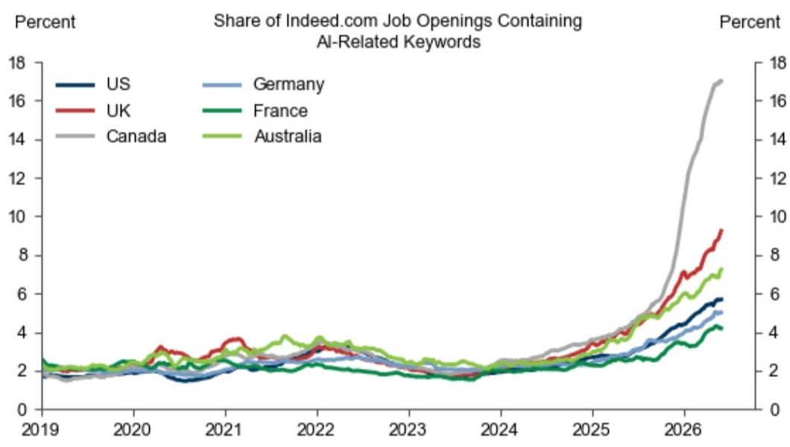  
Source: Indeed Hiring Lab, GS Global Investment Research

Exhibit 25: Construction Employment in Data Center-Exposed Categories Has Risen by 1.6% Since Year Ago (and by +251k Since 2022, Relative to Broader Construction Employment Trends)

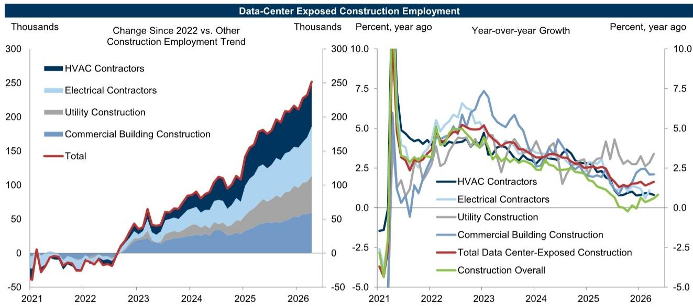  
Source: US Bureau of Labor Statistics, Haver Analytics, GS Global Investment Research

## Exhibit 26: $24\%$ of Russell 3000 Companies Mentioned AI and Labor-Related Keywords in 2026Q1 Earnings Calls

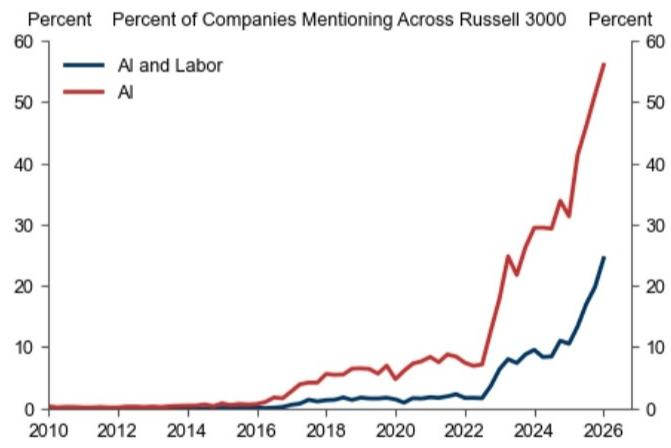  
Source: GS Data Works, GS Global Investment Research

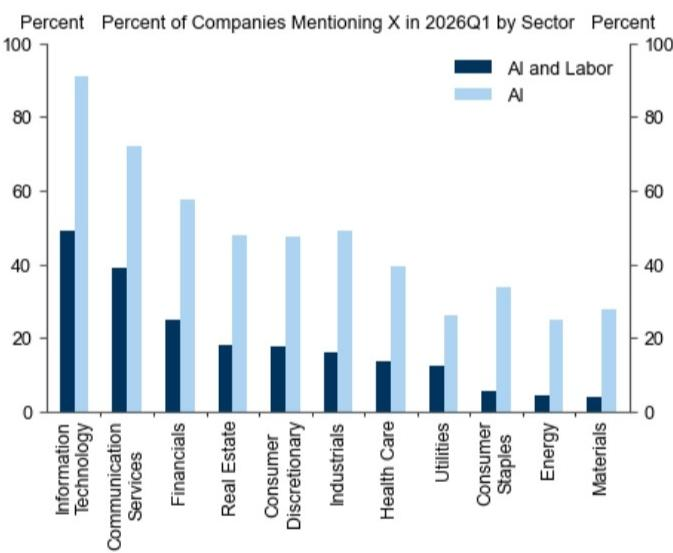

## AI's Impact on Productivity

Exhibit 27: Evidence From Academic Studies Suggests AI Adoption Boosts Labor Productivity by Around 23% on Average...

  
Source: GS Global Investment Research

Exhibit 28: ... And Company Anecdotes Suggest an Average Productivity Boost of $34\%$  
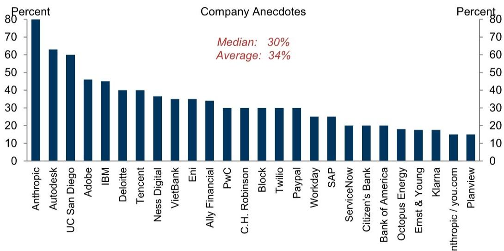  
Source: Company data, Data compiled by GS Global Investment Research

## Exhibit 29: Industries with Higher Adoption Rates Continue to Show Slightly Stronger Productivity Growth

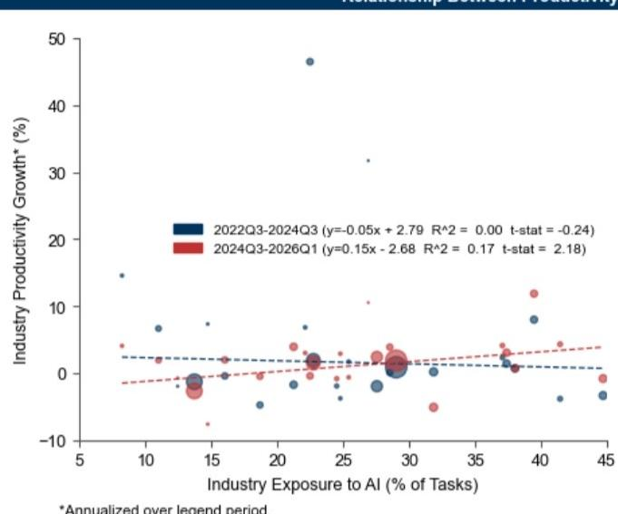  
Note: Bubble size corresponds to total industry employment.

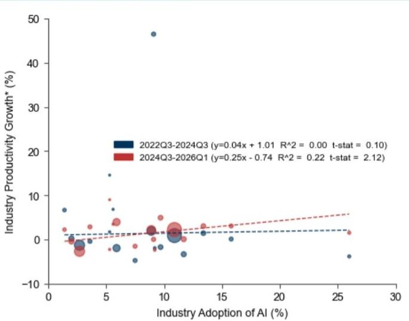  
Source: US Bureau of Labor Statistics, Bureau of Economic Analysis, Haver Analytics, GS Global Investment Research

## Exhibit 30: No Relationship Between Company Level AI Exposure and Margin Growth

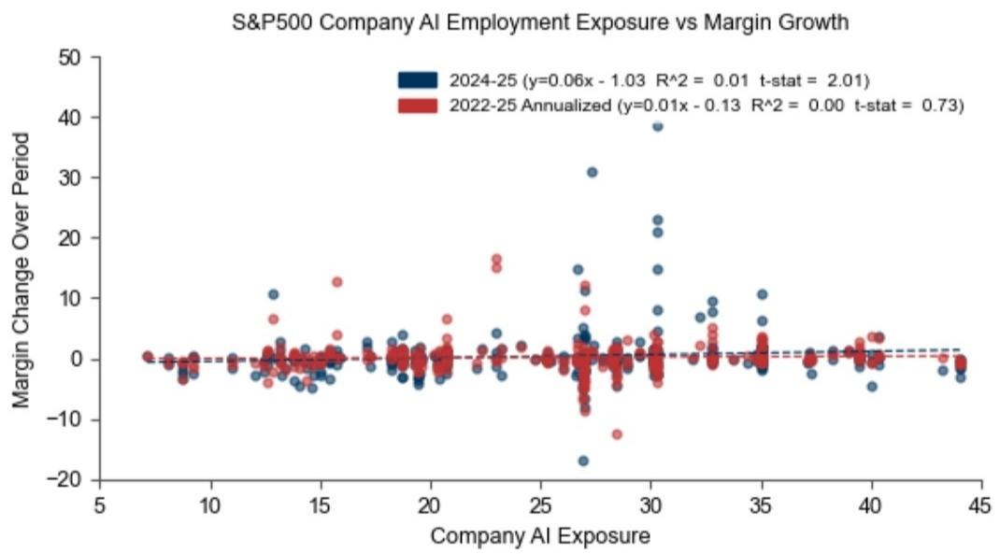  
Source: FactSet, GS Global Investment Research

## Latest GS Research on Artificial Intelligence

The Credit Line: AI-Related Signals From Corporate Credit Commentary, June 29

■ Top of Mind: An AI job apocalypse?, June 25

Global Markets Analyst: Where the AI Boom Stands Now—Markets Ahead of the Macro, June 22

Americas Technology: Hardware: Traditional & accelerated servers: An industry primer, June 22

GS SUSTAIN INSIGHTS: The Future of Work - Labor Shortages, Automation, and AI, June 18

US Daily: Are College Students Adjusting to AI-Driven Labor Market Shifts?, June 15

For research from prior quarters, see the Artificial Intelligence page on our publishing portal.

The Global Economics Team

Jan Hatzius +1(212)902-0394 jan.hatzius@gs.com GS & Co. LLC

Joseph Briggs +1(212)902-2163 joseph.briggs@gs.com GS & Co. LLC

Sarah Dong +1(212)357-9741 sarah.dong@gs.com GS & Co. LLC

Megan Peters

+44(20)7051-2058

megan.l.peters@gs.com

GS International

## Disclosure Appendix

## Reg AC

We, Sarah Dong and Joseph Briggs, hereby certify that all of the views expressed in this report accurately reflect our personal views, which have not been influenced by considerations of the firm's business or client relationships.

Unless otherwise stated, the individuals listed on the cover page of this report are analysts in GS' Global Investment Research division.

Contributing Authors: Sarah Dong GS & Co. LLC, Joseph Briggs GS & Co. LLC.

Unless otherwise stated, the individuals listed in the Contributing Authors disclosure of this report are analysts in GS' Global Investment Research division.

## Disclosures

## Regulatory disclosures

## Disclosures required by United States laws and regulations

See company-specific regulatory disclosures above for any of the following disclosures required as to companies referred to in this report: manager or co-manager in a pending transaction; 1% or other ownership; compensation for certain services; types of client relationships; managed/co-managed public offerings in prior periods; directorships; for equity securities, market making and/or specialist role. GS trades or may trade as a principal in debt securities (or in related derivatives) of issuers discussed in this report.

The following are additional required disclosures: Ownership and material conflicts of interest: GS policy prohibits its analysts, professionals reporting to analysts and members of their households from owning securities of any company in the analyst's area of coverage. Analyst compensation: Analysts are paid in part based on the profitability of GS, which includes investment banking revenues. Analyst as officer or director: GS policy generally prohibits its analysts, persons reporting to analysts or members of their households from serving as an officer, director or advisor of any company in the analyst's area of coverage. Non-U.S. Analysts: Non-U.S. analysts may not be associated persons of GS & Co. LLC and therefore may not be subject to FINRA Rule 2241 or FINRA Rule 2242 restrictions on communications with a subject company, public appearances and trading in securities covered by the analysts.

## Additional disclosures required under the laws and regulations of jurisdictions other than the United States

Additional disclosures required under the laws and regulations of jurisdictions other than the United States

The following disclosures are those required by the jurisdiction indicated, except to the extent already made above pursuant to United States laws and regulations. Australia: GS Australia Pty Ltd and its affiliates are not authorised deposit-taking institutions (as that term is defined in the Banking Act 1959 (Cth)) in Australia and do not provide banking services, nor carry on a banking business, in Australia. This research, and any access to it, is intended only for “wholesale clients” within the meaning of the Australian Corporations Act, unless otherwise agreed by GS. In producing research reports, members of Global Investment Research of GS Australia may attend site visits and other meetings hosted by the companies and other entities which are the subject of its research reports. In some instances the costs of such site visits or meetings may be met in part or in whole by the issuers concerned if GS Australia considers it is appropriate and reasonable in the specific circumstances relating to the site visit or meeting. To the extent that the contents of this document contains any financial product advice, it is general advice only and has been prepared by GS without taking into account a client’s objectives, financial situation or needs. A client should, before acting on any such advice, consider the appropriateness of the advice having regard to the client’s own objectives, financial situation and needs. A copy of certain GS Australia and New Zealand disclosure of interests and a copy of GS’ Australian Sell-Side Research Independence Policy Statement are available at: https://www.goldmansachs.com/disclosures/australia-new-zealand/index.html. Brazil: Disclosure information in relation to CVM Resolution n. 20 is available at https://www.gs.com/worldwide/brazil/area/gir/index.html. Where applicable, the Brazil-registered analyst primarily responsible for the content of this research report, as defined in Article 20 of CVM Resolution n. 20, is the first author named at the beginning of this report, unless indicated otherwise at the end of the text. Canada: This information is being provided to you for information purposes only and is not, and under no circumstances should be construed as, an advertisement, offering or solicitation by GS & Co. LLC for purchasers of securities in Canada to trade in any Canadian security. GS & Co. LLC is not registered as a dealer in any jurisdiction in Canada under applicable Canadian securities laws and generally is not permitted to trade in Canadian securities and may be prohibited from selling certain securities and products in certain jurisdictions in Canada. If you wish to trade in any Canadian securities or other products in Canada please contact GS Canada Inc., an affiliate of The GS Group Inc., or another registered Canadian dealer. Hong Kong: Further information on the securities of covered companies referred to in this research may be obtained on request from GS (Asia) L.L.C. India: Further information on the subject company or companies referred to in this research may be obtained from GS (India) Securities Private Limited, Research Analyst - SEBI Registration Number INH000001493, 10th Floor, Ascent-Worli, Sudam Kalu Ahire Marg, Worli, Mumbai-400 025, India, Corporate Identity Number U74140MH2006FTC160634, Phone +91 22 6616 9000, Fax +91 22 6616 9001. GS may beneficially own 1% or more of the securities (as such term is defined in clause 2 (h) the Indian Securities Contracts (Regulation) Act, 1956) of the subject company or companies referred to in this research report. Registration granted by SEBI and certification from NISM in no way guarantee performance of the intermediary or provide any assurance of returns to investors. GS (India) Securities Private Limited compliance officer and investor grievance contact details, a copy of the annual compliance audit report and other relevant information and disclosures can be found at this link:

https://www.goldmansachs.com/worldwide/india/research-analyst. Japan: See below. Korea: This research, and any access to it, is intended only for “professional investors” within the meaning of the Financial Services and Capital Markets Act, unless otherwise agreed by GS. Further information on the subject company or companies referred to in this research may be obtained from GS (Asia) L.L.C., Seoul Branch. New Zealand: GS New Zealand Limited and its affiliates are neither “registered banks” nor “deposit takers” (as defined in the Reserve Bank of New Zealand Act 1989) in New Zealand. This research, and any access to it, is intended for “wholesale clients” (as defined in the Financial Advisers Act 2008) unless otherwise agreed by GS. A copy of certain GS Australia and New Zealand disclosure of interests is available at: https://www.goldmansachs.com/disclosures/australia-new-zealand/index.html. Russia: Research reports distributed in the Russian Federation are not advertising as defined in the Russian legislation, but are information and analysis not having product promotion as their main purpose and do not provide appraisal within the meaning of the Russian legislation on appraisal activity. Research reports do not constitute a personalized investment recommendation as defined in Russian laws and regulations, are not addressed to a specific client, and are prepared without analyzing the financial circumstances, investment profiles or risk profiles of clients. GS assumes no responsibility for any investment decisions that may be taken by a client or any other person based on this research report. Singapore: GS (Singapore) Pte. (Company Number: 198602165W), which is regulated by the Monetary Authority of Singapore, accepts legal responsibility for this research, and should be contacted with respect to any matters arising from, or in connection with, this research. Taiwan: This material is for reference only and must not be reprinted without permission. Investors should carefully consider their own investment risk. Investment results are the responsibility of the individual investor. United Kingdom: Persons who would be categorized as retail clients in the United Kingdom, as such term is defined in the rules of the Financial Conduct Authority, should read this research in conjunction with prior GS on the covered companies referred to herein and should refer to the risk warnings that have been sent to them by GS International. A copy of these risks warnings, and a glossary of certain financial terms used in this report, are

available from GS International on request.

European Union and United Kingdom: Disclosure information in relation to Article 6 (2) of the European Commission Delegated Regulation (EU) (2016/958) supplementing Regulation (EU) No 596/2014 of the European Parliament and of the Council (including as that Delegated Regulation is implemented into United Kingdom domestic law and regulation following the United Kingdom's departure from the European Union and the European Economic Area) with regard to regulatory technical standards for the technical arrangements for objective presentation of investment recommendations or other information recommending or suggesting an investment strategy and for disclosure of particular interests or indications of conflicts of interest is available at https://www.gs.com/disclosures/europeanpolicy.html which states the European Policy for Managing Conflicts of Interest in Connection with Investment Research.

Japan: GS Japan Co., Ltd. is a Financial Instrument Dealer registered with the Kanto Financial Bureau under registration number Kinsho 69, and a member of Japan Securities Dealers Association, Financial Futures Association of Japan Type II Financial Instruments Firms Association, and Investment Management Association of Japan. Sales and purchase of equities are subject to commission pre-determined with clients plus consumption tax. See company-specific disclosures as to any applicable disclosures required by Japanese stock exchanges, the Japanese Securities Dealers Association or the Japanese Securities Finance Company.

## Global product; distributing entities

GS Global Investment Research produces and distributes research products for clients of GS on a global basis. Analysts based in GS offices around the world produce research on industries and companies, and research on macroeconomics, currencies, commodities and portfolio strategy. This research is disseminated in Australia by GS Australia Pty Ltd (ABN 21 006 797 897); in Brazil by GS do Brasil Corretora de Títulos e Valores Mobiliários S.A.; Public Communication Channel GS Brazil: 0800 727 5764 and / or contatogoldmanbrasil@gs.com. Available Weekdays (except holidays), from 9am to 6pm. Canal de Comunicação com o Público GS Brasil: 0800 727 5764 e/ou contatogoldmanbrasil@gs.com. Horário de funcionamento: segunda-feira à sexta-feira (exceto feriados), das 9h às 18h; in Canada by GS & Co. LLC; in Hong Kong by GS (Asia) L.L.C.; in India by GS (India) Securities Private Ltd.; in Japan by GS Japan Co., Ltd.; in the Republic of Korea by GS (Asia) L.L.C., Seoul Branch; in New Zealand by GS New Zealand Limited; in Russia by OOO GS; in Singapore by GS (Singapore) Pte. (Company Number: 198602165W); and in the United States of America by GS & Co. LLC. GS International has approved this research in connection with its distribution in the United Kingdom.

GS International (“GSI”), authorised by the Prudential Regulation Authority (“PRA”) and regulated by the Financial Conduct Authority (“FCA”) and the PRA, has approved this research in connection with its distribution in the United Kingdom.

European Economic Area: GS Bank Europe SE (“GSBE”) is a credit institution incorporated in Germany and, within the Single Supervisory Mechanism, subject to direct prudential supervision by the European Central Bank and in other respects supervised by German Federal Financial Supervisory Authority (Bundesanstalt für Finanzdienstleistungsaufsicht, BaFin) and Deutsche Bundesbank and disseminates research within the European Economic Area.

## General disclosures

This research is for our clients only. Other than disclosures relating to GS, this research is based on current public information that we consider reliable, but we do not represent it is accurate or complete, and it should not be relied on as such. The information, opinions, estimates and forecasts contained herein are as of the date hereof and are subject to change without prior notification. We seek to update our research as appropriate, but various regulations may prevent us from doing so. Other than certain industry reports published on a periodic basis, the large majority of reports are published at irregular intervals as appropriate in the analyst's judgment.

GS conducts a global full-service, integrated investment banking, investment management, and brokerage business. We have investment banking and other business relationships with a substantial percentage of the companies covered by Global Investment Research. GS & Co. LLC, the United States broker dealer, is a member of SIPC (https://www.sipc.org).

Our salespeople, traders, and other professionals may provide oral or written market commentary or trading strategies to our clients and principal trading desks that reflect opinions that are contrary to the opinions expressed in this research. Our asset management area, principal trading desks and investing businesses may make investment decisions that are inconsistent with the recommendations or views expressed in this research.

We and our affiliates, officers, directors, and employees will from time to time have long or short positions in, act as principal in, and buy or sell, the securities or derivatives, if any, referred to in this research, unless otherwise prohibited by regulation or GS policy.

The views attributed to third party presenters at GS arranged conferences, including individuals from other parts of GS, do not necessarily reflect those of Global Investment Research and are not an official view of GS.

Any third party referenced herein, including any salespeople, traders and other professionals or members of their household, may have positions in the products mentioned that are inconsistent with the views expressed by analysts named in this report.

This research is focused on investment themes across markets, industries and sectors. It does not attempt to distinguish between the prospects or performance of, or provide analysis of, individual companies within any industry or sector we describe.

Any trading recommendation in this research relating to an equity or credit security or securities within an industry or sector is reflective of the investment theme being discussed and is not a recommendation of any such security in isolation.

This research is not an offer to sell or the solicitation of an offer to buy any security in any jurisdiction where such an offer or solicitation would be illegal. It does not constitute a personal recommendation or take into account the particular investment objectives, financial situations, or needs of individual clients. Clients should consider whether any advice or recommendation in this research is suitable for their particular circumstances and, if appropriate, seek professional advice, including tax advice. The price and value of investments referred to in this research and the income from them may fluctuate. Past performance is not a guide to future performance, future returns are not guaranteed, and a loss of original capital may occur. Fluctuations in exchange rates could have adverse effects on the value or price of, or income derived from, certain investments.

Certain transactions, including those involving futures, options, and other derivatives, give rise to substantial risk and are not suitable for all investors. Investors should review current options and futures disclosure documents which are available from GS sales representatives or at https://www.theocc.com/about/publications/character-risks.jsp and https://www.goldmansachs.com/disclosures/cftc\_fcm\_disclosures. Transaction costs may be significant in option strategies calling for multiple purchase and sales of options such as spreads. Supporting documentation will be supplied upon request.

Differing Levels of Service provided by Global Investment Research: The level and types of services provided to you by GS Global Investment Research may vary as compared to that provided to internal and other external clients of GS, depending on various factors including your individual preferences as to the frequency and manner of receiving communication, your risk profile and investment focus and perspective (e.g., marketwide, sector specific, long term, short term), the size and scope of your overall client relationship with GS, and legal and regulatory constraints.

As an example, certain clients may request to receive notifications when research on specific securities is published, and certain clients may request that specific data underlying analysts' fundamental analysis available on our internal client websites be delivered to them electronically through data feeds or otherwise. No change to an analyst's fundamental research views (e.g., ratings, price targets, or material changes to earnings estimates for equity securities), will be communicated to any client prior to inclusion of such information in a research report broadly disseminated through electronic publication to our internal client websites or through other means, as necessary, to all clients who are entitled to receive such reports.

All research reports are disseminated and available to all clients simultaneously through electronic publication to our internal client websites. Not all research content is redistributed to our clients or available to third-party aggregators, nor is GS responsible for the redistribution of our research by third party aggregators. For research, models or other data related to one or more securities, markets or asset classes (including related services) that may be available to you, please contact your GS representative or go to https://research.gs.com.

Disclosure information is also available at https://www.gs.com/research/hedge.html or from Research Compliance, 200 West Street, New York, NY 10282.

## © 2026 GS.

You are permitted to store, display, analyze, modify, reformat, and print the information made available to you via this service only for your own use. You may not resell or reverse engineer this information to calculate or develop any index for disclosure and/or marketing or create any other derivative works or commercial product(s), data or offering(s) without the express written consent of GS. You are not permitted to publish, transmit, or otherwise reproduce this information, in whole or in part, in any format to any third party without the express written consent of GS. This foregoing restriction includes, without limitation, using, extracting, downloading or retrieving this information, in whole or in part, to train or finetune a machine learning or artificial intelligence system, or to provide or reproduce this information, in whole or in part, as a prompt or input to any such system.