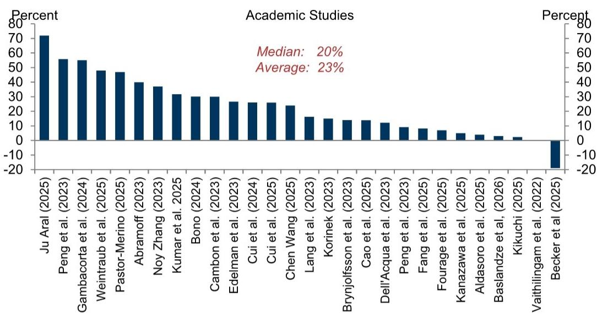

# AI Adoption Reached 20.6% in June 2026, but the Real Story Is the Gap Between Investment and Productivity

The headline number is arresting: 20.6% of US firms now use artificial intelligence in their regular business functions, a 1.1 percentage point increase from May, with expectations reaching 23.9% within six months. Yet the most important insight from the latest data is not the adoption rate itself. It is the growing disconnect between the scale of capital deployed and the narrowness of measurable economic impact. AI-related investment in US national accounts has surged by $425 billion since 2022, semiconductor revenues are projected to reach $826 billion annualized by year-end, and South Korean AI hardware shipments hit an all-time high of $36 billion per month. Meanwhile, corporate layoffs attributed to AI accelerated to 38,600 employees in May, and the correlation between AI adoption and broad labor market slack remains statistically insignificant. The pattern suggests a market that is investing as if general-purpose transformation has arrived, while the data shows only targeted, sector-specific disruption.

This asymmetry creates a strategic tension for executives, investors, and policymakers. The infrastructure buildout is real and accelerating. The revenue forecasts for memory producers have been revised up by $173 billion since ChatGPT's public release. But the productivity gains, while impressive in isolated cases, have not yet translated into economy-wide acceleration. Academic studies show a 23% average uplift to productivity in areas where generative AI has been deployed, and company anecdotes suggest even larger gains of around 34%. Yet these remain confined to specific use cases in marketing, graphic design, customer service, and select tech occupations. The question is not whether AI will matter. It is whether the current pace of investment is rational relative to the pace of organizational adoption, or whether we are building infrastructure faster than we can build the systems to use it.

The data through June 2026 demands a framework that separates signal from noise. Adoption is rising, but unevenly. Investment is surging, but concentrated. Labor displacement is visible, but narrow. Productivity gains are real, but isolated. This report provides the tracker. The strategic question belongs to the reader.

## Semiconductor Revenue Projections and Hardware Investment Suggest the Infrastructure Cycle Has Not Peaked

The most striking numbers in the tracker are not about adoption rates but about capital flows. Semiconductor company revenues are projected to reach $826 billion annualized by the end of 2026. Revenue forecast revisions for memory producers have accelerated notably over the past month. US AI hardware investment in the national accounts has increased by $425 billion since 2022 on a three-month annualized basis, now representing 1.3% of GDP. South Korean AI-related manufacturing shipments soared to an all-time high of $36 billion per month in May, and US AI hardware net imports remained elevated at $52 billion in April.

These figures tell a clear story: the physical layer of AI is being built at a pace that exceeds most historical technology infrastructure cycles. The scale is comparable to the early years of cloud computing or the buildout of 4G networks, but compressed into a shorter timeframe. The implication is that the supply chain for AI compute is already operating at levels that imply expectations of widespread deployment. If adoption were to stall or plateau, the overhang in hardware capacity would be significant. Conversely, if adoption continues to accelerate, the current investment levels may prove insufficient.

The strategic question for capital allocators is whether this infrastructure spending is leading or lagging demand. If it is leading, the risk is overcapacity. If it is lagging, the bottleneck becomes access to compute, which would constrain adoption and concentrate benefits among firms with capital. The data does not yet answer this question, but the trajectory of hardware imports and semiconductor revenues suggests the market is betting on demand materializing faster than current adoption metrics indicate.

## Adoption Is Concentrated in Knowledge Sectors, but Medium-Sized Firms Are Now the Margin of Acceleration

The 20.6% adoption figure masks a highly uneven distribution. Over a third of firms in information, professional services, finance, and education have already adopted AI. At the detailed subsector level, publishing and some finance firms report adoption levels at or exceeding 50%. Utilities and education firms had the largest gains in adoption since the last update. Large firms with over 250 employees continue to lead at 40.7%, but the more interesting dynamic is that medium-sized firms with 100 to 250 employees have accelerated their pace of adoption in recent months.

This shift matters because medium-sized firms often represent the leading edge of scalable deployment. Large enterprises have the resources to experiment but also the organizational inertia to slow implementation. Small firms may lack the capital and expertise. Medium-sized firms, by contrast, have enough scale to justify investment but enough agility to move quickly. If this cohort continues to accelerate, it could signal a transition from early adopter concentration toward broader diffusion.

The correlation between AI adoption and subsector AI automation exposure scores remains strong, confirming that firms are deploying AI where the technical and economic case is clearest. This is rational, but it also means that adoption is being driven by existing task structures rather than by reimagining business processes. The danger is that firms adopt AI to do what they already do, slightly faster, rather than to do what they could not do before. That distinction will determine whether the productivity gains remain narrow or become systemic.

## Labor Market Impacts Remain Visible but Narrow, and the Acceleration in AI-Attributed Layoffs Warrants Attention

The labor market data in the tracker is the most carefully watched and the most easily misinterpreted. Employment growth continues to underperform in occupations where AI use cases have been established, such as marketing, graphic design, customer service, and some tech occupations. Corporate layoffs attributed to AI accelerated to 38,600 employees in May, continuing a notable acceleration since the start of the year. Twenty-four percent of Russell 3000 companies mentioned AI and labor-related keywords in first-quarter 2026 earnings calls.

Yet these numbers must be placed in context. The employment drag in AI-exposed occupations is offset by construction job growth in data center-exposed categories, which is up 251,000 since 2022 relative to broader construction employment trends. The correlation between AI adoption and broad labor market slack measures remains limited. There are early signs of a negative relationship with job growth and hours growth, but the signal is weak. Unemployment among young tech workers has fallen back in line with unemployment for all tech workers, suggesting that earlier concerns about youth displacement may have been premature.

The most important finding is the acceleration in AI-attributed layoffs. The absolute number remains small relative to total employment, but the trend is upward and the slope is steepening. If this acceleration continues, it could shift the narrative from narrow displacement to broader restructuring. The strategic question for business leaders is whether to treat this as a signal to accelerate workforce restructuring or to wait for clearer evidence of which roles are genuinely at risk.

## Productivity Gains Are Real but Isolated, and Official Data Has Not Yet Caught Up

The tracker reports that academic studies imply a 23% average uplift to productivity in areas where generative AI has been deployed, while company anecdotes suggest slightly larger efficiency gains of around 34%. Industries with higher AI adoption rates are now showing a slight acceleration in productivity growth over the past year in official US data.

These numbers are encouraging but require careful interpretation. The 23% and 34% figures come from controlled studies and company self-reports, which tend to capture best-case scenarios. The official productivity data shows only a slight acceleration, and only in industries with the highest adoption rates. This suggests that the aggregate productivity impact remains modest, consistent with the narrowness of adoption and the early stage of deployment.

The implication is that the productivity payoff from AI investment is real but lagged. This is typical of general-purpose technologies. The productivity gains from electrification and computing took years to appear in official statistics because they required complementary investments in processes, skills, and organizational redesign. The same is likely true for AI. Firms that invest in the technology without investing in the complementary changes may see disappointing returns. Firms that treat AI as a catalyst for broader transformation may capture the gains that the aggregate data has not yet registered.

## The Report Does Not Fully Answer Whether Agentic AI Will Accelerate or Complicate the Adoption Curve

The tracker includes multiple survey references to agentic AI, the next generation of systems that can act autonomously rather than merely respond to prompts. Fifty-two percent of surveyed employees reported using AI agents at work, according to one survey. Sixty-two percent of organizations have agentic AI under consideration, and 25% currently use it. Nearly three-quarters of companies expect to be using agentic AI at least moderately in two years.

Yet the report does not resolve the central tension around agentic AI. On one hand, these systems could dramatically expand the scope of tasks that AI can perform, moving from content generation to workflow execution. On the other hand, the same surveys show that legacy systems are limiting organizations ability to scale AI, that few leaders report seeing significant ROI from AI agents, and that fewer than half of organizations have defined guardrails for agent adoption.

The unanswered question is whether agentic AI will accelerate adoption by making AI more useful, or whether it will complicate adoption by introducing new risks around reliability, control, and governance. The surveys suggest both dynamics are at play. Organizations are exploring agentic AI because they see its potential, but they are also struggling to integrate it because they lack the infrastructure and governance frameworks. The next six to twelve months will be critical in determining which force dominates.

## A Decision Framework for Leaders: Four Questions to Determine Your AI Strategy

The tracker provides data. The strategic question is what to do with it. Based on the patterns in the report, leaders should evaluate their position along four dimensions.

First, what is your infrastructure exposure? If your business depends on semiconductor supply chains, data center construction, or hardware manufacturing, the investment cycle is your primary signal. The current trajectory suggests continued growth, but the risk of overcapacity is real. Monitor lead times, inventory levels, and capital expenditure announcements for signs of inflection.

Second, what is your adoption readiness? The data shows that adoption is concentrated in knowledge sectors and among larger firms. If your organization is in a sector with low current adoption, you have time but not unlimited time. The medium-sized firm acceleration is a leading indicator that adoption may spread faster than current rates suggest. Invest in understanding which use cases are most relevant to your business, but do not rush to deploy without the complementary investments in skills and processes.

Third, what is your labor strategy? The acceleration in AI-attributed layoffs suggests that restructuring is underway, but the narrowness of the impact means that most firms have not yet felt the pressure. The risk is not that AI will immediately replace large numbers of workers, but that it will gradually change the mix of skills that are valued. Firms that invest in reskilling and role redesign may gain a competitive advantage over those that rely on headcount reduction.

Fourth, what is your productivity measurement framework? The gap between anecdotal productivity gains and official data suggests that many firms are not capturing the full impact of their AI investments. Establish clear metrics for productivity, quality, and speed at the task level, not just the aggregate level. The firms that can measure and manage these micro-level gains will be better positioned to scale them.

## The Full Report Contains the Charts That Tell the Story Behind the Numbers

The data points in this article are drawn from a comprehensive tracker that includes detailed exhibits on semiconductor revenues, hardware investment, adoption rates by sector and firm size, labor market impacts, and productivity estimates. The charts reveal patterns that summary statistics cannot capture: the shape of the adoption curve, the distribution of investment across industries, and the relationship between AI exposure and employment outcomes.

Join the community to read the full report and review the original charts. The tracker is updated monthly, and the analysis includes the methodological changes that affect comparability over time. The question of whether AI is following the path of previous general-purpose technologies or diverging from it remains open. The data to answer that question is in the charts.

*This article is for learning and discussion only and does not constitute investment advice.*

Personal reading notes and learning share only. Not investment advice.

