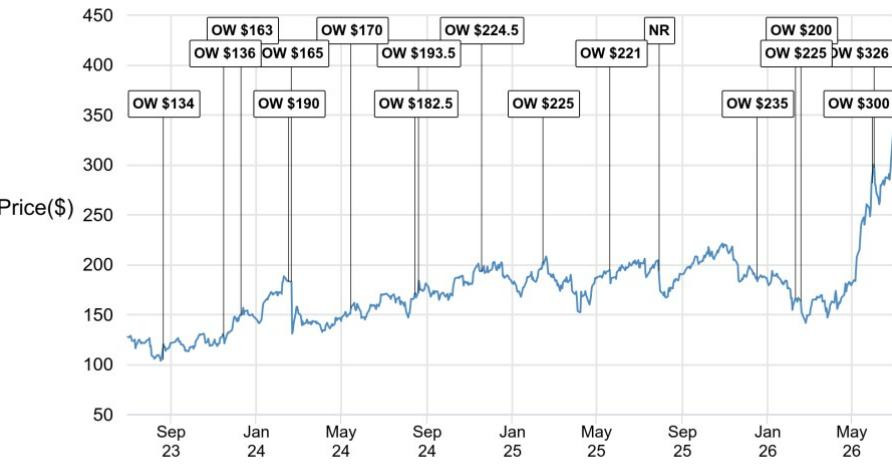
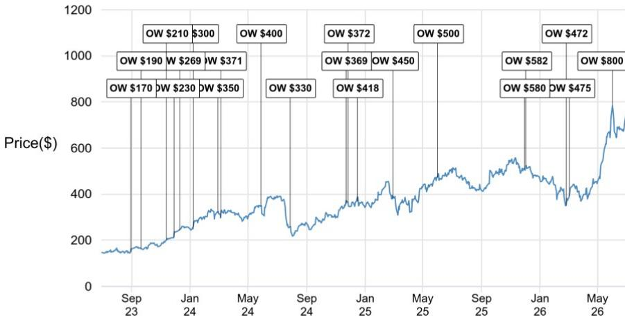
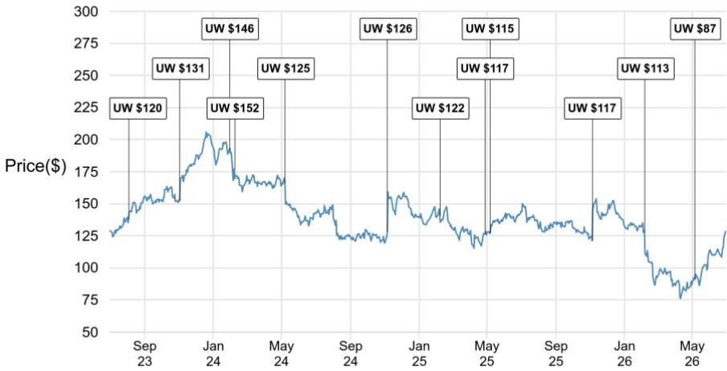

# The Vulnerability Tsunami Has a New Accelerant: Open-Weight AI Models Are Closing the Gap, and the Security Market Is Not Priced for It

The cybersecurity industry has long operated under the assumption that sophisticated vulnerability discovery and exploitation required nation-state resources or elite human talent. That assumption is breaking down faster than most enterprise buyers and investors realize. Open-weight AI models from China are rapidly closing the performance gap with frontier US models in vulnerability discovery benchmarks, and the data already shows a corresponding acceleration in the volume of Common Vulnerabilities and Exposures (CVEs) tracked in the first quarter of this year. This is not a hypothetical future risk. It is a present-day shift in the supply curve of cyber risk. The implication for enterprise security buyers and investors is straightforward: the mean time to exploit is collapsing, and the demand for exposure management platforms is about to re-rate upward. The vendors best positioned to capture this wave are those with platform breadth, agentic AI capabilities, and established trust relationships with enterprise security operations centers. The market is not yet pricing in this category re-rate, which creates an asymmetric opportunity for those who act on the signal now.

The conventional narrative has been that Chinese AI models lag significantly behind US frontier models, particularly in complex, multi-step tasks like chaining multiple vulnerabilities into an end-to-end exploit against a hardened target. That narrative is still technically true at the highest difficulty levels, but it is becoming dangerously misleading as a basis for security strategy. The latest benchmark data shows GLM 5.2 from China matching Anthropic Opus 4.8 and OpenAI GPT-5.5 on baseline vulnerability discovery harnesses. When specialized agentic harnesses are applied, the gap narrows further. The real-world implication is not that Chinese models can already execute autonomous, end-to-end attacks against hardened enterprise targets. It is that they are getting close enough, fast enough, to materially increase the volume of discovered vulnerabilities and lower the barrier to entry for attackers who can assemble exploit chains from published components. The combination of open-weight availability, rapid benchmark convergence, and the absence of export controls on model weights creates a structural shift in the threat landscape that enterprise security teams cannot ignore.

The report identifies three distinct vectors through which this shift will impact the security market, and each vector favors a different set of vendors. The most immediate and broad-based effect is the acceleration of vulnerability volumes. More AI-powered discovery means more CVEs, more patches to prioritize, and more attack surface to monitor. This directly benefits exposure management vendors whose core value proposition is helping organizations understand and prioritize their vulnerability landscape. The second vector is the demand for agentic AI capabilities that can operate at machine speed to discover, prioritize, and remediate vulnerabilities before they are exploited. This favors vendors that have invested in AI-native platforms with agentic architectures. The third vector is the consolidation trend, as enterprises seek to reduce the complexity of their security stacks in the face of an accelerating threat environment. This favors platform consolidators with broad product portfolios and strong coalition standing in the frontier AI security partnerships that are emerging as procurement filters.

## The Open-Weight Model Convergence Is Real, and It Changes the Calculus for Enterprise Security Investment

The benchmark data presented in the report is unambiguous: GLM 5.2 ties frontier US models on baseline vulnerability discovery harnesses, and the gap on specialized agentic harnesses is narrowing. The important nuance here is that individual benchmark outperformance is not directly reflective of autonomous agentic capabilities. Frontier models still lead in chaining multiple vulnerabilities into end-to-end exploits against hardened targets. OpenAI's GPT-5.6 system card, published in late June, explicitly states that the new flagship models "can find vulnerabilities and pieces of exploits, but in cybersecurity testing they were unable to carry out autonomous, end-to-end attacks against hardened targets." This is the ceiling that enterprise security teams are relying on for their current threat models. The question is how long that ceiling holds.

The pattern of Chinese model development suggests that the gap will continue to narrow, and the pace of convergence may accelerate as more training data and compute resources become available. The open-weight nature of these models means they can be fine-tuned, customized, and deployed by a wide range of actors without the constraints that apply to closed-source frontier models. This democratization of vulnerability discovery capability is the structural shift that the report identifies as the primary driver of demand acceleration for exposure management. Enterprise security teams that have been operating on the assumption that sophisticated vulnerability discovery is a rare and expensive capability need to recalibrate their threat models. The cost of discovering vulnerabilities is falling, the volume is rising, and the time available for remediation is shrinking.

## Tenable Is the Best Positioned Exposure Management Vendor to Capture the Vulnerability Acceleration Wave, and the Valuation Does Not Reflect the Category Re-Rate

The report makes a compelling case that Tenable is uniquely positioned to benefit from the acceleration of vulnerability volumes. The company's platform covers more asset types than legacy vulnerability management solutions, and the launch of Hexa AI in May 2026 provides a concrete reason for customers to upgrade from standalone vulnerability scanning to the broader Tenable One exposure management platform. Hexa is Claude-powered, per the joint announcement with Anthropic, and the Exposure Data Fabric built on two decades of platform telemetry serves as the trusted execution layer that allows the AI agent to act without causing operational disruption. This is a critical architectural advantage. Enterprise security teams are not going to give AI agents unrestricted access to their production environments. The trust layer that enables safe agentic action is as important as the AI capability itself.

The financial setup for Tenable is also favorable. Only about 30% of the company's 40,000-plus customer base is on the Tenable One platform, leaving a substantial upsell runway. More than 2,000 customers have annual contract values exceeding $100,000, which provides a strong economic anchor for the migration. Tenable One represented 41% of new business in the first quarter of 2026, with average selling price uplifts ranging from 6% to 60%. The company trades at 12.8 times enterprise value to free cash flow on calendar year 2027 estimates, against a long-term framework targeting high single-digit to low double-digit revenue growth, 28% operating margins, and 31% unlevered free cash flow margins. This multiple does not yet reflect the category re-rate that the vulnerability acceleration wave should drive. The risk-reward appears asymmetric, with the upside case driven by faster-than-expected adoption of the exposure management platform and the downside protected by the installed base and recurring revenue model.

## Qualys Will Benefit from the Rising Tide, but Execution Challenges Limit the Upside Capture

The same vulnerability explosion that lifts the category will lift Qualys, but the company faces structural challenges that will limit its ability to capture the full benefit. Qualys runs over 200 million agents worldwide and has shipped a multi-agent platform with autonomous patch orchestration, threat-informed prioritization, and risk elimination capabilities. The Risk Operations Center has been operational with the customer base for over a year and is the 100% sales focus for 2026. The margin profile offers valuation support, with adjusted EBITDA margins of 47% holding flat since 2022 and a Rule of 40 metric of 57%. Free cash flow margins of 45% compare favorably to a peer median EBITDA margin of 26%.

The problem is on the top line. Bookings mix has been a persistent headwind. Emerging products like Enterprise Threat Management and Cloud Security Asset Management represent only 11% of last twelve months bookings, up just three percentage points in two years. The core vulnerability management detection and response product still accounts for 50% of the mix. The absence of a multi-year financial framework leaves the platform value question unanswered for investors. Until the product mix shifts toward higher-growth adjacencies and a long-term framework is disclosed, Qualys will capture less of the vulnerability tailwind than Tenable. The upgrade from Underweight to Neutral is warranted by the tailwind, but the stock remains a show-me story on execution.

## The Report Leaves an Unanswered Question That Will Define the Next Phase of the Market

The report does not fully address the question of how the economics of vulnerability discovery will evolve as open-weight models continue to improve. If the cost of discovering a critical vulnerability falls by an order of magnitude over the next two years, the volume of CVEs could overwhelm existing prioritization and remediation processes. The report documents the acceleration in CVE volumes for the first quarter of this year, but it does not model what happens when the convergence between open-weight and frontier models reaches the point where autonomous, end-to-end attacks against hardened targets become feasible for a wider range of actors. That scenario would represent a step-change in the threat landscape that would likely drive a corresponding step-change in security spending.

The second unanswered question is how the competitive dynamics between exposure management specialists and platform consolidators will play out as the market expands. The report positions Tenable as the best positioned exposure management vendor, but it also notes that CrowdStrike and Palo Alto Networks are the cleanest beneficiaries of the demand-side acceleration running through vendors that were already winning on coalition standing, platform consolidation, and AI-native execution. If the vulnerability acceleration wave drives a broad increase in security spending, the platform consolidators may capture a disproportionate share of incremental dollars as enterprises seek to reduce vendor count and simplify operations. The exposure management specialists will benefit, but they may face increasing competition from the platforms that are embedding vulnerability management capabilities into broader security operations offerings.

## A Decision Framework for Investors Navigating the Vulnerability Acceleration Wave

The report provides the building blocks for a structured investment framework that investors can apply across the security sector. The framework has three dimensions: exposure to vulnerability volumes, platform breadth and AI capability, and valuation support.

The first dimension is exposure to vulnerability volumes. Vendors whose core value proposition is helping organizations discover, prioritize, and remediate vulnerabilities are the most direct beneficiaries of the acceleration in CVE volumes. Tenable and Qualys are the purest plays in this category, but the report makes a clear distinction between the two based on execution quality and product mix.

The second dimension is platform breadth and AI capability. Vendors that have invested in AI-native platforms with agentic architectures and broad product portfolios are better positioned to capture incremental demand as enterprises consolidate their security stacks. CrowdStrike and Palo Alto Networks are the standout names in this category, with strong coalition standing in the frontier AI security partnerships that are emerging as procurement filters.

The third dimension is valuation support. The report notes that Tenable trades at a multiple that does not yet reflect the category re-rate, while Qualys has margin support but faces top-line headwinds. The platform consolidators trade at premium multiples that reflect their market position and growth trajectory, but the demand acceleration could provide upside to estimates.

The most actionable insight from the report is that the vulnerability acceleration wave is a structural shift, not a cyclical one. The convergence of open-weight AI models is lowering the cost of vulnerability discovery permanently, and the security market will need to adapt to a higher baseline of risk. Vendors that can help enterprises manage this new reality are positioned for sustained demand growth, and the current valuation levels for some of these names do not fully reflect the opportunity.

## Join the Community to Read the Full Report and Review the Original Charts

The analysis presented here draws on detailed benchmark data, financial projections, and competitive assessments that cannot be fully captured in a single article. The original report includes the charts showing CVE quarterly severity trends, AI agent benchmark performance, and model comparison data that underpin the investment thesis. These charts provide the empirical foundation for the argument that the vulnerability landscape is entering a new phase. Readers who want to examine the data for themselves and understand the full scope of the analysis are invited to join the community where the complete report is available.

*This article is for learning and discussion only and does not constitute investment advice.*

Personal reading notes and learning share only. Not investment advice.

