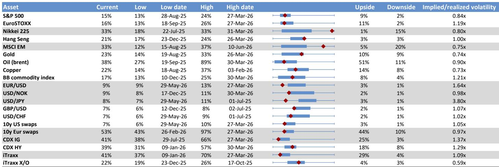
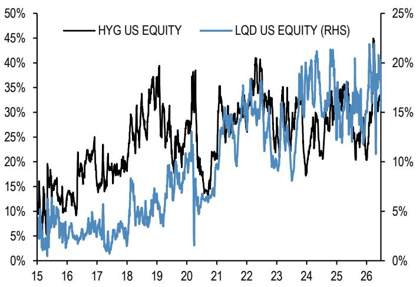
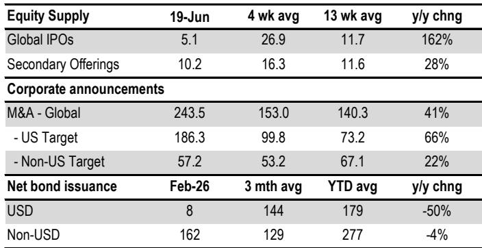

# JPM：AI芯片与云厂商的背离，正走向必须收敛的临界点

过去九个月，半导体股票（AI芯片与存储制造商）对云服务商的持续、近乎单边的超额收益，正在逼近一个关键拐点。这不是一个“还能涨多久”的问题，而是一个“以谁为代价”的问题。

JPM最新发布的《Flows & Liquidity》报告，用一个简洁但尖锐的框架，揭示了当前AI投资中最大的结构性张力：芯片厂商的强势表现，是否正在侵蚀其最大客户——云服务商的资本开支意愿？如果答案是肯定的，那么整个AI产业链的估值逻辑都将面临重估。

这份报告的核心判断值得所有关注AI产业和全球科技股定价的决策者仔细审视：AI产业链内部的价值分配，正从“共赢”走向“零和”的边缘。收敛必然发生，但路径不同，资产含义截然相反。

## 1. 半导体与云厂商的背离，已从估值差异演变为资本开支的博弈

自2025年9月以来，半导体股票相对云服务商的表现差距持续扩大。JPM的数据清晰显示，云服务商的股价在过去一年几乎原地踏步，而半导体板块的市值占比却持续攀升。这不仅仅是市场偏好的问题，它直接映射到实体经济的资本配置决策中。

报告指出，2026年云服务商的资本开支预计将同比增长100%，达到创纪录的7580亿美元。但问题在于，这些巨额投资并未在资本市场获得相应回报。云服务商的股本成本在上升，信用利差相对于半导体公司也在走阔。这意味着，市场正在用更高的融资成本惩罚那些“只花钱、难赚钱”的云巨头。

> **KC评论：** 这不是简单的板块轮动问题。当云服务商的融资成本上升，而芯片厂商的利润率持续扩张时，前者削减未来资本开支的动机就会显著增强。JPM报告中的核心张力就在这里：芯片厂商的“繁荣”可能正在损害其最重要的客户，而客户的反应会反过来冲击芯片需求。完整报告中包含的图表详细展示了云服务商资本开支增速从2027年开始的急剧放缓假设，这是理解未来AI投资节奏的关键线索。

## 2. 两种收敛路径，对应完全不同的资产定价逻辑

报告给出了两种可能的收敛路径，这正是理解当前市场博弈的框架。

正面路径：随着云服务商、AI模型提供商和应用端用户看到货币化、收入和盈利的改善，它们开始追赶，在AI整体价值增量中占据更大份额。这意味着半导体公司的相对表现回归均值，但整个AI产业链的总市值继续扩张。

负面路径：芯片厂商的超额收益是以牺牲客户利益为代价的。如果这种挤压持续，云服务商和模型提供商将被迫削减资本开支，最终对半导体公司的产品需求形成压制。这将是整个AI交易的一次显著且持续的修正。

JPM自己的中期展望偏向正面路径。但报告同时指出，在近期的客户交流中，对负面路径的担忧已成为主导情绪。原因在于，当前市场对云服务商2027年之后的资本开支增速预期出现了急剧放缓——从2026年的100%骤降至2027年的22%，并在此后逐步归零。如果这一预期被证实，半导体交易将面临严重压力。

> **KC评论：** 关键变量在于，市场共识的资本开支放缓预期，究竟是“理性预判”还是“自我实现的预言”？JPM的分析师团队给出了比市场共识更高的2027年资本开支预测（11500亿美元 vs 9250亿美元），这本身就意味着机构内部存在分歧。完整报告中对这一分歧的详细拆解，以及不同假设下的资产价格敏感性分析，是判断未来方向的核心素材。

## 3. 空头信号揭示市场正在押注哪些公司承压

报告提供的做空比率数据，是理解市场情绪分布的重要窗口。截至2026年6月，不同AI相关板块的空头信号呈现出显著分化。

云服务商的做空比率自2025年10月以来持续上升，并在5-6月出现急剧攀升，这与投资者对其资本开支回报率的担忧完全一致。半导体板块（除存储外）的做空比率在5-6月也有所上升，但尚未回到一年前的水平。AI受益者组合的做空比率自4月初以来保持相对稳定，低于年初水平。而AI脆弱性组合的做空比率自2025年初以来持续上升，且绝对水平显著高于其他三组。

这个数据格局告诉我们：市场并非无差别地看空AI，而是在有选择地定价风险。云服务商面临最直接的做空压力，而AI脆弱性公司（即那些可能被AI颠覆的传统业务）遭遇了最持续的空头积累。半导体板块虽然面临一定压力，但尚未形成趋势性看空。

## 4. AI算力定价的边际改善，是观察收敛方向的关键先行指标

报告提供了一组容易被忽视但至关重要的数据：AI计算资源的定价趋势。经过2025年底至2026年初的持续下行后，NVIDIA Hopper GPU的租赁价格在4-5月出现了边际改善，这是一个积极的信号。同样，大型语言模型的token价格在2月底至5月底期间持续上升，尽管6月有所回落。

这些价格信号之所以重要，是因为它们直接关系到云服务商能否实现资本开支的货币化。更高的算力定价意味着云服务商有更大的空间维持甚至提升利润率，从而缓解削减资本开支的压力。

> **KC评论：** 算力定价是连接芯片厂商与云服务商利润表的“温度计”。如果这个温度持续回升，正面路径的概率就会增加；如果重新走低，负面路径的风险将显著上升。完整报告中对不同算力等级、不同租赁合约结构的价格分解，提供了比表面数据更细致的观察维度。这也是为什么我们建议读者获取完整报告——这些细节往往决定了判断的精度。

## 5. 报告尚未完全回答的问题：流动性扩张能否对冲结构性压力

报告的另一重要部分是分析了美国货币创造的速度正在加快，预计从2025年的1.6万亿美元增至2026年的1.8万亿美元。JPM认为，这种强于名义GDP的货币创造将为美国金融资产提供支撑。

但这里存在一个尚未被充分回答的问题：货币流动性扩张是否足以抵消AI产业链内部的结构性压力？历史上，2020年3月、2022年、2025年3月和2026年3月的市场冲击都表明，当负面冲击足够大时，经济主体会开始重建现金配置，从而抽走金融资产的流动性支持。当前的现金配置水平处于历史低位，这既是支撑，也是脆弱性。

另一个未解问题是：MicroStrategy（现已更名）在加密市场引入的双向风险，是否会通过风险偏好传导至更广泛的科技股定价？报告提到这一点但未深入展开，这可能是后续需要关注的溢出效应。

## 6. 对决策者的观察框架：三个需要持续跟踪的变量

基于JPM的报告逻辑，我们提炼出三个需要持续跟踪的核心变量：

第一，云服务商的资本开支指引与实际执行之间的差距。2026年100%的增长已是既定事实，但2027年的预期分歧至关重要。如果云服务商的管理层在后续财报中给出低于市场预期的指引，负面路径的概率将显著上升。

第二，AI算力定价的趋势。这是连接芯片厂商与云服务商利润表的最直接纽带。如果算力价格能够维持甚至超越4-5月的改善趋势，正面路径的可信度将增强。

第三，半导体板块的相对估值是否开始收敛。报告指出，如果收敛迟迟不发生，可能引发技术面的情绪问题。JPM的技术分析师Jason Hunter也注意到了这一点。这是市场自身发出的信号，不需要依赖任何基本面假设。

这三个变量构成了一个简洁的观察框架。它们彼此独立，又共同指向同一个核心问题：AI产业链的价值分配，正在走向平衡还是失衡？

这份JPM报告的完整版本包含了更多关于跨资产配置、资金流监测和定位分析的细节。我们每天通过AI agent与人工审核相结合的方式，生成国际投行的中文摘要与KC评论，每日更新约10-40页，并整理当天最新数据图表合集。这些内容既方便喂给AI，也方便人工快速把握市场动态。欢迎来我们的知识星球和微信群继续讨论这些未解问题，特别是关于资本开支假设的敏感性分析，以及不同收敛路径下的资产配置应对方案。

Personal reading notes and learning share only. Not investment advice.

