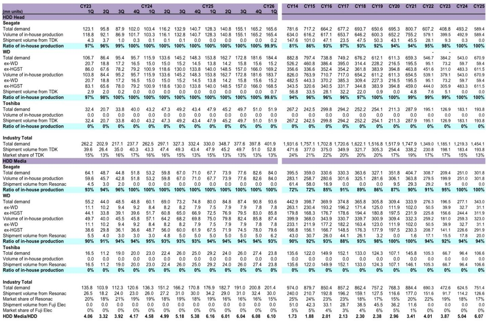
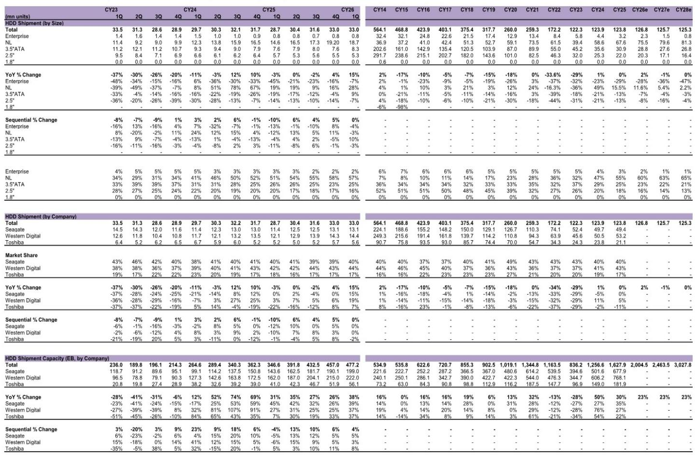
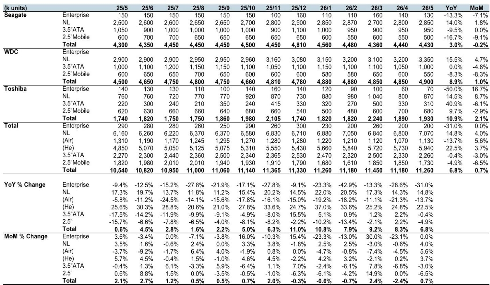

# Data Center Storage Is Not Converging: The HDD-SSD Divide Is Widening, and Investors Need a New Framework

The most important finding from the latest May HDD and SSD shipment data is not that volumes remain high. It is that the data center storage market is segmenting faster than most models assume, and the strategic implications for suppliers, hyperscalers, and component manufacturers are becoming increasingly distinct. Total exabyte shipments for both nearline HDDs and enterprise SSDs continue to grow at rates that would have seemed improbable three years ago. But the composition of that growth tells a far more nuanced story than the headline numbers suggest. Enterprise SSD capacity shipments surged 138.8% year-over-year in May, while nearline HDD capacity grew a respectable but comparatively modest 14.8%. This is not a temporary divergence. It is the early shape of a permanent architecture shift in how hyperscale data centers allocate storage budgets across performance tiers.

The timing matters because the market is approaching a critical inflection point. Total HDD production has recovered from its 2023 trough of 120.5 million units to an estimated 134.9 million units in 2026, but the recovery is almost entirely concentrated in helium-filled nearline drives. Air-filled drives, legacy enterprise drives, and mobile HDDs are in structural decline. Meanwhile, enterprise SSD shipments by unit are growing at 45.8% year-over-year, and capacity shipments are accelerating even faster as average drive density increases. The data center is no longer choosing between HDD and SSD. It is building two parallel storage infrastructures, each optimized for fundamentally different workloads. Investors who treat this as a single market risk missing the most important allocation decisions of the next cycle.

## The Nearline HDD Recovery Is Real but Narrowly Constructed, and the Growth Is Driven by Density, Not Volume

The May data confirms that nearline HDD production has recovered to 7.07 million units, up 14.8% year-over-year and 4.0% month-over-month. The full-year forecast of 84.37 million units for 2026 represents a 12.8% increase from 2025, which itself was a strong recovery year. But the composition of this growth is critical. Helium-filled drives now account for the vast majority of nearline production, and their share is increasing. In May, helium drive production reached 5.94 million units, up 22.5% year-over-year, while air-filled drive production fell 13.7% to 1.13 million units. The industry is effectively abandoning air-filled architectures for data center applications.

The implication is that nearline HDD revenue growth will increasingly depend on the pace of areal density improvements and the successful ramp of technologies such as heat-assisted magnetic recording. Unit volumes are growing, but not at rates that suggest a renaissance. The 2026 forecast of 84.37 million nearline units is still below the 81.45 million units shipped in 2021, and the compound annual growth rate from the trough is modest. What is growing is the exabyte content per drive. TSR now forecasts 2026 nearline HDD shipment capacity at 1,841 exabytes, up 30.1% year-over-year, which implies that average drive capacity is increasing faster than unit volumes. This is a density-driven recovery, not a volume-driven one. For suppliers of HDD components such as motors and heads, the addressable market is shifting toward higher-value, higher-margin products. For hyperscalers, the economics of cold storage remain favorable, but the marginal cost per terabyte is declining more slowly than the cost of flash alternatives.

## Enterprise SSD Growth Is Entering a New Regime, and the Acceleration Is Structural, Not Cyclical

The enterprise SSD data is where this report delivers its most provocative signal. May enterprise SSD shipment capacity reached 41.35 exabytes, up 138.8% year-over-year and 9.7% month-over-month. The full-year 2026 forecast has been raised sharply to 509.33 exabytes, representing 94.0% year-over-year growth. This is not a cyclical upswing. It is a structural acceleration driven by three forces that are likely to persist for multiple years.

First, the workload mix in hyperscale data centers is shifting toward AI training and inference, which require random access performance that HDDs cannot provide. Large language model training involves reading massive datasets repeatedly, often in non-sequential patterns. The latency penalty of HDDs in these workloads is unacceptable, and the total cost of ownership calculation increasingly favors SSDs when the cost of idle server time is factored in. Second, the density of enterprise SSDs is improving rapidly. Higher-layer NAND flash, combined with advanced controllers and PCIe Gen 5 interfaces, means that a single SSD can now store 30 or 60 terabytes. This density improvement is compressing the cost-per-terabyte gap with HDDs faster than many models anticipated. Third, hyperscalers are building storage architectures that separate compute from storage, allowing them to deploy SSDs in disaggregated pools that serve multiple compute nodes. This architecture favors SSDs because they can handle the higher input-output operations per second demands of shared storage.

The unit shipment data supports this interpretation. Enterprise SSD units grew 45.8% year-over-year in May, and the 2026 forecast of 72.31 million units represents 28.0% growth. But the capacity growth is nearly three times faster than unit growth, which means the average capacity per drive is increasing dramatically. This is the hallmark of a market where the product is becoming more capable and more valuable per unit, not merely more numerous.

## The Report Raises an Unanswered Question That Should Worry Strategic Planners: Where Is the Tape?

One of the most striking omissions in the current analysis is the role of tape storage. The report mentions that data center storage is likely to remain segmented between SSDs, HDDs, and tape drives, but it provides no data on tape shipment volumes or capacity. This is not a minor gap. Tape is the most cost-effective medium for cold data, and its economics improve as data retention requirements grow. If enterprise SSD capacity is growing at 94% and nearline HDD capacity at 30%, the logical question is whether tape is absorbing the long-tail cold data that would otherwise go to HDDs, or whether tape is being displaced by lower-cost HDDs.

The answer has significant implications for the total addressable market of each storage medium. If tape is holding its share, then the growth in HDD capacity is primarily serving warm data workloads, and the competition between HDD and SSD is more intense than the headline numbers suggest. If tape is losing share, then HDDs may be capturing a larger portion of cold storage than expected, which would reduce the pressure on HDD margins but also limit the upside for SSD adoption. The absence of tape data in a report that otherwise provides granular detail on HDD and SSD shipments is a reminder that even the most thorough industry analysis has blind spots. Investors and strategists should treat the total storage market figures as incomplete until tape is properly accounted for.

## A Decision Framework for Investors: Three Questions to Determine Which Storage Supply Chain to Bet On

The segmentation of the data center storage market creates a clear decision framework for investors and corporate strategists. Rather than analyzing the storage industry as a single entity, the framework should treat HDD and SSD as separate investment theses with different drivers, different risk profiles, and different time horizons.

The first question is: What is the primary workload? If the workload is sequential read-heavy and latency-tolerant, such as video surveillance archives, backup repositories, or large-scale data lakes, nearline HDDs remain the cost-optimal solution. The density improvements in helium-filled drives will continue to improve the economics of this segment. If the workload is random access-intensive or latency-sensitive, such as AI training, real-time analytics, or transactional databases, SSDs are the only viable option, and the adoption rate will be determined by the pace of cost convergence.

The second question is: What is the data lifecycle? Data that is accessed frequently within the first 90 days should be on SSDs. Data accessed quarterly should be on HDDs. Data accessed annually or less should be on tape. The optimal storage architecture for a given hyperscaler depends on the distribution of its data across these access tiers. The faster the data ages, the more valuable a tiered storage strategy becomes.

The third question is: What is the technology roadmap? The next two years will see the introduction of higher-density HDDs using HAMR technology and higher-layer NAND SSDs with PCIe Gen 6 interfaces. The relative pace of these technology improvements will determine whether the cost gap narrows or widens. If HAMR delivers on its density roadmap, HDDs will remain competitive for warm data longer than current models assume. If NAND layer counts increase faster than expected, SSDs will capture warm data sooner.

## The Full Report Contains the Charts That Make These Trends Visible, and the Open Questions Are Worth Exploring

The original report from which this analysis is drawn contains detailed exhibits showing HDD production by company and size, SSD shipments by application, and the relationship between HDD production volumes and component supplier share prices. These charts reveal patterns that are difficult to capture in text alone. The correlation between nearline HDD production and the share prices of motor and head suppliers, for example, suggests that the component supply chain is more sensitive to volume changes than to capacity changes. The breakdown of SSD shipments by application shows that enterprise SSD growth is accelerating while PC and add-on SSD markets are stagnating or declining. These nuances matter for portfolio construction and supply chain planning.

But the report also leaves several meaningful questions unanswered. How will the shift to higher-capacity drives affect the pricing power of HDD manufacturers? Will the enterprise SSD market consolidate as NAND suppliers integrate vertically? What is the optimal capital expenditure strategy for a hyperscaler that must balance HDD and SSD procurement across multiple data center regions? These are the questions that the data raises but cannot fully resolve. They require ongoing analysis and scenario planning.

Join the community to read the full report and review the original charts.

*This article is for learning and discussion only and does not constitute investment advice.*

Personal reading notes and learning share only. Not investment advice.

