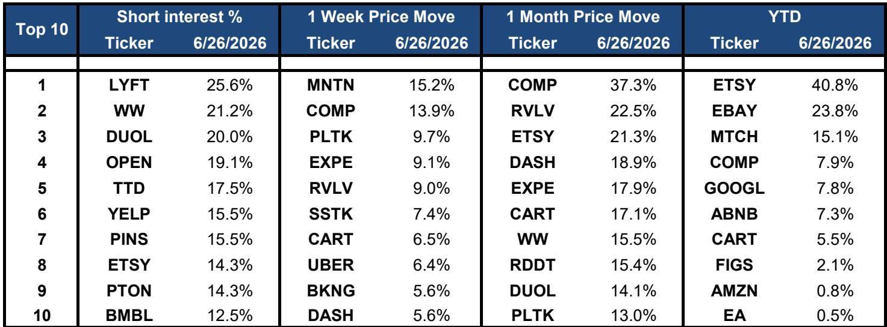
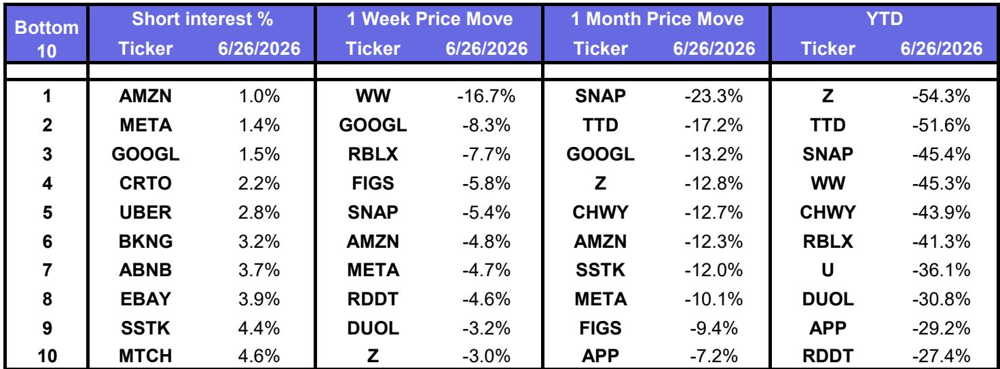
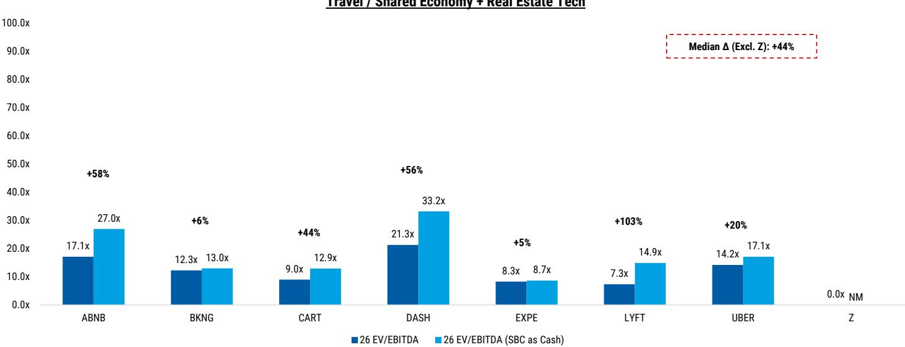

# AI Capital Is Rotating Toward Internet Earnings, But the Real Test Is Which Companies Can Convert AI Investment Into EPS Acceleration

The market is sending a clear signal that is easy to misinterpret. Over the past week, the largest internet platforms have sold off sharply—Alphabet down 8%, Amazon and Meta each falling roughly 5%—while travel and shared economy names like Booking Holdings, Expedia, and Uber have rallied 5% to 9%. On the surface, this looks like a simple rotation out of high-multiple AI beneficiaries into value-oriented consumer plays. That reading is too shallow.

What is actually happening is far more strategic. The market is beginning to differentiate between companies that are spending on AI infrastructure and those that can demonstrate a clear path from that spending to earnings per share acceleration. The selloff in the mega-cap internet names is not a rejection of AI. It is a demand for proof that AI capital expenditure will translate into higher EPS growth rates, not just higher revenue growth. The rally in travel and shared economy stocks, meanwhile, reflects a market that is rewarding companies where earnings visibility is improving without requiring massive upfront AI investment.

The data from a recent institutional research report covering North American internet stocks provides the raw material for this argument. But the report itself is a snapshot of prices, multiples, and performance dispersion. The strategic question it raises is forward-looking: as AI flows move through the internet sector, which companies have the earnings architecture to capture them? The answer will determine the next phase of relative performance.

## The Mega-Cap Selloff Is Not About Fundamentals; It Is About Multiple Compression That Signals a Shift in How the Market Values AI Spending

The three largest internet platforms—Amazon, Alphabet, and Meta—trade at 25x, 23x, and 17x 2026 estimated EPS respectively. These multiples represent a significant compression relative to their trailing twelve-month averages: Amazon at 22% below, Alphabet at 11% below, and Meta at 20% below. This compression happened even as revenue growth for these companies has remained resilient and their AI narratives have, if anything, strengthened.

The conventional explanation is that rising interest rates or macro uncertainty are compressing growth stock multiples. But that argument fails to explain why travel and shared economy stocks, which are also growth-dependent, have expanded their multiples over the same period. Booking Holdings trades at 18x 2026 EPS, Expedia at 13x, and Uber at 23x—all within or above their recent historical ranges. The divergence is not macro-driven. It is driven by a reassessment of how much of the AI investment cycle is already priced in.

For the mega-cap platforms, the market appears to be saying that the current multiples already reflect the expected benefits of AI-driven revenue acceleration. Any incremental AI investment that does not produce immediate EPS upside will be met with multiple compression. This is a rational response to the scale of capital expenditure these companies are undertaking. When a company spends tens of billions on data centers and GPU clusters, the market needs to see that spending flow through to the bottom line within a reasonable timeframe. If it does not, the multiple adjusts downward to reflect the increased risk that the investment will not generate adequate returns.

This dynamic is what makes the current moment different from the early stages of the AI cycle. In 2023 and 2024, the market rewarded any company that announced AI initiatives. In 2026, the market is rewarding only those companies where AI spending is demonstrably translating into EPS acceleration. The mega-cap internet names are not failing this test yet, but they are being held to a higher standard.

## Travel and Shared Economy Stocks Are Rallying Because Their Earnings Visibility Is Improving Without the Capital Intensity Burden That Weighs on AI-Heavy Platforms

The one-week performance data reveals a stark divergence. The market-cap weighted average for digital ad stocks fell 7.3%. E-commerce fell 4.6%. But travel rose 4.9% and shared economy rose 6.0%. This is not a rotation into defensives or value. Booking Holdings and Expedia are not bond proxies. They are cyclical growth companies that happen to have lower AI capital expenditure requirements relative to their earnings bases.

The reason these stocks are rallying is that their earnings visibility is improving. Travel demand remains strong, and these companies have demonstrated an ability to grow revenue and margins without needing to make the kind of multi-billion-dollar AI bets that the mega-cap platforms are making. For Booking Holdings, which trades at 18x 2026 EPS, the market is comfortable because the earnings trajectory is clear and the capital intensity is low. For Expedia, trading at 13x 2026 EPS, the market sees a company that is executing well on its core business without the distraction of a massive AI transformation.

This is not to say that AI is irrelevant for travel and shared economy companies. Uber uses AI for route optimization and demand forecasting. Booking uses AI for pricing and personalization. But the scale of AI investment required for these companies is an order of magnitude smaller than what Alphabet or Amazon need to spend to maintain their competitive positions in cloud and search. The market is effectively rewarding capital-light AI adoption while penalizing capital-intensive AI buildout.

The strategic implication is clear: in the current environment, the market prefers companies that can use AI as a tool to improve existing earnings streams over companies that must build AI infrastructure as a new earnings stream. The former has a shorter path to EPS acceleration. The latter requires patience that the market is no longer offering unconditionally.

## The Valuation Dispersion Within Digital Media Reveals a Market That Is Pricing AI Optionality Very Differently Across Companies

The digital media subsector within the report provides a laboratory for examining how the market values AI potential. The median digital media company trades at 17x 2026 EPS. But the range is enormous. Duolingo trades at 45x. Pinterest trades at 35x. Reddit trades at 24x. At the other end, Criteo trades at 4x and Bumble trades at 4x.

What explains this dispersion? It is not simply growth rates. Duolingo and Reddit are growing faster than Criteo and Bumble, but the multiple difference is far wider than the growth differential would suggest. The market is pricing in a significant AI optionality premium for some companies and a complete absence of AI optionality for others.

Duolingo, with its AI-powered language learning and recent integration of generative AI features, is being valued as if its AI investments will produce a step-change in user engagement and monetization. Reddit, with its massive data corpus that can be used to train AI models and its advertising platform that can benefit from AI-driven targeting, is being valued similarly. Pinterest, which has been investing in AI-powered visual search and recommendation, also commands a premium.

But the question the report raises is whether these premiums are justified. Duolingo at 45x 2026 EPS implies that the market expects earnings to grow at an extraordinary rate for an extended period. If the AI-driven acceleration does not materialize as quickly as expected, the multiple compression could be severe. The same logic applies to Reddit and Pinterest. The market is giving these companies credit for AI optionality that has not yet been proven in the earnings data.

This creates a two-sided risk. For companies that are already priced for AI success, any disappointment in the pace of EPS acceleration will be punished harshly. For companies like Criteo and Bumble, where the market is pricing no AI optionality, any positive surprise from AI adoption could produce significant multiple expansion. The dispersion itself is a signal that the market has not yet reached a consensus on which AI use cases will translate into earnings.

## What the Report Does Not Fully Answer: How to Distinguish Between AI Hype and AI-Driven EPS Acceleration in Real Time

The report provides an excellent snapshot of where valuations stand and how the market has moved over the past week and month. But it does not, and cannot, answer the most important strategic question: how can an investor distinguish between a company that is genuinely accelerating its EPS through AI and one that is simply riding the AI narrative?

This distinction is critical because the market is currently rewarding both. A company like AppLovin, which trades at 31x 2026 EPS, has seen its stock rally on the back of its AI-driven advertising platform. But is the earnings acceleration real and sustainable, or is it a one-time boost from early AI adoption that will fade as competitors catch up? Similarly, a company like Snap, which trades at a negative P/E for 2026 but 25x for 2027, is being given credit for a turnaround that may or may not be AI-related.

The report's data on short interest provides one clue. Companies with high short interest, like Lyft at 26%, Duolingo at 20%, and Pinterest at 16%, are attracting bearish bets despite their AI narratives. This suggests that sophisticated investors are skeptical about the sustainability of the AI-driven growth for these names. But short interest alone is not a sufficient signal. It can reflect structural factors like share lending availability as much as fundamental conviction.

The open question that the report leaves for readers is this: what metrics should investors use to separate AI winners from AI pretenders? The report provides the raw data on multiples, price performance, and short interest, but it does not offer a framework for making that distinction. That is the analytical gap that readers must fill themselves, and it is the reason why the full report and its original charts are worth studying carefully.

## A Decision Framework for Investors: Three Filters to Determine Whether AI Investment Will Translate Into EPS Acceleration

Based on the patterns visible in the report, investors can construct a decision framework with three filters to evaluate whether a company's AI spending is likely to produce EPS acceleration.

The first filter is capital intensity relative to earnings base. A company that must spend 10% or more of its revenue on AI infrastructure to remain competitive faces a higher hurdle to EPS acceleration than a company that can integrate AI into its existing cost structure. Alphabet and Amazon fall into the high capital intensity category. Booking and Expedia fall into the low capital intensity category. All else equal, the market will favor the latter until the former can demonstrate that its spending is producing above-market returns.

The second filter is the time horizon to earnings impact. AI investments that improve existing revenue streams—like better ad targeting, more efficient logistics, or improved recommendation systems—tend to flow through to EPS faster than investments that create entirely new revenue streams. Companies like Meta and Pinterest, which are using AI to improve their existing advertising businesses, should see EPS benefits sooner than companies like Alphabet, which is investing heavily in new AI products like Gemini that may take years to monetize.

The third filter is the competitive moat around the AI investment. A company that has proprietary data or unique distribution that makes its AI investments difficult to replicate has a higher probability of sustaining EPS acceleration. Reddit's data corpus and Duolingo's user engagement data are examples of proprietary assets that create a moat. A company that is using off-the-shelf AI models to improve its operations faces a higher risk that competitors will replicate the gains quickly, compressing the earnings benefit.

Applying these three filters to the companies in the report produces a differentiated set of conclusions. The mega-cap platforms have the data and distribution moats, but they face high capital intensity and uncertain time horizons. The travel and shared economy companies have low capital intensity and clear time horizons, but they lack the proprietary AI assets that would create a sustainable moat. The digital media companies are the most heterogeneous, with some scoring well on all three filters and others scoring poorly on all three.

## Join the Community to Read the Full Report and Review the Original Charts

The analysis above only scratches the surface of what the full report contains. The original charts include detailed comp sheets across digital media, e-commerce, shared economy, gaming, travel, and real estate tech. They show one-week, one-month, and year-to-date price performance for every major internet stock. They break down short interest by company. And they provide the raw data that allows readers to build their own valuation models and test their own hypotheses.

The full report also includes the analysts' ratings and price targets for each company, which are essential for understanding how the sell-side is positioning relative to the market. Are the analysts who cover these stocks bullish or bearish? How do their ratings compare to the price performance? These are the kinds of questions that the full report can help answer.

The most valuable part of the report, however, is the data itself. In a market where AI narratives are shifting rapidly and valuations are compressing for some names while expanding for others, having access to the underlying numbers is a competitive advantage. The report provides the raw material for making informed investment decisions, but it is up to each reader to interpret what the numbers mean.

Join the community to read the full report and review the original charts. The data will not stay current forever, but the analytical framework for evaluating AI-driven EPS acceleration will remain relevant as long as the market continues to differentiate between AI spenders and AI earners.

*This article is for learning and discussion only and does not constitute investment advice.*

Personal reading notes and learning share only. Not investment advice.

