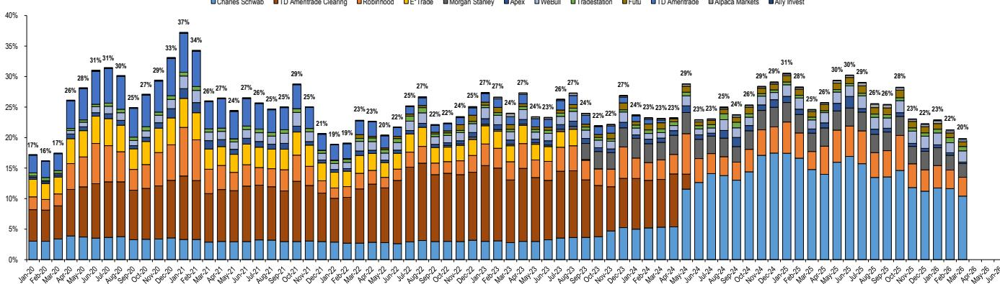
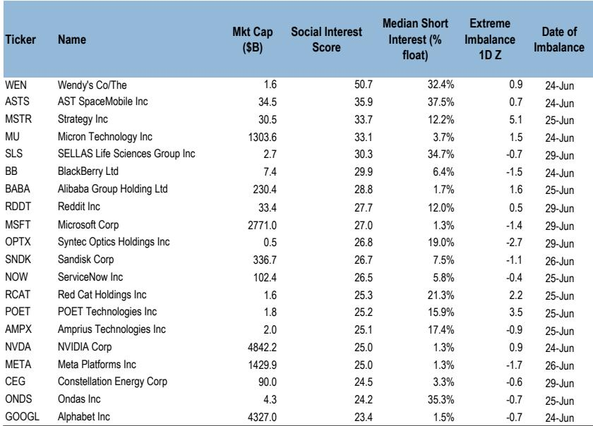
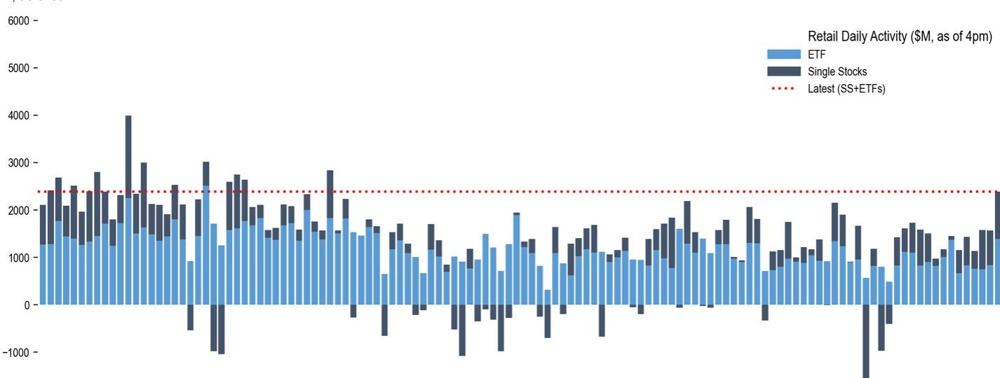

# Retail Investors Are Not Rotating Out of Tech—They Are Doubling Down on Memory and Semiconductors, and That Concentration Creates Both Opportunity and Risk

The dominant narrative in institutional circles over the past several weeks has been one of rotation: away from the crowded AI trade, toward value, fixed income, and defensives. Yet a careful reading of the latest retail flow data tells a strikingly different story. Retail investors are not rotating. They are reinforcing. In the week ending July 1, retail flows reached $8.1 billion, placing them in the 75th percentile of the past twelve months. But the composition of those flows reveals a level of conviction—and concentration—that deserves serious analytical attention. Single-stock inflows hit the 94th percentile, while ETF activity languished at the 17th percentile. This is not the behavior of a cautious retail base diversifying into broad-market exposure. This is a cohort that knows exactly what it wants: memory chips, semiconductor names, and the AI infrastructure theme. The question for institutional strategists is whether this retail conviction is a contrarian signal, a source of momentum, or a risk factor that is not yet priced into the market.

The most striking feature of the current retail landscape is the sheer intensity of demand for a narrow set of names within memory and semiconductors. Inflows into semiconductor stocks climbed to their highest levels in more than a year, while tech hardware attracted its second-strongest demand in over two years. The two standout favorites—Micron Technology and Sandisk—drew net purchases of $897 million and $705 million respectively, with z-scores of 3.7 and 4.6. These are not marginal positions. They represent a level of conviction that borders on the obsessive. The retail playbook has become remarkably consistent: buy the dip in memory, regardless of the broader market narrative. This is not a new phenomenon—the same pattern has been observed for weeks—but the scale is escalating. And it is happening against a backdrop of renewed debate about whether the AI trade has become a bubble.

The divergence between retail and institutional behavior is becoming a structural feature of the market, not a temporary anomaly. While retail investors were pouring $8.1 billion into stocks, futures traders were net selling approximately $11.3 billion, driven by broad-based sales across the S&P 500, Nasdaq, and Russell 2000 contracts. This is not a one-week phenomenon. The data shows a persistent pattern: retail buys the dip, institutions fade the rally. The implications for market structure are profound. Retail is providing a floor under the most crowded trades, but it is also amplifying concentration risk. If the AI narrative falters, the unwind could be violent, because retail is not diversified—it is leveraged to a single theme.

## Retail Investors Are Treating Memory Stocks as a Strategic Asset Class, Not a Tactical Trade

The most important insight from the current data is that retail behavior in memory stocks has shifted from opportunistic dip-buying to something resembling strategic accumulation. The flows into Micron are particularly instructive. The stock surged 16 percent on June 25 following a blockbuster earnings report that revealed a fundamental transformation in the company's business model. The expansion of Strategic Customer Agreements from a single five-year contract to sixteen signed agreements represents a structural shift away from cyclical commodity production toward multi-year contracted revenue with downside protection. Retail investors did not sell into the strength. They bought more. And when the stock gave back most of those gains in subsequent days, they bought even more. This is not momentum chasing in the traditional sense. It is a conviction trade based on a thesis that the memory industry has undergone a permanent change in its competitive dynamics.

The concentration in memory is reinforced by the data on thematic baskets. Retail activity in the AI/Datacenter/Electrification basket reached $1.45 billion for the week, with year-to-date turnover of $40.15 billion. The S&P 500 Top 30 AI/Datacenter Beneficiaries basket saw $1.45 billion in weekly turnover. These are not small numbers. They indicate that retail investors are systematically allocating capital to a coherent set of themes, and they are doing so with remarkable consistency week after week. The question that this raises for institutional investors is whether retail conviction in memory and semiconductors represents a leading indicator of future returns or a crowded trade that is ripe for reversal. The answer likely depends on whether the structural transformation in memory is real and durable.

## The Social Media and Short Interest Data Reveal a Growing Set of Potential Squeeze Candidates That Are Distinct from the Memory Trade

While the memory trade dominates headline flow data, a separate and potentially more volatile dynamic is playing out in a different set of names. The weekly social media screen identifies a list of stocks with elevated retail interest and high short interest that could become battlegrounds for short squeezes. The names on this list are not the usual suspects. Wendy's, AST SpaceMobile, Strategy Inc, and SELLAS Life Sciences all appear with social interest scores above 30 and short interest ratios exceeding 12 percent. What is notable about this list is its diversity. It spans fast food, space communications, enterprise software, and biotechnology. This is not a single meme theme. It is a collection of individual stories that have attracted retail attention and institutional skepticism.

The dynamics in specific names illustrate the pattern. QXO has seen retail purchases accelerating since April 2026, totaling $112 million, while short interest has risen to approximately 21 percent of float. VELO has attracted $27 million in retail buying over the past month while short interest climbed to 34 percent of float. ARES has seen $66 million in retail purchases since March alongside rising short interest now at 9 percent of float. These are not large positions in absolute terms, but the ratios are extreme. When retail buying meets elevated short interest in stocks with limited liquidity, the potential for sudden price dislocations is real. The data suggests that the risk of squeeze events is increasing, not decreasing, and that this risk is concentrated in names that are not part of the mainstream AI narrative.

The relationship between retail positioning and short interest is captured in a chart that plots the divergence between the two. A positive slope indicates opposite positioning, which heightens the risk of either a short squeeze or retail losses. The current data shows a widening gap in several names, suggesting that the tension between retail bulls and institutional bears is escalating. This is not a market-wide phenomenon—it is stock-specific. But for investors who hold these names, the risk of a sudden, violent move is material.

## The Fixed Income and ETF Data Suggest Retail Is Not Rotating Defensively, But Rather Reallocating Within a Risk-On Framework

One of the conventional interpretations of the recent data would be that retail investors are becoming more defensive, given the modest uptick in fixed income ETF flows. That interpretation is misleading. Fixed income ETF flows have rebounded to roughly month-ago levels after several weeks of softness, led by inflows into corporate investment grade and aggregate products. But these flows are modest in absolute terms and pale in comparison to the single-stock inflows into technology and semiconductors. The data does not support a narrative of broad-based rotation into safety. Instead, it suggests that retail investors are making tactical allocations to fixed income as a diversifier while maintaining their core conviction in technology.

The ETF data also reveals a notable absence of rotation within technology itself. In semiconductors, positioning has largely plateaued. There are steady outflows from the leveraged SOXL product, but these have been partly offset by inflows into SOXX and SMH, as well as the tech-tilted QQQ and QQQM. Within software, activity remains unchanged despite the IGV ETF rising approximately 8 percent over the past week. This is not the behavior of a retail base that is reducing risk. It is the behavior of a retail base that is comfortable with its existing exposures and is using ETF flows to fine-tune rather than to exit.

The implication is that retail investors are operating with a coherent worldview. They believe that the AI theme is durable, that memory and semiconductors are the primary beneficiaries, and that short-term volatility should be used as an opportunity to add to positions. This worldview may prove correct, but it is also vulnerable to a specific set of risks. If the AI investment cycle disappoints, if memory prices reverse, or if the macroeconomic environment deteriorates, the retail base is exposed in a way that is not diversified across sectors or asset classes.

## The Report Leaves Unanswered the Question of How Retail Conviction Would Behave in a Sustained Drawdown

The data provided in the report is comprehensive and detailed, but it leaves one critical question unanswered. How would retail conviction behave in a sustained drawdown of more than 10 to 15 percent in the names that retail investors love most? The current data captures behavior during a period of dip-buying, where pullbacks have been shallow and short-lived. The memory trade has worked. Investors who bought the dip have been rewarded. But the report does not provide data on how retail flows respond to a genuine, multi-week correction that challenges the fundamental thesis. Would retail investors hold firm, or would they capitulate? The answer to this question is essential for any institutional investor who is considering positioning against the retail flow or using retail behavior as a contrarian signal.

The report also does not fully address the interaction between retail options activity and the underlying cash market. The data shows that retail share in options is at highs, and the most traded options names echo the cash market favorites: Tesla, Micron, Nvidia, Amazon, Sandisk, AMD, and Meta. But the report does not quantify the gamma exposure that retail options activity creates for market makers, nor does it assess whether retail options positioning is amplifying or dampening volatility in the underlying stocks. For investors who are short volatility or who are positioning for a mean-reversion trade, this is a material gap.

## A Decision Framework for Institutional Investors: How to Interpret Retail Flow Data in a Portfolio Context

For institutional investors who receive retail flow data on a weekly basis, the challenge is not a lack of information but a lack of framework. The data is granular, but it is not self-interpreting. The following framework is designed to help investors translate retail flow data into actionable portfolio decisions.

First, distinguish between concentration and conviction. High flows into a single name or theme can indicate either deep conviction or dangerous crowding. The key question is whether the thesis supporting the flows is structural or cyclical. In the case of memory and semiconductors, the thesis is structural: the expansion of Strategic Customer Agreements, the growth of AI data center capex, and the transformation of memory from a commodity to a contracted business. This thesis is testable and time-bound. If the structural transformation is real, retail conviction is rational. If it is overstated, the crowding is dangerous.

Second, monitor the divergence between retail and institutional positioning. When retail is buying and institutions are selling, the market is pricing in two different narratives. The resolution of this divergence will determine the direction of the next significant move. In the current environment, retail is buying memory and semiconductors while futures traders are selling broad-based equity indices. This divergence suggests that the market is not in equilibrium and that a resolution is likely in the coming weeks.

Third, assess the squeeze risk in names where retail buying meets high short interest. The list of names with elevated social media interest and short interest above 20 percent is a watchlist for potential dislocations. The risk is not that these names will outperform the market over a six-month horizon. The risk is that they will experience sudden, violent moves that create portfolio losses for short sellers and windfall gains for retail buyers. For institutional investors, the appropriate response is not to avoid these names entirely but to size positions appropriately and to hedge tail risk.

Fourth, use retail flow data as a sentiment indicator, not a signal of fundamental value. Retail investors are not always wrong, but they are rarely early. When retail flows become extreme in a single name or theme, it often marks the late stages of a trend rather than the beginning. The current data suggests that the memory trade is mature but not exhausted. The question is whether the next catalyst is positive or negative.

## Join the Community to Read the Full Report and Review the Original Charts

The analysis above draws on a single week of data from a single source. The full report contains charts and tables that provide a richer and more nuanced picture of retail behavior over time. The thematic basket data, the options activity analysis, and the social media screen are updated weekly and are essential for any investor who wants to understand the evolving dynamics of retail participation in equity markets. The original charts include time series data on retail imbalances in memory stocks, the divergence between retail and institutional positioning, and the specific names where squeeze risk is highest. These charts are not available in any other source and are produced by a team of quantitative strategists with deep expertise in retail flow analysis. Join the community to access the full report and to receive weekly updates on retail trading activity, thematic flows, and potential squeeze candidates.

*This article is for learning and discussion only and does not constitute investment advice.*

Personal reading notes and learning share only. Not investment advice.

