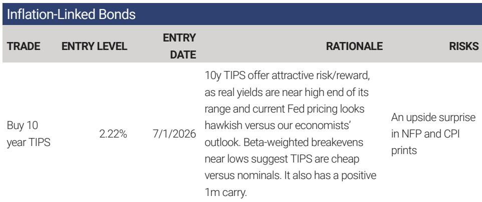

# 摩根斯坦利：MS：10年期TIPS的买入窗口已经打开

通胀数据连续低于预期、美联储终端利率定价偏高、以及即将到来的PCE统计方法调整，正在共同制造一个被市场低估的固定收益交易机会。

MS利率策略团队在7月1日发布的研报中，明确建议投资者在当前位置买入10年期美国通胀保值国债（TIPS）。这份报告的核心判断是：10年期TIPS实际收益率已接近其历史区间上沿，而当前市场对美联储终端利率的定价，比该行经济学家认为的合理水平更加鹰派。两者之间的裂口，构成了一个有吸引力的风险回报比。

这不仅仅是一个简单的“通胀下行买TIPS”的故事。报告背后隐藏着几个更值得推敲的结构性信号：通胀预期的定价权正在从油价转移到劳动力市场，TIPS相对于名义国债的估值已经进入历史性便宜区间，以及一项可能被市场忽略的BEA统计方法调整，有望在未来几个月内改变核心PCE与核心CPI之间的楔形关系。

---

## 1. 市场对美联储的定价过于鹰派，这给了TIPS一个赔率优势

MS经济学家预测美联储将在未来几个月内实施两次降息，终端利率将低于当前市场定价的3.6%。而当前10年期TIPS实际收益率约为2.22%，在过去五年的周度数据中，它与美联储终端利率的相关系数高达51%。这意味着，如果终端利率随降息预期而下移，10年期TIPS实际收益率将同步走低，价格上升。

过去三个月，10年期实际收益率随市场对美联储鹰派立场的重新定价而大幅上行。但这份研报指出，这种鹰派定价在很大程度上源于过去三次非农就业数据的超预期，而非通胀本身的粘性。与此同时，过去12个月中有8次CPI数据低于预期，通胀下行的趋势已经确立。市场正在用后视镜定价，而MS的观点是，接下来几个月的通胀数据将证明当前定价的过度。

> **KC评论：** 这本质上是一个“押注市场错误定价”的交易。投资者不需要判断通胀是否会大幅下行，只需要相信市场对美联储降息路径的定价过于悲观。如果MS的经济学家是对的，当前2.22%的实际收益率就是一个不错的入场点。完整报告中的Exhibit 2清晰展示了实际收益率与终端利率的历史联动关系，值得细看。

---

## 2. 通胀预期正在从油价驱动转向就业驱动，市场尚未充分定价这一切换

美伊谅解备忘录签署后，布伦特原油跌破每桶80美元，5年5年和2年3年CPI互换远期利率也随之走低。MS认为，这证明市场对美联储维持价格稳定的长期能力有了信心——通胀预期不再因油价波动而大幅脱锚。

但真正值得关注的不是油价本身，而是通胀预期定价权的转移。随着能源基数效应消退，核心CPI的走势将更多取决于劳动力市场的紧张程度和薪资增长。而当前市场对核心CPI的定价依然偏高——5月2027年核心CPI固息仍在2.9%，过去两周还上升了15个基点。

这种“油价跌了但核心通胀定价反而走高”的背离，恰恰说明市场尚未完成从能源通胀到服务通胀的定价框架切换。如果接下来的非农数据不及预期（MS经济学家预测6月NFP为9万，低于市场共识的11.5万），核心通胀定价将面临一次显著的下修。

---

## 3. 从相对价值看，TIPS已经便宜到了历史均值回归区间

这份报告中最有技术含量的一个判断来自beta加权盈亏平衡通胀率。简单来说，10年期TIPS的beta约为0.7-0.8，意味着名义收益率每上升1个基点，实际收益率通常上升约0.75个基点，盈亏平衡通胀率相应扩大0.25个基点。当beta加权盈亏平衡通胀率处于低位时，说明TIPS相对于名义国债已经被系统性卖便宜了。

当前beta加权10年期盈亏平衡通胀率已接近历史区间低点。MS的分析显示，当波动率上升时，beta加权盈亏平衡通胀率倾向于从极端水平均值回归。如果这一回归发生，TIPS将跑赢名义国债。

> **KC评论：** 这里的关键不是预测通胀本身，而是判断相对价值是否被扭曲。beta加权盈亏平衡通胀率是一个比简单盈亏平衡率更干净的估值指标，因为它剔除了名义收益率和实际收益率之间的历史联动关系。完整报告中的Exhibit 3展示了这一指标的当前水平与历史区间的对比，是判断TIPS是否“便宜”的核心图表。

---

## 4. BEA统计方法调整可能成为压低核心PCE的催化剂

这是整份报告中最容易被忽视但潜在影响最大的一个点。MS经济学家指出，美国经济分析局（BEA）即将对PCE价格统计方法进行调整。如果调整被回溯应用，核心PCE同比数据可能被压低最多20个基点。

当前核心PCE相对于核心CPI的楔形已经异常走阔，主要来自医疗、金融服务、软件和内存等PCE权重高于CPI的类别。一个更窄的CPI-PCE楔形将直接有利于降息预期，因为美联储的目标是PCE而非CPI。如果BEA的调整确实落地，当前市场对终端利率的鹰派定价将失去一个重要的数据支撑。

---

## 5. 交易并非没有风险：非农数据是最大的短期扰动

MS明确指出了这个交易的主要风险：即将公布的6月非农就业数据和CPI数据。如果非农再次超预期，市场可能将其解读为经济持续强劲的信号，推高名义收益率，从而在短期内打压TIPS价格。

为此，报告建议投资者通过买入1个月10年期payer swaption来部分对冲这一风险。当前1个月10年期平价payer的成本为63个基点，意味着10年期利率需要上行约7.7个基点才能实现盈亏平衡。考虑到当前隐含波动率处于近期区间低位，这一对冲成本并不算高。

> **KC评论：** 这其实是一个经典的“核心仓位+尾部对冲”结构。如果非农数据符合MS的预期（低于共识），TIPS将直接受益；如果数据超预期，payer swaption可以提供保护。完整报告中的Exhibit 7和Exhibit 8详细展示了隐含波动率的当前水平和对冲的盈亏平衡点，是执行这个交易前必须了解的细节。

---

## 报告没有完全回答的关键问题：核心CPI固息曲线的脆弱性

尽管MS对10年期TIPS给出了明确的买入建议，但报告中对核心CPI固息曲线的讨论留下了一个悬而未决的问题。报告提到，核心CPI固息曲线的峰值在历史上曾在冲突期间一个月内波动60个基点。这意味着，即使整体通胀趋势向下，核心通胀预期的短期波动仍然可能很大。

当前2.9%的核心CPI固息定价是否已经充分反映了劳动力市场的韧性？如果接下来几个月的数据出现反复，市场是否会重新定价通胀风险，从而打乱TIPS的交易逻辑？报告对此没有给出明确的概率判断，而是将其作为一个需要持续跟踪的变量。

---

## 对投资者的观察框架：三个需要持续跟踪的信号

基于这份研报的逻辑，投资者在持有或考虑这个交易时，可以关注以下三个边际变化：

第一，beta加权盈亏平衡通胀率是否从当前低位开始回升。这是判断TIPS相对价值修复是否启动的最直接指标。

第二，核心PCE与核心CPI的楔形是否开始收窄。如果BEA的方法调整确实落地，楔形收窄的速度将直接影响降息预期和TIPS的定价。

第三，非农数据是否持续低于市场共识。如果就业市场确实如MS经济学家预测的那样降温，当前对终端利率的鹰派定价将面临系统性下修。

这三个信号中任何一个出现方向性变化，都可能意味着TIPS交易的赔率发生了根本性转变。而这三个信号的交叉验证，恰恰是这份研报的完整版中通过多张图表和情景分析展开的核心内容。

---

更多国际信源汇编与评论，欢迎扫码交流。每日更新，汇总国际主流叙事、数据与图表，观测边际变化。目前已汇聚头部券商、PE/VC、投行、并购、hedge fund、资管机构、战略咨询、智库等朋友，期待与您交流。

Personal reading notes and learning share only. Not investment advice.

