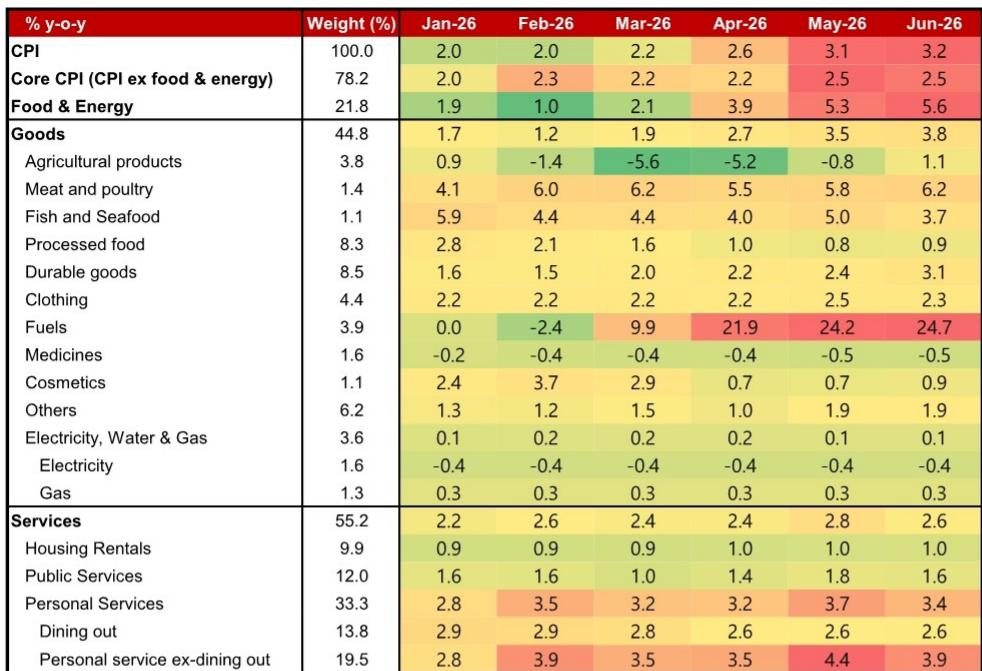

# Korea's Inflation Headline Hides the Real Story: The Bank of Korea Will Hike Despite Stable Core Prices

The June inflation print from South Korea delivered a superficially alarming number, but the underlying data tells a far more strategic story for investors. Headline CPI rose to 3.2% year-on-year, the fastest pace since late 2023, yet the monthly increase slowed sharply to just 0.1%. Core inflation, which strips out food and energy, remained unchanged at 2.5% year-on-year with a flat month-on-month reading. This divergence between the headline and the core is not noise; it is a signal about the nature of the current inflationary cycle and the policy response that will follow.

The critical insight for market participants is that the Bank of Korea is not responding to the headline number. Instead, it is responding to financial stability risks that have become the dominant concern in its policy framework. The investment bank report underlying this analysis projects three 25-basis-point rate hikes starting in July, taking the terminal rate to 3.25%. This path is not driven by demand-side overheating or wage-price spirals, but by a calculated trade-off between inflation management and the containment of household debt and property market imbalances.

Why now matters: the next few months will test whether the BOK can thread the needle between a headline that will peak in August and a core that refuses to accelerate. The central bank's hawkish narrative will be maintained, but the rationale will shift from fighting inflation to preventing financial instability. For investors in Korean bonds, equities, and the won, understanding this pivot is essential for positioning over the next two quarters.

## The Headline Spike Is a Supply-Side Echo, Not a Demand-Side Breakout

The June figure of 3.2% year-on-year is best understood as the tail end of earlier oil price shocks working through the index, not as the beginning of a new inflationary phase. The sequential data confirms this interpretation. Headline CPI rose only 0.1% month-on-month in June, a dramatic deceleration from the 0.5% pace in May and the even stronger readings in the prior two months. If this were a genuine reacceleration driven by domestic demand, the monthly momentum would be building, not collapsing.

The composition of the headline increase reinforces the supply-side diagnosis. Petroleum product prices surged 24.7% year-on-year, contributing nearly a full percentage point to the headline. This is the lingering effect of earlier global oil price increases that are now fading. Agricultural, livestock, and fishery product inflation jumped to 3.2% year-on-year from 2.2% in May, but this was concentrated in livestock and fishery products rather than broad-based food inflation. Meanwhile, services inflation actually eased to 2.6% from 2.8%, with personal services excluding dining out slowing markedly from 4.4% to 3.9%.

The so what here is straightforward: central banks and investors should not overreact to a headline that is being mechanically lifted by lagged commodity pass-through. The real question is whether these supply-side impulses become embedded in wages and inflation expectations. On that front, the evidence so far is reassuring. Core inflation held steady, and the monthly pace fell to zero. The BOK can look past the June number without losing credibility.

## Core Stability Masks a More Important Strategic Question

The flat month-on-month reading for core inflation in June is the most important data point in this release, but its implications are more nuanced than they first appear. On one hand, it confirms that underlying price pressures remain contained in the mid-2% range, well within the BOK's tolerance zone. On the other hand, it raises a strategic question: if core inflation is stable and the headline is about to peak, why would the central bank embark on a tightening cycle?

The answer lies in the distinction between inflation management and financial stability policy. The BOK is facing a situation where household debt levels remain elevated and property prices in certain segments have shown renewed upward momentum. In this context, a stable core inflation reading does not provide cover for inaction; it actually gives the central bank room to focus on the financial stability objective without being accused of ignoring inflation.

This is a classic case of policy objective switching. When inflation was the primary concern, the BOK cut rates. Now that inflation is no longer accelerating and core is stable, the central bank can shift its attention to the side effects of its previous easing cycle. The rate hikes projected for July, October, and January are not about fighting the June CPI print. They are about preemptively tightening financial conditions to prevent the buildup of imbalances that could force a more disruptive adjustment later.

For investors, this means the BOK's communication will be carefully calibrated. The hawkish narrative will remain intact, but the justification will increasingly reference financial stability risks rather than inflation dynamics. The market should expect the central bank to emphasize that it is not reacting to the headline number, but rather acting to ensure that the current disinflation trend is not disrupted by financial instability.

## The Disinflation Path Is Real but Subject to Two Important Offsets

The report's baseline view is that headline CPI will peak in August and then resume a gradual disinflationary trend, anchoring to the BOK's 2% target by the second quarter of 2027. This is a reasonable central case, but the path is not frictionless. Two structural factors complicate the transmission of lower global oil prices into domestic inflation relief.

First, the flexible fuel price cap mechanism has contained the passthrough of higher oil prices, which means it will also limit the passthrough of lower oil prices. The cap was designed to smooth the impact of oil price volatility on consumers, but it works symmetrically. When global prices fall, domestic prices do not fall as much as they otherwise would, because the cap mechanism absorbs some of the decline. This creates a natural floor for energy-related inflation components.

Second, the weaker Korean won is acting as an offsetting force. A depreciating currency raises the domestic cost of imported goods, including energy and raw materials. As global oil prices decline, the won's weakness partially offsets the disinflationary benefit. The net effect is that the headline CPI will decline more slowly than the global oil price trajectory would suggest.

The implication for investors is that the disinflation narrative is correct but the timing is extended. The BOK's 2026 inflation forecast of 2.7% and 2027 forecast of 2.1% already incorporate these offsets. The market should not expect a rapid decline back to target. Instead, the path will be gradual, with periodic upside surprises from currency movements and residual supply-side effects.

## What the Report Does Not Fully Answer: The Second-Round Risk

The report provides a detailed decomposition of the June inflation data and a clear policy outlook, but it leaves one critical question underdeveloped: what happens if the current supply-side shocks begin to feed into wages and services prices through second-round effects? The report notes that the BOK's key concern for the July MPC meeting will be whether higher energy and transport costs begin to affect services prices, wages, and inflation expectations. Yet the analysis does not provide a framework for monitoring this risk.

The data so far is benign. Personal service inflation excluding dining out slowed from 4.4% to 3.9%, and dining-out inflation itself held steady at 2.6%. But these are backward-looking indicators. The risk is forward-looking: if businesses begin to build higher energy costs into their pricing strategies, or if labor unions use the headline inflation number as a bargaining chip in wage negotiations, the core inflation picture could change rapidly.

The report's baseline assumption is that there is no strong evidence of wage-led or demand-side inflation pressures. This is a reasonable starting point, but it is not a guarantee. The BOK's rate hike path is partly designed as insurance against this scenario. By tightening preemptively, the central bank hopes to prevent second-round effects from materializing. The open question is whether this insurance is sufficient or whether more aggressive action will be needed if the transmission channel activates.

## A Decision Framework for Investors: Three Scenarios for the Next Six Months

Translating the report's analysis into actionable investment strategy requires a scenario framework. The base case is the report's own projection: three rate hikes, a peak in headline inflation in August, and a gradual disinflation toward 2% by mid-2027. But investors should stress-test this baseline against two alternative scenarios.

Scenario One: Soft Landing with No Second-Round Effects. In this scenario, the supply-side shocks fade as expected, core inflation remains stable, and the BOK completes its three rate hikes without needing to accelerate or extend the cycle. The terminal rate of 3.25% proves sufficient to contain financial stability risks without tipping the economy into recession. This is the most favorable outcome for Korean bonds, as the tightening cycle ends sooner than the market currently prices. It is also positive for the won, as the rate differential with the US narrows.

Scenario Two: Sticky Core Inflation Triggers a Longer Cycle. If second-round effects begin to materialize, core inflation could rise above the 2.5% level and approach 3%. In this scenario, the BOK would need to extend its hiking cycle beyond the three projected moves, potentially taking the terminal rate to 3.5% or higher. This would be negative for bonds and negative for equity valuations, particularly in domestic demand-sensitive sectors. The won would likely strengthen initially on the rate differential, but the economic slowdown would eventually weigh on the currency.

Scenario Three: Financial Stability Crisis Forces an Abrupt Pause. The report notes that financial stability concerns are already outweighing inflation concerns. If the rate hikes themselves trigger a sharp correction in property prices or a spike in household debt distress, the BOK could be forced to pause or even reverse its tightening cycle. This scenario is the least likely in the near term, but it represents the tail risk that the central bank is trying to avoid. In this outcome, bonds would rally sharply, the won would weaken on policy credibility concerns, and equities would face a dual shock from financial instability and policy reversal.

The key for investors is to monitor the monthly core inflation prints and the BOK's communication around financial stability. If core inflation remains at 2.5% or below and the central bank continues to emphasize financial stability as the primary motivation for hikes, the base case is intact. If core inflation edges higher and the BOK shifts its language toward inflation fighting, Scenario Two becomes more likely.

## The Unresolved Analytical Question That Demands Deeper Research

The report's most valuable contribution is its clear-eyed assessment of the policy trade-off facing the BOK. But it leaves one major analytical thread dangling: the interaction between the flexible fuel price cap, currency dynamics, and the transmission of global commodity prices into domestic inflation. The report acknowledges that the cap and the weaker won are offsetting factors, but it does not quantify the net effect or model the sensitivity of the inflation path to changes in either variable.

This is not a criticism of the report, which is a timely and well-structured analysis of the June data. It is an invitation for investors to do their own scenario analysis. How much would the won need to depreciate to fully offset a 10% decline in global oil prices? What is the effective passthrough coefficient of the fuel price cap mechanism? These are the questions that separate a superficial understanding of Korean inflation from a truly strategic investment framework.

The full report includes the original data and charts that allow investors to build these models. The heatmap of inflation components by category and by month provides the granular detail needed to track the evolution of price pressures in real time. For serious investors who want to move beyond the headline narrative and into the structural dynamics of the Korean economy, this data is indispensable.

Join the community to read the full report and review the original charts.

*This article is for learning and discussion only and does not constitute investment advice.*

Personal reading notes and learning share only. Not investment advice.

