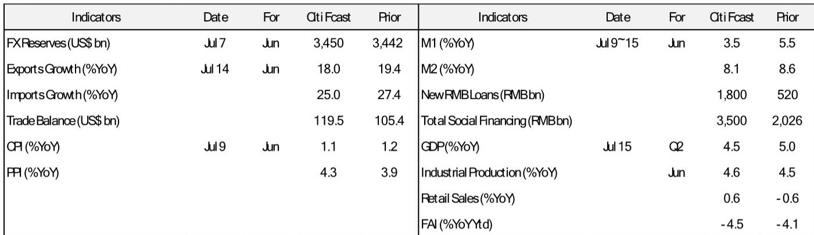

# Citi：中国经济的“止跌信号”藏在数据细节里，而非总量

6月的经济数据，大概率不会出现让市场意外的全面反弹。但Citi最新一份研报的核心判断，恰恰不是“数据有多好”，而是“数据正在从最悲观的位置上，给出几个关键领域的边际改善信号”。对于习惯从宏观总量判断趋势的投资者而言，这份报告提醒我们：真正的观察点，已经从“GDP能否保5”转向了“哪些结构性力量正在形成新的支撑”。

这份报告最值得关注的判断是：二季度GDP增速可能触及全年低点，而6月数据中，出口的韧性与消费补贴驱动的零售转正，是两个最关键的“止跌”信号。但与此同时，投资与信贷的持续疲弱，意味着政策宽松窗口并未关闭，7月LPR调整是最早的检验点。

## 1. 出口不是“虚火”，AI驱动的结构性需求正在重塑贸易格局

市场对当前出口高增速一直存有疑虑，担心是春节效应、基数干扰或短期抢运。Citi的预测给出了一个更坚实的解释：6月出口增速预计仍将维持在18.0%的较高水平，而进口增速预计更高，达25.0%。贸易顺差预计将扩大至约1195亿美元。

支撑这一判断的核心逻辑，并非传统的全球需求周期性回暖，而是两个结构性因素：中东地缘紧张局势的边际缓和，以及全球AI超级周期的持续深化。后者尤其值得关注。报告引用了一个关键证据：6月韩国对中国的出口同比飙升92.1%。韩国是全球半导体和电子元器件的“前哨”，其对华出口的爆发式增长，直接指向中国AI相关产业链的进口需求正在急剧扩张。

> **KC评论：** 出口数据的韧性，正在被AI产业链的资本开支周期重新定义。过去我们看出口看纺织、家具、机电，现在需要关注的是半导体设备、高端元器件和AI算力基础设施的进口与再出口。这份报告没有展开的是，这种结构性变化如何重塑中国的贸易顺差结构和产业链利润分布——这恰恰是完整报告中值得深挖的核心图表。

## 2. 消费的“止跌”靠补贴，但可持续性取决于收入预期

零售数据是这份报告中最具“意外性”的看点。Citi预计6月社会消费品零售总额同比增速可能转正至0.6%，而5月为-0.6%。这一转正的主要动力，并非消费信心的自发修复，而是“以旧换新”补贴政策的加速落地。

报告提供了一个关键数据：6月1日至20日，日均补贴销售额约为88亿元人民币，而1-5月的日均水平仅为约54亿元。补贴力度的显著加码，正在短期内对耐用品消费形成实质性拉动。

但这里必须指出一个尚未回答的问题：补贴驱动的消费修复，本质上是“价格补贴”而非“收入效应”。一旦补贴节奏放缓或政策力度不及预期，消费增速能否维持正增长？Citi的报告对此保持了审慎，指出“我们继续认为只有零星的消费者支持措施”。这意味着，消费的真正拐点，需要等待居民收入预期的实质性改善，而这又取决于就业市场和资产价格的表现。

## 3. 投资与信贷的“双弱”，是政策宽松最直接的催化剂

如果说出口和消费给出了边际改善的信号，那么投资和信贷数据则构成了这份报告的另一面——它们共同强化了政策宽松的必要性。

Citi预计，6月固定资产投资累计同比降幅可能进一步扩大至-4.5%，尽管月度降幅可能收窄至中个位数。信贷方面，预计6月新增人民币贷款为1.8万亿元，低于去年同期的2.24万亿元；新增社会融资规模为3.5万亿元，同样低于去年同期的4.225万亿元。M1增速预计从5月的5.5%大幅回落至3.5%，M2增速预计从8.6%回落至8.1%。

> **KC评论：** 信贷数据的疲弱，叠加M1增速的显著回落，反映的是企业和居民“加杠杆意愿”的持续低迷。这已经不是单纯的“宽货币”能否传导为“宽信用”的问题，而是经济主体对未来的预期是否已经触底。7月LPR是否调整，将是一个关键的政策信号测试。如果LPR下调，市场会解读为“托底”而非“刺激”；如果不下调，则可能意味着政策层对当前经济增速仍有容忍度。

## 4. 通胀的“油”风险退潮，但“煤”与“AI”的新扰动正在浮现

通胀数据的解读，可能是这份报告中最容易被忽视但最具前瞻性的部分。Citi预计6月CPI同比增速为1.1%，PPI为4.3%。报告明确指出，“石油冲击似乎基本已经过去”，布伦特原油价格环比已下跌20.2%。

但一个更值得关注的信号是：煤炭价格在6月延续了上涨趋势，其潜在的溢出效应可能比石油和天然气更为广泛。同时，“AI通胀”可能在PPI中进一步显现——这意味着，与AI相关的算力基础设施、数据中心和高端芯片制造环节，正在推高相关工业品价格。

> **KC评论：** 传统上，市场习惯于用“输入性通胀”框架来理解中国的PPI，即关注原油和铁矿石价格。但Citi的提示给出了一个新的观察维度：AI产业链的资本开支，正在成为国内工业品价格的一个独立推手。这可能会在供给端形成新的价格支撑，同时也意味着，PPI的回落速度可能慢于市场预期。

## 5. 报告尚未完全回答的关键问题：政策宽松的“天花板”在哪里？

这份报告的完整价值，在于它给出了一个清晰的短期数据图景，但也留下了几个尚未完全解答的关键问题。其中最重要的一点是：如果7月LPR下调，其对实体经济的传导效率究竟如何？在当前企业和居民资产负债表受损、预期偏弱的背景下，降息能否有效提振信贷需求，还是仅仅停留在“信号意义”上？

另一个未被充分展开的变量是：地方政府的财政约束。报告提到了政府债券发行（约8000亿元）和企业债券融资（约5000亿元）对社会融资的支撑，但并未深入分析，在土地出让收入持续下滑的背景下，地方政府是否有足够的财政空间来配合中央的宽松政策。

## 6. 一个值得投资者建立的观察框架

基于这份报告的逻辑，我们可以提炼出一个三层观察框架，用于跟踪后续的经济和政策演变：

第一层，看“量”的边际变化。关注6月及7月的高频数据，尤其是出口增速能否维持15%以上，零售增速能否稳定在正区间，以及固定资产投资降幅是否收窄。这些是判断经济是否“止跌”的最直接指标。

第二层，看“价”的结构性信号。关注PPI中与AI相关的细分项（如半导体、电子元器件、算力设备）的价格走势，以及煤炭价格是否持续上涨。这将决定通胀预期的演变方向，进而影响货币政策的操作空间。

第三层，看“政策”的响应节奏。7月LPR调整是最早的检验点，但更重要的是政治局会议对经济形势的定调。如果政策基调从“稳中求进”转向更明确的“加大逆周期调节”，那么市场对后续政策的预期将显著提升。

---

以上是Citi这份研报的核心洞察与延伸思考。但报告本身还包含了更多未在此处展开的关键分析：例如，AI超级周期如何具体影响中国出口的结构性变化；补贴政策对消费的拉动效应能持续多久；以及信贷数据中各分项的详细拆解。这些内容，都需要回到原始报告中才能获得完整的逻辑链条和数据支撑。

更多国际信源汇编与评论，每日更新，汇总国际主流叙事、数据与图表，观测边际变化。我们汇聚了头部券商、PE/VC、投行、并购、hedge fund、资管机构、战略咨询、智库等朋友，期待与你交流。

Personal reading notes and learning share only. Not investment advice.

