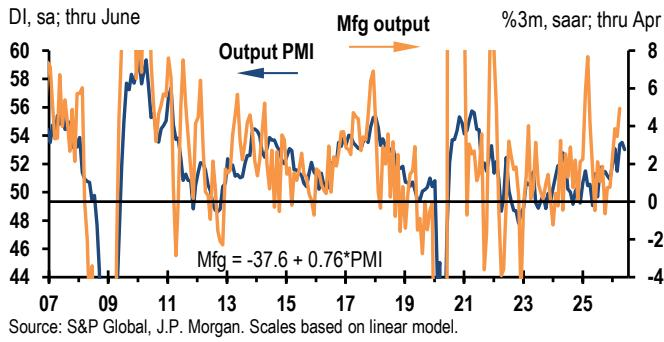
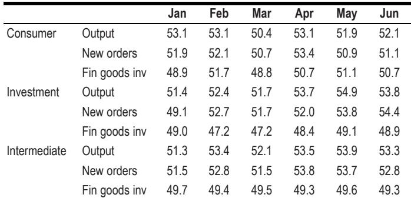
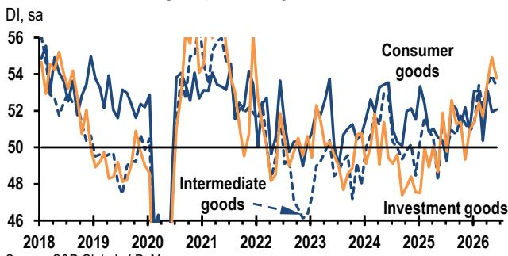

# Global Manufacturing Is Not Slowing — It Is Shifting Gears. The Real Question Is Whether the Engine Can Handle the Next Phase.

The June global manufacturing PMI data appears, at first glance, to tell a story of moderation. The headline output index slipped 0.5 points from a five-year high to 53.0, and the future output component dropped to its lowest level in this expansion. A casual reading suggests the torrid first-half pace is losing steam. That interpretation is too simple, and it misses the more important strategic signal embedded in these numbers.

The global factory sector is not decelerating into weakness. It is consolidating into a more sustainable, but structurally different, growth regime. The output PMI at 53.0 remains consistent with industrial growth running at an annualized pace of approximately 2.7 percent. The new orders index, while down for a second consecutive month, still sits near a four-year high. The ratio of new orders to finished goods inventories remains firmly in expansionary territory. These are not the signatures of a cycle about to stall.

What is actually happening is a transition away from a demand surge that was partly artificial — driven by precautionary stockpiling and hedge-buying in response to geopolitical uncertainty — and toward a growth path supported by genuine final demand and the early stages of a deliberate inventory rebuild. The distinction matters enormously for anyone making capital allocation decisions in the second half of the year.

The report's own language is instructive: the boom is "consolidating," not collapsing. The data shows resilience, not fragility. But the composition of that resilience is shifting in ways that will reward investors and executives who understand the underlying mechanics, and punish those who extrapolate the first-half momentum linearly into the future. This article unpacks what the June PMIs really mean, where the hidden risks lie, and how to build a decision framework around the data that the headline numbers alone cannot provide.

## The Divergence Between Current Output and Future Expectations Is the Most Important Signal in the Data — and It Is Not a Contradiction

The most striking feature of the June PMI release is not the level of the output index. It is the widening gap between the current output PMI and the future output PMI. The future output component dropped to 59.0 in June, a notable step down from the 60.0-62.0 range that had persisted for much of the past year. The gap between current and expected output now resembles the pattern seen during the 2018-2019 trade war period, which preceded a meaningful slowdown in actual manufacturing growth.

This divergence creates an analytical puzzle. How can current output be robust while producer expectations are deteriorating? The answer lies in the composition of the demand drivers. The first half of the year benefited from a confluence of forces that are inherently temporary: a post-energy-shock rebound in consumer spending, a catch-up in business capex, and — critically — a wave of precautionary ordering by companies seeking to hedge against potential supply chain disruptions stemming from the Middle East conflict.

The PMI data itself provides the clue. The report explicitly notes that businesses have been boosting demand and output "in part as a hedge against potential bottlenecks." When companies order ahead of need, current output gets a temporary lift, but future demand is pulled forward. The future output index is capturing the inevitable payback: once inventories are rebuilt and geopolitical fears recede, the pace of new orders naturally normalizes.

This does not mean a downturn is coming. It means the growth trajectory is rotating from a front-loaded surge to a steadier, lower-slope expansion. The key question for investors is whether the underlying final-demand foundation is strong enough to support the transition. On that score, the evidence is cautiously positive. Labor markets are improving, equity markets have delivered strong returns, and energy prices have fallen back from their peaks. These factors should keep goods spending well-supported even as the hedge-driven demand fades.

The danger is not that the cycle ends. The danger is that market participants misinterpret the future output decline as a recession signal and position defensively, missing the continued expansion in actual activity. The 2018-2019 analogy is instructive precisely because it highlights a period when growth slowed but did not collapse — and where the slowdown was driven by policy uncertainty and inventory dynamics rather than by a collapse in final demand. The current cycle shares those features, but with a stronger final-demand backdrop.

## The Sectoral Story Reveals That the Capital Goods Boom Is Broader Than the Tech Narrative, and That Consumer Goods Remain the Weak Link

One of the most valuable analytical contributions of the sector-level PMI data is that it forces a disaggregation of the aggregate narrative. The headline numbers can mask important differences in the underlying drivers, and the June data is no exception.

The investment goods sector — capital equipment, machinery, and related products — posted an output PMI of 53.8 in June, down 1.1 points from May but still well above its historical average. More importantly, the sector's new orders index actually rose to 54.4, the highest reading in the series. This is a critical detail. The decline in output was a partial unwind of an unusually strong May, but the demand pipeline remains robust. The report notes that the investment goods PMI's rapid gain from a November trough has mirrored the rebound in actual capex spending, and that the strength appears to be "broad-based" rather than narrowly concentrated in technology.

This has significant implications for investors who have been positioning around a tech-centric industrial recovery narrative. The data suggests that non-tech capital spending is also picking up, which would broaden the opportunity set beyond semiconductors and AI-related hardware into more traditional industrial sectors. If the capex recovery is indeed broadening, then the next phase of the cycle could see outperformance in areas that have lagged — such as conventional machinery, construction equipment, and industrial automation outside of the tech supply chain.

The consumer goods sector tells a different story. Its output PMI ticked up marginally to 52.1 in June, but remains the weakest of the three major sectoral groupings and is below its pre-pandemic expansion pace. This is the area that requires the most careful monitoring. Consumer spending on goods has been supported by improving labor markets and strong financial conditions, but the data suggests that the consumer-led rebound may be running out of steam. The new orders index for consumer goods slipped to 51.1, and finished goods inventories are actually building, which could lead to production cuts in the coming months if demand does not accelerate.

The intermediate goods sector sits in between. Its output PMI fell back to 53.3, but remains near five-year highs. The sector's performance has been closely tied to the inventory cycle, and the recent moves in the stocks of purchases PMI are historically a positive signal for manufacturing growth. This is the sector most likely to benefit from the inventory rebuild that the report anticipates in the coming months.

For investors, the sectoral dispersion creates a clear hierarchy of conviction. The capital goods story is the most compelling, with broad-based demand and a rising orders pipeline. The intermediate goods story is supportive but contingent on the inventory cycle playing out as expected. The consumer goods story is the most fragile and requires the most evidence to confirm the resilience thesis.

## The Regional Divergence Is Not Random — It Reflects Differential Exposure to the Tech Cycle, Energy Shocks, and Inventory Dynamics

The national PMI data in the June release reveals a pattern that is far from random. Developed markets are outperforming emerging markets by a wide margin — the DM aggregate output PMI stands at 54.0, compared to 52.2 for the EM aggregate. But within each group, the dispersion is even more revealing.

In the developed world, the United States remains the standout performer, even after a 0.4-point decline in its output PMI. At its current level, the US index is the most elevated of any DM economy tracked in the report. This is consistent with a narrative of US industrial exceptionalism driven by strong domestic demand, a resilient labor market, and the ongoing tech investment cycle. The Euro area and Japan both posted modest increases in June, partially reversing May's declines, but neither has the same momentum as the US. The UK and Australia continue their gradual climb, suggesting that the DM recovery is broadening geographically but not accelerating.

The emerging market story is more complex and more concerning. China's output PMI declined for a second consecutive month to 52.8, though this follows an April surge that left the level elevated relative to its recent history. The more alarming signal comes from EM Asia excluding China and India, which dropped 1.7 points to 51.5 — its weakest level in seven months. The declines were led by Korea and Indonesia, two economies that are heavily exposed to the global tech supply chain. This suggests that the tech boom that has been a key driver of Asian manufacturing may be losing some of its momentum, or that the benefits are becoming more concentrated in a few countries.

The EMEA EM aggregate is the weakest of all, falling to 48.2 — below the expansion-contraction threshold of 50.0. The declines in Poland and Turkey were particularly sharp, and the region's exposure to the energy shock and geopolitical uncertainty continues to weigh heavily. Latin America was the only EM region to improve, rising to 49.4, but this is still a contractionary reading.

The strategic implication is clear: the global manufacturing recovery is not uniform, and the regions that benefited most from the initial post-shock rebound may be the first to fade. The DM-led recovery is more durable because it is supported by stronger final demand and more diversified industrial bases. The EM recovery is more fragile because it is more dependent on the tech cycle and on external demand from the DM economies. Investors who treat the EM PMI data as a simple lagging indicator of DM performance may miss the fact that the EM weakness is structural in some cases, not cyclical.

## What the Report Does Not Fully Answer: The Interaction Between the Inventory Rebuild and the Price Shock

The report makes a compelling case that inventory rebuilding will be a key driver of manufacturing growth in the coming months. Inventories have gotten lean over the past year, and the ratio of new orders to finished goods inventories still points to solid expansion. But the report does not fully address the tension between this inventory thesis and the price dynamics that are playing out simultaneously.

The input price PMI has skyrocketed 12.3 points this year. The output price PMI is up 6.4 points. Both remain extremely elevated even after June's modest declines. If input costs continue to rise, companies may be reluctant to rebuild inventories aggressively, because the cost of carrying inventory increases and the risk of being caught with overpriced stock if demand softens becomes more acute. The inventory rebuild that the report anticipates may be slower and more cautious than the historical relationship would suggest, precisely because the price environment introduces a new variable that was not present in previous cycles.

This is not a criticism of the report's logic. It is an acknowledgment that the current cycle is unusual in combining a demand-driven recovery with a supply-side price shock. The historical patterns that the report uses to calibrate its expectations may not hold if the price environment remains elevated. The report acknowledges the "upside risks to underlying core goods price inflation," but it does not fully explore how those risks could alter the inventory behavior that is central to its growth forecast.

For readers, this is the open analytical question that the full report may address in greater depth. How does the inventory cycle behave when input prices are rising rapidly? Does the historical relationship between the orders-to-inventory ratio and future output hold in an environment of cost-push inflation? These are not minor technical questions. They have direct implications for the timing and magnitude of the inventory-driven growth that the report expects.

## A Decision Framework for the Second Half: Three Questions Every Investor Should Ask About the Data

The PMI data is not a forecast. It is a measurement of current conditions and near-term expectations. But it can be used to build a decision framework that helps investors and executives navigate the uncertainty of the coming months. Based on the June release, three questions should guide strategic positioning.

First, is the final-demand foundation strong enough to sustain growth as the hedge-driven demand fades? The report points to improving labor markets, strong stock market gains, and falling energy prices as supporting factors. But these are lagging indicators. The leading indicators are the new orders and future output components, both of which are softening. The decision framework should treat the final-demand thesis as unproven and require additional data points — particularly consumer spending data and retail sales figures — before committing capital to cyclically exposed positions.

Second, is the inventory rebuild real or aspirational? The report expects inventory rebuilding to support growth, but the price environment introduces friction. Investors should monitor the finished goods inventory PMI and the stocks of purchases PMI in the coming months. If inventories begin to rise while output holds steady, the inventory thesis is confirmed. If inventories remain lean despite rising orders, the thesis is challenged, and the growth forecast should be revised downward.

Third, which sectors and regions are best positioned for the consolidation phase? The sectoral data points to capital goods as the strongest area, with broad-based demand and a rising orders pipeline. The regional data points to developed markets, particularly the United States, as the most resilient. The decision framework should overweight exposure to DM capital goods and underweight EM consumer goods until the data provides clearer signals.

These three questions will not produce definitive answers in the near term. But they provide a structured way to interpret the incoming data and adjust positioning as the evidence accumulates. The PMI data is a tool, not a verdict. The skill is in knowing which signals to prioritize and which to discount.

## The Full Report Contains the Charts and Granular Data That Make These Distinctions Actionable

The analysis above draws on the headline numbers and the strategic patterns visible in the June PMI release. But the full report contains the detailed charts, the historical comparisons, and the country-level and sector-level breakdowns that allow for a more precise assessment. The ratio of new orders to finished goods inventories, the trajectory of the future output PMI relative to past cycles, the dispersion of the capex recovery across sectors — these are not abstract concepts. They are visible in the data, and the charts in the full report make them immediately interpretable.

For anyone making portfolio or capital allocation decisions in the current environment, the difference between a general understanding of the PMI data and a granular, chart-supported analysis is the difference between a directional bet and a calibrated position. The full report provides the latter.

Join the community to read the full report and review the original charts.

*This article is for learning and discussion only and does not constitute investment advice.*

Personal reading notes and learning share only. Not investment advice.

