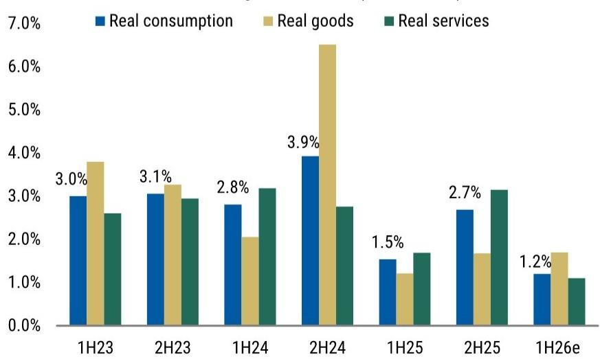
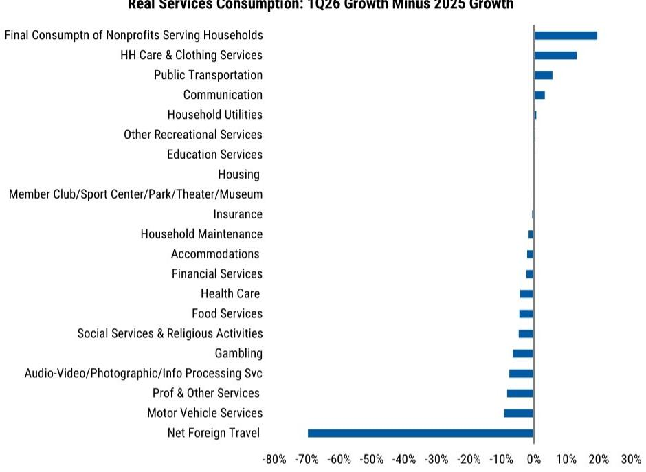
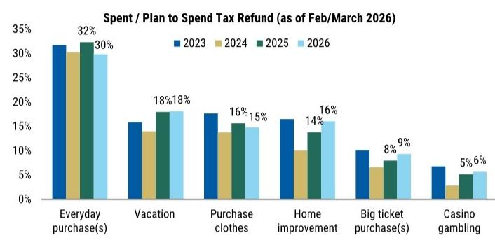

# The Consumer Slowdown Is Not a Collapse — But It Reveals a Fragile K-Shaped Recovery

The headline numbers look alarming at first glance. Real consumer spending growth in the United States has decelerated to a 1.2% annualized pace in the first half of this year, down from 2.1% in 2025. A slowdown of nearly half a percentage point in the largest component of GDP naturally raises questions about whether the economy is heading toward a broader downturn. But the real story is more nuanced — and more strategically important for investors, corporate strategists, and policymakers.

The deceleration is real, but it is not a collapse. It is a composition-driven slowdown that reveals deep structural shifts beneath the surface. The services sector, which had been the engine of consumption growth, has weakened considerably. Meanwhile, durable goods spending has accelerated, driven by big-ticket items like motor vehicles and furniture. This divergence is not random. It reflects a combination of high inflation eroding purchasing power, residual seasonality distorting the data, and a surprising boost from tax refunds that may have temporarily shifted spending patterns.

The critical question is not whether consumption will recover — it likely will, moderately, in the second half of the year. The real question is what this divergence tells us about the underlying health of the American consumer and where the risks lie for the next 12 to 18 months. The answer points to a K-shaped recovery that favors high-income households, a narrowing of spending breadth, and a set of asymmetrical risks that could tip the balance either way.

## The Slowdown Is Concentrated in Services, Not a Broad-Based Retrenchment

The headline deceleration masks a critical compositional shift. Through May, real goods spending rose 1.7% compared to 1.4% last year, while services spending slowed to 1.1% from 2.4%. This is not the pattern you would expect from a typical demand-driven recession, where consumers pull back across the board. Instead, it suggests that the slowdown is being driven by specific forces that are hitting services harder than goods.

Within goods, the acceleration is almost entirely attributable to durable goods — motor vehicles, furniture, and appliances — which grew at a 2.3% annualized rate through May, compared to just 0.1% in the fourth quarter of last year. Nondurable goods, such as clothing and gasoline, actually decelerated in real terms. This is a striking divergence that demands explanation.

The services slowdown is even more revealing. In the first quarter, weakness was widespread across both discretionary and nondiscretionary categories: foreign travel, motor vehicle services, professional services, food services, health care, and financial services all showed deceleration. The expiration of Affordable Care Act credits may have contributed to the health care weakness, but the breadth of the slowdown suggests a more systemic factor is at work.

This pattern matters because services spending is typically more persistent than goods spending. Consumers do not easily give up dining out, travel, or professional services unless there is a genuine income constraint. The fact that services slowed so broadly — and so suddenly — signals that the income squeeze is real and is affecting even categories that usually show resilience.

## Real Income Decline Is the Core Driver, But Residual Seasonality Distorts the Picture

The fundamental driver of the slowdown is straightforward: real disposable income growth has been negative. In the first half of the year, real disposable income is tracking a decline of 0.6% annualized. Even with the boost from tax changes, real labor income is even weaker, at negative 1.0%. Nominal income growth has slowed from the faster pace of 2023 and 2024, but the weakness over the past two quarters is largely due to elevated inflation as tariff and oil pressures peaked.

This income decline alone would justify a sharper slowdown in consumption. But consumers have been tapping savings to smooth through the price shock. The saving rate fell from 3.6% at the end of 2025 to 3.0% at the end of May. Wealth gains over the period likely justify part, but not all, of this decline in the saving rate.

There is also a technical factor at play that exaggerates the apparent weakness. Since the pandemic, the seasonal adjustments used by the Bureau of Economic Analysis for inflation have not fully accounted for all seasonal differences. This residual seasonality artificially boosts measured first-quarter inflation, with a giveback later in the year. Because consumption is measured in real terms, higher inflation mechanically means softer real consumption. The report estimates this could have subtracted 60 to 80 basis points from real consumption growth in the first quarter alone. Without it, first-half consumption growth would be around 1.6% — still a deceleration, but far less extreme.

This is not merely an academic point. For investors and corporate planners, it means the underlying trend may be slightly stronger than the headline data suggest. But it also means that the second half of the year could see a mechanical boost from the unwinding of this residual seasonality, which would make it harder to distinguish genuine recovery from statistical noise.

## Tax Refunds Provided a Surprising Boost to Durable Goods, But This Is Likely Temporary

The acceleration in durable goods spending is the most puzzling element of the current picture. Given tariffs, higher oil prices, and elevated interest rates, one would expect consumers to pull back on big-ticket items. Instead, they accelerated. The report provides a compelling explanation: tax refunds.

Tax refunds were up 19% year-over-year, totaling $57 billion. Historically, consumers use refunds primarily for saving and paying down debt, with roughly 35% spent within three months. But the evidence this year suggests a larger share was spent immediately — possibly as much as 50% — and most of that went toward goods.

The AlphaWise Consumer Pulse survey shows slight year-over-year declines in intentions to save and pay debts, with increases in intentions for home improvement and big-ticket purchases. These align precisely with the categories of goods spending that accelerated, such as furniture and motor vehicles, which had weak growth in the second half of 2025 and likely had pent-up demand.

Perhaps more telling is the auto ABS delinquency data. Historically, larger real tax refunds are associated with larger improvements in auto ABS delinquency rates, as consumers use refunds to pay down debt. This year, the improvement in both prime and subprime auto ABS delinquencies was weaker than the historical relationship would imply. Prime auto ABS delinquencies declined 15% versus an expected 19%, while subprime declined 17% versus an expected 21%. This suggests consumers directed a smaller share of refunds toward debt paydown and a larger share toward spending.

The implication is clear: the durable goods acceleration is likely a temporary phenomenon driven by a one-time refund boost. As the refund effect fades, goods spending should decelerate in the second half of the year. This creates a natural rotation back toward services, assuming income growth recovers as expected.

## The K-Shape Is Still Dominant: High-Income Consumers Are Driving What Growth There Is

The categories that have accelerated this year are disproportionately consumed by high-income households. The top 20% income cohort makes up about 40% of all spending, but 55% of durable goods spending. They account for the largest share of motor vehicle purchases, furniture, household equipment, and recreational vehicles — all categories that have shown strength.

If tax refunds were used for these purchases, spending could have been more evenly spread across income cohorts than usual. But the typical pattern is that a smaller share of high-income consumers receive refunds, and for those who do, their refunds are larger. The benefits from the tax changes were expected to accrue mostly to middle- and high-income consumers, so these groups likely drove the acceleration.

The picture is more mixed for services. Some high-income-dominated services categories, such as transportation services, recreation services, and other services, slowed considerably in the first quarter. If softer stock prices weighed on high-income spending during that period, it could explain the weakness. But until the Quarterly Services Survey data is incorporated in August, it is impossible to know whether these categories rebounded in the second quarter.

This leaves a critical unresolved question: is the services slowdown a temporary phenomenon that will reverse as inflation eases, or does it signal a broader deceleration in spending growth for high-income consumers as well? The answer has enormous implications for sectors ranging from luxury goods to travel and hospitality.

## What the Report Does Not Fully Answer: The Persistence of the Services Slowdown

The report makes a compelling case that residual seasonality and tax refund effects will unwind, leading to a moderate recovery in the second half. But it leaves several important questions unanswered.

First, the services slowdown may be more persistent than the model assumes. Services spending is typically sticky, but the breadth of the first-quarter deceleration across both discretionary and nondiscretionary categories suggests something more fundamental may be at work. If consumers are adjusting their spending patterns structurally — perhaps due to lasting inflation expectations or a reassessment of household balance sheets — the recovery in services may be slower than forecast.

Second, the relationship between tax refunds and spending behavior may have shifted permanently. The pandemic-era experience of direct fiscal transfers may have changed how consumers treat lump-sum payments. If consumers now view refunds as windfall income to be spent rather than saved or used for debt paydown, the boost to goods spending could persist longer than expected — or the payback could be sharper.

Third, the report does not fully resolve the question of whether low- and middle-income consumers are simply being squeezed out of the spending picture or whether they are making rational adjustments to a new price level. If the former, the K-shape could worsen before it improves. If the latter, the broadening the report expects in 2027 could materialize sooner.

## A Decision Framework for Investors and Corporate Strategists

Given the complexity of the current environment, a structured decision framework is essential. The following questions can help assess where the risks and opportunities lie.

First, assess the inflation trajectory. The report's forecast depends critically on inflation decelerating as expected. If headline and core PCE inflation fall toward 3.0% by year-end, real income growth should recover, supporting consumption. But if inflation remains elevated — due to tariffs, oil prices, or wage pressures — the squeeze on purchasing power will persist, and the recovery will be delayed. The divergence between the report's inflation forecast and the Federal Reserve's is a key variable to monitor.

Second, evaluate the composition of consumption growth in your sector. If you are in durable goods, the tax refund boost is likely temporary, and the oil shock should weigh on goods spending with a lag in the third quarter. If you are in services, the recovery depends on whether the first-quarter weakness was real or a statistical artifact. The Quarterly Services Survey data in August will be decisive.

Third, track income cohort dynamics. The high-income consumer is still spending, but the services categories they dominate showed weakness in the first quarter. If stock market gains resume, high-income spending could recover. If not, the K-shape could become even more pronounced. For companies targeting middle- and low-income consumers, the outlook remains challenging until real income growth turns positive.

Fourth, monitor credit performance. The auto ABS delinquency data was a leading indicator of the tax refund effect. Similarly, credit card and auto loan performance in the coming months will reveal whether consumers are using savings to smooth spending or whether they are becoming increasingly stretched. A deterioration in credit quality would be a leading indicator of a sharper slowdown.

Fifth, consider the residual seasonality adjustment. If the report's estimate is correct, first-half consumption growth is understated by 60 to 80 basis points. This means the second half could see a mechanical boost that is not supported by genuine improvement in consumer fundamentals. Distinguishing between statistical noise and real recovery will be critical for investment and planning decisions.

## The Path Forward: A Moderate Recovery with Asymmetrical Risks

The baseline forecast is for a moderate acceleration in the second half, with consumption growth of around 2.0% in the third and fourth quarters, bringing the full-year figure to approximately 1.7%. This is not a strong recovery, but it is not a recession either. The recovery is expected to be led by services, as the tax refund effect fades and the oil shock weighs on goods with a lag.

Looking into 2027, the report expects continued disinflation and productivity gains to support real income and consumption growth, with a broadening across spending categories and income cohorts. This assumes that inflation decelerates as forecast and that the Federal Reserve remains on hold, allowing financial conditions to ease.

But the risks are evenly balanced. On the upside, a smaller-than-expected oil shock effect on goods spending, stronger wealth effects from equity markets, or continued strong employment gains could boost consumption more than expected. On the downside, if inflation remains elevated or if tighter monetary policy is required to bring it down, the affordability crisis and K-shaped consumer dynamic could worsen.

The most important unresolved question is whether the services slowdown is real or a statistical artifact. If the Quarterly Services Survey data shows that services spending was stronger than currently reported, the recovery could be faster and more broad-based than expected. If it confirms the weakness, the underlying trend is softer than the model assumes, and the risks tilt decisively to the downside.

For serious investors and corporate strategists, the current environment demands a nuanced approach. The headline numbers are not as bad as they look, but the composition of spending reveals vulnerabilities that could widen. The K-shape is still dominant, and the broadening that the report expects in 2027 depends on a sequence of favorable outcomes that are far from guaranteed. The next six months will determine whether the consumer slowdown is a temporary soft patch or the beginning of a more persistent deceleration.

Join the community to read the full report and review the original charts.

*This article is for learning and discussion only and does not constitute investment advice.*

Personal reading notes and learning share only. Not investment advice.

