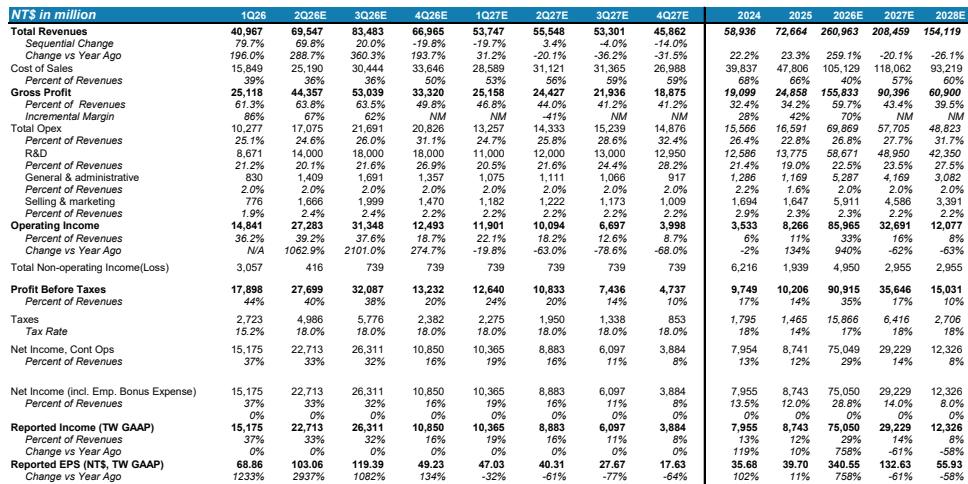
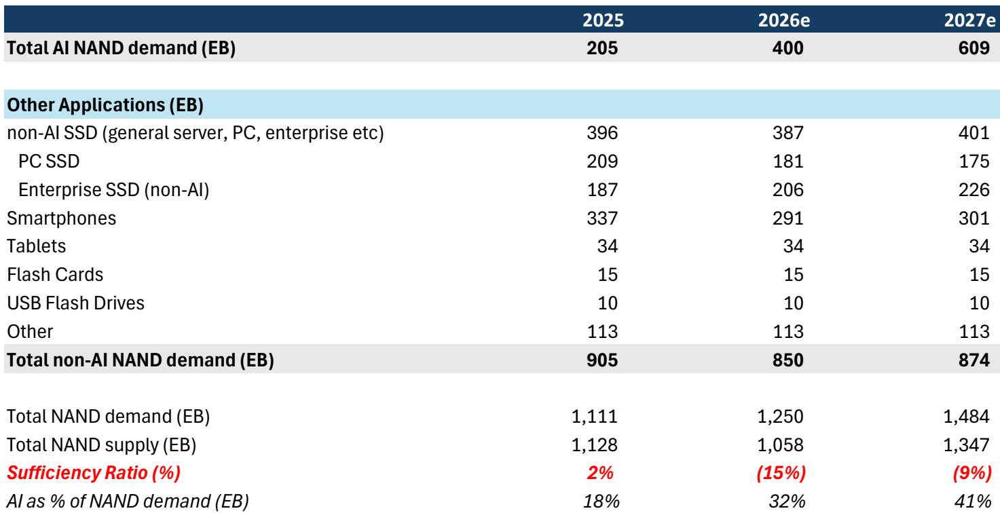
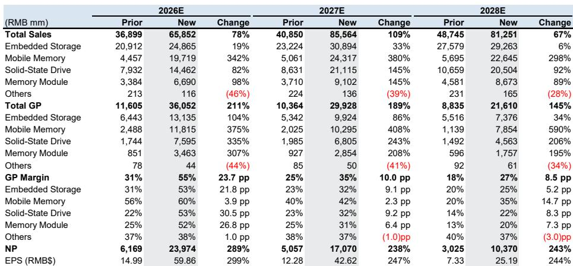

# The NAND Market Is No Longer One Market: AI Demand Will Create Structural Shortages Through 2027 While Consumer Pricing Hits a Ceiling

The memory industry is undergoing a transformation that most investors have not fully priced in. For the first time in a decade, the NAND market is splitting into two fundamentally different demand environments, each with its own pricing dynamics, supply constraints, and competitive implications. The old model of a unified memory cycle that rises and falls together no longer applies.

The implications are stark. AI-driven demand for NAND will create meaningful supply shortages that persist through 2027, driven by hyperscaler demand for enterprise SSDs, boot drive storage, and high-capacity QLC solutions. Meanwhile, consumer-facing NAND products are already showing signs of demand saturation, with order cuts appearing after recent price hikes and inventory building at module makers and distributors. This bifurcation is not a temporary phenomenon. It reflects a structural shift in how memory is consumed, who buys it, and what determines pricing power.

The investment community has largely treated NAND as a single cyclical commodity. The data now suggests that treating all NAND exposure as equivalent is a strategic error. Suppliers with long-term agreements anchored to AI infrastructure will enjoy margin durability and valuation expansion. Module makers and consumer-focused players face volume constraints and pricing ceilings that will compress returns. The divergence is already visible in price target revisions across the coverage universe, with some names seeing targets more than doubled while others receive only modest adjustments.

What makes this moment particularly consequential is the interaction between supply discipline and demand growth. The industry has learned painful lessons from past oversupply cycles and has maintained remarkable capital discipline. But the real question is whether that discipline can hold through 2028, when greenfield expansion decisions made today will begin to deliver new capacity. The answer depends on how aggressively AI demand continues to scale and whether geopolitical factors alter the supply landscape.

## Long-Term Agreements Are Reshaping the NAND Industry Structure, Creating a Two-Tier Market Between Protected Suppliers and Exposed Module Makers

The most important structural change in the NAND industry is not about technology or capacity. It is about contracting. Long-term agreements have moved from being a peripheral tool to the central mechanism governing how NAND is allocated, priced, and consumed. This shift has profound implications for which companies capture value and which ones get squeezed.

For suppliers with direct access to fab output and the ability to negotiate LTAs with hyperscalers, the benefits are clear. These agreements provide downside price protection, revenue visibility extending two to three years out, and a foundation for capital return programs. Kioxia, for example, expects LTAs to cover more than 50% of its calendar 2027 shipments, with similar coverage planned for 2028. This is not merely a hedging strategy. It is a fundamental reorientation of the business model away from spot market volatility and toward contracted, predictable cash flows.

The consequences for module makers and controller vendors are more complex. Companies like Phison and Longsys benefit from the pricing stability that LTAs create upstream, but they face a structural disadvantage in volume allocation. As suppliers prioritize LTA commitments to hyperscalers, the residual supply available to the open market shrinks. This creates a ceiling on unit growth for module makers even as prices remain elevated. The tension is visible in the revised estimates for Longsys, where stronger pricing assumptions drive higher revenue forecasts, but volume growth concerns keep the rating at Equal-Weight.

The deeper strategic question is whether LTAs ultimately concentrate or disperse value across the supply chain. In theory, stable pricing should benefit all participants. In practice, the allocation mechanism favors those who control the physical supply. Module makers are essentially trading volume certainty for price stability, and the trade may not be favorable over time. The LTA structure effectively transforms NAND from a commodity market into a negotiated market, and in negotiated markets, bargaining power determines outcomes.

## Consumer NAND Demand Has Hit a Pricing Ceiling While AI Enterprise Demand Remains Structurally Undersupplied Through 2027

The evidence for demand bifurcation is no longer theoretical. It is showing up in actual order patterns and inventory data. After the price increases implemented in the second quarter of 2026, consumer-facing customers have begun cutting orders. This is the classic signal of a demand ceiling: buyers accept price increases only until they cannot pass them through to end users, at which point volume destruction begins.

The consumer weakness is concentrated in smartphones and PCs, where end demand remains muted and customers face an increasingly difficult trade-off between maintaining margins and preserving unit volumes. Inventory levels at module makers and distributors have risen, suggesting that the channel is absorbing supply that end users are not yet ready to buy. This does not mean consumer NAND demand is collapsing. It means the pricing elasticity that drove the recovery phase has exhausted itself.

On the enterprise side, the dynamics are entirely different. Hyperscalers are not price-sensitive in the traditional sense. Their demand is driven by AI workload requirements, and their purchasing decisions are governed by long-term capacity planning rather than spot market conditions. The NAND content per AI server is substantial and growing, driven by boot drives, inference storage, and large-scale QLC arrays for training data repositories. The CM Series and GP Series SSDs from Kioxia, targeting KV cache and high-IOPS inference workloads respectively, illustrate how AI-specific storage requirements are creating demand categories that did not exist three years ago.

The supply-demand calculation supports the thesis of extended shortages. A global investment bank report projects significant NAND shortages persisting into 2027, with the deficit potentially reaching 5% even under optimistic assumptions about node migration and greenfield expansion. In a bear case where both Chinese supply restrictions ease and industry discipline weakens, oversupply becomes a risk. But the base case and bull case both point to tight markets for at least another eighteen months.

The strategic implication is that investors need to distinguish between companies that serve AI enterprise demand and those that depend on consumer markets. The two segments are converging in the sense that both use NAND, but they are diverging in every dimension that matters for profitability: pricing power, volume growth, customer concentration, and margin stability.

## The Controller Ecosystem Is Undergoing a Structural Upgrade as Enterprise SSD Opportunities Create New Growth Vectors Beyond Consumer Markets

The most underappreciated development in the NAND supply chain is the transformation of the controller market. Historically, NAND controllers were a commoditized component, with value driven by volume and cost efficiency in consumer applications. That is changing rapidly as enterprise SSD controllers become a meaningful revenue stream with fundamentally different economics.

Silicon Motion provides the clearest example of this transition. The company's boot drive storage business, initially focused on DPU boot drives, is expanding into broader next-generation AI GPU and CPU platform content, including DPU, Ethernet, and NVLink-related switch opportunities. This is not incremental business. It represents a new addressable market that is directly tied to AI infrastructure buildout. The company's MonTitan enterprise SSD platform has begun production with two customers, with plans to add five more tier-1 CSPs by late 2026. The revenue contribution from enterprise SSD controllers is projected to reach 13% of total revenue by 2027 and 19% by 2028.

Fadu tells a similar story from a different starting point. The company is transitioning from a recovery narrative to a structural scaling story in AI storage semiconductors. Management now frames over 300 billion won in 2026 revenue as effectively secured, supported by hyperscaler-related enterprise SSD controller engagements. The debate has shifted from whether hyperscaler exposure exists to how far the company can penetrate AI-centric storage architectures over the next three to five years. If Fadu can cover three to four of the top global hyperscalers through indirect and direct engagement models, the revenue visibility and valuation framework would fundamentally change.

The common thread across these stories is that enterprise SSD controllers carry higher margins, longer product cycles, and deeper customer relationships than consumer controllers. They also require different capabilities: firmware customization, integration with hyperscaler architectures, and the ability to scale production while maintaining reliability at data center quality levels. The companies that can execute this transition will emerge as structurally different businesses from their consumer-oriented peers.

The question that remains unanswered is how large the total addressable market for enterprise SSD controllers will become. The report projects meaningful growth, but the trajectory depends on how quickly AI workloads migrate from HBM-centric architectures to storage-intensive configurations. If AI inference becomes more storage-heavy as models grow and context windows expand, the controller opportunity could be significantly larger than current estimates suggest.

## The 2028 Supply Outlook Remains the Critical Unknown, With Greenfield Expansion Decisions and Geopolitical Factors Creating a Wide Range of Possible Outcomes

Every analysis of the NAND market through 2027 points in the same direction: shortages, pricing power for suppliers, and favorable conditions for companies with LTA protection. The divergence of views begins when the analysis extends to 2028 and beyond. This is where the analytical framework becomes most valuable and where the uncertainty is greatest.

The base case assumes that node migration and greenfield expansion will ease some supply tightness, reducing the shortage to approximately 5% if AI NAND demand grows at 60% year-over-year with current base case capacity expansion. This scenario implies that the market remains tight enough to support pricing but avoids the extreme shortages of the 2026-2027 period. Suppliers would still have pricing power, but the rate of price increases would moderate.

The bear case introduces two variables that could shift the market toward oversupply. The first is a relaxation of Chinese supply restrictions, which would add capacity from players that have been constrained by equipment access and regulatory barriers. The second is a breakdown of supply discipline among major NAND manufacturers, who might be tempted to chase market share as shortages ease. If both factors materialize simultaneously, the risk of a sharp price correction in 2028 becomes real.

The bull case, which the report does not fully explore but which logically follows from its analysis, is that AI demand growth continues to accelerate beyond current projections. If AI NAND demand grows at 80% or 100% year-over-year rather than 60%, even aggressive capacity expansion would be insufficient to close the gap. This scenario would extend the shortage cycle well into 2028 and potentially beyond.

The strategic question for investors is how to position for this uncertainty. One approach is to focus on companies with LTA protection that extends into 2028, as Kioxia is pursuing. Another is to favor companies with exposure to multiple demand drivers, so that weakness in one segment can be offset by strength in another. A third is to accept the uncertainty and maintain flexibility, recognizing that the 2028 outlook will become clearer as capacity expansion decisions are made and AI demand trajectories become more visible.

## The Decision Framework for NAND Investing Now Requires Distinguishing Between Three Distinct Risk-Reward Profiles

The traditional approach to NAND investing treated the sector as a single cyclical trade: buy at the bottom of the cycle, sell at the top, and rotate based on supply-demand forecasts. That framework is no longer adequate. The bifurcation of demand, the emergence of LTAs as a structural feature, and the divergence between supplier and module maker economics require a more nuanced approach.

The first risk-reward profile is the vertically integrated supplier with LTA protection and AI exposure. Companies like Kioxia, Samsung Electronics, and SK hynix fit this category. Their advantages include direct control over fab output, the ability to negotiate favorable LTA terms, and exposure to both DRAM and NAND markets. The downside risk is that their scale makes them sensitive to any broad downturn in memory demand, and their share prices already reflect significant optimism. The risk-reward skew is favorable but not extreme, with upside of 20-40% and downside of 30-40% in bear scenarios.

The second profile is the specialized enterprise SSD or controller company that is riding the AI storage upgrade cycle. Silicon Motion and Fadu exemplify this category. Their advantages include high growth rates, expanding margins, and exposure to a structural demand driver that is still in its early innings. The risk is that execution matters enormously, and any delay in customer qualifications or production ramps could significantly alter the trajectory. The risk-reward skew is more asymmetric, with upside of 80-140% and downside of 40-45%.

The third profile is the module maker or consumer-focused player that benefits from the pricing environment but faces structural volume constraints. Phison and Longsys represent this category. Their advantages include strong pricing tailwinds and improving margin profiles from better product mix and in-house capabilities. The risks include limited volume growth as suppliers prioritize hyperscaler customers, potential margin compression as low-cost inventory is depleted, and vulnerability to any softening in consumer demand. The risk-reward skew is relatively balanced, with upside of 15-50% and downside of 12-45%.

The framework suggests that investors should allocate capital based on their conviction about the duration of the AI demand cycle and their tolerance for execution risk. Those with high conviction about sustained AI demand growth and a willingness to accept near-term volatility should favor the second profile. Those seeking more predictable returns with lower upside should favor the first. Those who believe the cycle is closer to its peak should avoid the third profile entirely.

## What the Report Does Not Fully Answer: The Sustainability of AI NAND Demand Growth and the Timing of Capacity Inflection

For all its analytical rigor, the report leaves several critical questions unresolved. The most important is whether AI NAND demand growth of 60% year-over-year is sustainable beyond 2027. The report uses this assumption in its base case, but the justification rests on extrapolating current trends rather than on a fundamental model of AI storage requirements.

The uncertainty revolves around whether AI workloads will become more or less storage-intensive over time. If model compression and hardware optimization reduce the storage footprint per inference, demand growth could decelerate faster than expected. Conversely, if multimodal models and long-context applications continue to scale, storage demand could accelerate. The report acknowledges the upside but does not provide a framework for assessing which outcome is more likely.

The second unresolved question is the timing and magnitude of greenfield capacity additions. The report models node migration and greenfield expansion as easing supply tightness in 2028, but the lead times for new fab construction are long and the execution risks are substantial. Equipment delivery delays, construction bottlenecks, and qualification timelines could push capacity additions into 2029 or beyond, extending the shortage cycle. Alternatively, aggressive capacity investments made now could create oversupply if demand growth disappoints.

The third question is about the role of Chinese NAND manufacturers in the global supply balance. The report treats Chinese supply restrictions as a variable in the bear case, but the geopolitical dynamics are evolving rapidly and unpredictably. Policy changes in either direction could have outsized effects on the market, and the report does not provide a probability-weighted assessment of different scenarios.

These open questions are not weaknesses in the analysis. They are inherent uncertainties that any serious investor must grapple with. The value of the report is that it provides a structured framework for thinking about these uncertainties and their implications for different parts of the value chain.

Join the community to read the full report and review the original charts.

*This article is for learning and discussion only and does not constitute investment advice.*

Personal reading notes and learning share only. Not investment advice.

