# Strategy Espresso: Europe and the China Dragon – a fiercer fight

Is China continuing to take share in Europe? Yes, more than ever. China's exports to Europe have grown double-digit p.a. in recent months, and China has been increasing share in third markets. China now accounts for $23\%$ of EU imports. Meanwhile, China's share of EU exports has fallen sharply since 2020.

What are the drivers? China's companies are seeking growth outside given weak domestic demand and over-capacity in many industries. China also has huge cost advantages in labour, borrowing, energy and land use as well as a significantly undervalued currency. These, combined with Europe's own growth impediments—regulation, planning laws, lack of investment—have all meant China is rapidly gaining share in manufacturing.

Who is exposed? Stocks in the China competition basket (GSXECHNX); mainly in Autos, Medtech, Chemicals and select Industrials. This basket has consistently underperformed both STOXX 600 and our Asia team's China Going Global basket (GSXACHGG); the underperformance tallies closely to the widening trade deficit with China.

Is it in the price? Underperformance has largely been a function of EPS downgrades. Given the ongoing export share gains by China and continued weak earnings outlook for these exposed stocks we continue to expect earnings-driven under-performance rather than further valuation declines given the discount for these stocks is already steep.

Is Europe defending itself? Less than $10\%$ of Chinese imports into the EU currently face tariffs—a sharp contrast with the US approach. The EU is unlikely to copy the broad-based US approach but our economists do expect the EU to target reducing reliance on Chinese components and tariffs on specific sectors.

\- Does this matter for European indices? Not as much as investors tend to think. Autos and Chemicals combined are smaller than Aerospace & Defence or Renewables. Tech Hardware and Autos had roughly the same market-cap just three years ago, now Tech Hardware is 4x the size of Autos.

What does this mean for global investors? While China is clearly gaining market share, this does not necessarily translate into shareholder returns. Much of China's success has been driven by aggressive pricing, often resulting in subdued profitability. As a result, Chinese equities have not been the primary beneficiaries of China's export expansion. European equities have outperformed over most medium- and long-term horizons, supported by stronger earnings quality, higher returns on capital, and greater diversification by sector.

## Sharon Bell

+44(20)7552-1341 | sharon.bell@gs.com GS International

Guillaume Jaisson  
+44(20)7552-3000 | guillaume.jaisson@gs.com GS International

Peter Oppenheimer +44(20)7552-5782 | peter.oppenheimer@gs.com GS International

Giovanni Ferrannini  
+44(20)7051-2589 |  
giovanni.ferrannini@gs.com  
GS International

Elena Porfidia  
+44(20)7051-5240 |  
elena.porfidia@gs.com  
GS International

## Q&A on Europe Equity & the China Dragon – A fiercer fight

1. Is China continuing to take share in Europe, and in third markets? Yes, most certainly. China exports to Europe have been growing at a double digit annual pace in recent months, and China has been increasing share in third markets too. China now accounts for $23\%$ of EU imports (Exhibit 1) and the share of China in Europe's exports has fallen sharply since 2020. In other words, China is buying less from Europe but selling more into Europe, representing a competitive threat to European manufacturing companies. We have seen several companies warn or lower guidance over China competition in recent weeks, including Signify and BMW.

Autos: The figures are stark, our analysts report that Chinese domestic brands gained over 400 bps of Europe market share in the year to end May (their overall share of the European market is now 6–7%), corresponding to a roughly 400bps share loss from mass-market brands in Europe. They argue that this share gain trend appears to be accelerating, with every mass-market brand losing ground except Tesla. Relative to the mass market, the European premium brands have proven more resilient but even these are losing share.

Chemicals: Our analyst recently downgraded several names arguing that China's export-oriented pivot over the course of the Middle East conflict has effectively extinguished any short-lived hopes of a revival in European competitiveness. With other Asian countries suffering feedstock supply issues and domestic Chinese demand remaining low, excess capacity is forcing product out of China with chemical exports from China to the rest of Asia rising $70\%$ in March and April according to ICIS data. In addition, China is beginning to lead not only in commodities but increasingly in semi-specialty chemicals too.

Capital goods: In their machinery export tracker our Asia analysts talk about strong growth in Europe of $+50\% / +19\%$ yoy in volume/value, mainly on accelerated China exports. And our European team argues that while Europe still leads in exports of capital goods within their tracked products, accounting for $43\%$ of global volumes, its share has decreased from $54\%$ in 2005. Meanwhile, China is steadily increasing its export presence in the global marketplace, gaining 17pp of market share, from $7\%$ in 2005 to $24\%$ in 2025. Chinese competition acceleration has been most noticeable in recent months for LED lighting, excavators, heat pumps, light commercial vehicles, heavy-duty trucks and tractors.

Exhibit 2: Machinery accounts for almost one third of EU imports from China  
EU Imports from China (% of total import from China)  
Exhibit 1: Europe imports more from China but exports less  
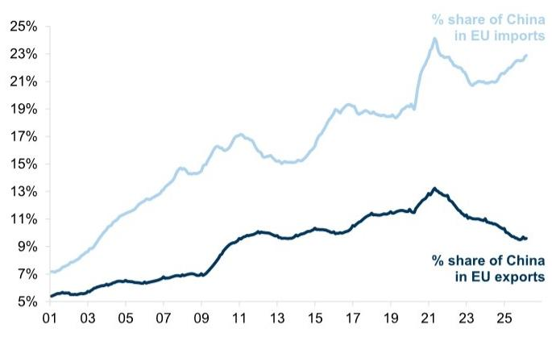  
Source: Haver Analytics, GS Global Investment Research

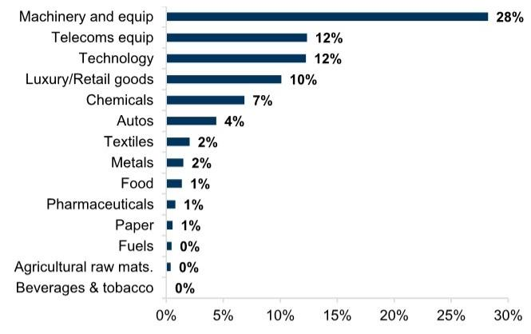  
Source: UNCTADstat, GS Global Investment Research

2. What are the drivers? China's companies are looking for growth outside given weak domestic demand and over-capacity in many industries. Our Asia economists argue China has huge manufacturing cost advantages: (i) lower labour costs, (ii) borrowing costs are very low in targeted sectors facilitated by a state banking system with a large pool of low-yielding deposits, (iii) China has a large, low-cost (though high-pollution) energy source in coal while government policies have also encouraged rapid development of solar energy, as well as a broader shift away from reliance on imported energy (e.g. via development of the EV sector). China's manufacturing firms enjoy very competitive power costs, especially versus Europe (Exhibit 3), (iv) on land, top-down planning means households pay high residential property prices and in effect subsidize manufacturing land use, (v) currency weakness, despite China outpacing world growth over the past decade and an improvement in manufacturing productivity the renminbi has slid in recent years and while it is true that the currency has strengthened since the lows in early 2025, it remains significantly undervalued on our FX teams' currency frameworks (Exhibit 4).

The combination of all these, along with some of Europe's own impediments to growth – regulation, planning laws and lack of investment – have all meant China is rapidly gaining share in manufacturing.

Exhibit 3: China's low power costs rival those in the United States
Power prices for industrial sectors  
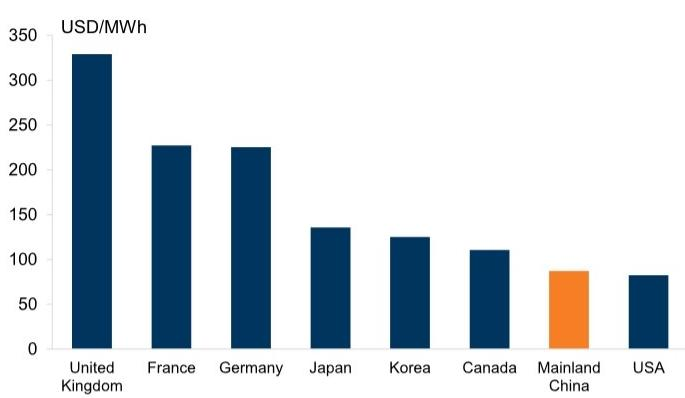  
Industrial power prices including taxes in 2023 for all except for Japan, where data is only available for 2021, and for China, where data is only available for 2018 and average power prices for all sectors instead of the industrial sector only

Exhibit 4: CNY has appreciated since the 2025 lows but remains under-valued compared with China's strong economic and productivity growth in recent years Index, 2019 = 100  
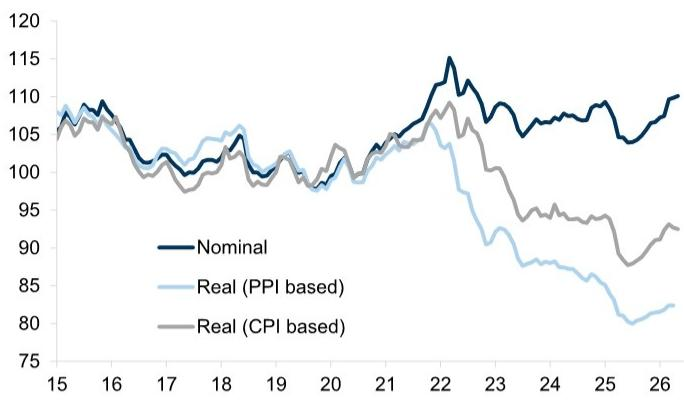  
Source: Haver Analytics, GS Global Investment Research  
Source: Penn World Table (PWT), Haver Analytics, GS Global Investment Research

3. Who is most exposed to China competition; how have they performed? Exhibit 5 shows the correlation of European sector EBITDA margins with China PPI inflation. The sectors with the highest sensitivity to this weak pricing dynamic, measured by the correlation of margins to China prices, have been Chemicals, Autos and Basic Resources (mining). On the flip-side, lower prices in China manufactured goods have been associated with better margins in some consumer and services sectors in Europe.

Of course there is always potential for these dynamics to shift either via Europe putting tariffs or other regulations on China goods, or by China making inroads into other previously insulated industries. Most recently internet retailing platform, JoyBuy, launched in the UK and users quickly rose to being $10\%$ of those for Argos, owned by Sainsbury's.

Exhibit 5: Margins of Chemicals, Autos, and Mining are the most sensible to China pricing dynamics
Correlation between China PPI and EBITDA Margin across European sectors since 2005  
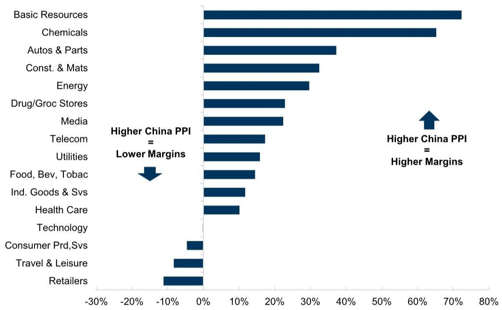  
Source: Haver Analytics, Datastream, GS Global Investment Research

In terms of companies, in our original work on Fighting the China Dragon we screened for companies that mention China as a competitive threat or potential threat. We found that across the STOXX 600 index China has been mentioned almost 10,000 times by around 300 companies since Q1 2024, although mostly these mentions are positive mentions about growth/demand, they are increasingly also about risk and competition. We screened the companies for the more negative comments which concerned competition and our Global Banking and Markets (GBM) division created a basket optimising for liquidity – GSXECHNX.

The companies are mainly in Autos, Medtech, Chemicals and select industrials. These companies have consistently underperformed both versus the STOXX 600 and versus our China Going Global companies from our Asia team, GSXACHGG (Exhibit 6).

Exhibit 9: Companies exposed to China competition trade on a substantial discount to the market  
12m fwd P/E Premium/Discount vs. STOXX 600. European sectors and baskets. China Exposure = GSSTCHNA; China Competition = GSXECHNX  
Exhibit 6: European companies exposed to China competition have consistently underperformed the market  
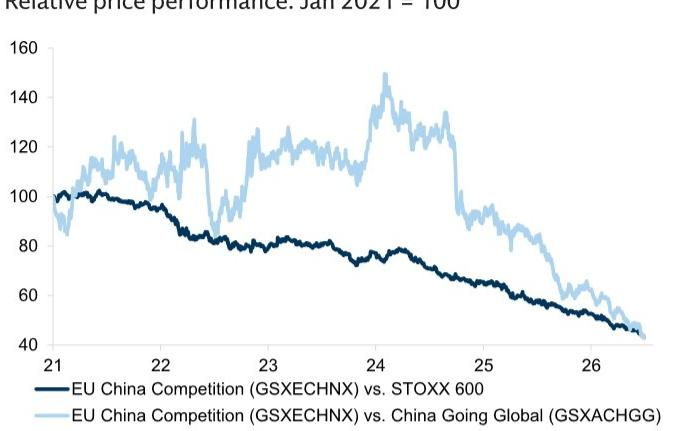  
Source: Bloomberg, Datastream, GS Global Investment Research, GS FICC and Equities

Exhibit 7: Europe's widening trade deficit with China
Price performance and trade balance between Euro Area and China (RHS)  
  
Source: Datastream, Haver Analytics, GS Global Investment Research, GS FICC and Equities

4. Is the weakness now well priced? We continue to argue for an under-weight in companies with high China-competition exposure, for example we recommend an underweight in Autos and Chemicals for this reason. The basket of China-competition exposed companies (GSXECHNX) has performed consistently poorly, both in terms of earnings and price performance (Exhibit 8). That said, these companies do trade on a substantial discount to the market c. 25-30%, a contrast to companies with high China sales exposure (GSSTCHNA) but not necessarily competition threat (Exhibit 9). Given the ongoing export share gains by China and continued weak earnings growth for these stocks we continue to expect earnings-driven under-performance (Exhibit 7) rather than further valuation declines given the discount for these stocks is already steep.

Exhibit 8: The basket of China-competition exposed companies has performed consistently poorly EU China competition basket (GSXECHNX)  
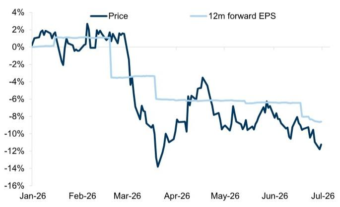  
Source: Bloomberg, GS Global Investment Research, GS FICC and Equities

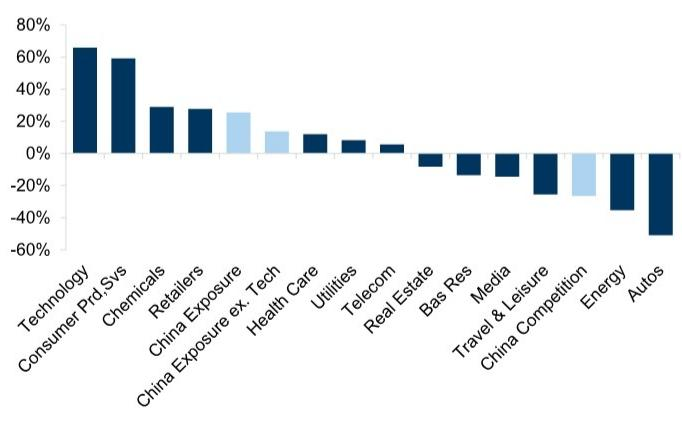  
Source: Datastream, Bloomberg, GS Global Investment Research, GS FICC and Equities

5. EU policy-makers are starting to focus on the threat posed by low-cost China manufacturing to Europe's industries. In its June meeting, the EU Council mandated the EU Commission with the task to propose the appropriate response to China, marking a shift in European policy. The EU has so far taken a relatively cautious stance toward

Chinese products. Although most EU trade-defence investigations have targeted China, less than 10% of Chinese imports into the EU currently face tariffs—a sharp contrast with the US approach (Exhibit 11). The main exceptions have been tariffs on battery electric vehicles, introduced in October 2024, and the abolition of the EUR 150 customs-duty exemption for small parcels from July 2026.

Our economists expect the Commission to continue to raise trade barriers, but in a targeted way consistent with the new trade-diversion monitoring framework:

Near-term measures are likely to focus on sectors where evidence of diversion or injury is strongest, such as tightening steel safeguards to prevent Chinese steel from being rerouted through third countries.

\- Expect anti-subsidy duties to be extended to hybrid vehicles, alongside faster anti-dumping investigations into machinery, wind-turbine components, and basic chemicals.

The EU is also discussing broader and more aggressive trade barriers by forcing procurement of “made in Europe” goods, limiting foreign direct investment in strategic sectors (Industrial Accelerator Act), restricting access to European market for Chinese technologies (Cybersecurity Act), and forcing European companies to diversify their supplies (“Anti-Dependency” instrument). Talking to corporates, we find that supply-chain resilience is already an area in which most managements are focused.

This structural shift under discussion could allow the EU Commission to impose sweeping tariffs and import quotas on sectors deemed critical to the bloc's "economic security". Benefitting from the WTO national security exceptions, the EU could target advanced manufacturing sectors—such as semiconductors, batteries, and robotics—where Chinese state subsidies are challenging the survival of Europe's industrial base.

Why does Europe not go further? Our economists expect the Commission to avoid US-style blanket tariffs for four reasons: (i) China retains leverage as a key supplier of refined rare earths, (ii) broad tariffs would do little to address the main source of the growth drag, which comes from lost market share in third countries, (iii) China still accounts for c. $8\%$ of total EU goods exports with US tariffs still elevated, European policymakers have an incentive to preserve access to China, and (iv) China's cost advantage is sufficiently large that tariffs may not materially close price gaps in some sectors.

Given these barriers, our economists expect a dual-track strategy: a diversification instrument to reduce reliance on Chinese components, and a protective instrument to raise targeted tariffs and quotas after due process and sector-specific investigations.

## Exhibit 10: Chinese Manufacturers Enjoy a Large Cost Advantage

Industrial subsidies in selected industrial sectors as a share of revenue (2024)

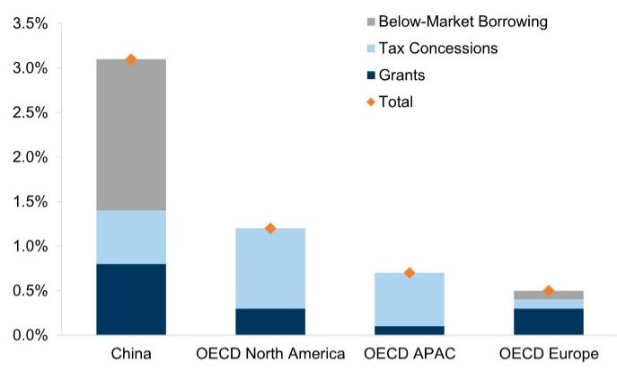  
Source: OECD, GS Global Investment Research  
Exhibit 11: Less than $10\%$ of Chinese imports into the EU currently face tariffs  
Share of imports from China covered by ad-hoc tariffs\*

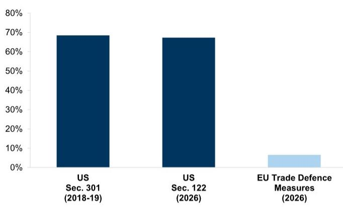  
Tariffs imposed on top of MFN rates  
Source: Haver Analytics, European Commission, GS Global Investment Research

6. How about innovation and investment? Europe has under-invested in recent years, at both the economy and corporate level, while in contrast China has been raising investment as part of the economic and political ambition to increase manufacturing and export share. For the market ex financials both US and China companies have spent in the last 5-years c.40-45% of their cash flow from operations (CFO) on growth investments, defined as R&D and capex over depreciation. In contrast, the European market share of growth-investment to CFOs is about 20%.

We show in Exhibit 12 the share of R&D and capex to CFO for tradable goods (ex food), technology and resources sectors. In almost all cases, Chinese companies have spent more in the last five years. For Chemicals the difference is especially large, but China also consistently spent more on growth-investment in Autos, Electronic/electrical equipment, Med tech, Software and computer services, Basic resources, Energy and Industrial transport.

Exhibit 12: Where do Chinese companies invest more? Share of R&D and capex to CFO for tradable goods (ex food), technology and resources sectors (last 5-years)  
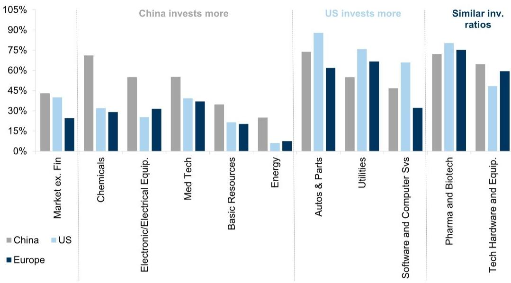  
Source: FactSet, Datastream, GS Global Investment Research

The only areas where Europe has spent to a similar degree as China are Pharmaceuticals, Tech hardware, and Utilities:

In Technology, ASML is considerably ahead with China having neither EUV tools nor DUV immersion tools. Our analysts argue the ecosystem around EUV IE lenses and lasers and mirrors plus engineering know-how as well as feedback from leading edge customers will be challenging or even impossible to replicate. In a recent CEO visit note they contextualised Chinese efforts with stacking which validate that they do not have equivalent EUV technology. We continue to recommend an OW in Technology.

European utilities are investing heavily in renewables and in electrification and power grids more broadly, which should improve Europe's aged power infrastructure, improve energy independence, and provide energy for the data centre roll out which will enable greater use of AI across industries. Our utilities analysts expect power-requirements to drive €3.5 trn of investment needs in power generation (largely renewables) and power grids over 2026-35, thus supporting a generational earnings super-cycle both for the utilities, and for the industrials in Europe which supply much of the equipment. See Utilities at the core of Europe's Electrification. We continue to recommend our Renewables basket (GSSBRNEW).

Pharma's long-term earnings largely depend on the sector's ability to offset patent expirations with innovation. Our analysts continue to favour those companies seeing innovation momentum. Within their coverage, Argenx, AstraZeneca, Bayer, GSK, Novartis and UCB have seen the greatest success year to date in late-stage drug pipelines. M&A, to buy innovation, is also ramping up and about $25\%$ of the 2026 YTD transactions are AI-driven, focusing on drug discovery, protein engineering and digital pathology. Novo Nordisk and Sanofi announced strategic partnerships with OpenAI and Formation Bio, respectively, to build AI agents to automate and accelerate clinical trial enrolment and drug development workflows. That said China invests heavily here too and is increasingly launching more innovative drugs, capturing nearly half of all global oncology trials, and matching European technical capabilities in complex medical hardware like MRI and CT scanners.

7. How about companies selling into China? China was a source of growth for European companies, and we saw a rise in investment spend going into Asia from 2000-14 to capture some of this growth. However, this has been in reverse for over a decade, and sales themselves into Asia peaked as a share of total European company sales and began to fall post the pandemic (Exhibit 13). We see this as a function of three things – (i) more regionalisation (more focus back on investing in Europe itself in defense, electrification etc, this is something we discuss in the Post Modern cycle), (ii) European businesses having already reached a high level of Asia exposure, and (iii) more competition of domestic players in China and/or other third-party Asian market making investment less worthwhile. As our Europe Med Tech analyst reports: while healthcare spend growth in China has accelerated from a 2022 trough and exceeded that of the U.S. in 2024 and 2025, much of that incremental growth has accrued to local market participants.

Exhibit 13: The expansion into Asia has recently stalled or even reversed STOXX Europe 600 - Geographical Revenue Exposure  
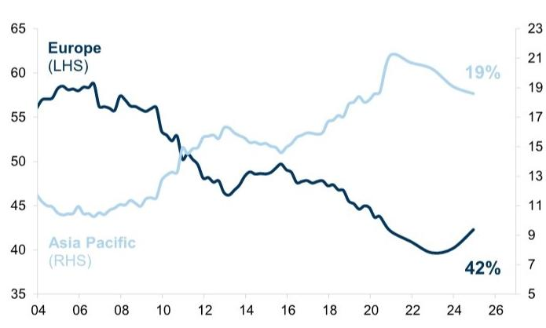  
Source: FactSet, STOXX, GS Global Investment Research

Exhibit 14: Companies with China exposure have performed well year to date  
Price Performance relative to the market, indexed to 100 in June 2025  
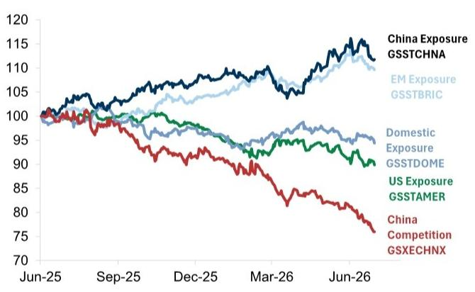  
Source: Bloomberg, GS Global Investment Research, GS FICC and Equities

Luxury goods exposure to China and Chinese-based travellers is high at around a third of European luxury sales. Previously these were seen as protected from Chinese competition by brands and heritage but even this barrier is being eroded. The global vintage or second-hand market has grown and Asian brands have also grown in prestige and influence. The lack of innovation/investment in brand and the significant price hikes for European luxury products over the pandemic recovery period have also reduced their allure.

Of course the success of Europe selling into China in the last 20-years also provides a very real barrier to tariffs, quotas or other regulations against China-goods coming into Europe. China can always retaliate against European businesses and has done so, or

threatened this in the past. That all said, companies with China exposure have performed well year to date (Exhibit 14) and this has at least partly been driven by upward EPS revisions. A lot but not all of this performance has been in the Tech sector stocks in our China-exposure basket with both high China and global exposure. We think it has also been a function of the modest rise in the CNY.

8. How exposed are European equities? It is here we see some good news. European indices have performed well and this is largely a function of the shifting share of these indices towards growth areas. Talking to international investors, there is a perception that Europe can do little to defend itself and is very exposed to China taking manufacturing share. While that is to some extent true (albeit that defence-strategy from the EU is rising) it is also true that vast swaths of the European equity market are either unaffected, protected or are unlikely to be affected for some time, or are areas in which China's advantages are not obvious, such as in building materials which cannot be transported economically at distance.

There tends to be a perception that Autos play a meaningful role in Europe. They do in share of the economy and certainly in the workforce in Germany, France and Italy, but they are increasingly a tiny fraction of the equity market (Exhibit 16). This reduction in the market cap of Autos has been ongoing but has accelerated in the last year just as there has been a sharp rise in the earnings and value of Tech Hardware, especially Semis. ASML is two-and-a-half times the size of the entire Autos market cap in Europe. As we show in Exhibit 15 tech hardware is now five times bigger than Autos. This transformation of European market cap has been fast and reflects significant growth in Semis and Equipment and suggests a deterioration in the competitiveness of European Autos.

Exhibit 15: In Europe, Tech Hardware is now 4 times bigger than Autos Market cap of European sectors

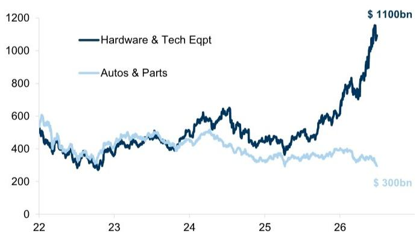  
Source: Datastream, GS Global Investment Research  
Exhibit 16: Autos only constitute $1\%$ of total European market cap  
% of total European market cap

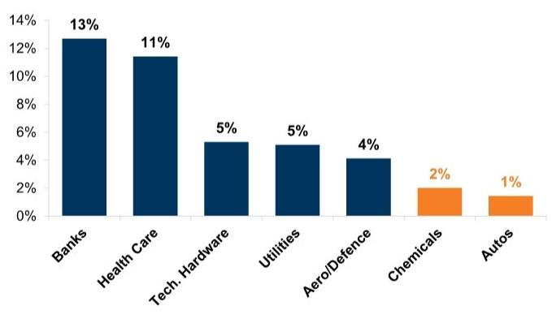  
Source: Datastream, GS Global Investment Research

In addition, there are plenty of areas where Europe does not compete with China, or where there is demand for European products for reasons of security or ongoing servicing. In addition, the majority of sectors are not obviously vulnerable to China manufacturing pushing down prices: examples include Financials, Services companies (Business services, Media, Travel & Leisure), and domestic sectors like Real estate, Telecoms and Utilities. Moreover, the European consumer should benefit from lower prices and lower inflation than would otherwise be the case boosting real incomes and spending power elsewhere – on services, for example, which European companies tend to supply – and also potentially reducing longer term inflationary risks and hence bond yields and borrowing costs.

Finally, European equities have performed well versus China equities (Exhibit 17), as overcapacity and a relatively lower focus on returns to shareholders have hampered China returns for some time and, while there have been pockets of strong China performance (e.g., the more tech-heavy A-shares in the last year), Europe has outperformed significantly on most medium or long term horizons. Even year-to-date, in Asia, which has seen solid returns, performance has been driven by a few stocks, with the median stock lower (Exhibit 18). In contrast, year-to-date the median stock in the US and Europe is up.

Exhibit 17: The European equity market has been outperforming China

Total returns of STOXX 600 and China market in local currency (Euro and CNY). Indexed to 100 at the start of 2010

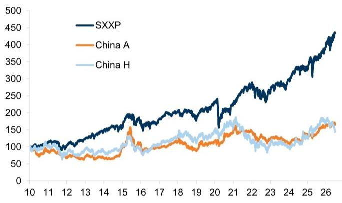  
Source: Datastream, GS Global Investment Research  
Exhibit 18: The performance of the median stock in Asia has been negative YTD, while returns have been positive in the US and Europe  
Price return in 2026; local currency (APxJ in USD)

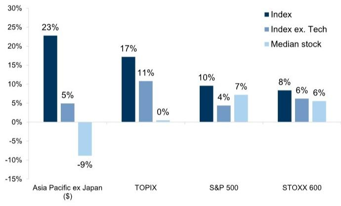  
Source: Datastream, GS Global Investment Research

## Europe Equity Strategy Team

Peter Oppenheimer

+44(20)7552-5782

Sharon Bell

+44(20)7552-1341

Guillaume Jaisson

peter.oppenheimer@gs.com

+44(20)7552-3000

GS International

sharon.bell@gs.com

guillaume.jaisson@gs.com

GS International

GS International

Giovanni Ferrannini

Elena Porfidia

+44(20)7051-2589

+44(20)7051-5240

giovanni.ferrannini@gs.com

elena.porfidia@gs.com

GS International

GS International

## Disclosure Appendix

## Reg AC

We, Sharon Bell, Guillaume Jaisson, Peter Oppenheimer, Giovanni Ferrannini and Elena Porfidia, hereby certify that all of the views expressed in this report accurately reflect our personal views, which have not been influenced by considerations of the firm's business or client relationships.

Unless otherwise stated, the individuals listed on the cover page of this report are analysts in GS' Global Investment Research division.

Contributing Authors: Sharon Bell GS International, Guillaume Jaisson GS International, Peter Oppenheimer GS International, Giovanni Ferrannini GS International, Elena Porfidia GS International.

Unless otherwise stated, the individuals listed in the Contributing Authors disclosure of this report are analysts in GS' Global Investment Research division.

## Disclosures

## Marquee disclosure

Marquee is a product of the GS Global Markets Division. Any Marquee content linked in this report is not necessarily representative of GS Research views.

## MSCI Disclosure

All MSCI data used in this report is the exclusive property of MSCI, Inc. (MSCI). Without prior written permission of MSCI, this information and any other MSCI intellectual property may not be reproduced or redisseminated in any form and may not be used to create any financial instruments or products or any indices. This information is provided on an “as is” basis, and the user of this information assumes the entire risk of any use made of this information. Neither MSCI, any of its affiliates nor any third party involved in, or related to, computing or compiling the data makes any express or implied warranties or representations with respect to this information (or the results to be obtained by the use thereof), and MSCI, its affiliates and any such third party hereby expressly disclaim all warranties of originality, accuracy, completeness, merchantability or fitness for a particular purpose with respect to any of this information. Without limiting any of the foregoing, in no event shall MSCI, any of its affiliates or any third party involved in, or related to, computing or compiling the data have any liability for any direct, indirect, special, punitive, consequential or any other damages (including lost profits) even if notified of the possibility of such damages. MSCI and the MSCI indexes are service marks of MSCI and its affiliates. The Global Industry Classification Standard (GICS) were developed by and is the exclusive property of MSCI and Standard & Poor’s. GICS is a service mark of MSCI and S&P and has been licensed for use by The GS Group.

## Basket disclosure

The ability to trade the basket(s) in this report will depend upon market conditions, including liquidity and borrow constraints at the time of trade.

## Regulatory disclosures

## Disclosures required by United States laws and regulations

See company-specific regulatory disclosures above for any of the following disclosures required as to companies referred to in this report: manager or co-manager in a pending transaction; $1\%$ or other ownership; compensation for certain services; types of client relationships; managed/co-managed public offerings in prior periods; directorships; for equity securities, market making and/or specialist role. GS trades or may trade as a principal in debt securities (or in related derivatives) of issuers discussed in this report.

The following are additional required disclosures: Ownership and material conflicts of interest: GS policy prohibits its analysts, professionals reporting to analysts and members of their households from owning securities of any company in the analyst's area of coverage. Analyst compensation: Analysts are paid in part based on the profitability of GS, which includes investment banking revenues. Analyst as officer or director: GS policy generally prohibits its analysts, persons reporting to analysts or members of their households from serving as an officer, director or advisor of any company in the analyst's area of coverage. Non-U.S. Analysts: Non-U.S. analysts may not be associated persons of GS & Co. LLC and therefore may not be subject to FINRA Rule 2241 or FINRA Rule 2242 restrictions on communications with a subject company, public appearances and trading in securities covered by the analysts.

Additional disclosures required under the laws and regulations of jurisdictions other than the United States
The following disclosures are those required by the jurisdiction indicated, except to the extent already made above pursuant to United States laws and regulations. Australia: GS Australia Pty Ltd and its affiliates are not authorised deposit-taking institutions (as that term is defined in the Banking Act 1959 (Cth)) in Australia and do not provide banking services, nor carry on a banking business, in Australia. This research, and any access to it, is intended only for “wholesale clients” within the meaning of the Australian Corporations Act, unless otherwise agreed by GS. In producing research reports, members of Global Investment Research of GS Australia may attend site visits and other meetings hosted by the companies and other entities which are the subject of its research reports. In some instances the costs of such site visits or meetings may be met in part or in whole by the issuers concerned if GS Australia considers it is appropriate and reasonable in the specific circumstances relating to the site visit or meeting. To the extent that the contents of this document contains any financial product advice, it is general advice only and has been prepared by GS without taking into account a client’s objectives, financial situation or needs. A client should, before acting on any such advice, consider the appropriateness of the advice having regard to the client’s own objectives, financial situation and needs. A copy of certain GS Australia and New Zealand disclosure of interests and a copy of GS’ Australian Sell-Side Research Independence Policy Statement are available at: https://www.goldmansachs.com/disclosures/australia-new-zealand/index.html. Brazil: Disclosure information in relation to CVM Resolution n. 20 is available at https://www.gs.com/worldwide/brazil/area/gir/index.html. Where applicable, the Brazil-registered analyst primarily responsible for the content of this research report, as defined in Article 20 of CVM Resolution n. 20, is the first author named at the beginning of this report, unless indicated otherwise at the end of the text. Canada: This information is being provided to you for information purposes only and is not, and under no circumstances should be construed as, an advertisement, offering or solicitation by GS & Co. LLC for purchasers of securities in Canada to trade in any Canadian security. GS & Co. LLC is not registered as a dealer in any jurisdiction in Canada under applicable Canadian securities laws and generally is not permitted to trade in Canadian securities and may be prohibited from selling certain securities and products in certain jurisdictions in Canada. If you wish to trade in any Canadian securities or other products in Canada please contact GS Canada Inc., an affiliate of The GS Group Inc., or another registered Canadian dealer. Hong Kong: Further information on the securities of covered companies referred to in this research may be obtained on request from GS (Asia) L.L.C. India: Further information on the subject company or companies referred to in this research may be obtained from GS (India) Securities Private Limited, Research Analyst - SEBI Registration Number INH000001493, 10th Floor, Ascent-Worli, Sudam Kalu Ahire Marg, Worli, Mumbai-400 025, India, Corporate Identity Number U74140MH2006FTC160634, Phone +91 22 6616 9000, Fax +91 22 6616 9001. GS may beneficially own 1% or more of

the securities (as such term is defined in clause 2 (h) the Indian Securities Contracts (Regulation) Act, 1956) of the subject company or companies referred to in this research report. Registration granted by SEBI and certification from NISM in no way guarantee performance of the intermediary or provide any assurance of returns to investors. GS (India) Securities Private Limited compliance officer and investor grievance contact details, a copy of the annual compliance audit report and other relevant information and disclosures can be found at this link:

https://www.goldmansachs.com/worldwide/india/research-analyst. Japan: See below. Korea: This research, and any access to it, is intended only for “professional investors” within the meaning of the Financial Services and Capital Markets Act, unless otherwise agreed by GS. Further information on the subject company or companies referred to in this research may be obtained from GS (Asia) L.L.C., Seoul Branch. New Zealand: GS New Zealand Limited and its affiliates are neither “registered banks” nor “deposit takers” (as defined in the Reserve Bank of New Zealand Act 1989) in New Zealand. This research, and any access to it, is intended for “wholesale clients” (as defined in the Financial Advisers Act 2008) unless otherwise agreed by GS. A copy of certain GS Australia and New Zealand disclosure of interests is available at: https://www.goldmansachs.com/disclosures/australia-new-zealand/index.html. Russia: Research reports distributed in the Russian Federation are not advertising as defined in the Russian legislation, but are information and analysis not having product promotion as their main purpose and do not provide appraisal within the meaning of the Russian legislation on appraisal activity. Research reports do not constitute a personalized investment recommendation as defined in Russian laws and regulations, are not addressed to a specific client, and are prepared without analyzing the financial circumstances, investment profiles or risk profiles of clients. GS assumes no responsibility for any investment decisions that may be taken by a client or any other person based on this research report. Singapore: GS (Singapore) Pte. (Company Number: 198602165W), which is regulated by the Monetary Authority of Singapore, accepts legal responsibility for this research, and should be contacted with respect to any matters arising from, or in connection with, this research. Taiwan: This material is for reference only and must not be reprinted without permission. Investors should carefully consider their own investment risk. Investment results are the responsibility of the individual investor. United Kingdom: Persons who would be categorized as retail clients in the United Kingdom, as such term is defined in the rules of the Financial Conduct Authority, should read this research in conjunction with prior GS on the covered companies referred to herein and should refer to the risk warnings that have been sent to them by GS International. A copy of these risks warnings, and a glossary of certain financial terms used in this report, are available from GS International on request.

European Union and United Kingdom: Disclosure information in relation to Article 6 (2) of the European Commission Delegated Regulation (EU) (2016/958) supplementing Regulation (EU) No 596/2014 of the European Parliament and of the Council (including as that Delegated Regulation is implemented into United Kingdom domestic law and regulation following the United Kingdom's departure from the European Union and the European Economic Area) with regard to regulatory technical standards for the technical arrangements for objective presentation of investment recommendations or other information recommending or suggesting an investment strategy and for disclosure of particular interests or indications of conflicts of interest is available at https://www.gs.com/disclosures/europeanpolicy.html which states the European Policy for Managing Conflicts of Interest in Connection with Investment Research.

Japan: GS Japan Co., Ltd. is a Financial Instrument Dealer registered with the Kanto Financial Bureau under registration number Kinsho 69, and a member of Japan Securities Dealers Association, Financial Futures Association of Japan Type II Financial Instruments Firms Association, and Investment Management Association of Japan. Sales and purchase of equities are subject to commission pre-determined with clients plus consumption tax. See company-specific disclosures as to any applicable disclosures required by Japanese stock exchanges, the Japanese Securities Dealers Association or the Japanese Securities Finance Company.

## Global product; distributing entities

GS Global Investment Research produces and distributes research products for clients of GS on a global basis. Analysts based in GS offices around the world produce research on industries and companies, and research on macroeconomics, currencies, commodities and portfolio strategy. This research is disseminated in Australia by GS Australia Pty Ltd (ABN 21 006 797 897); in Brazil by GS do Brasil Corretora de Títulos e Valores Mobiliários S.A.; Public Communication Channel GS Brazil: 0800 727 5764 and / or contatogoldmanbrasil@gs.com. Available Weekdays (except holidays), from 9am to 6pm. Canal de Comunicação com o Público GS Brasil: 0800 727 5764 e/ou contatogoldmanbrasil@gs.com. Horário de funcionamento: segunda-feira à sexta-feira (exceto feriados), das 9h às 18h; in Canada by GS & Co. LLC; in Hong Kong by GS (Asia) L.L.C.; in India by GS (India) Securities Private Ltd.; in Japan by GS Japan Co., Ltd.; in the Republic of Korea by GS (Asia) L.L.C., Seoul Branch; in New Zealand by GS New Zealand Limited; in Russia by OOO GS; in Singapore by GS (Singapore) Pte. (Company Number: 198602165W); and in the United States of America by GS & Co. LLC. GS International has approved this research in connection with its distribution in the United Kingdom.

GS International (“GSI”), authorised by the Prudential Regulation Authority (“PRA”) and regulated by the Financial Conduct Authority (“FCA”) and the PRA, has approved this research in connection with its distribution in the United Kingdom.

European Economic Area: GS Bank Europe SE (“GSBE”) is a credit institution incorporated in Germany and, within the Single Supervisory Mechanism, subject to direct prudential supervision by the European Central Bank and in other respects supervised by German Federal Financial Supervisory Authority (Bundesanstalt für Finanzdienstleistungsaufsicht, BaFin) and Deutsche Bundesbank and disseminates research within the European Economic Area.

## General disclosures

This research is for our clients only. Other than disclosures relating to GS, this research is based on current public information that we consider reliable, but we do not represent it is accurate or complete, and it should not be relied on as such. The information, opinions, estimates and forecasts contained herein are as of the date hereof and are subject to change without prior notification. We seek to update our research as appropriate, but various regulations may prevent us from doing so. Other than certain industry reports published on a periodic basis, the large majority of reports are published at irregular intervals as appropriate in the analyst's judgment.

GS conducts a global full-service, integrated investment banking, investment management, and brokerage business. We have investment banking and other business relationships with a substantial percentage of the companies covered by Global Investment Research. GS & Co. LLC, the United States broker dealer, is a member of SIPC (https://www.sipc.org).

Our salespeople, traders, and other professionals may provide oral or written market commentary or trading strategies to our clients and principal trading desks that reflect opinions that are contrary to the opinions expressed in this research. Our asset management area, principal trading desks and investing businesses may make investment decisions that are inconsistent with the recommendations or views expressed in this research.

We and our affiliates, officers, directors, and employees will from time to time have long or short positions in, act as principal in, and buy or sell, the securities or derivatives, if any, referred to in this research, unless otherwise prohibited by regulation or GS policy.

The views attributed to third party presenters at GS arranged conferences, including individuals from other parts of GS, do not necessarily reflect those of Global Investment Research and are not an official view of GS.

Any third party referenced herein, including any salespeople, traders and other professionals or members of their household, may have positions in the products mentioned that are inconsistent with the views expressed by analysts named in this report.

This research is focused on investment themes across markets, industries and sectors. It does not attempt to distinguish between the prospects or performance of, or provide analysis of, individual companies within any industry or sector we describe.

Any trading recommendation in this research relating to an equity or credit security or securities within an industry or sector is reflective of the investment theme being discussed and is not a recommendation of any such security in isolation.

This research is not an offer to sell or the solicitation of an offer to buy any security in any jurisdiction where such an offer or solicitation would be illegal. It does not constitute a personal recommendation or take into account the particular investment objectives, financial situations, or needs of individual clients. Clients should consider whether any advice or recommendation in this research is suitable for their particular circumstances and, if appropriate, seek professional advice, including tax advice. The price and value of investments referred to in this research and the income from them may fluctuate. Past performance is not a guide to future performance, future returns are not guaranteed, and a loss of original capital may occur. Fluctuations in exchange rates could have adverse effects on the value or price of, or income derived from, certain investments.

Certain transactions, including those involving futures, options, and other derivatives, give rise to substantial risk and are not suitable for all investors. Investors should review current options and futures disclosure documents which are available from GS sales representatives or at https://www.theocc.com/about/publications/character-risks.jsp and https://www.goldmansachs.com/disclosures/cftc\_fcm\_disclosures. Transaction costs may be significant in option strategies calling for multiple purchase and sales of options such as spreads. Supporting documentation will be supplied upon request.

Differing Levels of Service provided by Global Investment Research: The level and types of services provided to you by GS Global Investment Research may vary as compared to that provided to internal and other external clients of GS, depending on various factors including your individual preferences as to the frequency and manner of receiving communication, your risk profile and investment focus and perspective (e.g., marketwide, sector specific, long term, short term), the size and scope of your overall client relationship with GS, and legal and regulatory constraints. As an example, certain clients may request to receive notifications when research on specific securities is published, and certain clients may request that specific data underlying analysts' fundamental analysis available on our internal client websites be delivered to them electronically through data feeds or otherwise. No change to an analyst's fundamental research views (e.g., ratings, price targets, or material changes to earnings estimates for equity securities), will be communicated to any client prior to inclusion of such information in a research report broadly disseminated through electronic publication to our internal client websites or through other means, as necessary, to all clients who are entitled to receive such reports.

All research reports are disseminated and available to all clients simultaneously through electronic publication to our internal client websites. Not all research content is redistributed to our clients or available to third-party aggregators, nor is GS responsible for the redistribution of our research by third party aggregators. For research, models or other data related to one or more securities, markets or asset classes (including related services) that may be available to you, please contact your GS representative or go to https://research.gs.com.

Disclosure information is also available at https://www.gs.com/research/hedge.html or from Research Compliance, 200 West Street, New York, NY 10282.

## © 2026 GS.

You are permitted to store, display, analyze, modify, reformat, and print the information made available to you via this service only for your own use. You may not resell or reverse engineer this information to calculate or develop any index for disclosure and/or marketing or create any other derivative works or commercial product(s), data or offering(s) without the express written consent of GS. You are not permitted to publish, transmit, or otherwise reproduce this information, in whole or in part, in any format to any third party without the express written consent of GS. This foregoing restriction includes, without limitation, using, extracting, downloading or retrieving this information, in whole or in part, to train or finetune a machine learning or artificial intelligence system, or to provide or reproduce this information, in whole or in part, as a prompt or input to any such system.