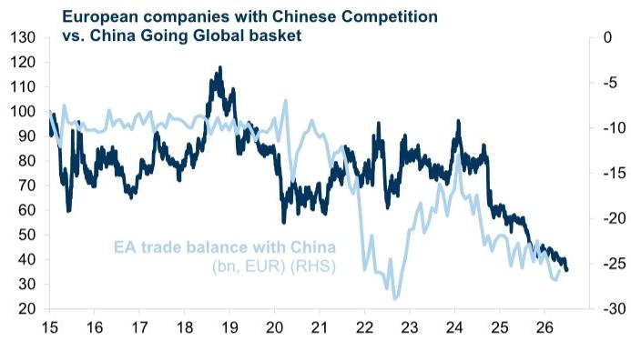

# Europe’s Industrial Core Is Under Siege, and the Defensive Playbook Is Not Yet Written

The dominant strategic fact for European equities today is not macroeconomic uncertainty, nor monetary policy. It is the structural displacement of European manufacturing by Chinese exports, a process that is accelerating, not abating. China now accounts for 23 percent of EU imports, while Europe’s share of Chinese imports has collapsed since 2020. This is not a cyclical trade shock. It is a permanent reordering of industrial competitiveness, driven by China’s massive cost advantages, weak domestic demand, and a deliberate state-led export push. For investors, the implications are stark: a widening trade deficit with China maps directly onto persistent earnings downgrades for exposed European sectors, and these earnings headwinds are not yet fully reflected in valuations, despite deep discounts. The critical question is not whether Europe will defend itself, but whether its chosen defensive tools can alter the trajectory of competitive decline, or whether investors must accept that a significant portion of Europe’s industrial base is now structurally impaired.

The conventional narrative that Chinese competition is a cyclical nuisance, manageable through tariff adjustments, is dangerously incomplete. The data reveals a multi-sector assault. In autos, Chinese domestic brands have gained over 400 basis points of European market share in the past year alone, with every mass-market brand except Tesla losing ground. In chemicals, China’s export-oriented pivot during the Middle East conflict has extinguished any short-lived hopes of a European competitiveness revival; chemical exports from China to the rest of Asia rose 70 percent in March and April alone. In capital goods, China’s share of global machinery exports has risen from 7 percent in 2005 to 24 percent today, while Europe’s has fallen from 54 percent to 43 percent. The acceleration is most pronounced in LED lighting, excavators, heat pumps, and heavy-duty trucks. This is not a narrow sectoral issue. It is a broad-based erosion of Europe’s manufacturing advantage.

## The Cost Advantage Is Structural, Not Cyclical, and Tariffs Alone Cannot Bridge the Gap

Europe’s competitive problem is not that Chinese firms are temporarily underpricing. It is that China possesses a structural cost advantage that is deeply embedded in its economic model. Labor costs are lower, but that is only the beginning. Borrowing costs in targeted manufacturing sectors are kept artificially low by a state banking system that channels a vast pool of low-yielding deposits into industrial loans. Energy costs, particularly from coal, are among the lowest in the world, while Europe’s industrial power prices remain multiples higher. Land use is subsidized by a system where households pay inflated residential prices, effectively cross-subsidizing manufacturing. And the renminbi, despite recent appreciation, remains significantly undervalued relative to China’s productivity gains and economic growth over the past decade.

These advantages are compounded by Europe’s own self-imposed constraints: regulation, planning laws, and chronic underinvestment. The result is that even if the EU were to impose aggressive tariffs on Chinese goods, the price gap in many sectors would remain wide. A global investment bank report estimates that China’s cost advantage in manufacturing is sufficiently large that tariffs alone may not materially close the gap. This is the uncomfortable arithmetic that European policymakers are only beginning to confront. The US approach of blanket tariffs is unlikely to be replicated in Europe, not because Europe is less protectionist, but because such tariffs would do little to address the main source of the growth drag: lost market share in third countries, not just direct imports.

## The Earnings Damage Is Already Priced, but the Earnings Trajectory Is Not

Investors have not been blind to this threat. A basket of European companies most exposed to Chinese competition, concentrated in autos, medtech, chemicals, and select industrials, has consistently underperformed both the STOXX 600 and the basket of Chinese companies that are the direct beneficiaries of this export push. The underperformance has been overwhelmingly driven by earnings downgrades, not valuation compression. These stocks now trade at a 25 to 30 percent discount to the broader market. Yet this discount is not a buying opportunity. It is a rational reflection of an ongoing earnings erosion that has no clear catalyst for reversal.

The critical insight for investors is that further underperformance is likely to come from continued earnings weakness, not from further multiple contraction. The discount is already steep, but the earnings outlook remains negative. Chinese export share gains are ongoing, and the structural drivers of China’s cost advantage show no signs of diminishing. European companies in these sectors are not merely facing a cyclical headwind; they are losing pricing power, market share, and the ability to invest in the future. The question is whether any of these dynamics can be reversed by policy action, or whether investors should accept that a structural underweight in these sectors is the appropriate long-term positioning.

## Europe’s Policy Response Is Real but Incremental, and It May Be Too Slow to Matter

The EU is beginning to shift its posture. In June, the EU Council mandated the Commission to propose a response to Chinese manufacturing competition. Less than 10 percent of Chinese imports into the EU currently face tariffs, a stark contrast with the US. The main exceptions are tariffs on battery electric vehicles, introduced in October 2024, and the abolition of the EUR 150 customs-duty exemption for small parcels from July 2026. Going forward, economists expect a dual-track strategy: a diversification instrument to reduce reliance on Chinese components, and a protective instrument to raise targeted tariffs after sector-specific investigations.

Near-term measures are likely to focus on tightening steel safeguards to prevent Chinese steel rerouted through third countries, extending anti-subsidy duties to hybrid vehicles, and accelerating anti-dumping investigations into machinery, wind-turbine components, and basic chemicals. Longer-term, the EU is discussing broader tools: forcing procurement of “made in Europe” goods, limiting foreign direct investment in strategic sectors, restricting access to the European market for Chinese technologies, and forcing European companies to diversify supplies. These are serious proposals, but they face four constraints. China remains a key supplier of refined rare earths. Broad tariffs would not address lost market share in third countries. Europe still exports roughly 8 percent of its goods to China, and preserving access matters. And the cost advantage is so large that tariffs may not close the gap.

The implication is that Europe’s defensive playbook is real, but it is incremental, reactive, and unlikely to reverse the structural trend. It may slow the erosion in specific sectors, but it cannot restore the competitiveness that has been lost. For investors, this means that the earnings trajectory for exposed sectors is unlikely to improve meaningfully in the near term, and any policy-driven relief in valuations is likely to be temporary.

## What the Report Does Not Fully Answer: The Second-Order Effects on European Innovation and Capital Allocation

The report documents Europe’s underinvestment relative to China with striking clarity. Over the past five years, Chinese companies have spent roughly 40 to 45 percent of their cash flow from operations on growth investments, defined as R&D and capex above depreciation. The comparable figure for European companies is about 20 percent. In chemicals, autos, electronic equipment, medtech, software, and basic resources, Chinese companies have consistently outspent their European peers. The only areas where Europe matches China are pharmaceuticals, tech hardware, and utilities.

This investment gap is not just a symptom of competitive decline; it is a cause of future decline. European companies that are losing market share and seeing margins compress have less cash flow to reinvest, creating a vicious cycle. The report does not fully explore what this means for the long-term composition of European equity markets. If Europe’s industrial base is structurally impaired, capital will flow to sectors where Europe retains an edge: technology hardware, aerospace and defense, renewables, and pharmaceuticals. The market cap of tech hardware in Europe is now roughly four times that of autos, a ratio that was near parity just three years ago. This is not a temporary rotation. It is a structural reallocation of capital away from industries where Europe can no longer compete.

The open question is whether Europe’s remaining strengths are sufficient to sustain index-level returns. Autos and chemicals, the two sectors most exposed to Chinese competition, together have a smaller market cap than aerospace and defense or renewables. The index is not as exposed as many investors assume. But the risk is that the erosion spreads to sectors currently considered safe, such as medtech or select industrials. The report notes that Chinese companies are beginning to lead not only in commodities but increasingly in semi-specialty chemicals. The next wave may target areas where Europe still has a technological edge.

## A Decision Framework for Investors: Three Questions to Determine Your Exposure

For investors, the report provides a clear decision framework. The first question is whether you hold stocks with high direct exposure to Chinese competition. The sectors with the highest correlation between margins and Chinese PPI are chemicals, autos, and basic resources. If you hold these, the evidence suggests that earnings downgrades will continue, and the valuation discount, while steep, is not a sufficient reason to add exposure.

The second question is whether you hold stocks with high China sales exposure but not competition threat. These stocks have performed much better, as they benefit from Chinese demand without facing competitive displacement. The report distinguishes clearly between these two baskets, and the performance divergence is stark. Investors should not conflate China exposure with China risk.

The third question is whether you are positioned for the second-order effects of Europe’s policy response. If the EU implements targeted tariffs and diversification requirements, some European companies may benefit from reduced import competition. But the report’s analysis suggests that the benefits will be limited to specific sectors and will take time to materialize. The more durable positioning may be to overweight sectors where Europe retains a genuine competitive advantage: technology hardware, pharmaceuticals, aerospace and defense, and utilities investing in the energy transition. These sectors have the investment profiles and structural tailwinds that the exposed sectors lack.

The underlying analytical tension is this: the discount on China-competition stocks is already deep, but the earnings trajectory remains negative. Buying the discount requires a catalyst for earnings stabilization that is not yet visible. Waiting for the catalyst risks missing a potential turning point. The report’s authors lean toward continued underweight, and the data supports that caution.

Join the community to read the full report and review the original charts.

*This article is for learning and discussion only and does not constitute investment advice.*

Personal reading notes and learning share only. Not investment advice.

