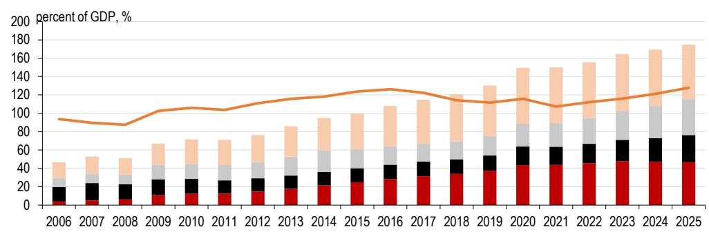
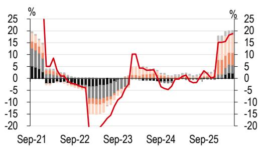
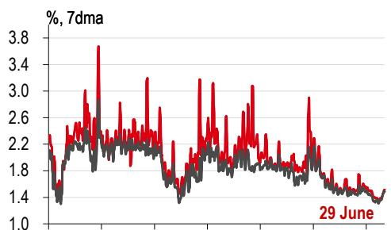

# HSBC：中国利润正在“一边倒”，中下游企业需警惕成本挤压

中国工业利润增速放缓的信号，在本周HSBC发布的中国宏观追踪报告中得到了数据层面的确认。这份报告的核心判断并非“复苏放缓”这样笼统的描述，而是指向一个更值得关注的结构性真相：利润正在向能源和AI相关行业极端集中，而中下游制造业正在承受成本与需求的双重挤压。与此同时，中欧贸易关系的微妙变化、地方政府化债进程中的“数据注水”风险，构成了当前中国经济图景中不可忽视的暗线。

这份报告真正的价值，不在于罗列了多少张图表，而在于它帮助读者建立了一个观察框架：当利润集中度达到近年高位时，资产定价的逻辑需要从“总量增长”切换到“结构分配”。谁在产业链中拥有议价权，谁就能在利润再分配中占据主动。

## 1. 利润增长的结构性分化，比增速放缓本身更值得警惕

HSBC报告指出，中国5月工业利润同比增长21.1%，但这一数字是在较低基数上实现的，实际增长动能已经出现放缓。更关键的是利润分布：能源（石油、煤炭）、有色金属，以及受益于全球AI资本开支的电子设备行业，成为利润增长的主要贡献者。而剔除这些行业后，其他中下游行业的利润拖累从1-4月的4.8个百分点扩大到了1-5月的5.5个百分点。

这意味着，宏观利润增速的“好看”掩盖了微观层面日益严重的分化。下游服装、皮革、橡胶塑料等行业利润同比下滑11%至19%不等，家具、体育用品、汽车等消费相关行业同样表现疲弱。能源成本上升而产出价格难以传导，导致下游企业利润率持续承压。

> **KC评论：** 这不是一个“经济好不好”的问题，而是一个“利润去哪了”的问题。当利润高度集中在少数上游和AI相关行业时，多数企业的定价能力正在被削弱。对于投资者而言，这意味着行业选择比宏观判断更重要。HSBC报告中的图表4详细拆分了各行业利润贡献，值得仔细研究。

## 2. 中欧贸易摩擦正在从“议题”变为“变量”，且可能比市场预期的更持久

HSBC报告提醒读者注意一个正在发生的叙事转变：中美关系出现阶段性企稳迹象的同时，中欧之间的紧张态势正在升温。欧盟正在推行更明确的“去风险”议程，并提出了《欧盟工业加速法案》，旨在扩大本土制造能力。

自2023年以来，欧盟已对中国化工、钢铁、机械设备、电气设备和电动汽车等领域发起了贸易救济措施，未来可能进一步扩大范围。报告指出，中国对欧盟出口中约40%是中间品，这部分供应链贸易最容易受到政策干扰。更值得关注的是，HSBC认为这些措施可能像此前中美贸易摩擦一样，从特定行业逐步扩散到产业政策和供应链安全的更广泛领域，并需要较长时间才能形成可预测的新均衡。

目前双方仍在谈判，6月29日中欧经贸高层对话达成了四个工作组的共识，并设定了10月达成“切实成果”的时间表。但HSBC提醒，谈判涉及补贴、标准、政府采购和战略技术等议题，这些领域的技术争议很容易演变为政治问题。

> **KC评论：** 市场可能低估了中欧贸易摩擦的复杂性和持久性。HSBC报告的一个关键洞察是，中国不会在压力下退缩——近期出台的供应链安全法和7月1日生效的ODI新规，表明北京已准备好反制工具。这意味着“谈判-升级-再谈判”的模式可能持续，对出口导向型企业的估值框架需要纳入这一不确定性。报告中对中欧贸易结构的详细拆解（图表1-3）是理解这一风险的基础。

## 3. 地方化债进入第三年，审计署发现的“数据造假”问题不容忽视

HSBC报告披露了一个令人不安的细节：中国国家审计署在抽查中发现，6%的地方融资平台（LGFV）通过伪造数据“退出”监管名单，部分地区还通过国有企业新增隐性债务，或通过贷款置换和系统数据删除人为降低存量债务规模。与此同时，路透社报道称国家发改委正在劝阻地方融资平台发行高收益离岸债券，显示北京对部分地方政府“拖延清理、掩盖风险”的行为高度警惕。

从数据看，2025年上半年地方再融资债券发行已超2万亿元，完成年度额度的73%，发行节奏明显前置。LGFV债务占GDP比重从2024年的47.2%微降至46.8%，化债取得了一定进展。但土地出让收入1-5月同比下降28.7%，地方财政压力依然巨大。HSBC认为，短期内地方政府财政约束仍将制约投资，但随着国内增长压力加大，政策可能转向加速部署支持措施。

**这里有一个尚未被充分讨论的问题：** 如果部分地方政府通过“数据注水”完成了化债指标，那么真实的地方债务风险可能被低估。审计署的抽查结果只是冰山一角，投资者需要警惕那些高度依赖地方财政和城投平台敞口的行业。

## 4. 房地产仍未触底，但一线城市出现了一些值得关注的边际变化

HSBC的周度高频数据显示，房地产市场的分化仍在持续。6月最后一周，一线城市二手房价格环比微涨，新房销售季节性回升，且同比仍保持正增长。但二线城市二手房交易虽然同比仍高，绝对量已出现边际走弱。土地市场方面，土地出让面积和规划建筑面积均出现环比回升，但绝对水平仍处于低位。

HSBC判断，房地产投资短期内仍将是经济的主要拖累。但一线城市房价的企稳，以及政策层面对“消化存量、优化增量”的持续推动，可能为市场底部提供支撑。需要注意的是，当前的市场回暖更多是政策驱动和季节性因素叠加的结果，并非自发性需求复苏。

## 5. HSBC报告没有完全回答的三个关键问题

尽管这份报告提供了丰富的数据和清晰的分析框架，但仍有几个关键问题值得读者进一步思考：

第一，AI资本开支的可持续性。当前电子设备行业的利润增长高度依赖全球AI资本开支，但这一轮AI投资周期能否持续，以及中国企业在其中的竞争地位如何演变，报告没有深入展开。

第二，地方化债的“真实进度”如何评估。审计署发现的数据造假问题，意味着官方统计数据可能低估了实际债务风险。投资者需要找到更可靠的观察指标来评估地方政府的真实财政状况。

第三，中欧贸易谈判的“底线”在哪里。10月的截止日期之前，双方能否就电动汽车关税等核心议题达成妥协，将直接影响出口相关行业的盈利预期。报告对此持谨慎态度，但并未给出具体的概率判断。

---

这些未解问题，恰恰是深入理解中国经济真实运行状况的钥匙。HSBC的这份报告提供了高质量的数据和分析起点，但要形成完整的投资判断，还需要结合更多国际信源、交叉验证不同机构的观点，以及持续跟踪边际变化。

更多国际信源汇编与评论，欢迎扫码交流。每日更新，汇总国际主流叙事、数据与图表，观测边际变化。目前已汇聚头部券商、PE/VC、投行、并购、对冲基金、资管机构、战略咨询、智库等领域的朋友，期待与您交流。

Personal reading notes and learning share only. Not investment advice.

