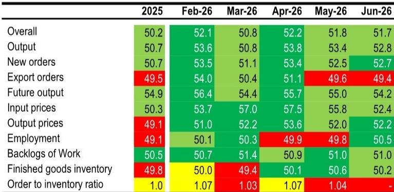
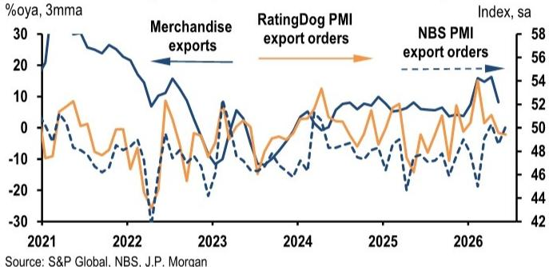
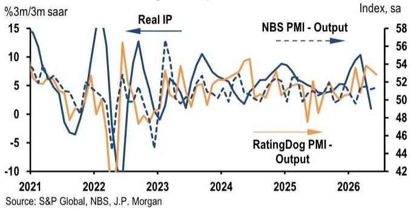

# JPM：中国制造业企稳了，但远未到再通胀

这份来自JPM的6月中国制造业PMI解读，给出了一个必须认真对待的判断：制造业正在企稳，但这不是一个需求驱动的广泛复苏。

6月RatingDog制造业PMI录得51.7，略低于市场预期的52.0，但已是连续第七个月站在扩张区间，并创下2020年四季度以来最强的季度均值。新订单连续第十三个月扩张，追平2018年以来最长的连续扩张记录。这些数字本身并不差。

但真正值得关注的，不是这些表面数字，而是数字背后的结构。JPM明确区分了“企稳”和“再通胀”这两个概念。企稳意味着下行风险可控，但再通胀意味着企业有定价权、工资有增长、消费有动力。当前的中国制造业，显然更接近前者。

> **KC评论：** 很多投资者看到PMI连续在扩张区间，容易得出“经济没问题”的结论。但JPM这份报告的核心洞察是：制造业的韧性来自供给端和特定领域，而不是来自家庭消费和终端需求。这两个不同的引擎，决定了完全不同的投资逻辑。

## 1. 出口订单连续两月收缩，前期的“抢出口”效应正在消退

报告中一个最值得警惕的信号是：出口订单指数从5月的49.6进一步下滑至6月的49.4，连续两个月低于荣枯线。

JPM对此的解读很直接：“出口韧性正在变得更有争议”。前期的抢出口效应正在消退，而关税不确定性将贯穿整个下半年。这不是一个短期波动，而是一个结构性压力。美国、欧盟以及其他主要贸易伙伴的关税摩擦、原产地规则审查、反补贴行动和本地化要求，都可能使外部需求在下半年变得更加不均匀。

> **KC评论：** 出口订单连续两个月收缩，这不是一个可以忽视的信号。结合全球贸易摩擦的升温，下半年出口对制造业的拉动大概率会减弱。那些依赖出口的制造业子行业，需要更谨慎地看待其盈利持续性。

## 2. 价格上涨只是成本缓解，不是需求拉动

价格数据是这份报告最容易被误读的部分。6月产出价格指数连续第六个月扩张，录得52.2。但JPM明确警告：这不是再通胀的信号。

关键在于，投入价格指数从5月的55.8大幅回落至52.4，而产出价格指数基本持平。这意味着企业利润空间的改善，更多来自能源和上游成本压力的缓解，而不是下游需求的强劲。霍尔木兹海峡的重新开放和能源价格下降，降低了输入成本和运费压力，这才是利润率改善的真正来源。

JPM认为，最坏的通货紧缩担忧可能已经缓解，但再通胀仍然是“狭窄的、成本敏感的”，并且取决于更强的订单能否转化为收入、服务需求和更稳固的国内定价权。在工资增长疲弱、服务需求依然偏软的背景下，CPI的传导能力仍然有限。

> **KC评论：** 看到PPI改善就认为通缩结束，是一种危险的简化。JPM的数据表明，当前的价格改善更多是供给侧成本下降的被动结果，而不是需求侧拉动的主动涨价。这意味着，一旦能源价格反弹，这种“利润改善”可能迅速逆转。

## 3. 就业改善是“选择性”的，不是广泛复苏

6月就业指数录得50.5，是2023年8月以来最快扩张。但JPM对此的解读非常克制：这看起来是“为满足现有订单而进行的选择性招聘，而不是广泛就业周期的开始”。

新订单和积压订单都在增加，说明产能利用率在提升。但企业是否愿意为此大规模扩招、增加资本开支，仍然存疑。国家统计局PMI的细节数据强化了这种谨慎：就业和库存数据仍然疲弱，说明企业对需求的持续性、补库存和资本开支仍然保持高度警惕。

这正是“制造业韧性”与“广泛复苏”之间的核心区别。制造业可以靠出口订单和特定领域的投资维持活跃，但如果就业没有广泛改善、工资没有增长，家庭消费就不会真正启动，经济就无法形成自我强化的正循环。

## 4. 报告尚未完全回答的关键问题：消费的传导何时到来？

JPM的报告清晰地描绘了一个“两速经济体”：与国内订单、设备更新、高端制造和特定出口供应链相关的制造业持续跑赢整体经济。但面向家庭的消费需求仍然疲弱。

报告指出，全球工业生产和AI周期持续支持电子、资本品、电力设备和先进制造业。这些力量强化了中国制造业的再平衡，但它们本身并不能产生广泛的面向家庭的需求复苏。

这里有一个关键问题，报告没有完全回答：消费的传导机制何时才能启动？制造业的韧性能否最终通过就业和工资增长传导到消费端？还是说，这种“供给强、需求弱”的格局会持续更长时间？

> **KC评论：** 这是所有关注中国资产的投资者都必须回答的问题。如果制造业的韧性无法有效传导到消费，那么当前的经济企稳就是有天花板的。这个天花板何时被突破、如何被突破，取决于政策选择、外部环境和消费者信心的综合作用。完整报告中有更多关于PPI和CPI传导路径的图表分析，值得仔细研究。

## 5. 投资者的观察框架：关注三个关键信号

基于JPM的判断，投资者可以建立以下观察框架，来判断制造业企稳是否在向广泛复苏演变：

**第一个信号：出口订单能否企稳回升。** 6月出口订单连续第二个月收缩，这是最需要关注的先行指标。如果未来两个月出口订单无法回到扩张区间，则意味着外部压力正在实质性影响制造业。

**第二个信号：投入价格与产出价格的差值。** 当前利润改善更多来自成本下降，而非需求拉动。如果未来投入价格企稳甚至反弹，而产出价格无法同步跟上，企业的利润空间将被重新压缩。这才是真正的“再通胀”考验。

**第三个信号：就业改善的广度。** 当前就业改善是“选择性”的。如果未来几个月就业指数能够持续扩张，并且伴随工资数据的改善，则说明制造业的韧性开始向更广泛的经济领域传导。

这三个信号，任何一个的边际变化，都比PMI的总量数字更有意义。

---

这份JPM报告的价值在于，它没有简单地用“制造业PMI持续扩张”来给出一个乐观结论，而是深入剖析了数据背后的结构性特征：企稳是真实的，但再通胀尚未到来。出口压力在累积，利润改善依赖成本下降，就业改善仍然有限。

报告的完整版还包含更多关于PPI和CPI传导路径的详细图表分析，以及不同制造业子行业的分化表现。这些细节对于判断哪些行业真正具备定价权、哪些行业只是被动受益于成本下降，至关重要。

更多国际信源汇编和评论，欢迎扫码交流。社群每日更新，汇总国际主流叙事、数据与图表，观测边际变化。目前汇聚了头部券商、PE/VC、投行、并购、对冲基金、资管机构、战略咨询、智库等领域的从业者，期待与您深入交流。

Personal reading notes and learning share only. Not investment advice.

