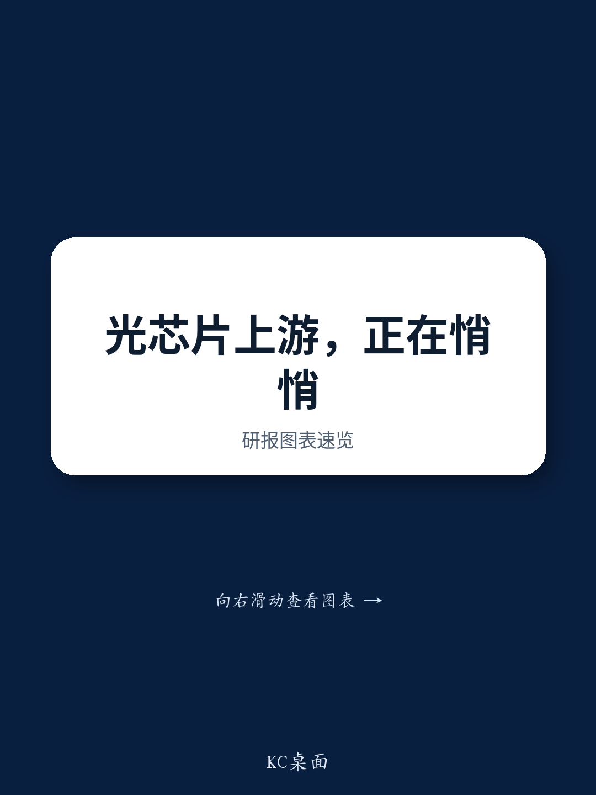

# The Optical Chip Supply Chain Is Breaking Along Geopolitical Fault Lines, and That Creates Both Risk and Opportunity for Investors

The global market for optical laser chips, long considered a niche segment of the semiconductor industry, has suddenly become a critical bottleneck in the artificial intelligence infrastructure buildout. As hyperscale data centers expand their fiber-optic interconnects to handle the massive data throughput required by AI training and inference workloads, the upstream materials that enable these chips—indium phosphide (InP) wafers and epitaxial (Epi) wafers—are experiencing price surges that demand the attention of any technology investor. According to data from a recent expert call hosted by a global investment bank, the price of 2-inch InP wafers in China has risen from CNY 500-600 at the end of 2025 to CNY 850-880 today, while 3-inch InP wafers have nearly doubled from CNY 1,800 to CNY 3,200 over the same period. These are not marginal adjustments; they are signals of structural scarcity.

The driving force behind this scarcity is not simply rising demand from AI data centers, though that is a contributing factor. The more consequential dynamic is the intersection of technology barriers, concentrated manufacturing capacity, and escalating export controls between China and Japan. The expert call revealed that larger-size InP wafers (3-inch and above), which are primarily supplied by Japanese and other global players, are now in acute shortage for Chinese customers due to export restrictions. This is creating a bifurcated market where Chinese domestic suppliers cannot yet fill the gap, and global suppliers are operating at the limits of their capacity. The implications extend far beyond wafer pricing; they cascade through the entire optical chip supply chain, from epitaxial growth to laser diode output, and ultimately affect the pace at which AI infrastructure can be deployed.

This article argues that the InP and Epi wafer market is entering a period of structural dislocation that will reward investors who can identify the companies positioned to capture pricing power, while punishing those who underestimate the technology barriers to scaling production. The expert call provides a granular view of these barriers, the competitive landscape, and the supply-demand dynamics that will shape the market over the next 12 to 24 months. But the report also leaves critical questions unanswered—questions that any serious investor must explore further.

## The Technology Barriers to Scaling InP and Epi Wafer Production Are Higher Than Most Investors Assume

The core challenge in producing high-quality InP wafers lies in the transition from polycrystalline to monocrystalline material. This is not a simple scaling problem; it is a fundamental materials science challenge. The expert noted that cleaning and surface treatment processes, combined with the need to minimize metal residues and impurities, are the primary obstacles. These requirements become exponentially more difficult as wafer size increases. The industry is currently attempting to move from 2-inch and 3-inch wafers to 6-inch wafers, but the technical hurdles are substantial.

The implications for investors are clear: companies that have already mastered these processes at scale possess a durable competitive advantage that cannot be easily replicated. The report identifies the top tier of global InP wafer makers as Sumitomo Electric, JX Metal, and AXT. These players have accumulated decades of process knowledge and have the equipment infrastructure to produce wafers with the purity and crystalline quality required for optical laser applications. New entrants, particularly in China, face not only the technology barriers but also the challenge of achieving acceptable yield rates. The expert explicitly stated that Chinese players have lower yields on single crystal lifting and less stable process control compared to global peers.

For epitaxial growth, the barriers are even more layered. The expert identified three critical factors: MOCVD equipment performance, the quality of the underlying InP wafer, and the industry know-how regarding materials, processes, and epitaxial structure design. This is not a commodity manufacturing process; it is a complex interplay of equipment, materials, and proprietary knowledge. The move to larger wafer sizes, particularly 6-inch Epi wafers, requires stricter equipment and process parameters. In China, the development of large-size Epi wafers is still in the early stage, with Wuhan Jiufengshan Laboratory being the key player attempting to develop 6-inch Epi wafers. The gap between laboratory development and commercial-scale production with acceptable yields is vast.

The so-what for investors is that the supply response to rising prices will be slower and more constrained than a simple economic model would predict. High prices alone will not solve the supply shortage because the technology barriers cannot be overcome by capital expenditure alone. They require time, experimentation, and the accumulation of process knowledge that is often tacit rather than codified. This creates a window of pricing power for incumbent producers that could last several years.

## The Competitive Landscape Is Divided Between IDM Vendors and Third-Party Foundries, and the Balance of Power Favors the Integrated Players

The Epi wafer market is structurally divided into two categories: third-party foundry players such as IQE and Landmark, and IDM (integrated device manufacturer) vendors such as Coherent and Lumentum. This distinction matters because it determines bargaining power, pricing strategy, and the ability to capture value along the supply chain.

The expert made a clear statement: IDM vendors have more bargaining power compared to foundries. This is intuitive but worth examining in detail. IDM vendors control the entire value chain from wafer fabrication to device manufacturing, which means they can optimize their internal processes for quality and yield, and they have alternative uses for their wafer output if external demand weakens. Foundries, by contrast, are dependent on their customers for design specifications and must compete on price and service. In a tight supply environment, IDM vendors can prioritize their internal needs and allocate only surplus capacity to the merchant market, giving them pricing leverage that foundries cannot match.

For China, the landscape is even more fragmented. The main Chinese Epi wafer players include Huaxing Laser, WaferChina, and EPIHOUSE, all of which operate independently as dedicated Epi wafer manufacturers. None of them have the integrated capabilities of the global IDM players. The expert noted that domestic manufacturers still fall behind global peers in terms of stability and yield rates. This gap is not closing quickly, and the export controls on larger-size InP wafers are exacerbating the problem by limiting the supply of high-quality substrates that Chinese Epi wafer makers need to improve their own output.

The strategic implication is that investors should favor companies with integrated business models and established process expertise over pure-play foundries, particularly in the current environment of supply constraint. The IDM vendors are better positioned to capture the pricing upside because they can control their input costs and optimize their output mix. Foundries, by contrast, face the risk of being squeezed between rising substrate costs and customer resistance to higher Epi wafer prices.

## The Supply-Demand Gap Is Real and Pricing Trends Confirm a Structural Shift, Not a Cyclical Blip

The pricing data from the expert call is striking. In addition to the InP wafer price increases already noted, the report shows that 2-inch EML (electro-absorption modulated laser) Epi wafers have increased from CNY 40,000+ per piece at the end of 2025 to CNY 60,000-70,000 today. For 3-inch CW (continuous wave) Epi wafers, prices have risen from CNY 50,000 to CNY 70,000+ over the same period. These are not small movements; they represent price increases of 40% to 75% in a matter of months.

The expert attributed this tightness primarily to export controls between China and Japan, which have restricted the flow of larger-size InP wafers to Chinese customers. But the report also hints at a deeper structural issue: the global capacity for high-quality InP wafer production is limited, and the demand from AI-related optical interconnects is growing faster than the industry can add capacity. The expert noted that domestic wafer prices in China are relatively lower than overseas prices, with 2-inch Epi wafers ranging from USD 10,000-20,000 per piece in the overseas market compared to CNY 60,000-70,000 in China. This price differential reflects not only quality differences but also the impact of trade restrictions that segment the market.

For investors, the key question is whether these price increases are sustainable. The answer depends on two factors: the pace at which new capacity can be brought online, and the extent to which demand growth will moderate as AI infrastructure deployment matures. The technology barriers discussed earlier suggest that new capacity will be slow to materialize, particularly for larger wafer sizes. On the demand side, the report provides a useful data point: one 2-inch Epi wafer can produce a maximum of 10,000 units of 100G EML, but after accounting for cut loss, yield rate, and packaging loss, the actual output is only around 2,000 units per wafer. This means that the effective demand for wafers is much higher than a simple calculation based on laser chip demand would suggest, because yield losses multiply the number of wafers required.

The pricing trend is therefore likely to persist, and may even accelerate, until either new capacity comes online or demand growth slows due to alternative technologies emerging. Neither of these scenarios appears imminent.

## What the Report Does Not Fully Answer: The Elasticity of Demand and the Potential for Technology Substitution

Despite the richness of the expert call takeaways, the report leaves several critical questions unanswered. The most important of these is the elasticity of demand for InP and Epi wafers. If prices continue to rise, at what point will optical module manufacturers begin to seek alternatives? Could silicon photonics or other material systems provide a viable substitute for InP-based lasers in some applications? The report does not address this question, and the expert call appears to have focused on the supply side rather than the demand side.

A second unresolved question concerns the specific impact of export controls. The report notes that larger-size InP wafers are in shortage for Chinese customers due to export controls, but it does not specify which countries or companies are imposing these controls, nor does it assess the likelihood of further escalation. Geopolitical risk is inherently difficult to model, but it is essential for investors to understand the range of possible outcomes. If export controls tighten further, the price spikes we have seen so far could be just the beginning. If they ease, the market could normalize more quickly than expected.

Third, the report does not provide a detailed analysis of the MOCVD equipment supply chain. The expert mentioned that Aixtron's G4 equipment can produce 350-400 pieces of EML per month, and that CW laser output is about 20% higher because it requires fewer epitaxy growth cycles. But the report does not assess whether MOCVD equipment capacity itself is a bottleneck, or whether there are alternative equipment suppliers that could alleviate the constraint. This is a critical gap because the equipment lead times could be the binding constraint on the entire supply chain.

Finally, the report does not quantify the total addressable market for InP and Epi wafers in the AI infrastructure context. How many wafers are needed to support the current wave of data center expansion? What is the growth rate? Without this data, it is difficult to assess whether the current price increases are driven by genuine demand growth or by temporary supply disruptions that will self-correct.

## A Decision Framework for Investors Navigating the Optical Chip Supply Chain

For investors seeking to act on the insights from this report, a structured decision framework is essential. The following approach can help evaluate opportunities and risks across the value chain.

First, assess the technology moat. Companies that have demonstrated the ability to produce high-quality InP wafers and Epi wafers at scale, with stable yields, possess a durable competitive advantage. The report identifies Sumitomo Electric, JX Metal, and AXT as top-tier InP wafer makers, and Coherent and Lumentum as IDM vendors with bargaining power. These are the incumbents most likely to benefit from the current supply-demand imbalance.

Second, evaluate the pricing power transmission. The price increases at the wafer level must be transmitted through the supply chain to laser chip manufacturers and ultimately to optical module makers. Investors should analyze which companies have the ability to pass through cost increases to their customers, and which are likely to see their margins compressed. The IDM vendors are better positioned here because they control more of the value chain.

Third, consider the China-specific dynamics. The report shows that Chinese domestic players are behind global peers in terms of yield and stability, but they are also the beneficiaries of policy support and domestic demand. The development of large-size Epi wafers in China is still early stage, but the potential for catch-up growth is significant. Investors with a higher risk tolerance may find opportunities among the Chinese players, but they must be prepared for volatility and execution risk.

Fourth, monitor the MOCVD equipment cycle. The output capacity of MOCVD equipment is a key determinant of how quickly Epi wafer supply can expand. Investors should track equipment orders, lead times, and the emergence of new equipment suppliers. The report mentions Aixtron, but there may be other players entering this space.

Fifth, build a geopolitical scenario framework. The export control dynamic is the wild card in this thesis. Investors should model at least three scenarios: continued tightening of controls, status quo, and easing of restrictions. Each scenario has different implications for pricing, supply availability, and the relative positioning of Chinese versus global players.

## The Full Report Contains the Granular Data and Original Charts That Make These Insights Actionable

The analysis above is based on the key takeaways from the expert call, but the full report contains additional data points, pricing charts, and competitive analysis that are essential for making informed investment decisions. The report includes detailed breakdowns of wafer pricing trends, yield rate comparisons between Chinese and global players, and the specific output capacities of different MOCVD equipment configurations. These details matter because they allow investors to calibrate their expectations and identify the specific inflection points that will signal changes in the market.

The original charts in the report provide visual context for the pricing trends and supply-demand dynamics discussed in this article. They show the trajectory of price increases over time, the relative pricing of different wafer sizes, and the yield rate differentials that separate the leaders from the laggards. For any investor serious about understanding the optical chip supply chain, these charts are not optional; they are foundational.

Join the community to read the full report and review the original charts.

*This article is for learning and discussion only and does not constitute investment advice.*

Personal reading notes and learning share only. Not investment advice.

