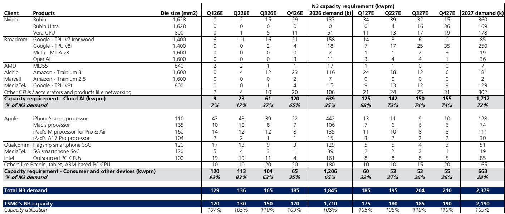
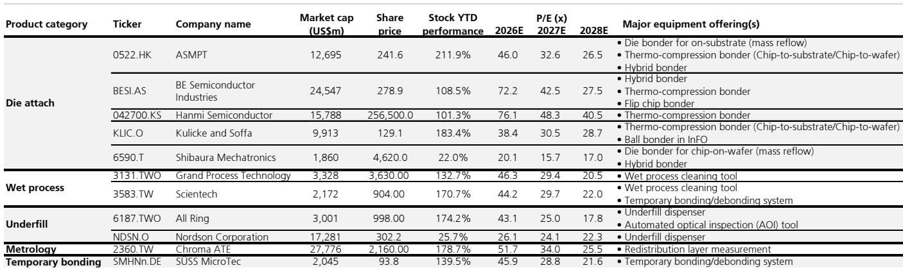
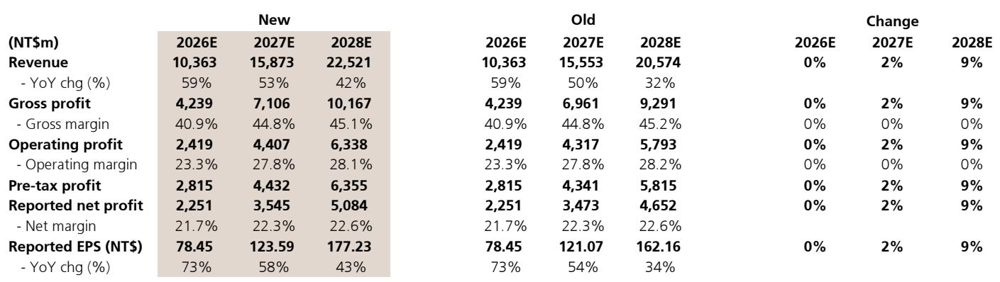

# CoWoS Capacity Is No Longer a Bottleneck: It Is Now the Leading Indicator of Cloud AI Demand Acceleration

The global investment bank report that underpins this analysis makes a bold and strategically significant claim: advanced packaging capacity, specifically CoWoS (Chip-on-Wafer-on-Substrate), is expanding faster than previously expected, and this acceleration is not a supply-side anomaly. It is a direct reflection of stronger-than-anticipated cloud AI demand. For investors and strategists tracking the semiconductor ecosystem, this shifts the analytical center of gravity. The question is no longer whether supply can meet demand. The question is whether the market has fully priced in the structural expansion of the total addressable market that CoWoS enables.

The report revises upward its capacity estimates for both TSMC and ASE, projecting industry-wide CoWoS capacity to reach 250,000 wafers per month by the end of 2027, up from a prior estimate of 190,000. This is not a marginal adjustment. It represents a 32% upward revision in just one month. When a leading indicator of this scale moves this quickly, it signals that the underlying demand drivers—hyperscaler AI investments, server CPU upgrades, and custom ASIC programs—are compounding faster than even the most bullish models anticipated.

This article does not summarize the report. It interprets the pattern, identifies the strategic implications, and raises the unresolved questions that matter for decision-making. The argument is straightforward: the CoWoS expansion trajectory tells us that cloud AI demand is entering a new phase, one that will reshape competitive dynamics across the semiconductor supply chain, from foundry to backend to equipment.

## The Acceleration of CoWoS Capacity Expansion Reveals a Structural, Not Cyclical, Shift in Cloud AI Demand

The most important data point in the report is not a revenue forecast or a price target. It is the upward revision of TSMC's CoWoS capacity to 130,000 wafers per month by end-2026 and 180,000 by end-2027, compared to prior estimates of 120,000 and 150,000. This is a 33% increase in the outer-year projection. More striking is ASE's trajectory: the report now expects ASE's full-process CoWoS capacity to more than double, from 20,000 wafers per month at end-2026 to approximately 50,000 by end-2027.

Why does this matter? Because CoWoS is the physical bottleneck for the highest-value AI chips. Every Nvidia Rubin GPU, every AMD MI400 and MI500, every Google TPU, and every Amazon Trainium chip must pass through CoWoS packaging. When the industry's capacity projections rise by 32% in a month, it means the hyperscalers and chip designers are placing orders that require that capacity. This is not speculation. It is revealed preference.

The implication is clear: the cloud AI buildout is not slowing down. It is accelerating. And the acceleration is broad-based. It is not just Nvidia. It is AMD's Venice server CPU, which the report estimates will grow from 1.3 million units in 2026 to 4 million in 2027. It is Google's TPU program, with chipset units rising from 4.1 million to 9.0 million over the same period. It is Amazon's Trainium 3, with estimates lifted from 1.7 million to 1.8 million in 2026 and from 2.3 million to 2.8 million in 2027.

The pattern is unmistakable: every major hyperscaler is scaling its custom silicon programs, and the packaging capacity is being built to match. This is not a one-time inventory build. This is a structural shift in how AI compute is provisioned.

## The Demand Composition Is Shifting: ASICs and Server CPUs Are Becoming the New Growth Engines Alongside Nvidia GPUs

For the past two years, the narrative around AI semiconductors has been dominated by Nvidia's GPU dominance. The report's data confirms that Nvidia remains the largest single consumer of CoWoS capacity, accounting for 61% of demand in 2026 and 50% in 2027. But the composition of the remaining demand is changing in ways that have significant strategic implications.

ASICs, led by Google's TPU and Amazon's Trainium, are projected to grow from 30% of CoWoS demand in 2026 to 33% in 2027. More importantly, the absolute volume is soaring. Google TPU chipset units alone are expected to nearly double, from 4.1 million to 9.0 million. The report highlights that MediaTek is expected to support 4 million units of TPU v8t capacity in 2027, a massive ramp from zero in 2025.

AMD's CoWoS demand is projected to grow 232% in 2027, driven by the Venice server CPU and the MI450 and MI455 GPU families. This is not just about market share gains. It is about the fact that server CPUs are becoming AI-relevant in a way they were not before. The Venice CPU, with 4 million units projected for 2027, is a server processor that requires advanced packaging. That is a new demand vector.

The strategic takeaway is that the CoWoS ecosystem is becoming less dependent on a single customer. While Nvidia's absolute volume continues to grow, its share is declining. This diversification reduces risk for the packaging supply chain and increases the total addressable market over the long term.

## The Supply Chain Is Diversifying, But TSMC's Competitive Moat in Advanced Packaging Is Widening, Not Narrowing

The report anticipates that advanced packaging supply will become more diversified from 2027-2028 onward, with increasing opportunities for ASE and Amkor in the second half of 2026 and 2027. Intel's EMIB-T technology is gaining traction, and the report notes that Intel will likely prioritize internal products and Google and MediaTek's TPU v9 initially. However, the report also cautions that Intel may face resource and capacity constraints in 2028.

This creates a nuanced picture. On one hand, the entry of new players and technologies suggests that the advanced packaging market is becoming more competitive, which should benefit customers through better pricing and more options. On the other hand, TSMC's position appears to be strengthening, not weakening.

The report projects that TSMC's advanced packaging sales will sustain approximately 50% growth over the next five years, driven by leading market share, rising content through 3D stacking, and technology upgrades such as CoPoS and co-packaged optics. TSMC's back-end sales, including advanced packaging, bumping, and testing, are projected to rise from 12.1% of total sales in 2026 to 15.3% in 2027. In absolute terms, that is a jump from $20.3 billion to $35.3 billion.

The key insight is that TSMC is not just a foundry. It is becoming an integrated advanced packaging powerhouse. The company's ability to offer a seamless front-end to back-end solution is a competitive advantage that will be difficult for rivals to replicate, especially at scale. The report's recommendation of TSMC as the top pick in the cloud AI supply chain reflects this structural advantage.

## What the Report Does Not Fully Answer: The Elasticity of Demand at Higher Capacity Levels and the Risk of Overbuild

For all its detailed projections, the report leaves several important questions unanswered. The most critical is the elasticity of demand at higher capacity levels. The report assumes that demand will continue to grow into the capacity being built. But what happens if the hyperscalers' AI investment cycles moderate? The report's demand projections are based on disclosed customer plans and supply chain checks, but these are inherently forward-looking and subject to revision.

The report does not fully address the risk of a double-ordering phenomenon. When capacity is scarce, customers tend to over-order to secure supply. If multiple customers are doing this simultaneously, the apparent demand may be inflated. The report's capacity estimates are based on actual build plans, not orders, but the two are correlated. If a significant customer reduces its orders, the industry could face an overcapacity situation in 2028 or 2029.

Another unresolved question is the impact of technological substitution. The report mentions CoPoS and co-packaged optics as future technologies, but it does not model how these could change the demand for CoWoS specifically. If a new packaging technology reduces the need for CoWoS interposers, the capacity buildout could prove excessive.

Finally, the report does not fully explore the geopolitical dimension. CoWoS capacity is concentrated in Taiwan. Any disruption to the supply chain, whether from natural disasters or geopolitical tensions, would have severe consequences. The report's demand projections assume business as usual, which may not be a safe assumption for a multi-year horizon.

These are not criticisms of the report's analysis. They are the natural open questions that arise when a leading indicator moves as fast as CoWoS capacity has. Investors who want to make informed decisions need to consider not just the upside scenarios, but also the conditions under which the thesis could break.

## A Decision Framework for Investors: How to Position Across the Cloud AI Supply Chain

The report provides a clear set of stock recommendations, but a strategic investor needs a framework for interpreting those recommendations in the context of the broader thesis. Here is a decision framework based on the report's logic.

First, identify the bottleneck. In the cloud AI supply chain, the bottleneck has shifted from front-end manufacturing to advanced packaging. TSMC's 3nm and 5nm capacity is no longer the primary constraint. CoWoS is. Therefore, companies with exposure to CoWoS capacity expansion have the strongest near-term tailwinds.

Second, distinguish between capacity builders and capacity users. TSMC and ASE are building capacity. They benefit from the capital expenditure cycle. Equipment suppliers like GPTC, Chroma, Hon Precision, and ASMPT are selling the tools needed to build that capacity. They benefit from the investment wave. Chip designers like Nvidia, AMD, and the ASIC vendors are users of that capacity. They benefit from having more supply available, which can lower costs and improve margins.

Third, assess the duration of the opportunity. The report's projections extend through 2027 and beyond. Companies with multi-year visibility into their CoWoS-related revenue, such as TSMC and ASE, offer more predictable growth. Companies that are dependent on specific product ramps, such as Alchip with Amazon Trainium, have higher upside but also higher single-customer risk.

Fourth, consider the technology roadmap. The report highlights 3D stacking and co-packaged optics as future growth drivers. Companies that are investing in these technologies, such as TSMC with CoPoS, are building moats that will extend their competitive advantage. Companies that are reliant on older packaging technologies may face margin pressure as the industry transitions.

Finally, manage the risk of overbuild. The report's capacity projections are aggressive. Investors should monitor quarterly capacity utilization rates and customer order patterns. If utilization drops below 80% for two consecutive quarters, it may signal that demand is not keeping pace with supply.

## The Analytical Frontier: What the CoWoS Acceleration Tells Us About the Next Phase of AI Infrastructure

The report's most valuable contribution is not its stock picks or its price targets. It is the analytical framework that connects CoWoS capacity to cloud AI demand. By treating advanced packaging as a leading indicator, the report provides a real-time window into the hyperscalers' investment intentions.

The acceleration of CoWoS capacity expansion tells us that the hyperscalers are not done building. They are scaling faster than expected. The report's demand projections show that Nvidia's Rubin ramp, AMD's Venice CPU, and Google's TPU v8t are all contributing to a demand surge that will extend well into 2027.

But the report also raises a strategic question that it does not fully answer: Is this the beginning of a sustained multi-year investment cycle, or is it a front-loaded buildout that will peak in 2027-2028? The answer depends on whether the AI applications that are being built today will generate sufficient returns to justify continued investment at these levels.

If the answer is yes, then the CoWoS capacity being built today will be fully utilized, and the industry will need even more capacity in 2029 and beyond. If the answer is no, then the industry could face a significant correction.

The report does not take a definitive position on this question. It provides the data and the analysis, but the ultimate judgment belongs to the investor. That is what makes this report valuable. It does not give you the answer. It gives you the tools to find your own.

Join the community to read the full report and review the original charts.

*This article is for learning and discussion only and does not constitute investment advice.*

Personal reading notes and learning share only. Not investment advice.

