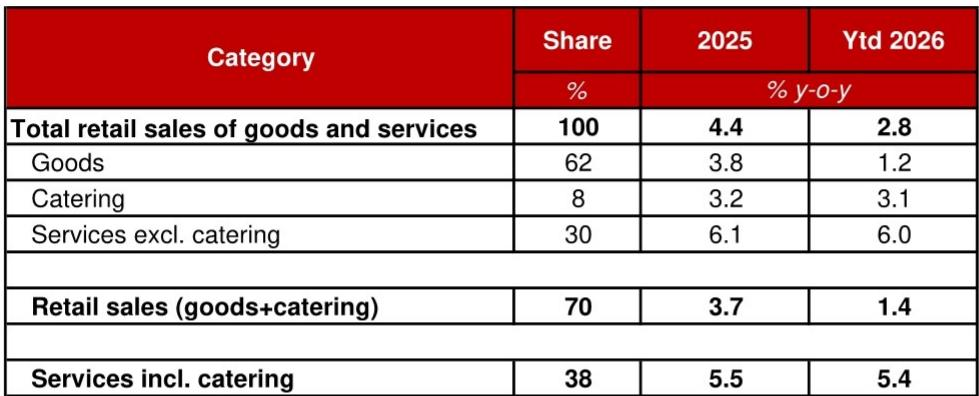

# China's Consumption Slowdown Is Not a Demand Crisis — It Is a Policy Exhaustion Signal

The sharp deceleration in China's retail sales growth during the first five months of 2026 has triggered widespread concern about the health of the world's second-largest consumer market. Headline retail sales growth plunged from 3.7 percent in 2025 to negative territory in May, with April and May registering just 0.2 percent and minus 0.6 percent year-on-year respectively. The instinctive reaction is to attribute this to weakening consumer confidence or mounting economic headwinds. But a deeper examination of the data reveals a more nuanced and strategically significant story: the slowdown is overwhelmingly concentrated in subsidized durable goods that had been artificially boosted by Beijing's trade-in program. The policy stimulus has exhausted its capacity, and the resulting payback effect — not a collapse in underlying demand — explains nearly the entire goods sales decline.

This distinction carries profound implications for investors, policymakers, and corporate strategists. If the problem were broad-based demand destruction, the policy response would need to focus on income support and confidence restoration. Instead, the data suggests that consumption is splitting along two axes: subsidized goods are experiencing a natural correction after two years of policy-driven pull-forward, while services consumption — a far larger and more structurally important category — remains remarkably stable. The real question is not whether Chinese consumers are spending, but whether the government's toolkit for stimulating consumption has reached its limits, and what that means for the growth trajectory ahead.

The evidence from a detailed breakdown of retail sales categories is unambiguous. Among major subsidized durable goods, auto sales growth collapsed to negative 11.8 percent year-on-year in the first five months of 2026, down from negative 1.5 percent in 2025. Home appliances and furniture — two categories that had benefited enormously from the trade-in program — saw their growth rates swing from double-digit positive territory to deeply negative figures. Home appliances fell from 11.0 percent growth in 2025 to negative 6.9 percent, while furniture plunged from 14.6 percent to negative 3.0 percent. Even communication appliances, which had grown at 20.9 percent in 2025, slowed sharply to 13.8 percent. The pattern is consistent across every category that received subsidy support.

The mechanism is straightforward. Between August 2024 and the end of 2025, the central government allocated 450 billion renminbi in trade-in subsidies, with 150 billion in 2024 and 300 billion in 2025. In 2026, the allocation was reduced to 250 billion. This multi-year stimulus program pulled forward demand from future periods, creating an artificial boom in subsidized categories. Consumers who had been planning to replace their cars, appliances, or electronics accelerated their purchases to capture the subsidies. Now that the program is winding down and the pent-up demand has been largely satisfied, a natural payback period has begun. The data confirms this: sales growth for non-subsidized goods actually improved from 2.1 percent in 2025 to 3.5 percent in the first five months of 2026, offsetting some of the drag from subsidized categories.

## The payback effect in subsidized goods explains the entire goods sales slowdown, while services consumption remains resilient

A rigorous estimation of the payback effect's magnitude reveals its centrality. Using data from retail enterprises above a designated size — which account for 42 percent of total merchandise sales and 37 percent of total retail sales — the combined value of subsidized durable goods represents 44 percent of above-size merchandise sales and 16 percent of total retail sales. Autos alone account for 27 percent of above-size goods retail, followed by home appliances at 6 percent, communication appliances at 5 percent, and smaller categories including office appliances, furniture, and sports and entertainment goods.

The growth rate of subsidized goods sales fell by 11.6 percentage points, from 5.1 percent in 2025 to negative 6.4 percent in the first five months of 2026. This contributed negative 5.0 percentage points to the overall 4.2 percentage point slowdown in above-size merchandise retail sales growth during this period. In contrast, non-subsidized goods sales growth actually increased from 2.1 percent to 3.5 percent, contributing positive 0.8 percentage points. The arithmetic is clear: the payback effect alone can account for the entire decline in goods sales. Without it, headline retail sales growth would have been broadly stable.

This finding challenges the narrative that Chinese consumers are fundamentally retrenching. Instead, it points to a policy design problem: the trade-in program was highly effective at pulling forward consumption but has now created a vacuum that natural demand cannot immediately fill. The implication is that policymakers face a structural dilemma. Further rounds of goods subsidies would likely yield diminishing returns, as the pool of households willing and able to accelerate durable purchases shrinks with each successive program. The low-hanging fruit has been harvested.

## Services consumption is structurally stable but politically harder to stimulate through subsidies

The broader consumption picture becomes clearer when we move beyond headline retail sales data, which has historically excluded services consumption other than catering. In May 2026, the National Bureau of Statistics for the first time released aggregate retail sales data covering both goods and all services. This new data series is a game-changer for understanding Chinese consumption dynamics. It reveals that aggregate retail sales of goods and services slowed to 2.8 percent year-on-year in the first five months of 2026, down from 4.4 percent in 2025. But the composition tells a different story than the headline number suggests.

Goods account for 62 percent of aggregate retail sales, and their growth dropped from 3.8 percent to 1.2 percent. Catering services, at 8 percent of the total, held steady at around 3.1 percent. The critical finding is that services excluding catering — which account for 30 percent of aggregate retail sales — registered 6.0 percent year-on-year growth in the first five months of 2026, virtually unchanged from 6.1 percent in 2025. Services consumption, in other words, has been remarkably stable throughout the goods slowdown.

This stability is both encouraging and challenging. It suggests that the structural drivers of services consumption — urbanization, aging demographics, rising demand for healthcare, education, travel, and digital services — remain intact. Chinese households are spending on experiences and services even as they defer durable goods purchases. But from a policy perspective, services consumption is far more difficult to stimulate through the kind of subsidy programs that worked for goods. Services are inherently non-standardized, making it difficult to design uniform subsidy criteria. Their prices are more volatile and less predictable. And unlike a washing machine or a car, a service cannot be stockpiled or pulled forward in the same way. The policy toolkit that worked for goods is largely ineffective for services.

This asymmetry creates a strategic impasse. The government can no longer rely on goods subsidies to drive consumption growth, but it lacks effective instruments to boost services consumption. The policy response must therefore shift from demand management to structural reform — but that is a slower and more politically fraught process.

## Balance sheet repair is underway, but it is K-shaped and austerity-driven, not a foundation for broad consumption recovery

A recent research report from CF40, a leading Chinese think tank, suggests that aggregate household balance sheets have been repairing since late 2024. On the surface, this appears to be good news for consumption prospects. But the mechanism of this repair fundamentally limits its positive spillover effects. The balance sheet improvement is not occurring uniformly across households, nor is it driven by rising incomes.

First, the repair is concentrated among the wealthiest cohorts. The AI boom and stock market rally have disproportionately benefited high-net-worth individuals who hold meaningful equity allocations, while the vast majority of Chinese households have minimal stock market exposure and have derived little from these asset price increases. Meanwhile, property markets remain deeply K-shaped: price stabilization and modest gains are concentrated in tier-one cities, while smaller cities continue to experience price declines. For the typical Chinese household, whose wealth is overwhelmingly tied to housing, the ongoing property depreciation continues to erode balance sheets. The result is a K-shaped wealth effect where only the top of the distribution is recovering.

Second, the balance sheet repair that is occurring among the broader population is driven by austerity, not prosperity. Households are building net income surpluses through aggressive spending cuts and defensive saving behavior, not through robust income growth. They are paying down debt and hoarding precautionary savings in response to future income uncertainty, a weak social protection network, and a perennial property crisis. This pattern fundamentally differs from organic balance sheet repair driven by rising incomes. In such a situation, a seemingly improving household balance sheet actually weighs on consumption growth, because the improvement comes at the expense of current spending.

This dynamic reinforces the policy dilemma. The consumption weakness is not simply a short-term payback effect that will naturally reverse. It is being amplified by structural factors — inequality, housing wealth destruction, and precautionary saving — that require deeper policy interventions. The most effective solutions, according to the analysis, remain the cleanup of bad debt in the property sector and comprehensive reform of the basic pension system. These would address the root causes of household caution: the fear of future income loss and the absence of a reliable social safety net. But these are politically difficult reforms with long implementation timelines.

## What the report does not fully answer: the durability of services consumption and the threshold for policy intervention

For all its analytical rigor, the report leaves several critical questions unanswered. The most important concerns the durability of services consumption. While services excluding catering have remained stable at around 6 percent growth, it is unclear whether this stability can persist if the goods slowdown deepens or if labor market conditions deteriorate further. Services consumption is not immune to income effects; it may simply have a longer lag in responding to economic weakness. The report does not model the potential spillover channels from the goods sector to services, such as reduced employment in manufacturing and retail leading to lower services demand.

A second open question is the threshold at which the policy response would shift from targeted subsidies to broader macroeconomic stimulus. The report lowers its quarterly retail sales growth forecasts for the remainder of 2026, but it does not specify what data triggers would prompt a change in the policy outlook. Would a sustained decline in services consumption growth below 4 percent constitute a red line? Would further deterioration in labor market indicators force the government to reconsider its fiscal stance? The absence of a clear policy reaction function leaves investors guessing.

Third, the report does not fully explore the implications of the K-shaped wealth effect for corporate strategy. If consumption growth is bifurcated between premium and mass-market segments, companies need to understand where the growth is. Luxury goods and high-end services may continue to benefit from the wealthiest cohorts' balance sheet repair, while mass-market durable goods face prolonged weakness. The report provides the data to support this inference but does not develop the strategic implications for sector allocation or business model adaptation.

## A decision framework for investors: distinguishing between cyclical payback, structural weakness, and policy risk

For investors navigating Chinese consumption, the report's findings suggest a three-part decision framework. The first dimension is cyclical versus structural. The goods slowdown is largely cyclical — a payback effect from the trade-in program that will eventually fade as the base effects normalize and natural replacement demand re-emerges. The timeline for this normalization is uncertain, but the direction is clear. Investors should not extrapolate the current goods weakness indefinitely.

The second dimension is sectoral differentiation. Within goods, subsidized categories face the most acute headwinds, but non-subsidized categories are showing resilience. Within services, catering is stable and other services are growing at a healthy clip. The divergence between goods and services, and between subsidized and non-subsidized goods, creates clear winners and losers. Companies and sectors with exposure to services consumption, premium goods, and non-subsidized categories are relatively better positioned.

The third dimension is policy dependency. The report makes clear that the trade-in program has exhausted its capacity to stimulate goods consumption. Future consumption growth will depend on structural reforms — property sector cleanup, pension reform, and income support — that are slow to implement and uncertain in their timing and scope. Investors should price in a higher discount rate for consumption-sensitive assets that rely on continued policy support. The era of easy consumption stimulus is over.

The most important unanswered question is whether the Chinese consumer is entering a period of structural deleveraging akin to what Japan experienced in the 1990s. The K-shaped wealth effect, the austerity-driven balance sheet repair, and the concentration of consumption among the wealthy all echo patterns seen in Japan's post-bubble era. But there are also important differences: China's services sector is less developed, its urbanization rate still has room to rise, and its digital economy is more advanced. The outcome will depend on policy choices in the coming quarters.

Join the community to read the full report and review the original charts.

*This article is for learning and discussion only and does not constitute investment advice.*

Personal reading notes and learning share only. Not investment advice.

